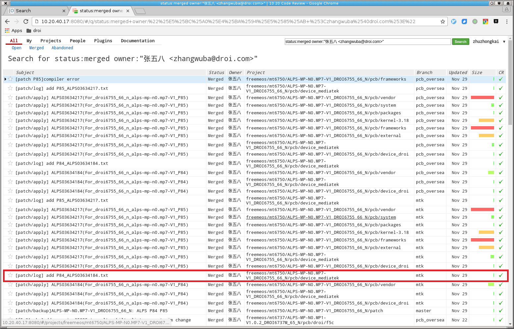

# repo项目同步其他仓库已合patch操作指南

[TOC]

## 概述

IMP小辣椒50项目为例。该项目基于MTK 6750平台。而gerrit上有两套6750 N项目仓库，卓易电子负责海外版，FreemDEV组开发国内版，各自维护了一份6750的项目代码，

以framework子仓库为例，这两套的各自在gerrit上的路径分别是：

1. FreemeOS/mt6750/ALPS-MP-N0.MP7-V1_DROI6755_66_N/pcb/frameworks，由FreemeDEV维护
2. freemeos/mt6750/ALPS-MP-N0.MP7-V1_DROI6755_66_N/pcb/frameworks，由卓易电子维护

PS. 由于历史原因，卓易电子维护项目位于`freeme`目录下，以后卓易电子项目的项目统一调整为Droi下。

这两套代码都是基于MTK释放的同一套代码演进。所以都需要合并MTK patch。对该项目来说卓易电子定期申请50N的patch、合并、提交。FreemeDEV只需要定期合并他们已经提交到gerrit上的patch即可，而不需要再手动对打patch。

这项工作利用gerrit的download功能实现。阅读该本文之前，请务必阅读：`git-repo简明教程3-提交技巧与图形配置` 中关于download的介绍。

gerrit的download功能针对单一仓库。而一个MTK的patch通常由多个仓库的提交构成。FreemeDEV维护的50N项目就含有以下分支：

- mtk
- droi_init
- customer_driver
- freeme-7.1.0_r1

注意：

1. 某仓库实际含有的远程分支，可以在gerrit上查看，也可以在本地使用`git branch -a`查看。
2. kernel没有`freeme-7.1.0_r1`分支，有`bv206a_driver`分支，`external`没有`freeme-7.1.0_r1`分支，而是有`freeme-7.1.0`分支。`vendor`仓库则有`bv206a_driver`分支。

当卓易电子合并PATCH时（只合并mtk、pcb_oversea分支），FreemeDEV则需要对以上四个分支分别进行合并PATCH。如果全部通过手动合并，工作量十分惊人，并且手动合并十分容易出错。

为此，我们开发了脚本工具解决该问题，本文描述具体使用方法。

## 安装/更新脚本

本文操作需要使用脚本工具，请确认获取了最新的脚本/文档仓库，并正确配置`PATH`。

### 首次安装

1. 克隆脚本/文档仓库

    修改zhuzhongkai为你的名字，注意有两处。

        $ cd ~
        $ git clone ssh://zhuzhongkai@gitlab.droi.com:29418/freemeos/common/documents freeme-documents && scp -p -P 29418 zhuzhongkai@gitlab.droi.com:hooks/commit-msg  freeme-documents/.git/hooks/

2. 添加脚本目录到`PATH`中

        $ gedit ~/.profile

    在最后添加一行

        PATH="$HOME/freeme-documents/scripts:$PATH"

    保存退出。

    测试下配置是否正确，打开终端，执行

        $ . ~/.profile
        $ repopatch.sh
        fail: unknown subcommand! ; 出现该提示，则表明配置成功

        repopatch.sh: command not found； 出现该提示，则表明配置失败，请根据上述步骤排查。

    配置成功后，请注销用户并重新登陆（或者重启计算机）重新加载.profile。

    PS. 如使shell为`zsh`，请执行`hash -r`，当前终端即可直接执行`repopatch.sh`

### 非首次安装

因为文档仓库经常更新，建议每次使用时前更新仓库，方法如下

```
$ cd ~/freeme-documents
$ git pull
```

## 合并patch

首先拉取一套新的仓库代码。如果使用旧代码，请先执行`repo sync`同步到最新状态，并保存未上传的提交，因为接下来的操作后删除本地分支，所以务必小心。

假定笔者代码位于`~/workspace/6750N-pcb`目录下，未经说明本文所有命令都在该目录下执行，在其他目录下执行时会明确切换路径并做说明。

1. 清理分支

        $ cd ~/workspace/6750N-pcb
        $ repo branches

        笔者机器如下所示：

        bv206a_driver             | in kernel-3.18
        freeme-7.1.0              | in external
        freeme-7.1.0_r1           | in:
                                        device/droi
                                        device/mediatek
                                        frameworks
                                        packages
                                        system
                                        vendor
        *  master                    | in all projects

    使用`repo abandon`命令，将这些分支都删除

        $ repo abandon master
        $ repo abandon bv206a_driver
        $ repo abandon freeme-7.1.0
        $ repo abandon freeme-7.1.0_r1

    执行完成之后，repo branches输出为

        $ repo branches
        (no branches)

2. 下载changlog仓库

    

    自动合并仓库需要changelog信息。在我们使用repopatch.sh合并mtk的patch包时会自动生成，并保存在`device/mediatek/changelogs`目录下。

        git clone ssh://`git config user.name`@10.20.40.19:29418/freemeos/mt6750/ALPS-MP-N0.MP7-V1_DROI6755_66_N/pcb/device_mediatek -b mtk

    请根据自己需要修改后面`freemeos/mt6750/ALPS-MP-N0.MP7-V1_DROI6755_66_N/pcb/device_mediatek`。后面-b表示指定取出mtk分支。

    此时当前目录下生成`device_mediatek`目录，查看其中的changelog目录：

        $ ls device_mediatek/changelogs
        changelogs            P34_ALPS03336971.txt  P43_ALPS03457495.txt  P52_ALPS03527381.txt  P61_ALPS03565866.txt  P70_ALPS03576207.txt  P79_ALPS03599716.txt
        P26_ALPS03189263.txt  P35_ALPS03340397.txt  P44_ALPS03459696.txt  P53_ALPS03527401.txt  P62_ALPS03567737.txt  P71_ALPS03576175.txt  P7_ALPS03108431.txt
        P27_ALPS03291966.txt  P36_ALPS03340616.txt  P45_ALPS03459754.txt  P54_ALPS03527409.txt  P63_ALPS03573685.txt  P72_ALPS03576228.txt  P80_ALPS03599720.txt
        P28_ALPS03292398.txt  P37_ALPS03340608.txt  P46_ALPS03470695.txt  P55_ALPS03527415.txt  P64_ALPS03573700.txt  P73_ALPS03578058.txt  P81_ALPS03604176.txt
        P29_ALPS03292432.txt  P38_ALPS03341076.txt  P47_ALPS03489124.txt  P56_ALPS03527423.txt  P65_ALPS03573694.txt  P74_ALPS03576098.txt  P82_ALPS03607323.txt
        P30_ALPS03292445.txt  P39_ALPS03348592.txt  P48_ALPS03491415.txt  P57_ALPS03535064.txt  P66_ALPS03576032.txt  P75_ALPS03576325.txt  P83_ALPS03614759.txt
        P31_ALPS03292441.txt  P40_ALPS03373339.txt  P49_ALPS03505841.txt  P58_ALPS03543520.txt  P67_ALPS03576075.txt  P76_ALPS03583493.txt  P84_ALPS03634184.txt
        P32_ALPS03291972.txt  P41_ALPS03380821.txt  P50_ALPS03521816.txt  P59_ALPS03557655.txt  P68_ALPS03576144.txt  P77_ALPS03583525.txt  P85_ALPS03634217.txt
        P33_ALPS03317756.txt  P42_ALPS03444824.txt  P51_ALPS03525077.txt  P60_ALPS03564077.txt  P69_ALPS03576167.txt  P78_ALPS03597699.txt  P8_ALPS03128418.txt

3. 合并`patch`

    为某分支合并某PATCH的通用命令如下

        $ repopatch.sh merge device_mediatek/changelogs/PXXXXX.txt branch-name

    执行时，该命令会生成`device_mediatek/changelogs_branch-name`目录，其中存放新生成的patch的日志变更文件。合并成功的自仓库会自动上传到gerrit服务器。如果失败会提示，所以请务必仔细观察本命令的输出，检查是否正确执行合并。

    下面具体描述合并过程。

    先为分支`mtk`分支合并P84号patch，命令如下

        $ repopatch.sh merge device_mediatek/changelogs/P84_ALPS03634217.txt mtk

    对该分支合并不会出错，执行完成之后，代码会自动上传到gerrit服务器。合并过程中会在本地创建mtk分支，现在需要将他们清除

        $ repo abandon mtk
        $ repo sync

    droi_init、customer_driver分支合并同理，不再赘述。

    接下来合并`freeme-7.1.0_r1`分支

        $ repopatch.sh merge device_mediatek/changelogs/P84_ALPS03634217.txt freeme-7.1.0_r1

    注意，此时可能出现以下几种情况：

    1. kernel、external仓库没有freeme-7.1.0_r1分支，此时会忽略对这两个仓库的合并
    2. 个别仓库合并冲突

    出现合并冲突时，会高亮提示错误信息，然后继续执行其他仓库的合并。执行完成后再提示合并失败，需要手动修复。

    修复方法是，进入冲突仓库目录下编辑代码，修复冲突，然后执行`git add -u`、`git commit cherry-pick --continue`，并手动执行`git push origin HEAD:refs/for/freeme-7.1.0_r1`提交

    全部冲突修复之后，请执行以下命令更新日志变更文件

        $ repopatch.sh logupdate device_mediatek/changelogs_freeme-7.1.0_r1/P84_ALPS03634217.txt

    然后切换到device/mediatek目录下，上传日志变更文件，命令为`git push origin HEAD:refs/for/freeme-7.1.0_r1`

    对于50项目，涉及`kernel`、`external`、`vendor`仓库的patch，请手动对`bv206_driver`、`freeme-7.1.0`分支手动合并patch并提交。以kernel仓库，bv206为例子，命令如下

        $ cd kernel-3.18
        $ git log origin/mtk，确定patch提交
        $ git cherry-pick patch提交
        $ git push origin HEAD:refs/for/bv206_driver

    对mtk、droi_init、customer_driver分支的合并，可以不做编译测试，提交后请leader直接merge即可，但对freeme-xxx/bv206_driver分支的合并，因为是开发分支，需要进行编译测试，尤其是出现冲突的情况下。

4. 清理

    清理临时目录

        $ rm -rf device_mediatek
