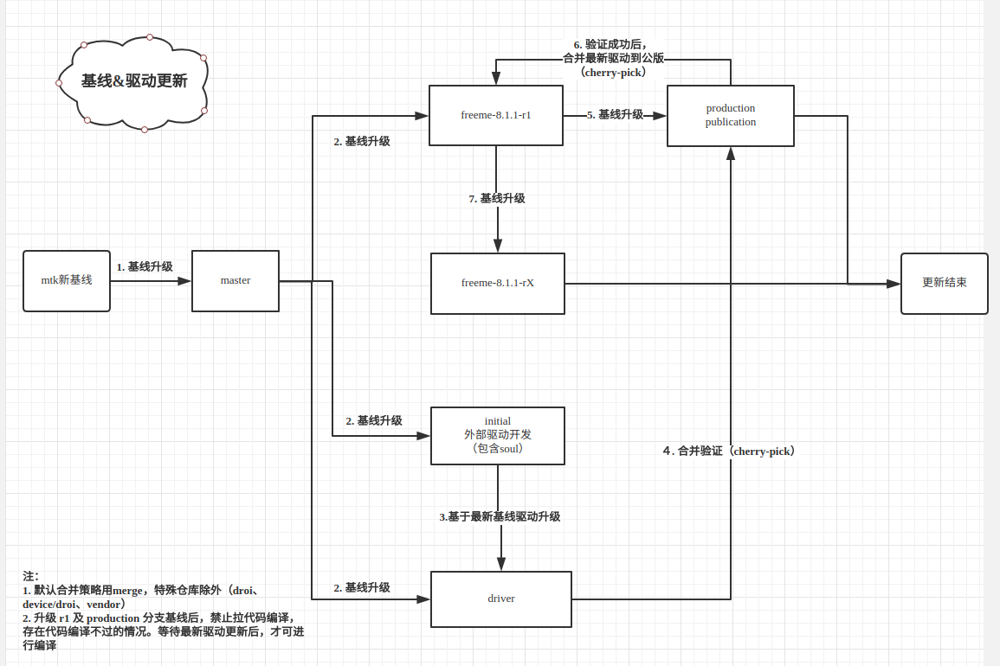
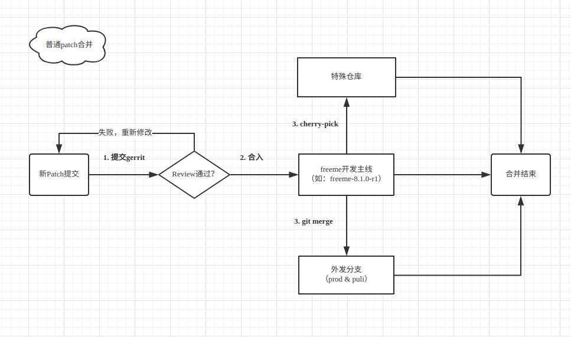

[TOC]

# 概要
本文档旨在介绍合并`Patch`提交时，需要了解和操作的注意事项

# 修改记录

| 版本 | 修改日期 | 作者 | 修改内容 |
| :---| ----------| ---- | ---- |
| v1.0 | 2018.05.16 | 陈明 | 初版 |

# MTK-Patch 合并流程



# Freeme-Patch 合并流程



### 1. 提交&review
待合入patch先提交到gerrit上，命名规则及提交规范请参考freeme默认要求。

### 2. 合并
review通过后，默认先合入主线分支，根据分支特性采用不同的合并策略合入其他分支

#### 普通平台仓库
以下仓库默认用 `git merge` 命令合入（命令详情见附录1与2）

```
vendor/freeme
framework 及其他 common 仓库 （定义在 common.xml中, vendor除外）
```

#### 特殊平台仓库
以下仓库暂包含部分 `bsp` 的改动，只采用 `cherry-pick` 的形式合入

```
vendor
device/droi
droi/
```

#### 应用仓库
根据各自需求合并（默认系统级应用采用 `git merge` 形式合并Patch）

### 3. 分支
以目前mt6763平台为例，包含以下分支

```
freeme-8.1.1_r1
freeme-8.1.1_r2
freeme-8.b.1_r1
production
publication
```
默认patch先合入当前工作主分支（`freeme-8.1.1_r1`），根据patch内容断是否合入其他分支，合并规则如下：

```
freeme-8.1.1_r1 === merge > freeme-8.1.1_r2
freeme-8.1.1_r1 === merge > production
freeme-8.1.1_r1 === merge > publication
freeme-8.1.1_r1 === pick  > freeme-8.b.1_r1
```

> 注：
> 1. 修复的平台Bug需要合入每一个分支
> 2. 项目特殊需求，如能平台话则合入每一个分支，否则单独项目提交

# 附录
#### 1. 合并命令：

```
git merge --no-ff --no-commit  freeme-8.1.1_r1
git commit -m"ROUTINE:  merge branch 'freeme-8.1.1_r1'"

```

#### 2. merge与cherry-pick的区别
参考资料：[Git笔记(三)——[cherry-pick, merge, rebase]] (https://blog.csdn.net/garfielder007/article/details/60885241)