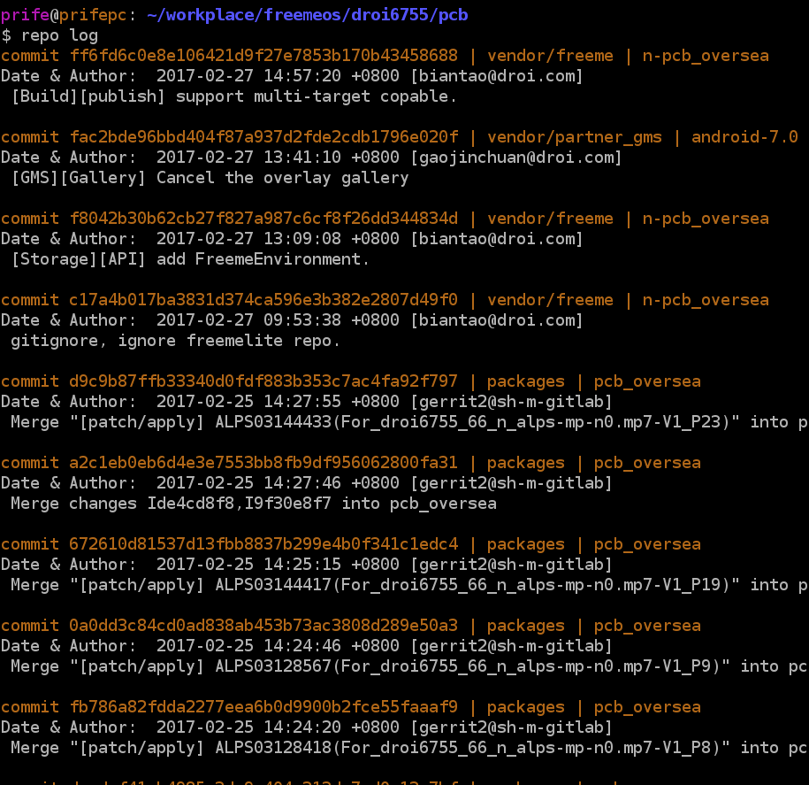
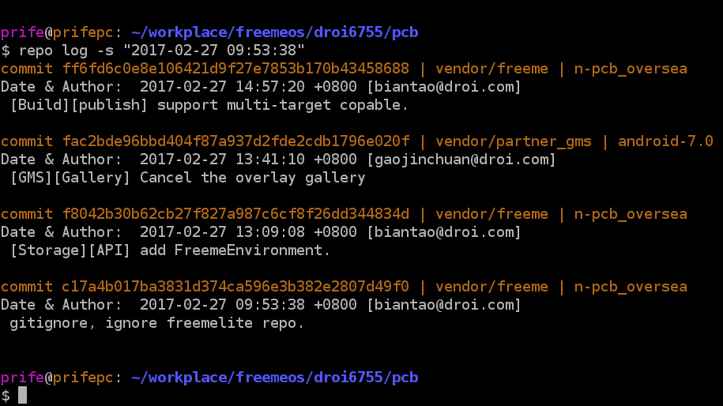
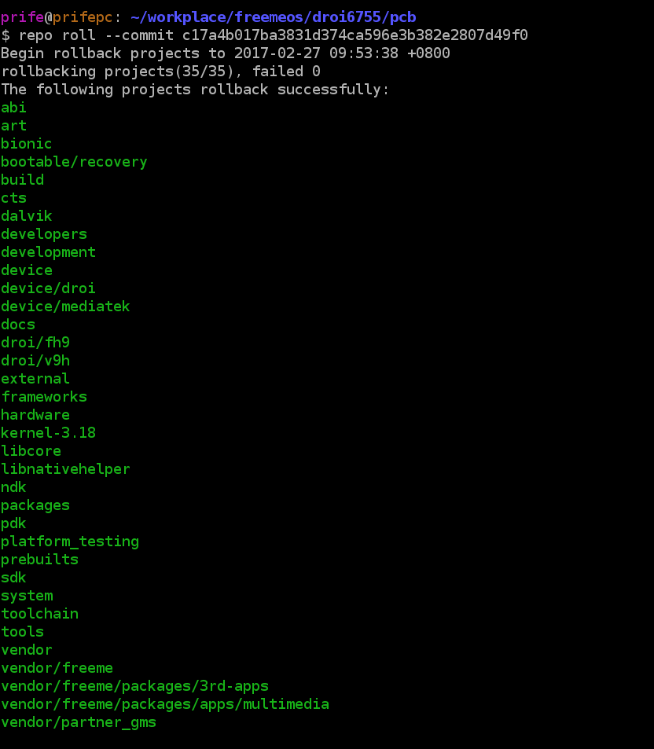
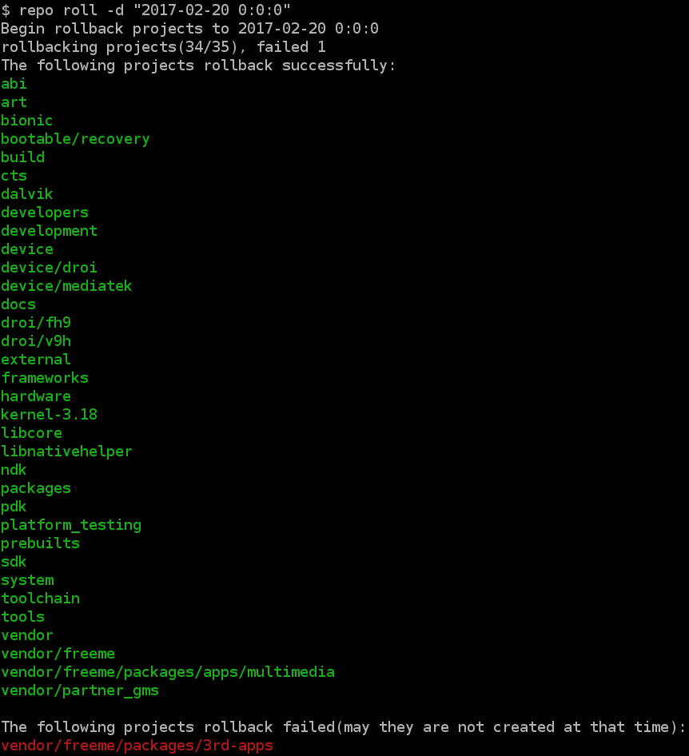

[TOC]

# 说明

repo仓库由多个子git仓库构成，为了方便对repo仓库的全部提交历史进行回溯，并且必要时可以将所有仓库回退到某个节点（类似于SVN），我们为repo增加了两个新命令。

- `repo log`，查看整个repo仓库的提交历史
- `repo roll`，用于对整个repo仓库进行整体回退

## `repo log`

该命令支持查看某个时间段的所有提交。如果不带任何参数，则列出所有仓库的所有提交，并根据每个提交的时间排序。效果如下：



查看某时刻至今的所有提交。



`repo log` 支持`-r`参数，该命依次按照时间先后顺序打印提交。最新的提交在最下面。

更多参数请使用`repo log --help`

注意，这个命令查看的是本地所有仓库的提交。需要查看服务器上的最新提交，请及时执行`repo sync`。

## `repo roll`

该命令可以用来快速将整个repo仓库代码取到某个commit-id节点。该命令配合`repo log`可实现二分法定位某提交引入的bug。

该命令支持两种用法，一种是指定commit，将所有仓库回退到该commit所表示的节点。



另一种是将所有仓库回退到某个时刻。注意该命令可能报错，如下所示。出现这个错误，是因为出错的仓库在这个时间时还不存在。针对这种情况，可手动将该仓库删除。



更多参数请使用`repo roll --help`。

# 演示说明

## 0. 准备

确保当前仓库同步最新代码。

```
repo sync
```

加载必要命令，后文用到的`repoclean`命令

```
. build/envsetup.sh
```

## 1. 生成日志文件

```
repo log > logcommit.txt
```

## 2. 选定回退节点

使用文本编辑器打开日志文件，确定要回退的节点。为了避免遗忘，笔者在要回退的节点出添加`<roll here: >`标记，如下

```
...【略】....

<roll here: >                                                                 
commit cb094de82ea41f764f6802200b3978de65f90803 | kernel-4.4 | pcb               
Date & Author:  2017-06-09 21:09:48 +0800 [dingxueqi@droi.com]                   
[DRIVER][COMMON][fixed main2 power on failed]
                                                                                
commit 94631e522736b9545b0e7af73c2770af647079cf | vendor/freeme/packages/3rd-apps | n-pcb
Date & Author:  2017-06-09 12:08:38 +0800 [lizhaomei@droi.com]                   
[FreemeLockNow] dele FreemeLockNow on launch,remove MtkBrowser

...【略】....
```

## 3. 执行回退命令

首先执行`repoclean`清理仓库，该命令将每个子仓库因为override的改动丢弃、并删除编译可能的临时文件。

```
repoclean
repo sync -l
```

注意上面使用`repo sync -l`，其中-l表示从`.repo`中存储的git记录checkout出版本。该命令不会联网同步代码。可以加快速度。

接下来执行回退

```
repo roll -c cb094de82ea41f764f6802200b3978de65f90803
```

根据该命令提示，如果有个别仓库在回退时间之前创建，命令会以红色命令提示，手动将这些仓库删除。

## 4. 编译

除了使用 mk脚本编译，这里介绍手动编译方法，在需要多次回退编译定位问题提交时，该方法可以大大加快编译速度。

```
. build/envsetup.sh
brunch xxxxxx-user -b
make -j10
```

说明：

- Android7.0使用的新编译工具`nijia`对增量编译的支持非常完善，`Android.mk`文件的改动也能识别并触发编译。上述命令没有删除out目录，因此属于增量编译。
- 建议仅在Android 7.0版本上执行版本回退编译验证时使用。该方法可以大大加快版本回退编译的速度。节省客观的资源。

## 5. 打包保存编译rom

编译ROM是占用了大量的计算资源生成的，以后回退版本时很可能再次用到，建议生成rom打包，然后重命名后保存，重命名规则为文件名后追加`日期-时分`。

```
./publish
mv <your-out-rom>  xxxxx-2017-0609-2109.zip
```

## 6. 刷机验证

刷机验证问题，如果问题存在，则更新

```
<roll here: fail>
```

如果成功，则更新为

```
<roll here: ok>
```

然后寻找下个节点，重复步骤3～6。