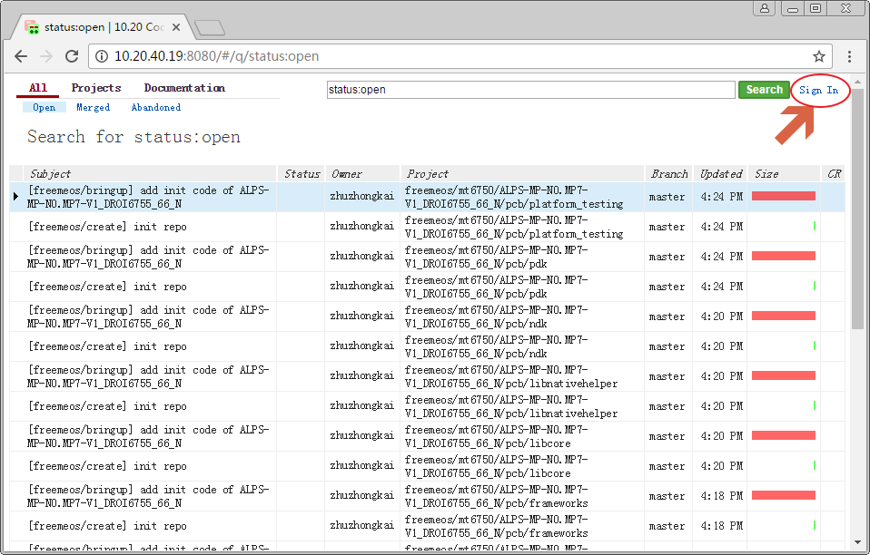
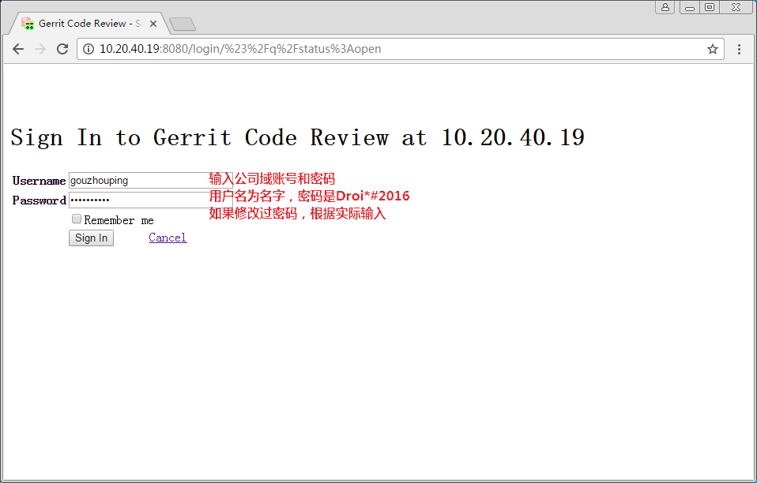
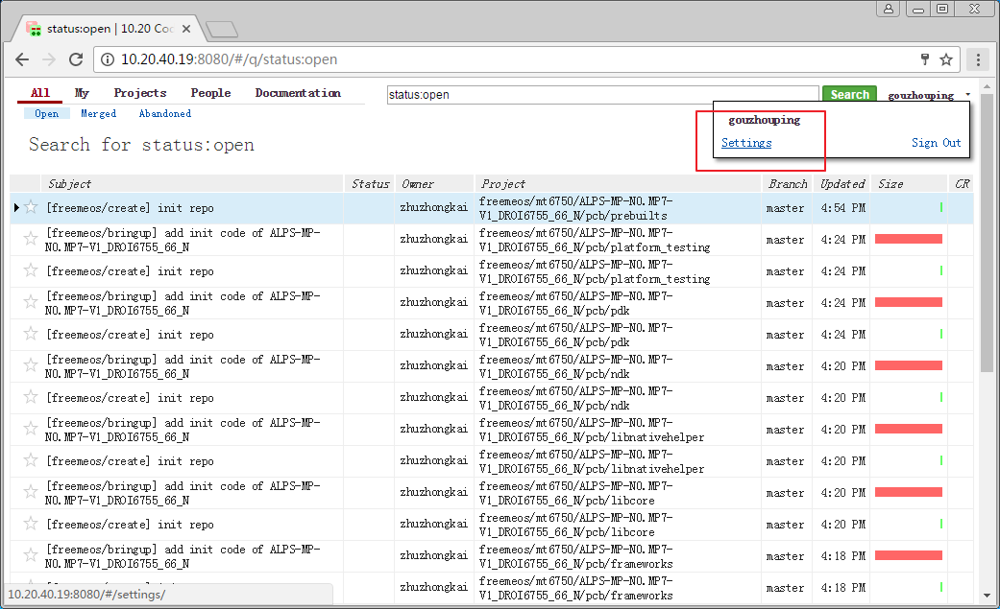
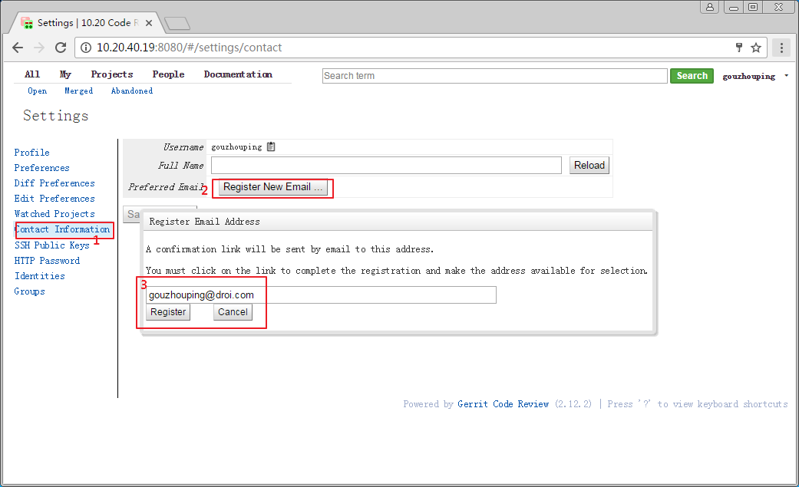
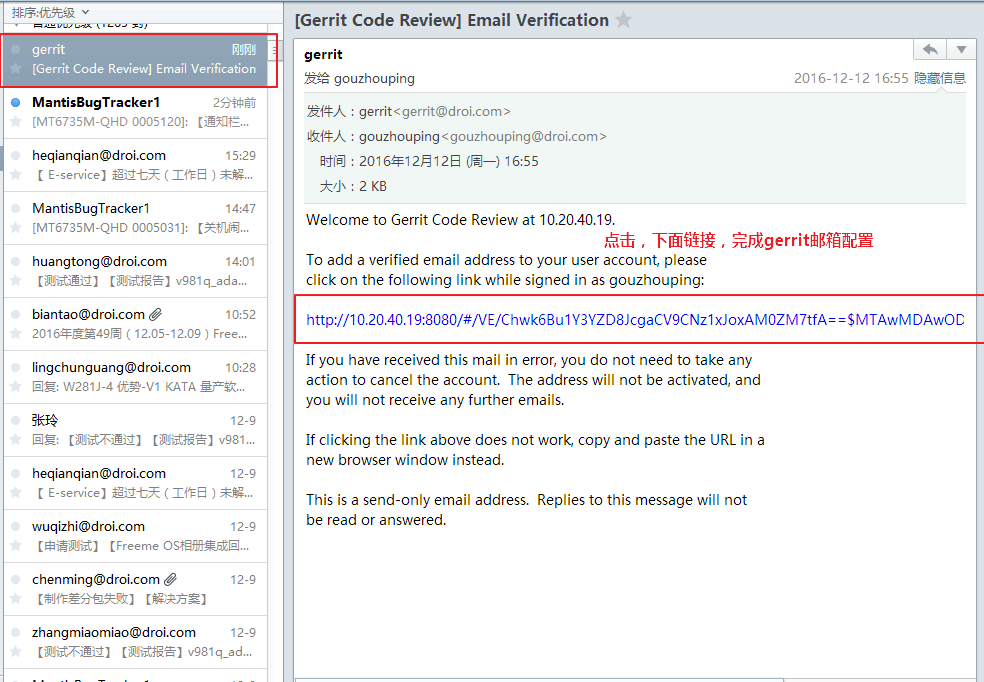
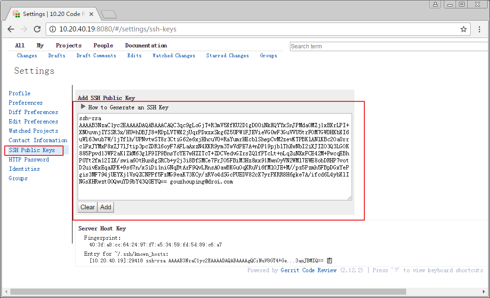
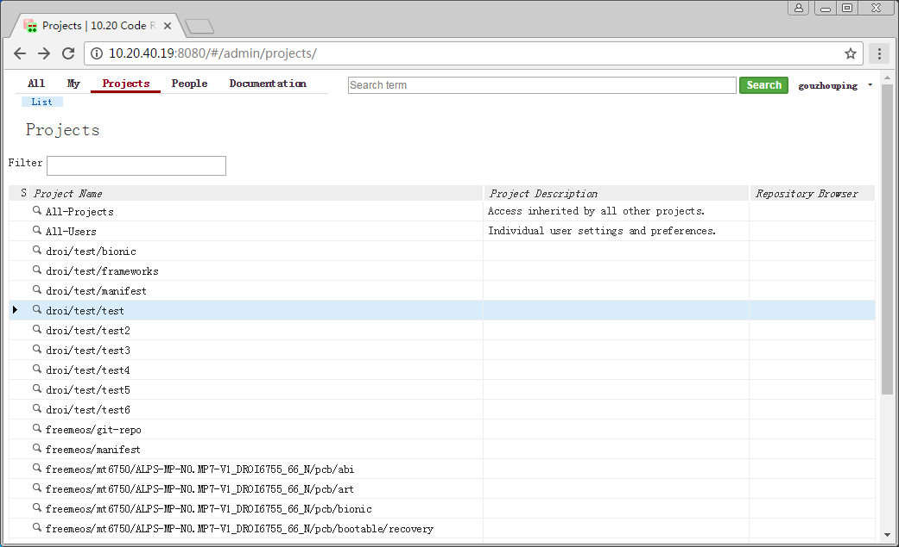
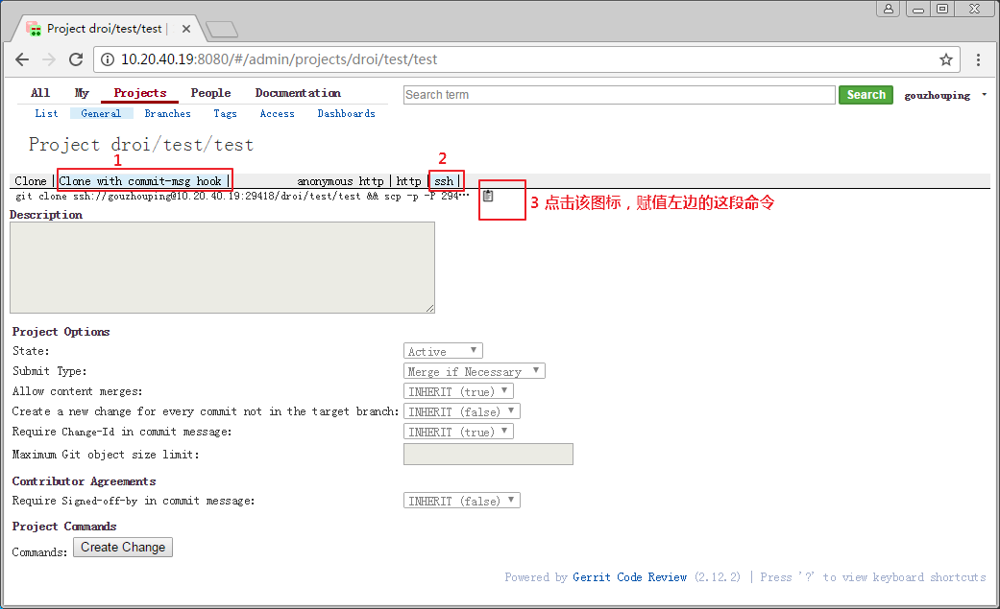

# git/repo环境配置

[TOC]

## 安装git

已知ubuntu14.04使用的git（版本1.9）版本过低，配合gerrit（版本2.12）使用有bug，请安装最新的git，命令如下：

```
$ sudo add-apt-repository ppa:git-core/ppa
$ sudo apt-get update
$ sudo apt-get install git
$ git version
git version 2.11.0
```

PS. ubuntu 16.04官方源中的git无此问题，可直接使用`sudo apt-get install git`安装即可。

### 配置Git

请把下面的`yourname`替换为自己的名字。

```
$ git config --global user.email "yourname@droi.com"
$ git config --global user.name "yourname"
$ git config --global core.editor vim
```

参考：[更多配置](https://git-scm.com/book/zh/v2/%E8%87%AA%E5%AE%9A%E4%B9%89-Git-%E9%85%8D%E7%BD%AE-Git)

### 生成ssh-key

请把下面的`yourname`替换为自己的名字。

```
$ ssh-keygen -t rsa -b 4096 -C "yourname@droi.com"
```

之后一直回车即可。执行完毕后生成`~/.ssh`目录，其中保存了一对秘钥（id_rsa.pub为公钥，id_rsa为私钥）

参考[非对称加密的简单概念](http://www.cnblogs.com/xuanhun/archive/2012/06/23/2559543.html)

## 下载安装repo命令

```bash
$ mkdir ~/bin
$ PATH=~/bin:$PATH
$ curl http://192.168.0.193/packages/linux/repo > ~/bin/repo
$ chmod a+x ~/bin/repo
```

打开`~/.bashrc`（如果使用zsh，请加入到`~/.zshrc`），添加如下行，注意，将`yourname`改成你的名字。

```
export REPO_URL="ssh://yourname@10.20.40.19:29418/freemeos/git-repo"
```

参考：[repo命令官方指南](https://source.android.com/source/using-repo.html)

然后注销系统或者`source ~/.bashrc`确保`REPO_URL`生效。

# 配置gerrit

## 登陆

首先登陆gerrit，公司内网地址：[http://10.20.40.17:8080](http://10.20.40.17:8080)，注意gerrit网页ip(10.20.40.17)地址与拉取代码使用的ip(10.20.40.19)不同，这是有意为之的。

**说明：目前测试发现使用IE浏览器以及360浏览器（兼容模式），无法打开本页面，请使用极速模式或更换chrome、firefox浏览器。**



用户名与密码是公司域账号，用户名为名字全拼，密码默认是`Droi*#2016`，如果自己修改过域账号密码，请使用修改后密码登陆。



## 配置邮箱







## 添加ssh-key

首先确保已经生成了ssh-key，如果未生成，请参考本文第一节生成。
打开`~/.ssh/id_rsa.pub`文件（可在命令行执行`gedit ~/.ssh/id_rsa.pub`打开该文件），把其中全部内容配置到添加到gerrit的ssh-key中，如下图所示。可以配置多个ssh-key。



## 拉取项目测试

### 1. 拉取git仓库测试




在ubuntu机器上打开终端，执行如下命令，将yourname修改为你自己的名字

```
$ git clone ssh://yourname@10.20.40.19:29418/droi/test/test && scp -p -P 29418 yourname@10.20.40.19:hooks/commit-msg test/.git/hooks/
```

修改代码后如何提交，以及git/repo/gerrit的基本工作流程，请参考`git-repo-quick-guide.md`文档。

### 2. 拉取repo仓库测试

创建临时目录，在终端中切换到该目录下，执行

```
$ repo init -u ssh://你的名字拼音@10.20.40.19:29418/freemeos/manifest -m test.xml
$ repo sync
$ repo start --all master
```

# 参考文献

- [Pro.git官方中文版本](https://git-scm.com/book/zh/v2)
- [Git与Repo入门](http://www.cnblogs.com/angeldevil/p/3238470.html)

# FAQ

## `Q: branch 'stable' has not been signed `

你的repo脚本可能是google原生的repo脚本，请在运行repo init命令时添加以下参数。

```
repo init --no-repo-verify -u ssh://***
```

或者使用 `http://192.168.0.193/packages/linux/repo` repo脚本

## `Q: git clone`提示`Permission denied (publickey)`

```
$ git clone ssh://yourname@10.20.40.19:29418/droi/test/test2
Cloning into 'packages'...
Permission denied (publickey).
fatal: Could not read from remote repository.

Please make sure you have the correct access rights
and the repository exists.
```

请做如下检查：

1. 确认已经安装了openssh-server，`sudo apt-get install openssh-server`
2. ssh-key已经生成，且公钥（~/.ssh/id_rsa.pub文件内容）已经添加到gerrit的ssh key public页面。
3. git clone <url>，url中的yourname是你本人的用户名

## `Q: git clone`提示`no matching key exchange method found`

```
$ git clone ssh://yourname@10.20.40.19:29418/droi/test/test2
Cloning into 'test2'...
Unable to negotiate with 10.20.40.19: no matching key exchange method found. Their offer: diffie-hellman-group1-sha1
fatal: Could not read from remote repository.
```

修改`~/.ssh/config`，如果不存在则创建该文件，确保该文件内容如下cat命令所示。

```
$ cat ~/.ssh/config
Host 10.20.40.19
    KexAlgorithms +diffie-hellman-group1-sha1
```

## `Q: git push`出错`error: unpack failed: error Missing tree ...`

```
$ git push origin HEAD:refs/for/master 
Counting objects: 1, done.
Writing objects: 100% (1/1), 223 bytes | 0 bytes/s, done.
Total 1 (delta 0), reused 0 (delta 0)
error: unpack failed: error Missing tree 261998b3bb6e7964f538ef9f5743fab5b0d044d5
fatal: Unpack error, check server log
To ssh://zhuzhongkai@10.20.40.19:29418/droi/test/frameworks
 ! [remote rejected] HEAD -> refs/for/master (n/a (unpacker error))
error: failed to push some refs to 'ssh://zhuzhongkai@10.20.40.19:29418/droi/test/frameworks'
```

请更新git版本，方法参考本文第一节。
