[TOC]

# repo介绍

## 下载代码

下载一个Repo项目，只需要三条命令：

```
$ repo init --no-repo-verify -u <URL> -m <manifest-file>
$ repo sync
$ repo start --all master
```

`repo init`中的使用到参数含义如下：

- `-u`：指定manifest仓库的路径，这是一个git仓库地址
- `-m`：指定manifest仓库中的某个manifest文件

例如，下载AndroidN 50项目海外公版本，注意修改yourname为你的名字。

```
$ repo init --no-repo-verify -u ssh://yourname@10.20.40.19:29418/freemeos/manifest -m ALPS-MP-N0.MP7-V1_DROI6755_66_N/pcb_oversea.xml
$ repo sync
$ repo start --all master
```

如果要下载驱动版本，请把repo init命令最后的`pcb_oversea.xml`改成`driver.xml`。

## 什么是repo？

repo有多重含义，这里明确说明下，以免混淆。

- 版本管理工具所谓的`仓库`，对应英文`repository`，缩写为`repo`。一个git仓库，英文即git repo。
- 整个Android源码树由500个左右的git仓库（git仓库也称为project）构成。为了方便管理，Google开发了`repo`工具（使用python语言开发），并且以特殊的目录结构组织Android源代码。有时候，采用这种方式构成的大项目（或称为大仓库）也被称为`Repo`。

## 什么是manifest文件

manifest文件即Repo工程的描述文件，XML格式，其中描述 **该Repo工程由哪些git仓库构成，且各个git子仓库以放置在哪个目录下。**

manifest文件本身也保存在一个git仓库中，这个特殊的仓库也就是所谓`manifest`仓库。当使用`repo`脚本下载`Repo`仓库代码时，需要明确告诉repo名命令使用哪个manifest仓库中哪个manifest文件下载代码。

## `Repo`的组织方式

Google设计的Repo项目的组织结构如下图，以AndroidN 50驱动版本为例（标准Android的目录结构类似）：

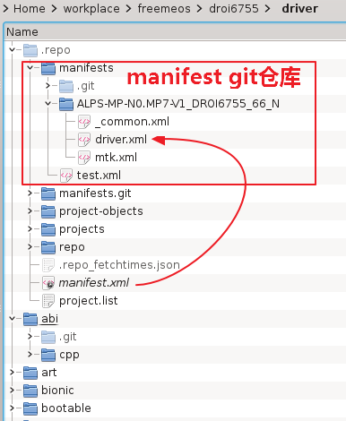

`.repo`目录结构

- manifest. 这是一个git仓库，repo命令的`-u`参传入的url被repo脚本使用`git clone`到此处。
- manifests.git
- project.list
- project-objects。
- projects
- repo. repo工具的具体实现。
- manifest.xml. 当前Repo的工程描述文件，该文件是个软连接，指向manifest/下的某个文件。

## 当前Gerrit上有哪些项目？如何下载？

当前FreemeOS的mainifest仓库路径是`ssh://yourname@10.20.40.19:29418/freemeos/manifest`。

想要知道FreemeOS有哪些Repo工程可以下载，命令如下，注意修改yourname为你的名字。

```
$ git clone ssh://yourname@10.20.40.19:29418/freemeos/manifest
$ cd manifest
$ ls
```

进入manifest目录，查看当前有哪些manifest配置文件。

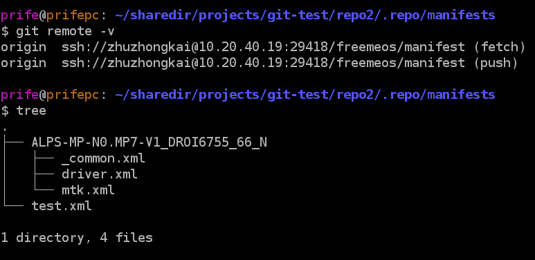

从上述目录可知，`repo init`的命令`<manifest-file>`参数可以取以下数值：

- `test.xml`
- `ALPS-MP-N0.MP7-V1_DROI6755_66_N/driver.xml`
- `ALPS-MP-N0.MP7-V1_DROI6755_66_N/mtk.xml`

当前约定的规则：以下划线开头的xml文件为内部使用文件，如`_common.xml`，不用于`repo init`的参数。 

# 项目开发

## 基本工作流程

1. 同步服务器最新代码
    - repo sync
2. 修改源代码
3. 使用git命令在本地提交
    - git add，暂存修改
    - git commit，提交到本地
4. 上传提交
    - repo upload，讲本地的提交上传到代码审核服务器（也就是gerrit）
5. 代码审核（code review）
    - 主管或高级工程师进行code review
    - 确认实现无问题，主管将修改提交到代码仓库

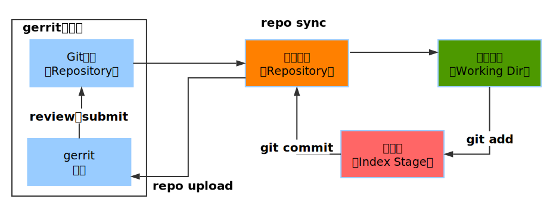

**案例1：上传并被review通过**

正常上传，review进去。涉及命令:

```
repo sync
git add
git commit
repo upload
```

**案例2：review不通过，修改后重新上传**

正常上传，但主管reveiw后发现认为代码需要修正。在案例1的基础上，继续执行:

如果review不过，使用

```
重新编辑代码
git add your-files
git commit --amend
repo upload .
```

**案例3：上传到gerrit上，提示冲突**

上传后，gerrit上提示冲突。在案例1的基础上，继续执行

```
repo sync
根据提示进入冲突文件目录，
repo rebase .
编辑冲突文件，修复冲突
git add 冲突文件
git rebase --continue
repo upload .
```

**案例4：本地有提交但未上传，repo sync时提示冲突**

```
根据提示进入冲突文件目录，
git status
编辑冲突文件，修复冲突
git add 冲突文件
git rebase --continue
repo upload .
```

## 同步代码

同步所有项目代码到本地。

```
$ repo sync
```

只同步某些项目

```
$ repo sync PROJECT0 PROJECT1 PROJECT2 ...
```

一般执行`repo sync`。

## 本地代码修改与提交

### 记录每次更新到仓库

#### 检查当前文件状态

```
$ git status
```

#### 跟踪新文件或暂存被修改的文件

```
$ git add <file>
```

如果被修改的文件很多，要将他们全部加入暂存，可以使用

```
$ git add -u
```

如果要跟踪或暂存某个目录所有文件，可以使用
```
$ git add you-dir
```

#### 忽略文件（.gitignore)

一般总会有些文件无需纳入`Git`的管理，也不希望它们总出现在未跟踪文件列表。 通常都是些自动生成的文件，比如日志文件，或者编译过程中创建的临时文件等。 在这种情况下，我们可以创建一个名为`.gitignore`的文件，列出要忽略的文件模式。

```
$ cat .gitignore
*.[oa]
*.swp
build/
```

- 第一行告诉`Git`忽略所有以`.o`或`.a`结尾的文件。一般这类对象文件和存档文件都是编译过程中出现的。
- 第二行告诉`Git`忽略所有以swp结尾的文件，这是vim生成的临时文件。
- 第三行告诉`Git`忽略`build/`

添加到.gitignore文件之后，`git status`和`git add`就会忽略他们。

### 提交更新（提交到本地git仓库）

现在的暂存区域已经准备妥当可以提交了。 在此之前，请一定要确认还有什么修改过的或新建的文件还没有`git add`过，否则提交的时候不会记录这些还没暂存起来的变化。 这些修改过的文件只保留在本地磁盘。 所以，每次准备提交前，先用 `git status`看下，是不是都已暂存起来了， 然后再运行提交命令`git commit`：

```
$ git commit
```
这种方式会启动文本编辑器以便输入本次提交的说明。 (默认会启用`shell`的环境变量`$EDITOR`所指定的软件，一般都是`vim`或`emacs`。一般使用`git config --global core.editor`命令设定你喜欢的编辑软件。）


另外，也可以在`commit`命令后添加`-m`选项，将提交信息与命令放在同一行，如下所示：

```
$ git commit -m "Story 182: Fix benchmarks for speed"
[master 463dc4f] Story 182: Fix benchmarks for speed
 2 files changed, 2 insertions(+)
 create mode 100644 README
```

请记住，提交时记录的是放在暂存区域的快照。 任何还未暂存的仍然保持已修改状态，可以在下次提交时纳入版本管理。 每一次运行提交操作，都是对你项目作一次快照，以后可以回到这个状态，或者进行比较。

### 查看历史

查看提交历史使用

```
$ git log
```

默认不用任何参数的话，`git log`会按提交时间列出所有的更新，最近的更新排在最上面。这个命令会列出每个提交的 SHA-1校验和、作者的名字和电子邮件地址、提交时间以及提交说明。

`git log`有许多选项可以帮助查找需要的提交。简单介绍一下最常见的几个参数。

- `-p`：显示每次提交的内容差异
- `-数字`：显示最近几条提交

例如`git log -p -2`显示，最近两条提交，并且给出每条提交内容差异

- 查看每次提交的简略的统计信息，可使用`--stat`选项
- 查看某个文件上的所有改动，使用`git log the-file-you-want-watch`
- 查看某个文件夹内的所有改动，使用`git log the-dir-you-want-watch`
- 查看某人的所有改动，使用`--author="xxxx"`选项

注意，上面的选项可以组合使用，例如查看某个文件夹内某人的改动，并且给出简略的统计信息，以及内容差异

```
$ git log --stat --author=biantao build
```

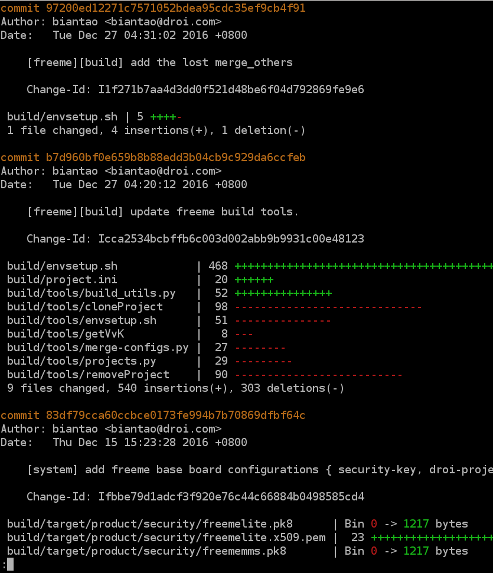

`git log`还有很多强大参数，比如列出某段时间内的提交，或以特定格式显示提交历史。

### 撤销修改

在任何一个阶段，都有可能想要撤消某些操作。

**修订上次提交**

有时候提交完了发现漏掉了几个文件没有添加，或者提交信息写错了。 此时，可以运行带有`--amend`选项的提交命令尝试重新提交：

```
$ git commit --amend
```

这个命令会将暂存区中的文件提交。 如果自上次提交以来你还未做任何修改（例如，在上次提交后马上执行了此命令），那么快照会保持不变，而你所修改的只是提交信息。

文本编辑器启动后，可以看到之前的提交信息。 编辑后保存会覆盖原来的提交信息。

例如，你提交后发现忘记了暂存某些需要的修改，可以像下面这样操作：

```
$ git commit -m 'initial commit'
$ git add forgotten_file
$ git commit --amend
```

最终只会有一个提交，第二次提交将代替第一次提交的结果。

**取消暂存的文件**

例如，你已经修改了两个文件并且想要将它们作为两次独立的修改提交，但是却意外地输入了`git add * `暂存了它们两个。 如何只取消暂存两个中的一个呢？ `git status`命令提示了你：

```
$ git add *
$ git status
On branch master
Changes to be committed:
  (use "git reset HEAD <file>..." to unstage)

    renamed:    README.md -> README
    modified:   CONTRIBUTING.md
```

根据提示，执行`git reset HEAD CONTRIBUTING.md`可以将`CONTRIBUTING.md`取消暂存。

**取消对文件的修改**

在最后一个例子中，未暂存区域是这样：

```
$ git status
On branch master
Changes to be committed:
  (use "git reset HEAD <file>..." to unstage)

    renamed:    README.md -> README
Changes not staged for commit:
  (use "git add <file>..." to update what will be committed)
  (use "git checkout -- <file>..." to discard changes in working directory)

    modified:   CONTRIBUTING.md
```

让我们来按照提示执行：

```
$ git checkout -- CONTRIBUTING.md
$ git status
On branch master
Changes to be committed:
  (use "git reset HEAD <file>..." to unstage)

    renamed:    README.md -> README
```

可以看到那些修改已经被撤消了。

## 上传提交

代码修改完成后，并且在本地提交后，现在可以将本地的改动推送到gerrit服务器上了，命令如下

```
$ repo upload [<PROJECT_LIST>]
```

### 上传当前项目

如果只想提交当前项目，那么可在当前项目目录下直接执行

```
$ repo upload .
```

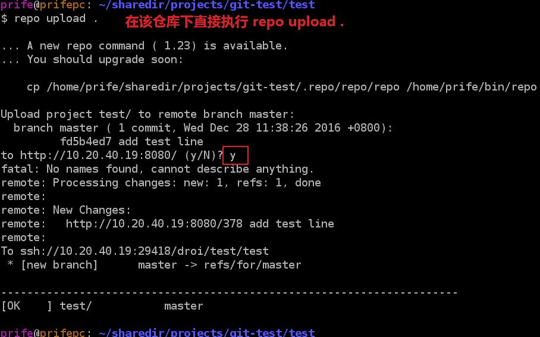

### 上传多个项目

如果在多个项目都有修改，想同时上传多个项目的多个提交，直接执行

```
$ repo upload
```

不加参数时，`repo upload`会打开终端编辑窗口（vim），效果如下

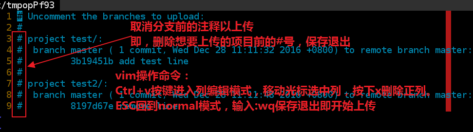

将要上传的仓库行前的#号删除，这是个vim窗口，请使用`:wq`保存退出，之后操作如下

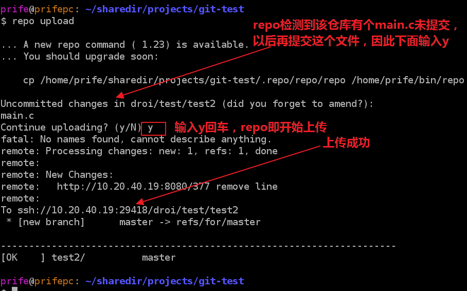

为了防止遗漏，建议在`repo upload`之前，执行`repo status`查看当期Repo仓库各个项目的状态。

代码提交之后，就可以在公司gerrit服务器：[http://10.20.40.19:8080/](http://10.20.40.19:8080/)看到自己的提交了。

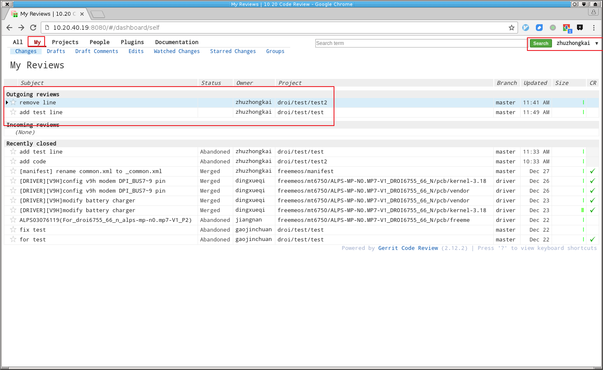

可以在gerrit上看到自己的提交，接下来请leader审核刚才的改动，确定没有问题submit到代码仓库中。

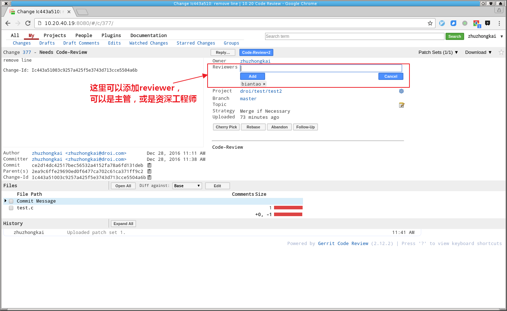

## 冲突修复

### gerrit上提示冲突
有时候，一切不是那么顺利。`repo upload`后，你可能在gerrit看到`。像下面这样。

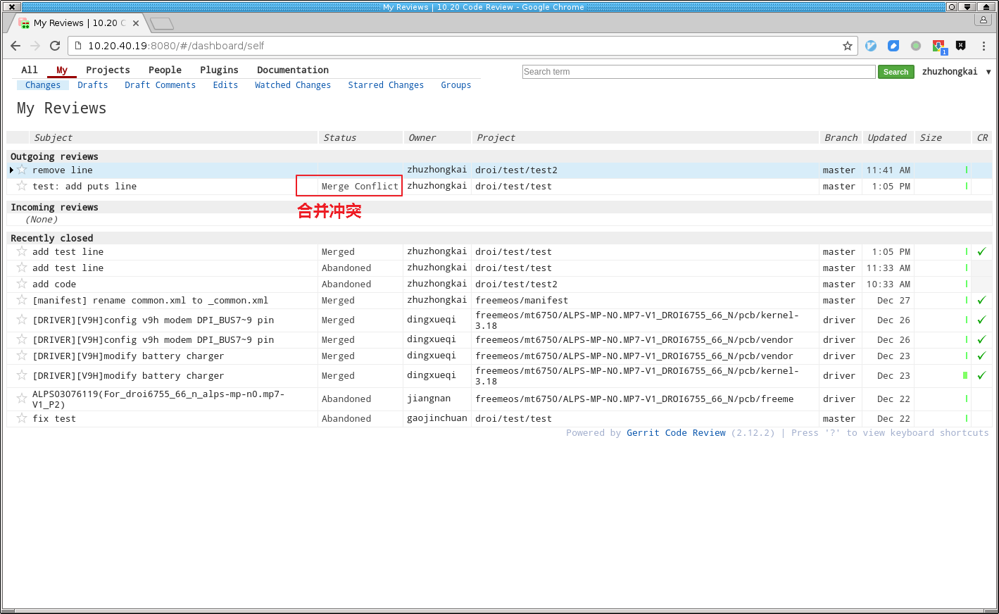

点击进入后，可以看到红色字体醒目的提醒我们，无法合并到仓库中。

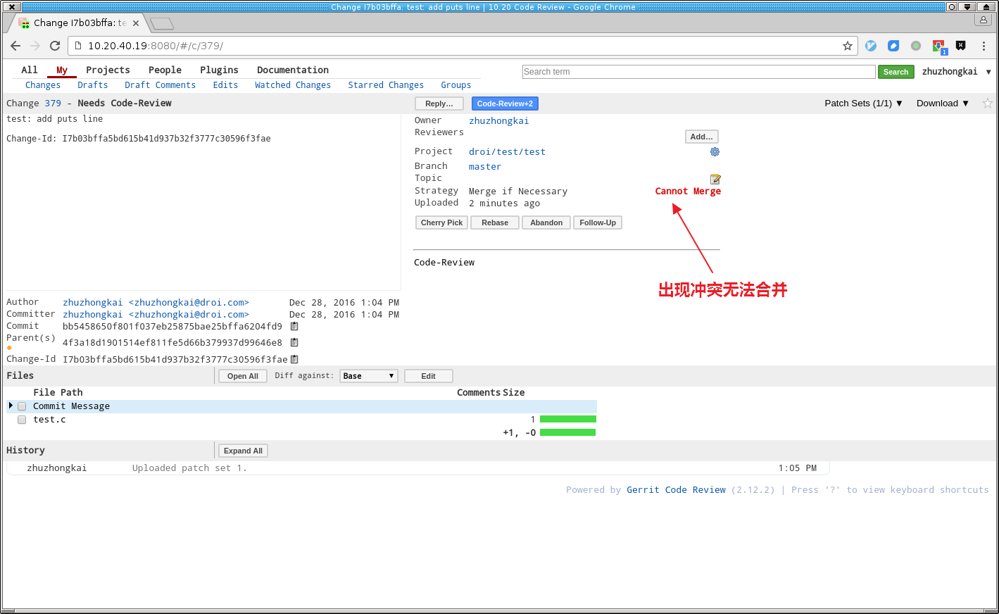


如果你和别人同时改动了同一个文件的相同位置，并且别人的代码比你先合并到远程仓库，就会出现这种情况。或者你要改动的文件在远程仓库中被删除了、移动、重命名都会出现冲突而无法合并。

**解决冲突**

冲突出现时，表明服务器上代码更新了，而你本地仓库的代码已经过时。

1. 首先更新本地仓库

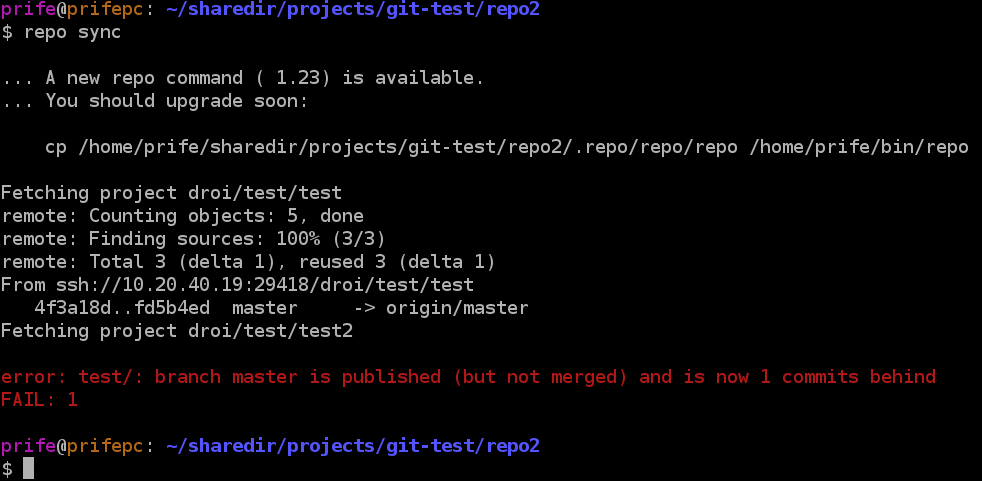

可以看到repo提示，因为执行过repo upload上传本地提交，repo提示，`branch master`被发布(published)到gerrit上，但同时服务器上仓库又有更新，这种情况repo提示错误。

2. 进入冲突仓库换基`rebase`，并手动修复冲突

执行`repo base .`，意料之中的，出现冲突了。

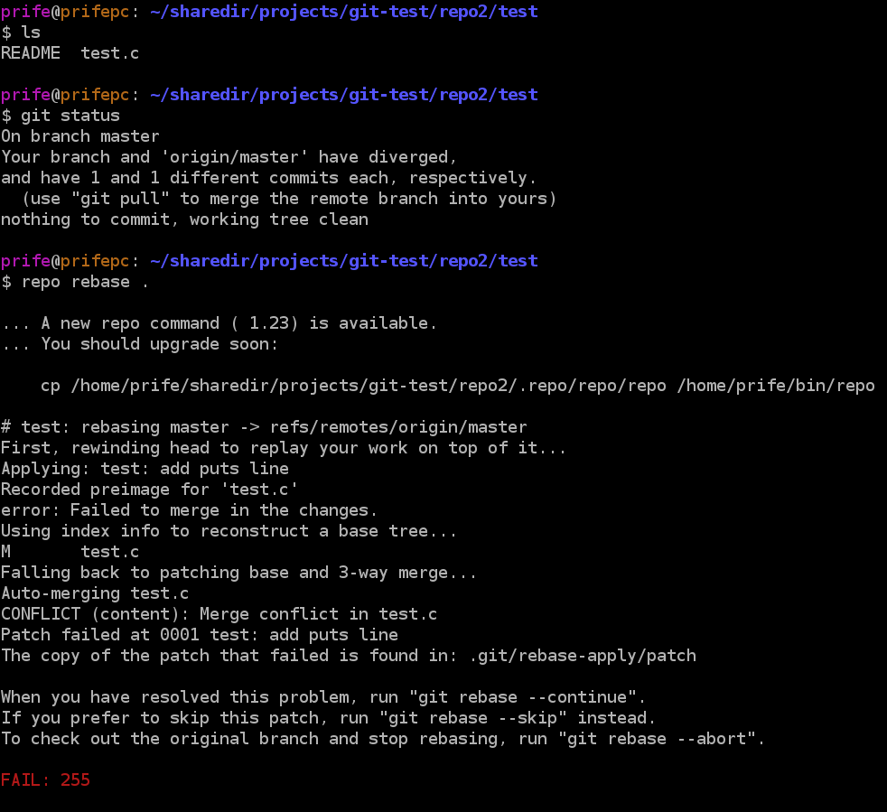

执行`git status`查看，Git提示有两个提交试图修改`test.c`

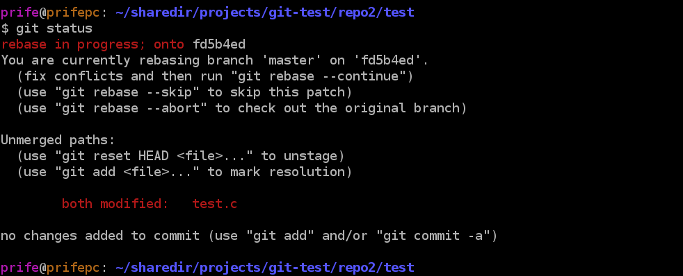

使用编辑工具打开冲突文件。其中HEAD表示远程服务器分支的改动，等号之下是本地提交的改动，两个提交都改动了源文件的第10行，因此出现冲突。

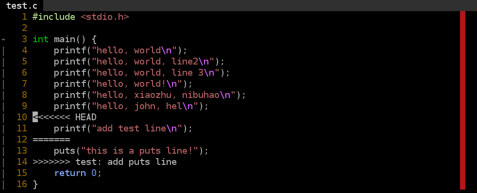

我们选择同时保留这两处修改，那么将<<<、====、 >>>>等行删除。然后保存退出vim。然后依次执行

```
$ git add 冲突的文件
$ git rebase --continue
```

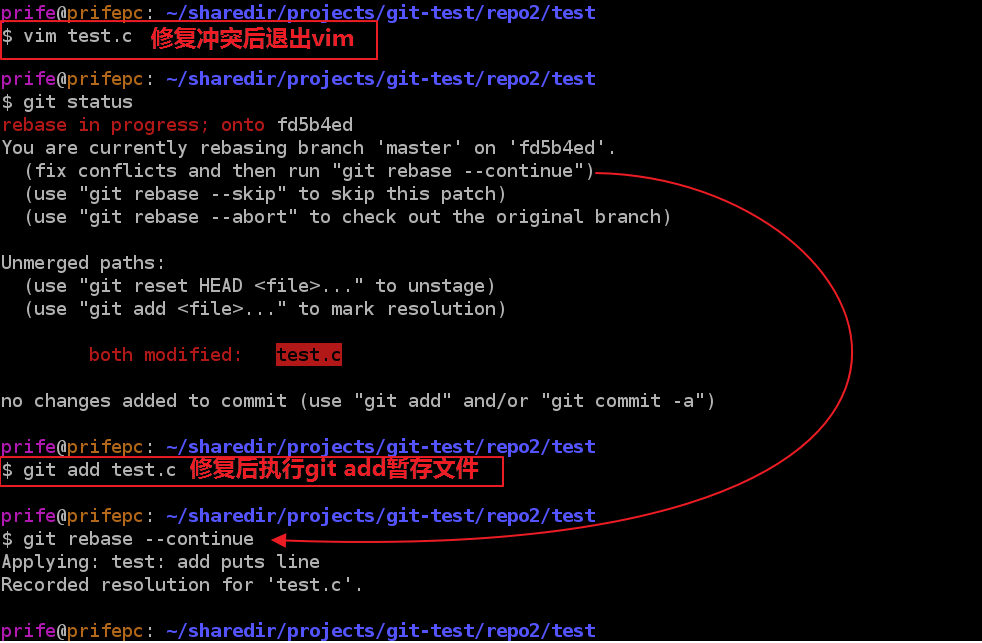

3. 重新上传服务器

冲突已经在本地修复，重新上传服务器。

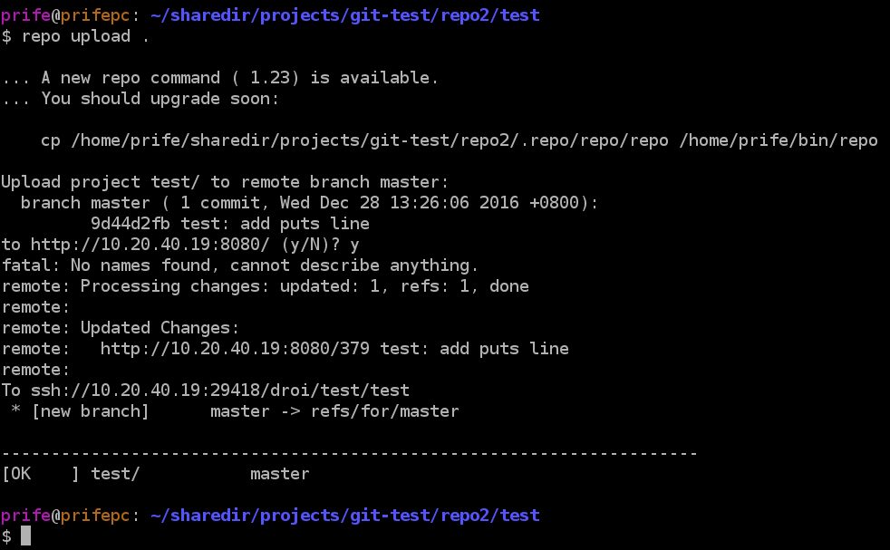

gerrit上可以看到冲突已经消除，可以合并。

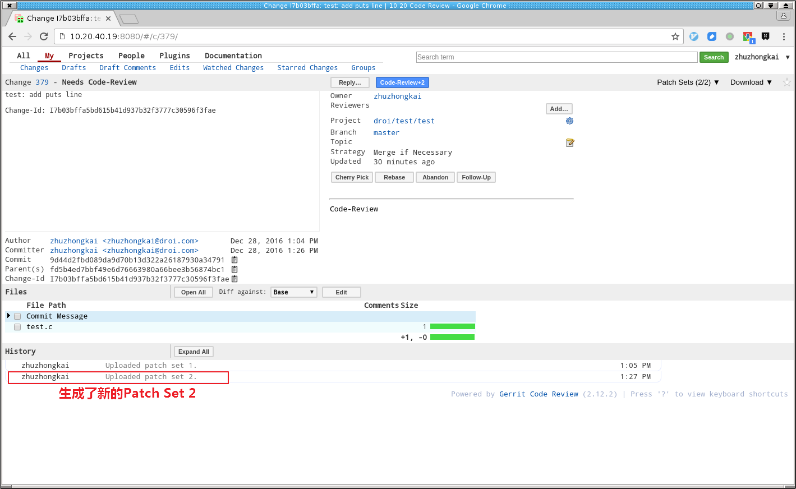

### 其他冲突情形

如果有些代码已经在本地提交，但还没有执行`repo upload`上传服务器，如果此时远程仓库中有提交的改动和你本地提交改动了相同位置，此时执行`repo sync`也出现冲突，如下图所示。

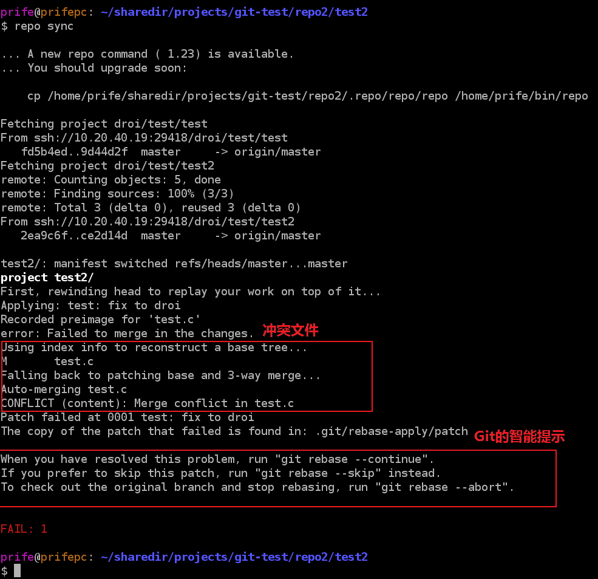

**解决冲突**

1. 进入冲突项目的位置
2. 编辑文件，手动修复冲突，然后保存退出
3. `git add`将冲突文件暂存，
4. `git rebase --continue`，完成rebase

之后你可以继续在本地工作。

## git图形界面

Git的原生环境是终端。 在那里，你可以体验到最新的功能，也只有在那里，你才能尽情发挥 Git的全部能力。 但是对于某些任务而言，纯文本并不是最佳的选择；有时候你确实需要一个可视化的展示方式，而且有些用户更习惯那种能点击的界面。

有一点请注意，不同的界面是为不同的工作流程设计的。 一些客户端的作者为了支持某种他认为高效的工作流程，经过精心挑选，只显示了`Git`功能的一个子集。 每种工具都有其特定的目的和意义，从这个角度来看，不能说某种工具比其它的“更好”。 还有请注意，没有什么事情是图形界面客户端可以做而命令行客户端不能做的；命令行始终是你可以完全操控仓库并发挥出全部力量的地方。

1. gitk

gitk是git项目自带的图形界面，功能比较简单。

```
$ sudo apt-get install gitk 
```

使用时，只需要在git仓库目录下执行gitk即可，加`--all`参数可以查看所有分支的状态，包括本地分支和远程分支。

```
$ cd your-git-repo
$ gitk --all
```

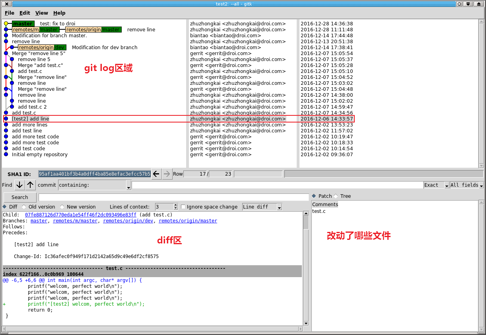

2. TortoiseGit(windows)

3. SourceTree(Windows/MAC)

4. SmartGit（Windows/Linux/MAC）

4. 其他GUI

[https://git-scm.com/downloads/guis](https://git-scm.com/downloads/guis)

## 总结

## 参考文献

# 附录

## `repo`命令

repo命令可以在Repo仓库目录及其任意子目录下执行，不需要在Repo根目录下执行。

### `repo init`

```
$ repo init -u <URL> [<OPTIONS>]
```

在当前目录下安装Repo仓库。执行完毕后在当前目录下生成`.repo`目录，并安装manifests.git, manifest，repo

命令行参数：

- `-u`：指定manifest的git仓库的路径。
- `-m`：选择manifest仓库中的具体文件，默认是default.xml。
- `-b`：指定manifest仓库的某个版本，通常是某manifest仓库分支。

### `repo sync`

```
$ repo sync [<PROJECT_LIST>]
```

从远程仓库上同步代码到本地Repo项目。中括号表示参数可选。后面可以跟一个或多个项目列表。如果不带参数，则更新全部项目。

例如，同步全部项目（也就是该Repo所有的git子仓库）

```
$ repo sync
```

例如，只同步`frameworks`和`vendor/droi/freeme`

```
$ repo sync frameworks vendor/droi/freeme
```

### `repo status`

```
$ repo status [<PROJECT_LIST>]
```

查看本地所有Project的状态，每个修改的文件前有两个字符，第一个字符表示git暂存区的状态。如果不带参数，则遍历全部项目状态。

当查看当前项目状态，可以使用 `repo status .`，当然也可以使用`git status`查看。

- | no change | same in HEAD and index
--|-----------|-----------------------
A | 已暂存的 | not in HEAD, in index
M | 已修改的 | in HEAD, modified in index
D | 已删除的 | in HEAD, not in index
R | 被重命名 | not in HEAD, path changed in index
C | 被拷贝的 | not in HEAD, copied from another in index
T | 文件模式改动的 | same content in HEAD and index, mode changed
U | 未被合并的 | conflict between HEAD and index; resolution required

### `repo upload`

```
$ repo upload [<PROJECT_LIST>]
```

上传本地提交至服务器。当不带参数时，repo命令会遍历全部项目，比较每个仓库的当前分支与远程分支的差异，并确定是否提交。

比较常见的简写是在当前工作的目录下执行 `repo upload .`，仅提交该工程到远程仓库。

### 参考文献

- http://source.android.com/source/developing.html
- https://source.android.com/source/using-repo.html
