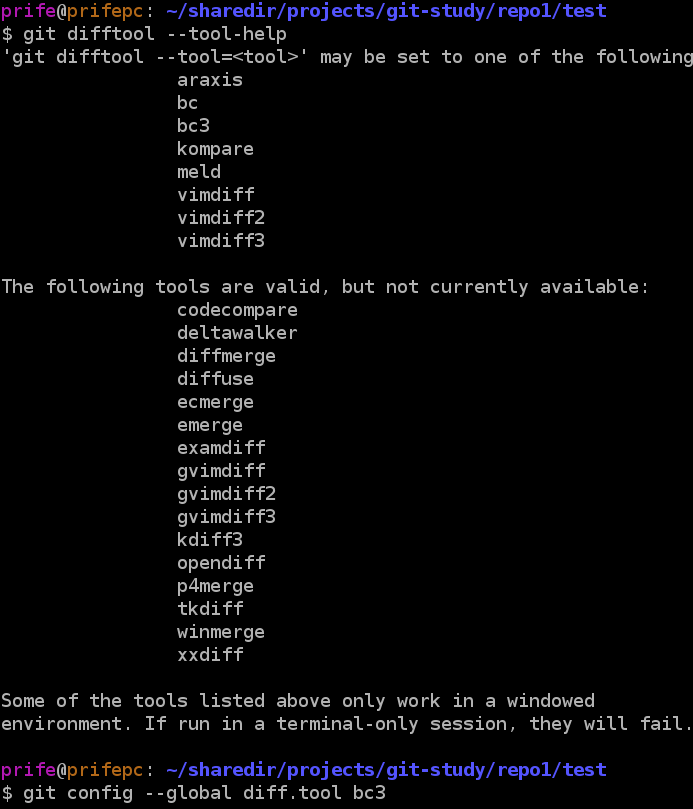

# 提交技巧

[TOC]

## 关于丢弃修改

如果某个提交完全不想要了，可以使用在gerrit上点击`abandon`丢弃该提交，本地的提交通常也需要丢弃，这可以使用git reset命令实现。

```
git reset
```

它有两种形式:

1. `git reset <commit-id> [files]`，只丢弃git提交，但保留工作目录文件内容不变。
2. `git reset --hard <commit-id> [files]`，`--hard`参数丢弃git提交，同时丢弃工作目录文件改动。

## git仓库中的`HEAD`

`HEAD`是一个指针，指向当前git所在的本地分支。它等价于`git log`看到的第一个提交的`commit-id(SHA1)`。

git设计了特殊的符号语法：`commit-id^N`，用于快速恢复到节点`commit-id`前`N`个节点。

例如丢弃最后一个提交，并丢弃工作区改动。使用
```
git reset --hard HEAD~1
```

## 同仓库多分支提交同一个Feature改动

目前已经上线的项目仓库，主要有以下四个分支：

1. mtk，用于记录mtk提供原生代码，并合并mtk后续补丁
2. driver，用于驱动组调试驱动
3. pcb_oversea，用于海外版本开发
4. pcb，用于国内版本开发

比如需要实现某个功能，同时需要向`driver`分支和`pcb`提交，已经在`driver`分支上提交了该修改，现在需要将相同的修改提交到`pcb_oversea`分支。有以下几种方法实现：

### 方法1. 多份代码，同步提交

拉取`pcb_oversea`仓库，使用比较工具（如beyond compare）从`driver`分支手动合并提交。

### 方法2. 利用gerrit的`Cherry Pick`

在gerrit上打开driver分支提交页面，点击`Cherry pick`，填写想要合并到的分支。如下图。


填写想要pick到的分支，gerrit会自动补全，然后点击`Cherry pick Chang`。


如果没有任何错误，则会生成一个该分支的新提交。


如果有冲突，pick将不成功，请尝试其他方法。

### 方法3，使用gerrit的`download`

在gerrit上打开driver分支提交页面，点击右上角的`download`按钮。


将上面红色圆圈，复制命令到粘贴板。拉取pcb_oversea仓库，命令行切换到相关仓库路径，粘贴命令。

顺利的话，该提交被pick成功了，如果发生冲突了，请修复冲突后上传服务器即可。

如果上传提示被拒绝，可能是`changid`被重复使用了。请执行`git commit --amend`删除最后一行`changid`，以生成一个新的`changid`后从新上传。

### 方法4. 本地使用`git`命令合并

`git cherry-pick`命令，顾名思义，用于合并一个或多个已存在的提交到某分支上。

只拉取一套，比如是`driver`分支，然后希望向`pcb_oversea`分支也提交

1. `git checkout pcb_oversea -b origin/pcb_oversea`
2. `git chery-pick your-commit`
3. `git commit --amend`，删除changid行以生成新的changid
3. `git push origin HEAD:refs/for/pcb_oversea`
4. `git checkout driver`

这比较适合单个仓库多分支，比如`FreemeLite`组。并且对git分支比较熟悉时使用。如果你对git不熟，那么不建议使用这个方法。因为很容易把本地分支搞乱。

**请谨慎使用此方法**。

## 多平台不同仓库提交同一个Feature改动

### 1. 使用gerrit的`download`

gerrit提供的Download功能，不仅可用于同一仓库，也可以本地仓库A中同步gerrit上远程仓库B的提交，这里所谓的同步，可以是检出（checkout）、、合并单一提交（cherry-pick）、合并分支（pull）等动作。

在gerrit上打开某提交页面，点击右上角的`download`按钮。


可以看到有多行命令，点击右边的复制，然后打开命令行，切换到想要`download`的仓库目录下，粘贴命令回车执行，下面分别介绍下各自的含义：

1. Checkout

    该命令的示例如下

        git fetch ssh://zhuzhongkai@gitlab.droi.com:29418/freemeos/common/documents refs/changes/06/33506/1 && git checkout FETCH_HEAD  

    该命令由两条命令构成。第一条命令`git fetch ...`代表的含义是获取刚提交节点（包括其所有父节点）的所有历史到本地；第二条`git checkout FETCH_HEAD`则表示取出到该节点。这样操作之后，执行命令的当前仓库的当前分支就会立刻变身为要download的那个提交。换言之，此时本地仓库的取出的代码与gerrit网页上提交的代码完全一样。如果执行这条命令之前你由未提交/或者提交但是未review通过提交，执行该命令后，你的提交将不可见，当前分支会变身为gerrit网页上那个提交。

2. Pull

    该命令的示例如下

        git pull ssh://zhuzhongkai@gitlab.droi.com:29418/freemeos/common/documents refs/changes/06/33506/1

    pull命令会将本地仓库的当前分支与gerrit上要download的那个提交的所在分支发生一次分支的merge。换言之，在当前分支上，你的本地提交和它的提交都会存在。

3. Cherry-pick

        git fetch ssh://zhuzhongkai@gitlab.droi.com:29418/freemeos/common/documents refs/changes/06/33506/1 && git FETCH_HEAD

    跟Checkout类似，这条命令也由两条命令构成，区别在第二条命令是` cherry-pick`。cherry-pick命令顾名思义，是仅仅将要被pick的提交（差异）合并到你当前所在的分支。执行完该命令之后，在你本地所有提交的基础上增加了gerrit上的这条提交。

利用gerrit的download命令，在协同开发、patch合并、合并历史提交等等诸多场景下有广泛应用。请读者留意，利用好该命令，在某些场景下，可以大大提高开发效率。

### 2. 多份代码，同步提交

拉取多平台代码，使用比较工具（如beyond compare）手动合并提交。这是传统做法，不建议使用。

### 3. 使用patch命令

unix/linux系统中自带了一对神奇的命令，可以生成两个文件的差异文件（diff文件）；也可以将差异文件合并到某个文件上，使之变成另外的文件，这就是`diff`与`patch`命令。

```
patch -Np1 < xxxx.diff
```

注意，数字`1`表示跳过1层目录。数字具体填几，需要根据`diff`文件和当前目录确定。

注意观察patch命令输出，如果没有错误，那么请git add，git commit、repo upload。
如果有patch失败的地方，请手动合并错误的失败的地方，此时可使用比较工具比较。

# 图形化工具

## 查看提交历史

ubuntu下最简单、方便的git图形工具就是gitk，安装方法如下：

```
sudo apt-get install gitk
```

使用方法是进入git仓库所在目录下，执行

```
gitk --all
```

即可查看所有该仓库所有分支的提交历史。

## 配置git使用`gedit`编辑器（`git commit`, `repo upload`)

有些同学不习惯vim，可以使用`gedit`作为`git commit`和`repo upload`弹出的编辑器。配置方法如下。

```
git config --global core.editor "gedit -w -s" 
```


注意，该配置仅支持gedit 3.x以上。ubuntu 14.04的gedit支持上面的配置。ubuntu 12.04的gedit版本过旧不支持。

参考：http://stackoverflow.com/questions/19455929/how-to-configure-gedit-as-git-core-editor

## diff时图形化工具

Git	预设了许多其他的合并和解决冲突的工具，无需特别的设置即可使用。查看当前支持的工具列表，试一下这个：

```
git difftool --tool-help
```



```
git config --global diff.tool bc3
```

只有要查看差异，请使用`git difftool`取代`git diff`，效果如下


## merge冲突时图形化工具

```
git mergetool --tool-help
```

查看系统中当前支持的merge工具。然后配置一个可用的，如beyong compare，方法如下。

```
git config --global merge.tool bc3
```

当合并出现冲突时，可以执行git mergetool即可使用图形合并工具。

# repo命令增强

为了方便对repo仓库的全部提交历史进行回溯，并且必要时可以将所有仓库回退到某个节点（类似于SVN），我们为repo增加了两个新命令。

- `repo log`，查看整个repo仓库的提交历史
- `repo roll`，用于对整个repo仓库进行整体回退

## `repo log`

该命令支持查看某个时间段的所有提交。如果不带任何参数，则列出所有仓库的所有提交，并根据每个提交的时间排序。效果如下：


查看某时刻至今的所有提交。


更多参数请使用`repo log --help`

注意，这个命令查看的是本地所有仓库的提交。需要查看服务器上的最新提交，请及时执行`repo sync`。

## `repo roll`

该命令可以用来快速将整个repo仓库代码取到某个commit-id节点。该命令配合`repo log`可实现二分法定位某提交引入的bug。

该命令支持两种用法，一种是指定commit，将所有仓库回退到该commit所表示的节点。


另一种是将所有仓库回退到某个时刻。注意该命令可能报错，如下所示。出现这个错误，是因为出错的仓库在这个时间时还不存在。针对这种情况，需要手动处理，可以将该仓库删除。


更多参数请使用`repo roll --help`。

## 脚本中实现的自定义命令

- repostatus
- repoclean
- repoupgrade
