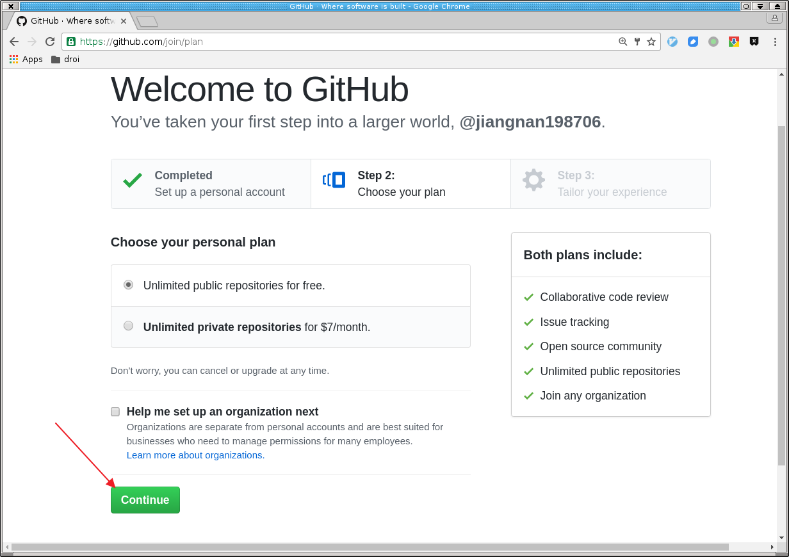
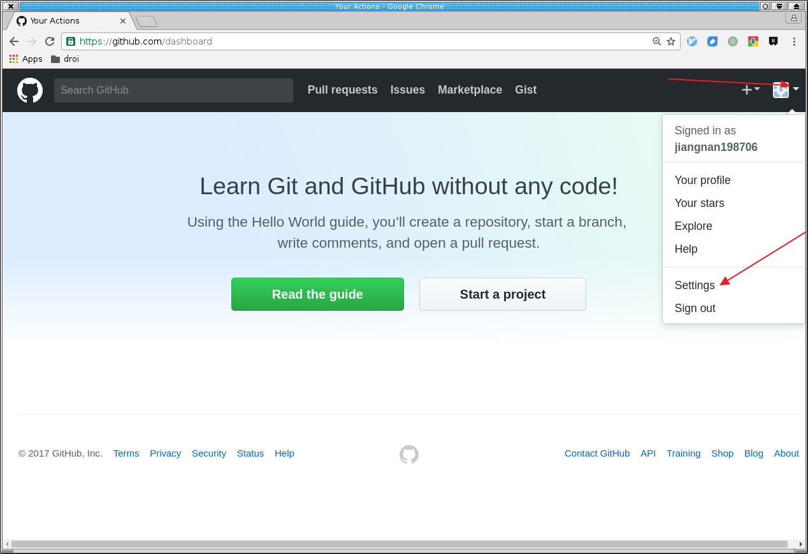
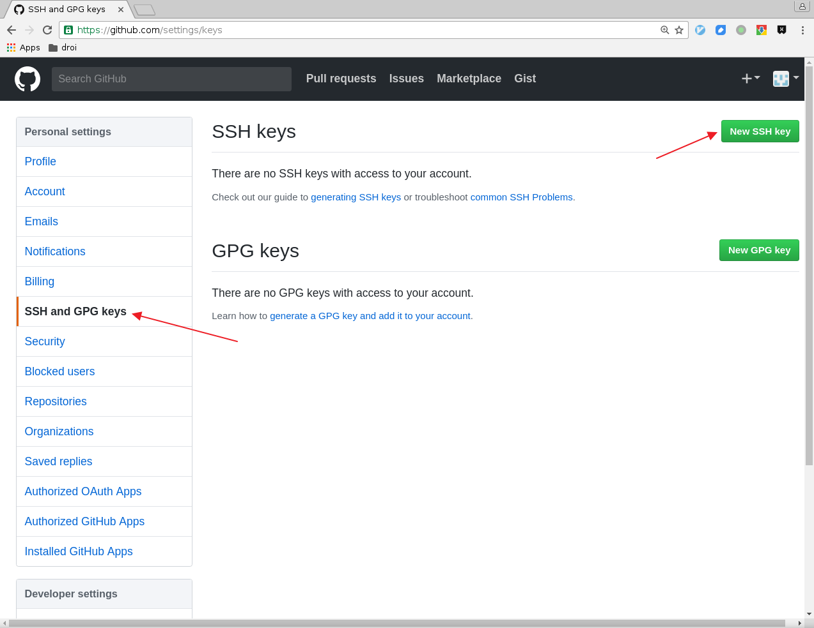
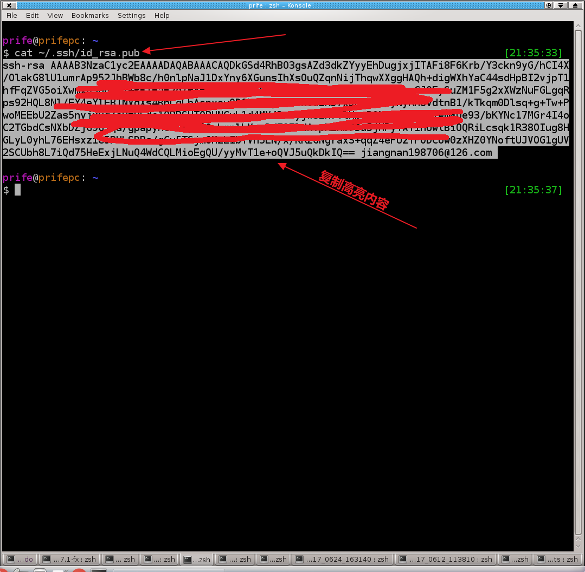
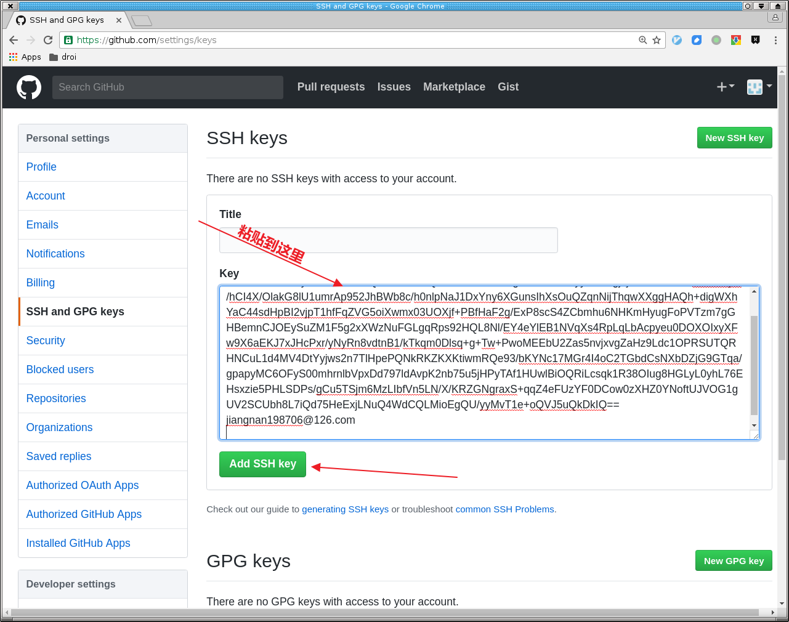
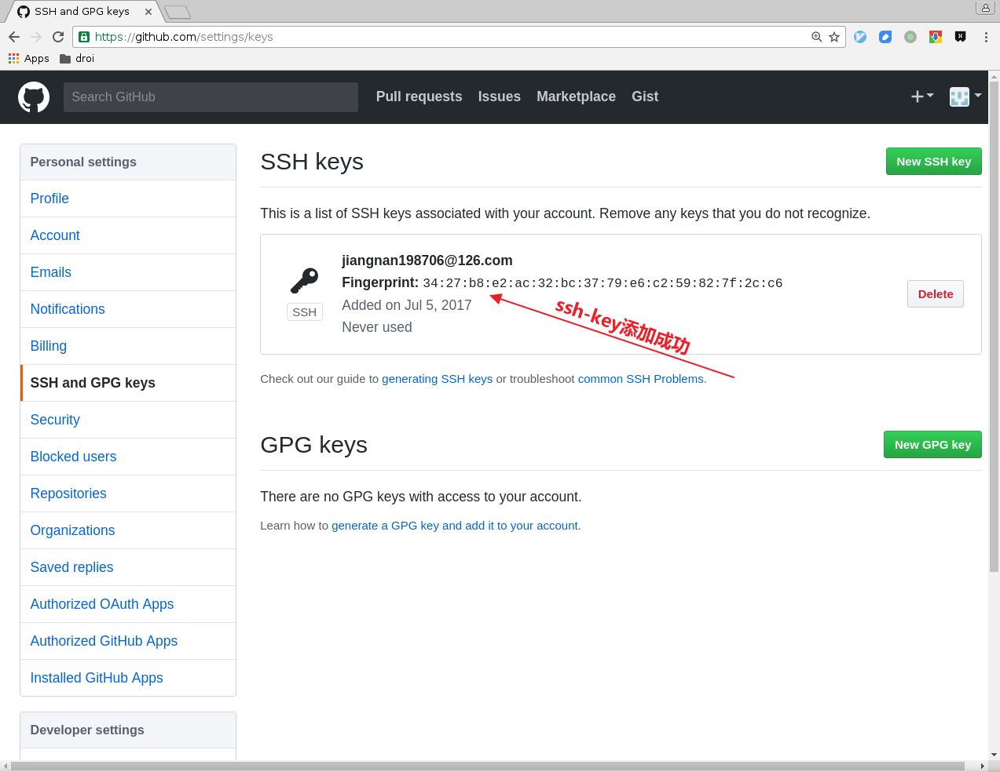
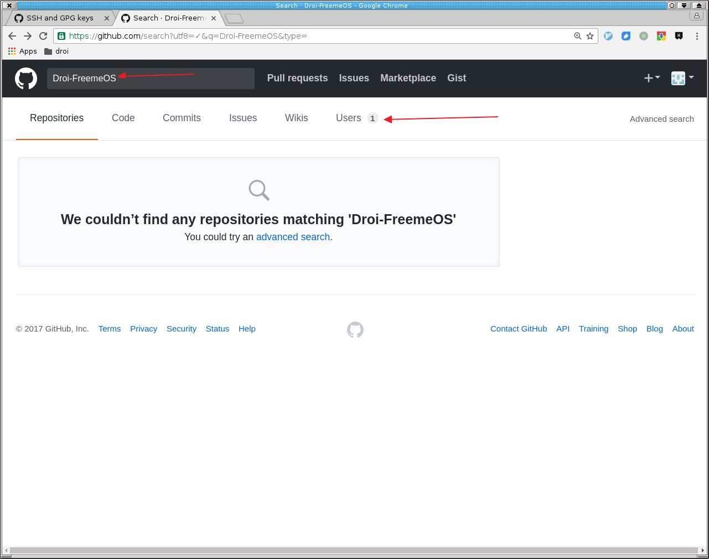
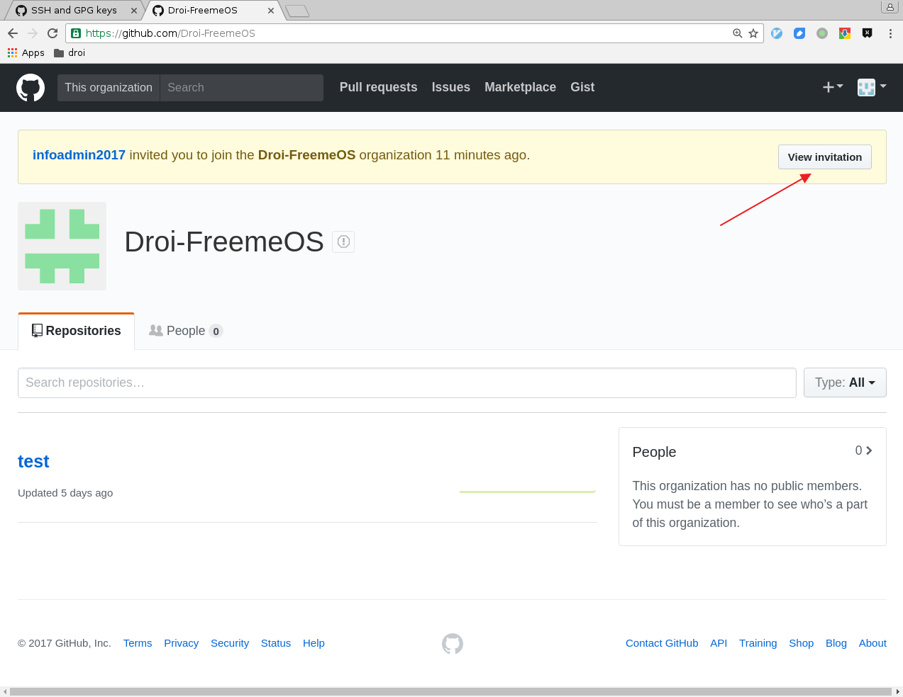
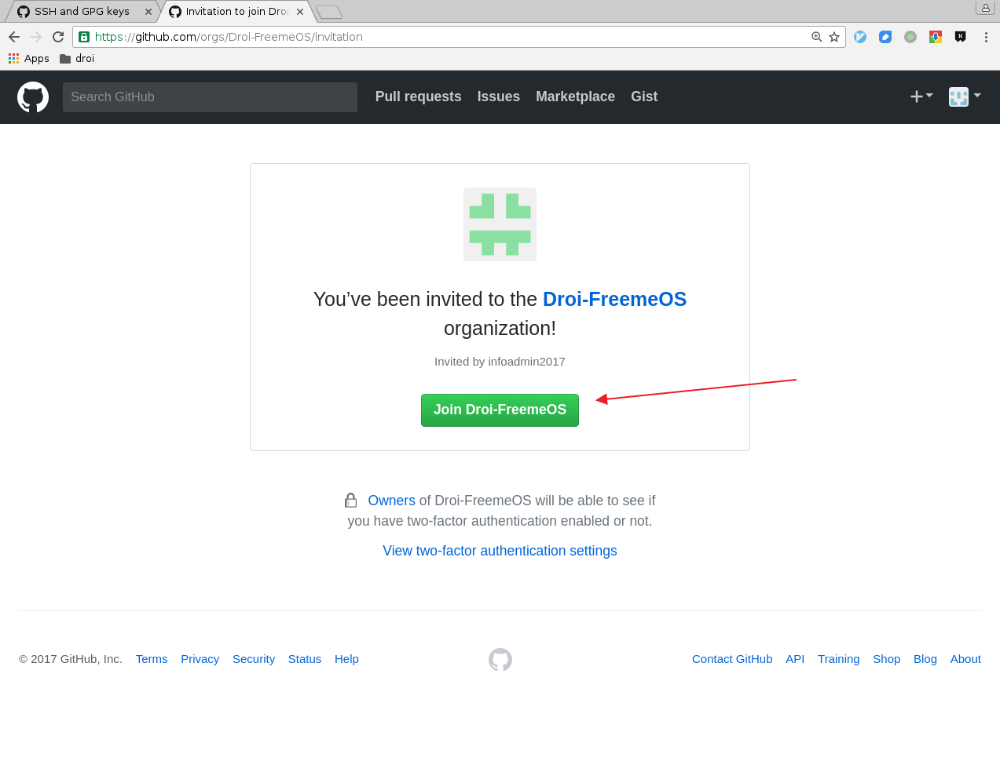
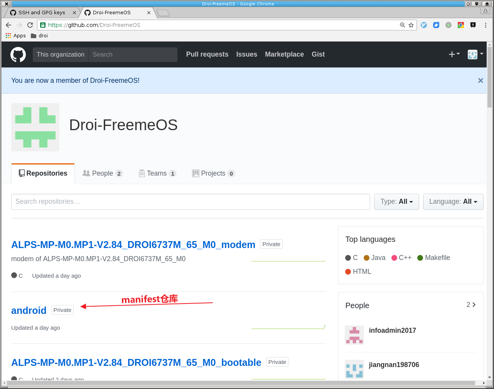

[TOC]

# 配置环境

## 机器要求

- 机器：ubuntu 14.04或者更高版本
- 内存：>=16G
- 硬盘：>=100G

## 安装git

ubuntu14.04使用的git（版本1.9）版本过低，建议安装新版本git，命令如下：

```
$ sudo add-apt-repository ppa:git-core/ppa
$ sudo apt-get update
$ sudo apt-get install git
$ git version
git version 2.11.0
```

PS. ubuntu 16.04或者更高版本，不需要更新`git`。

请把下面的`yourname`替换为自己的名字。

```
$ git config --global user.email "yourname@xxx"
$ git config --global user.name "yourname"
$ git config --global core.editor vim
```

参考：[更多配置](https://git-scm.com/book/zh/v2/%E8%87%AA%E5%AE%9A%E4%B9%89-Git-%E9%85%8D%E7%BD%AE-Git)

### 生成ssh-key

请把下面的`yourname`替换为自己的名字。

```
$ ssh-keygen -t rsa -b 4096 -C "yourname@xxxx"
```

之后一直回车即可。执行完毕后生成`~/.ssh`目录，其中保存了一对秘钥（id_rsa.pub为公钥，id_rsa为私钥）

## 安装repo命令

```
$ mkdir ~/bin
$ PATH=~/bin:$PATH
$ curl https://storage.googleapis.com/git-repo-downloads/repo > ~/bin/repo
$ chmod a+x ~/bin/repo
```

注意上述命令需要翻墙，如果无法翻墙，可使用清华Android镜像提供的git-repo仓库，方法如下：

```
$ mkdir ~/bin
$ curl https://mirrors.tuna.tsinghua.edu.cn/git/git-repo > ~/bin/repo
$ chmod +x repo
$ chmod a+x ~/bin/repo
```

打开`~/.bashrc`，最后添加下行。

```
export REPO_URL='https://mirrors.tuna.tsinghua.edu.cn/git/git-repo/'
```

重启系统确保repo命令安装配置成功。

参考：

- https://source.android.com/source/using-repo.html
- https://mirrors.tuna.tsinghua.edu.cn/help/git-repo/

# 配置github账号

freemeOS代码发布在github上，为私有仓库。默认不可见。请先注册github账号。方法如下







请登陆自己的邮箱，完成认证。










# 拉取代码

github账号注册完毕后，请将该账号提供给我司，我司将贵司github账号添加为合作伙伴。

在github中搜索Droi-FreemeOS组织，即可查看









## 拉取测试仓库

```
$ mkdir test
$ repo init -u git@github.com:Droi-FreemeOS/android.git -m test.xml
$ repo sync
$ repo start --all master
```

## 拉取FreemeOS代码

```
$ mkdir test
$ repo init -u git@github.com:Droi-FreemeOS/android.git -m ALPS-MP-M0.MP1-V2.84DROI6737M65_M0.xml
$ repo sync
$ repo start --all master
```

## 拉取modem代码

```
$ git clone git@github.com:Droi-FreemeOS/ALPS-MP-M0.MP1-V2.84_DROI6737M_65_M0_modem.git
```

## 编译方法

### 编译Android

```
source build/envsetup.sh
lunch full_droi6737t_35g_m0-user
make -j32
```

### 编译modem

- 移动联通

```
./make.sh
$project.mak new
```

- 电信

  参考C2K_Modem_Build_Environment.pdf，密码6322477226
