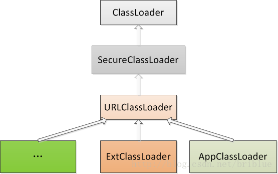
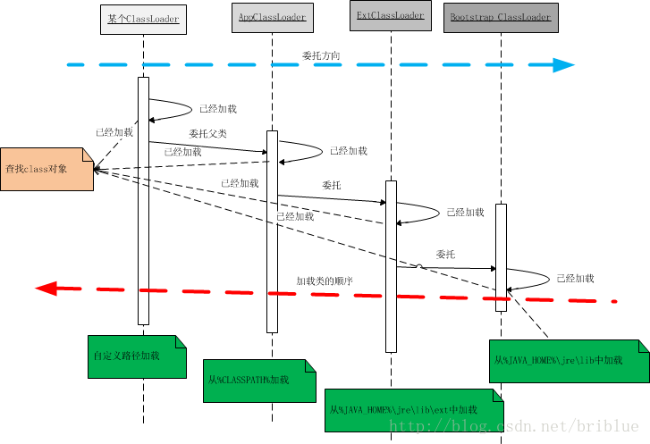
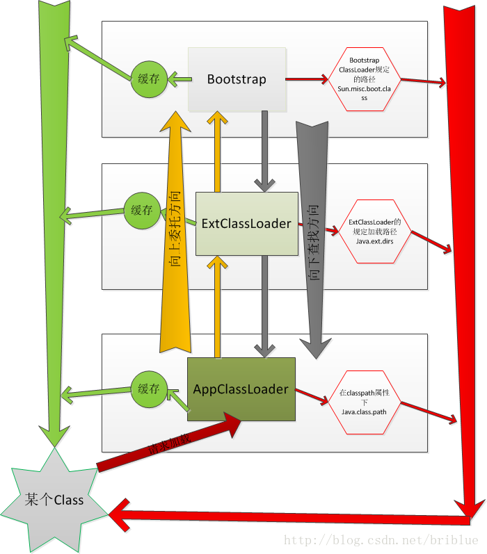

# ClassLoader原理

## 什么是ClassLoader

java的源代码通过javac编译后，生成字节码(.class文件)，通过jvm解析执行。但是在解析之前，需要加载到内存中。这就要用到ClassLoader。ClassLoader字面的意思，就是类加载器。主要的功能就是加载.class文件到内存。

## ClassLoader是如何加载的

.class文件说白了，还是一个文件，如果像C和C++,把所有源代码都编译成一个可执行文件，文件很大时，加载就需要很大的内存，并且加载比较慢。如果java把所有的源代码都编译成一个文件，也会有这个问题。java为了解决这个问题，javac会把一个class编译成一个文件。例如如下代码：

```
class Outer {
      public class Inner {
       }
   }
```
经过javac编译后，会生成Outer.class 、Outer$Inner.class这两个class文件，尽管你把上面的代码写在一个文件中，所以也可以理解ClassLoader就是class加载器。并且支持动态加载，只要在使用之前加载过，就可以了。

- 让我们写代码测试一下，类加载流程

PathClassLoader.java

```
import java.io.ByteArrayOutputStream;
import java.io.InputStream;
import java.io.IOException;
import java.io.File;
import java.io.FileInputStream;


public class PathClassLoader extends ClassLoader {
    private String pathUrl;

    public PathClassLoader(String path) {
        super(null);
        pathUrl = path;
        System.out.println("pathUrl = " + pathUrl);
    }

    @Override
    protected Class<?> findClass(String name) throws ClassNotFoundException {
        Class clazz = null;
        byte[] classData = getClassData(name);
        if (classData == null) {
            throw new ClassNotFoundException();
        }
        clazz = defineClass(name,classData,0,classData.length);
        System.out.println("findClass class = " + clazz.toString());
        return clazz;
    }

    private byte[] getClassData(String name) {
        String classPath = classNameToPath(name);
        File file = new File(classPath);
        byte[] buff = new byte[1024*4];
        int len = -1;
        InputStream is = null;
        System.out.println("getClasData classPath:" + classPath);
        try {
            is = new FileInputStream(file);
            ByteArrayOutputStream baos = new ByteArrayOutputStream();
            while ((len = is.read(buff)) != -1) {
                baos.write(buff,0,len);
            }
            return baos.toByteArray();
        } catch (Exception e) {
            System.out.println("Exception e : " + e.toString());
        } finally {
            if (is != null) {
                try {
                    is.close();
                } catch (IOException e) {
                    System.out.println("Exception e : " + e.toString());
                }
            }
        }
        return null;
    }

    private String classNameToPath(String name) {
        return pathUrl + "/" + name.replace(".","/") + ".class";
    }
}
```

- ClassLoaderSimple.java

```
public class ClassLoaderSimple {
    private ClassLoaderSimple instance;
    public void setClassLoaderSimple(Object obj) {
        try {
            instance = (ClassLoaderSimple) obj;
        } catch(Exception e) {
            System.out.println("Exception e = " + e.toString());
        }
        System.out.println("invoke setClassLoaderSimple");
    }
}
```

- 用于测试的ClassLoaderTest.java

```
public class ClassLoaderTest {
    public static void main(String [] args) {
        try {
            String path = "/home/azmohan/java/classloader/test";
            String className = "ClassLoaderSimple";
            PathClassLoader load1 = new PathClassLoader(path);
            Class<?> clazz1 = load1.loadClass(className);
            Object obj1 = clazz1.newInstance();
            System.out.println("object 1 classloader = " + clazz1.getClassLoader());
        } catch (Exception e) {
            System.out.println("Exception e:" + e.toString());
        }
    }
}
```

上面的用于测试ClassLoaderTest代码，表示了ClassLoader的加载和使用的过程，首先你要new一个ClassLoader,把.class文件的路径传进去，然后loadClass，获取Class的句柄，最后可以实例化对象，并且通过反射调用对象的方法。

## jvm如何认别一个类

上面我们知道了class是ClassLoader加载到内存中的，那么问题来了，如果我们用两个不同ClassLoader去加载同一个.class文件。那会是什么表现呢？如果把上面的测试代码修改成

```
public class ClassLoaderTest {
    public static void main(String [] args) {
        try {
            String path = "/home/azmohan/java/classloader/test";
            String className = "ClassLoaderSimple";
            PathClassLoader load1 = new PathClassLoader(path);
            PathClassLoader load2 = new PathClassLoader(path);
            Class<?> clazz1 = load1.loadClass(className);
            Class<?> clazz2 = load2.loadClass(className);
            Object obj1 = clazz1.newInstance();
            Object obj2 = clazz2.newInstance();
            System.out.println("object 1 classloader = " + clazz1.getClassLoader());
            System.out.println("object 2 Classloader = " + clazz2.getClassLoader());
            clazz1.getMethod("setClassLoaderSimple",Object.class).invoke(obj1,obj2);
        } catch (Exception e) {
            System.out.println("Exception e:" + e.toString());
        }
    }
}
```

运行结果如下：

```
pathUrl = /home/azmohan/java/classloader/test
pathUrl = /home/azmohan/java/classloader/test
getClasData classPath:/home/azmohan/java/classloader/test/ClassLoaderSimple.class
findClass class = class ClassLoaderSimple
getClasData classPath:/home/azmohan/java/classloader/test/ClassLoaderSimple.class
findClass class = class ClassLoaderSimple
object 1 classloader = PathClassLoader@6d06d69c
object 2 Classloader = PathClassLoader@4e25154f
Exception e = java.lang.ClassCastException: ClassLoaderSimple cannot be cast to ClassLoaderSimple
invoke setClassLoaderSimple
```
现在就是可回答刚才疑问了。JVM在判定两个class是否相同时，不仅要判断两个类名是否相同，而且要判断是否由同一个类加载器实例加载的。只有两者同时满足的情况下，JVM才认为这两个class是相同的。就算两个class是同一份class字节码，如果被两个不同的ClassLoader实例所加载，JVM也会认为它们是两个不同class。比如ClassLoaderSimple.java，javac编译之后生成字节码文件ClassLoaderSimple.class，loader1和loader2这两个类加载器并读取了ClassLoaderSimple.class文件，对于JVM来说，它们是两个不同类型的实例对象，但它们确实是同一份字节码文件，如果试图将这个Class实例生成具体的对象进行转换时，就会抛运行时异常java.lang.ClassCastException。

经过上面的分析，我们也能得出，一个类被加载后，它的ClassLoader是唯一确定的。测试如下：

```
class ClassLoaderTest1 {
    public static void main(String [] args) {
        ClassLoader loader = ClassLoaderSimple.class.getClassLoader();
        System.out.println("ClassLoader is : " + loader.toString());
        loader = String.class.getClassLoader();
        System.out.println("ClassLoader is : " + loader.toString());
    }
}
```
运行结果：

```
ClassLoader is : sun.misc.Launcher$AppClassLoader@73d16e93
Exception in thread "main" java.lang.NullPointerException
       at ClassLoaderTest1.main(ClassLoaderTest1.java:6)

```
可以看出ClassLoaderSimple.class是由AppClassLoader加载的，String的类加载器，居然是null.解释这个问题，我们要知道java系统的类加载流程。

## java系统的类加载流程

java语言系统提供了三个主要的类加载器

1. BootStrap ClassLoader.
2. Extension ClassLoader.
3. Application ClassLoader.

这三个加载器主要用途如下：

- Bootstrap ClassLoader 最顶层的加载类，主要加载核心类库，%JRE_HOME%\lib下的rt.jar、resources.jar、charsets.jar和class等
直接保证jvm和整个系统正常运行。

- Extention ClassLoader 扩展的类加载器，加载目录%JRE_HOME%\lib\ext目录下的jar包和class文件。

-  AppClassLoader也称为SystemAppClassLoader,加载当前应用的classpath的所有类，我们写的应用程序默认都是使用此类加载。

java系统运行时，这几个类加载器代表三个阶段的类加载流程。当你想在java系统中运行一个应用，是需要把jvm跑起来的，BootstrapClassLoader提供支持。

Bootstrap ClassLoader是由C/C++编写的，它本身是虚拟机的一部分，所以它并不是一个java类。也就是无法在java代码中获取它的引用，JVM启动时通过Bootstrap类加载器加载rt.jar等核心jar包中的class文件，int.class,String.class都是由它加载。
这样就能解释了上面测试代码的运行结果。

为了更好的理解，可以参考[sun.misc.Launcher](http://www.grepcode.com/file/repository.grepcode.com/java/root/jdk/openjdk/8u40-b25/sun/misc/Launcher.java),它是一个java虚拟机的入口应用。


```
public class Launcher {
    private static Launcher launcher = new Launcher();
    private static String bootClassPath =
        System.getProperty("sun.boot.class.path");

    public static Launcher getLauncher() {
        return launcher;
    }

    private ClassLoader loader;

    public Launcher() {
        // Create the extension class loader
        ClassLoader extcl;
        try {
            extcl = ExtClassLoader.getExtClassLoader();
        } catch (IOException e) {
            throw new InternalError(
                    "Could not create extension class loader", e);
        }

        // Now create the class loader to use to launch the application
        try {
            loader = AppClassLoader.getAppClassLoader(extcl);
        } catch (IOException e) {
            throw new InternalError(
                    "Could not create application class loader", e);
        }

        Thread.currentThread().setContextClassLoader(loader);
    }

    /*
     * Returns the class loader used to launch the main application.
     */
    public ClassLoader getClassLoader() {
        return loader;
    }
    /*
     * The class loader used for loading installed extensions.
     */
    static class ExtClassLoader extends URLClassLoader {
        static {
            ClassLoader.registerAsParallelCapable();
        }

        /**
         * create an ExtClassLoader. The ExtClassLoader is created
         * within a context that limits which files it can read
         */
        public static ExtClassLoader getExtClassLoader() throws IOException
        {
            final File[] dirs = getExtDirs();

            try {
                // Prior implementations of this doPrivileged() block supplied
                // aa synthesized ACC via a call to the private method
                // ExtClassLoader.getContext().

                return AccessController.doPrivileged(
                        new PrivilegedExceptionAction<ExtClassLoader>() {
                        public ExtClassLoader run() throws IOException {
                        int len = dirs.length;
                        for (int i = 0; i < len; i++) {
                        MetaIndex.registerDirectory(dirs[i]);
                        }
                        return new ExtClassLoader(dirs);
                        }
                        });
            } catch (java.security.PrivilegedActionException e) {
                throw (IOException) e.getException();
            }
        }

        private static File[] getExtDirs() {
            String s = System.getProperty("java.ext.dirs");
            File[] dirs;
            if (s != null) {
                StringTokenizer st =
                    new StringTokenizer(s, File.pathSeparator);
                int count = st.countTokens();
                dirs = new File[count];
                for (int i = 0; i < count; i++) {
                    dirs[i] = new File(st.nextToken());
                }
            } else {
                dirs = new File[0];
            }
            return dirs;
        }
  
        public ExtClassLoader(File[] dirs) throws IOException {
            super(getExtURLs(dirs), null, factory);   
        }
        ......
    }

    /**
     * The class loader used for loading from java.class.path.
     * runs in a restricted security context.
     */
    static class AppClassLoader extends URLClassLoader {
        public static ClassLoader getAppClassLoader(final ClassLoader extcl)
            throws IOException
            {
                final String s = System.getProperty("java.class.path");
                final File[] path = (s == null) ? new File[0] : getClassPath(s);


                return AccessController.doPrivileged(
                        new PrivilegedAction<AppClassLoader>() {
                        public AppClassLoader run() {
                        URL[] urls =
                        (s == null) ? new URL[0] : pathToURLs(path);
                        return new AppClassLoader(urls, extcl);
                        }
                        });
            }

        ......
    }
```

我们可以得到相关的信息。 

1. Launcher初始化了ExtClassLoader和AppClassLoader。 
2. Launcher中并没有看见BootstrapClassLoader，但通过System.getProperty("sun.boot.class.path")得到了字符串bootClassPath,这个应该就是BootstrapClassLoader加载的jar包路径。
3. AppClassLoader和ExtClassLoader有一种关系 ` new  AppClassLoader(urls, extcl)` 是给ExtClassLoader的实例传了进去，到底有什么关系，需要看ClassLoader的代码。因为顶层父类就是ClassLoader.

```
public abstract class ClassLoader {
    // The parent class loader for delegation
    // Note: VM hardcoded the offset of this field, thus all new fields
    // must be added *after* it.
    private final ClassLoader parent;

    protected ClassLoader() {
        this(checkCreateClassLoader(), null, getSystemClassLoader());
    }
    protected ClassLoader(ClassLoader parent) {
        this(checkCreateClassLoader(), null, parent);
    }
    protected ClassLoader(String name, ClassLoader parent) {
        this(checkCreateClassLoader(name), name, parent);
    }
    private ClassLoader(Void unused, String name, ClassLoader parent) {
        this.name = name;
        this.parent = parent;
        this.unnamedModule = new Module(this);
        if (ParallelLoaders.isRegistered(this.getClass())) {
            parallelLockMap = new ConcurrentHashMap<>();
            package2certs = new ConcurrentHashMap<>();
            assertionLock = new Object();
        } else {
            // no finer-grained lock; lock on the classloader instance
            parallelLockMap = null;
            package2certs = new Hashtable<>();
            assertionLock = this;
        }
    }
}
```
URLClassLoader的构造函数

```
 URLClassLoader(String name, URL[] urls, ClassLoader parent,
                   AccessControlContext acc) {
        super(name, parent);
        // this is to make the stack depth consistent with 1.1
        SecurityManager security = System.getSecurityManager();
        if (security != null) {
            security.checkCreateClassLoader();
        }
        this.acc = acc;
        this.ucp = new URLClassPath(urls, acc);
    }
```
从上面的代码知道，ExtClassLoader就是AppClassLoader的父加载器。ClassLoader构造函数表明:

1. 构造ClassLoader时，可以直接指定一个ClassLoader作为它的parent.
2. 如果没有指定就用`getSystemClassLoader()`方法生成，其实就是AppClassLoader.也就是说，一个ClassLoader创建时如果没有指定parent，那么它的parent默认就是AppClassLoader。

ExtClassLoader、URLCLassLoader构造函数表明：

1.  ExtClassLoader的parent是null.

我们可以通过下面的代码测试上面的结论。


```
class ClassLoaderTest1 {
    public static void main(String [] args) {
        ClassLoader loader = ClassLoaderSimple.class.getClassLoader();
        System.out.println("ClassLoader is : " + loader.toString());
        System.out.println("Parent ClassLoader is : " + loader.getParent().toString());
        System.out.println("ExtClassLoader Parent ClassLoader is : " + loader.getParent().getParent().toString());
        loader = String.class.getClassLoader();
        System.out.println("ClassLoader is : " + loader.toString());
    }
}
```

输出结果：

```
ClassLoader is : sun.misc.Launcher$AppClassLoader@626287d3
Parent ClassLoader is : sun.misc.Launcher$ExtClassLoader@32c3601b
Exception in thread "main" java.lang.NullPointerException
       at ClassLoaderTest1.main(ClassLoaderTest1.java:6)

```
ExtClassLoader就是AppClassLoader的父加载器。ExtClassLoader的父加载器是null。

## 父加载器和父类没有关系

在贴Launcher的代码时，里面有ExtClassLoader和AppClassLoader的实现。

```
static class ExtClassLoader extends URLClassLoader {}
static class AppClassLoader extends URLClassLoader {}
```

可以看见ExtClassLoader和AppClassLoader同样继承自URLClassLoader。下图是各种ClassLoader的继承图：



可以清楚的看到ExtClassLoader和AppClassLoader没有继承关系。

## 双亲委托

一个类加载器查找class和resource时，是通过“委托模式”进行的，它首先判断这个class是不是已经加载成功，如果没有的话它并不是自己进行查找，而是先通过父加载器，然后递归下去，直到Bootstrap ClassLoader，如果Bootstrap classloader找到了，直接返回，如果没有找到，则一级一级返回，最后到达自身去查找这些对象。这种机制就叫做双亲委托。 
整个流程可以如下图所示： 



1. 一个AppClassLoader查找资源时，先看看缓存是否有，缓存有从缓存中获取，否则委托给父加载器。 
2. 递归，重复第1部的操作。 
3. 如果ExtClassLoader也没有加载过，则由Bootstrap ClassLoader出面，它首先查找缓存，如果没有找到的话，就去找自己的规定的路径下，也就是sun.mic.boot.class下面的路径。找到就返回，没有找到，让子加载器自己去找。 
4. Bootstrap ClassLoader如果没有查找成功，则ExtClassLoader自己在java.ext.dirs路径中去查找，查找成功就返回，查找不成功，再向下让子加载器找。 
5. ExtClassLoader查找不成功，AppClassLoader就自己查找，在java.class.path路径下查找。找到就返回。如果没有找到就让子类找，如果没有子类会怎么样？抛出各种异常。

### 委托是从下向上，然后具体查找过程却是自上至下:



上面已经详细介绍了加载过程，但具体为什么是这样加载，我们还需要看ClassLoader.java的源代码，了解几个重要的方法loadClass()、findLoadedClass()、findClass()、defineClass()。

```
protected Class<?> loadClass(String name, boolean resolve)
        throws ClassNotFoundException
    {
        synchronized (getClassLoadingLock(name)) {
            // First, check if the class has already been loaded
            Class<?> c = findLoadedClass(name);
            if (c == null) {
                long t0 = System.nanoTime();
                try {
                    if (parent != null) {
                        c = parent.loadClass(name, false);
                    } else {
                        c = findBootstrapClassOrNull(name);
                    }
                } catch (ClassNotFoundException e) {
                    // ClassNotFoundException thrown if class not found
                    // from the non-null parent class loader
                }

                if (c == null) {
                    // If still not found, then invoke findClass in order
                    // to find the class.
                    long t1 = System.nanoTime();
                    c = findClass(name);

                    // this is the defining class loader; record the stats
                    PerfCounter.getParentDelegationTime().addTime(t1 - t0);
                    PerfCounter.getFindClassTime().addElapsedTimeFrom(t1);
                    PerfCounter.getFindClasses().increment();
                }
            }
            if (resolve) {
                resolveClass(c);
            }
            return c;
        }
    }
```

## 为什么ClassLoader要设计成双亲委托模式

可以想一下，如果不是双亲委托模式，我们是不是可以自定义一个ClassLoader，让它去load jvm的核心库，那java系统的表现形式是不是也要改写了。

例如：自己写的ClassLoader不是双亲委托模式，本身一个程序是想调用系统定义的String.java，我就可以加载自定义的String.java。

这样就是可修改String.java中接口的特性，那java宣称的compile once,run anywhere，就是不能保存了，只是ClassLoader接管，程序运行的表现就不一样了，根本没有安全可言。


## 总结

1. ClassLoader用来加载class文件的。
2. 系统内置的ClassLoader通过双亲委托来加载指定路径下的class和资源。
3. 可以自定义ClassLoader一般覆盖findClass()方法。


