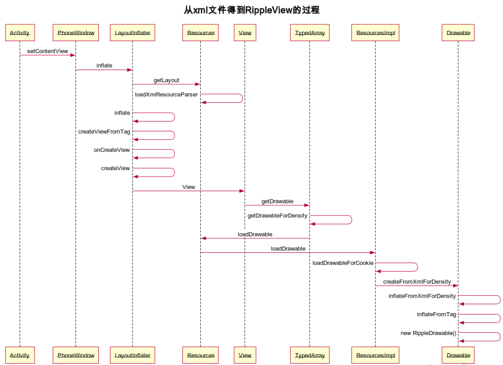
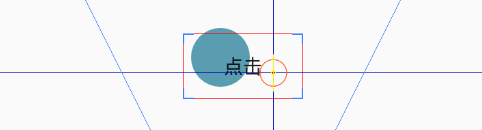
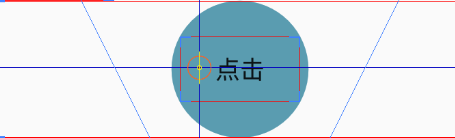
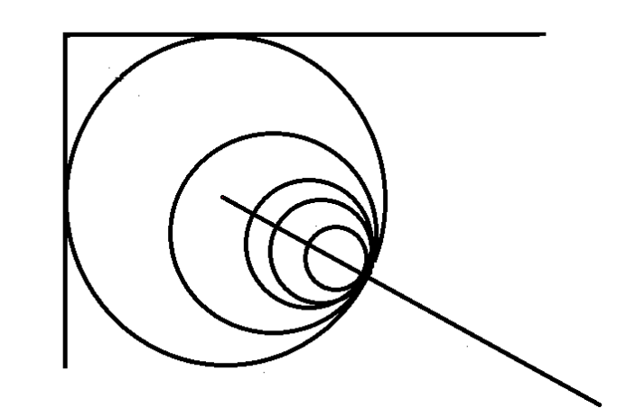

[TOC]

# 修改记录

| 版本 | 修改日期 | 作者 | 修改内容 |
| :---| ----------| ---- | ---- |
| v1.0 | 2018.07.02 | 张亚伦 | 初版 |
| v1.1 | 2018.07.31 | 张亚伦 | 更新 |

# Ripple 效果原理

**Ripple 波纹效果，用于给按钮添加统一的按压效果。**

* 大致流程分为：
 1. 从 xml 文件得到 RippleDrawable 的过程。
 2. 点击事件触发 View 的 DrawableState 更新。
 3. 具体的波纹效果流程。
* 解决疑惑：
 1. 根 view 设置宽高不起作用的问题。
 2. layout_width(height) 不是 view 的属性，却用在 view 中。
 3. Ripple 动画效果。

## 一、从xml文件得到 RippleDrawable 的过程
流程图：



首先，在 xml 文件中添加 RippleDrawable 用作 background。

````
<ImageView
    android:id="@+id/freeme_hang_up"
    android:layout_width="wrap_content"
    android:layout_height="wrap_content"
    android:layout_gravity="center_vertical"
    android:background="@drawable/ripple"
    android:layout_alignParentRight="true"
    android:layout_marginRight="30dp"
    android:scaleType="fitXY" />
````

ripple.xml

````
<ripple xmlns:android="http://schemas.android.com/apk/res/android"
    android:color="#111111">
</ripple>
````

添加好了 ripple，就从 Activity 的 SetContentView 方法开始，看看系统是如何将 xml 文件中的 background 标签解析成 RippleDrawable。

1、设置布局资源的活动内容。资源将被解析，将所有顶级视图添加到 activity 中。

````
public void setContentView(@LayoutRes int layoutResID) {
    //调用 Window 的子类 PhoneWindow 中的 setContentView 方法。
    getWindow().setContentView(layoutResID);
    //ActivityThread 启动一个 activity 时会调用 performLaunchActivity 方法去回调 activity 的 attach 方法 new PhoneWindow 实例。
    ...
}
````

2、窗口初始化一个容器来盛放要添加的布局。

````
public void setContentView(int layoutResID) {
    if (mContentParent == null) {
        //初始化顶层 DecorView(mDecor = generateDecor(-1))，一般来说它内部包含标题栏和内容栏。
        installDecor();
        //布局文件中都含一个 id 为 content(mContentParent = generateLayout(mDecor)) 的 FrameLayout。
        //将其引用返回给 mContentParent，以便以后用来盛放我们的布局。
        //这里的 generatelayout 方法也将 activity 的 Theme 属性加入，呈现不同风格的布局。
    } else if (!hasFeature(FEATURE_CONTENT_TRANSITIONS)) {
        //已存在，移除所有的子 view。
        mContentParent.removeAllViews();
    }

    if (hasFeature(FEATURE_CONTENT_TRANSITIONS)) {
        final Scene newScene = Scene.getSceneForLayout(mContentParent, layoutResID,
                getContext());
        transitionTo(newScene);
    } else {
        //mLayoutInflater 在创建 PhoneWindow 的时候顺带创建的。
        mLayoutInflater.inflate(layoutResID, mContentParent);
    }
    ...
}
````

3、布局填充器用获取的 xml 解析器解析布局文件，构建视图布局。

````
public View inflate(int resource, ViewGroup root, boolean attachToRoot) {
    final Resources res = getContext().getResources();
    //返回应用程序包的资源实例
    //这里最终调用的是 ContextImpl 中的 getResources() 方法；而它的 setResources() 是在 ActivityThread
    //performLaunchActivity->createBaseContextForActivity->ContextImpl.createActivityContext
    //->(ContextImpl) context.setResources(resourcesManager.createBaseActivityResources(...))

    ...

    final XmlResourceParser parser = res.getLayout(resource);
    //a) 返回一个 XmlResourceParser，通过它可以读取给定资源 ID 的视图布局描述。
    try {
        return inflate(parser, root, attachToRoot);
        //b) 用前面获取的布局解析器去解析前面所打开的 Xml 资源文件，创建相应的 UI 布局,添加到 id 为 content 的 FrameLayout 中。
    } finally {
        parser.close();
    }
}
````

* a) 通过资源 id 获取资源布局文件， 并且获取相应的 xml 文件解析器。

````
public XmlResourceParser getLayout(int id) throws NotFoundException {
    return loadXmlResourceParser(id, "layout");
}

XmlResourceParser loadXmlResourceParser(int id, String type)
        throws NotFoundException {
    final TypedValue value = obtainTempTypedValue();
    //用来盛放 AssetManager 根据给定的资源 ID 找到的资源文件的描述信息，比如文件路径、类型等。
    try {
        final ResourcesImpl impl = mResourcesImpl;
        impl.getValue(id, value, true);
        //通过 mAssets.getResourceValue 加载参数 id 所描述的资源项的值。
        //如果加载成功，那么结果就会保存在参数 outValue 所描述的一个 TypedValue 对象中。
        //在这个情景中，参数 id 描述的是一个 layout 资源 ID，它所对应的资源项的值是一个字符串，这个字符串描述的便是
        //一个 UI 布局文件，即一个经过编译的、以二进制格式保存的 Xml 资源文件。

        if (value.type == TypedValue.TYPE_STRING) {
            return impl.loadXmlResourceParser(value.string.toString(), id,
                    value.assetCookie, type);
                    //new Parser(nativeCreateParseState(mNative), this)
        }
        throw new NotFoundException("Resource ID #0x" + Integer.toHexString(id)
                + " type #0x" + Integer.toHexString(value.type) + " is not valid");
    } finally {
        releaseTempTypedValue(value);
    }
}
````

* b)解析前面所打开的 Xml 资源文件

````
public View inflate(XmlPullParser parser, ViewGroup root, boolean attachToRoot) {
    synchronized (mConstructorArgs) {
        Trace.traceBegin(Trace.TRACE_TAG_VIEW, "inflate");

        final Context inflaterContext = mContext;
        final AttributeSet attrs = Xml.asAttributeSet(parser);
        //疑惑? 代码中是怎么处理的呢
        //当 parser 在 XML 文件移动的时候(调用 parser.next() 的时候) 你可以用这个 AttributeSet 来取回对应的
        //attribute 的值，可以理解为只要 next 了, attrs 对应的值就改变了。

        Context lastContext = (Context) mConstructorArgs[0];
        mConstructorArgs[0] = inflaterContext;
        View result = root;

        try {
            // Look for the root node.
            int type;
            while ((type = parser.next()) != XmlPullParser.START_TAG &&
                    type != XmlPullParser.END_DOCUMENT) {
                // Empty
            }

            ...

            final String name = parser.getName();//获取标签(元素)的名字

            ...

            if (TAG_MERGE.equals(name)) {//如果标签名是 merge，但是没有父 view，就抛出异常。
                if (root == null || !attachToRoot) {
                    throw new InflateException("<merge /> can be used only with a valid "
                            + "ViewGroup root and attachToRoot=true");
                }

                rInflate(parser, root, inflaterContext, attrs, false);//直接跳转开始解析 merge 标签下的内容。
            } else {
                final View temp = createViewFromTag(root, name, inflaterContext, attrs);
                //c) 创建 xml 文件里的根 view。

                ViewGroup.LayoutParams params = null;
                //LayoutParams 被视图用来告诉他们的父母他们想如何摆放。

                if (root != null) {
                    if (DEBUG) {
                        ...
                    }

                    params = root.generateLayoutParams(attrs);
                    //创建与 root 相匹配的布局参数。
                    //这里也可以看出 Layout_width(height) 不是 view 的属性，但是 view 中添加了也会有效果。
                    if (!attachToRoot) {
                        temp.setLayoutParams(params);
                    }
                }

                ...

                rInflateChildren(parser, temp, attrs, true);
                //d) 解析 Temp(父标签) 下的所有子标签。

                ...

                if (root != null && attachToRoot) {
                    root.addView(temp, params);
                }
                //代码中动态加载布局，关于父节点设置 layout_height 不起作用的问题：
                //例如：A.编辑快速拨号底部弹窗 dialog，listview(自定义 adapterView) 需要加载的 item 的根节点高度不起作用。
                //Convertview = LayoutInflater.inflate(mContext,R.layout.xxx,null)
                //而且系统的 AdapterView 也不支持带 params 参数的 addview。
                //会报错: addView(View, LayoutParams) is not supported in AdapterView。
                if (root == null || !attachToRoot) {
                    result = temp;
                }
            }

        } ...

        return result;
    }
}

ViewGroup 中对 Layout_width 和 Layout_height 属性进行处理。

public LayoutParams(Context c, AttributeSet attrs) {
    TypedArray a = c.obtainStyledAttributes(attrs, R.styleable.ViewGroup_Layout);
    setBaseAttributes(a,
            R.styleable.ViewGroup_Layout_layout_width,
            R.styleable.ViewGroup_Layout_layout_height);
    a.recycle();
}
````

* c) 创建 xml 文件里的 view。

````
View createViewFromTag(View parent, String name, Context context, AttributeSet attrs,
        boolean ignoreThemeAttr) {

    ...

    try {
        View view;
        ...

        if (view == null) {
            final Object lastContext = mConstructorArgs[0];
            mConstructorArgs[0] = context;
            try {
                if (-1 == name.indexOf('.')) {//判断是自定义 view 还是系统 view
                    view = onCreateView(parent, name, attrs);//name = "android.view" + name
                } else {
                    view = createView(name, null, attrs);
                }
            } finally {
                mConstructorArgs[0] = lastContext;
            }
        }

        return view;
    } ...
}
````

* d) 递归调用解析 Temp (父标签) 下的所有子标签。

````
void rInflate(XmlPullParser parser, View parent, Context context,
        AttributeSet attrs, boolean finishInflate) throws XmlPullParserException, IOException {

    final int depth = parser.getDepth();
    int type;
    boolean pendingRequestFocus = false;

    while (((type = parser.next()) != XmlPullParser.END_TAG ||
            parser.getDepth() > depth) && type != XmlPullParser.END_DOCUMENT) {

        if (type != XmlPullParser.START_TAG) {
            continue;
        }

        final String name = parser.getName();

        //*/这里将下面用到的字符串黏贴到此,其中我们可能常用是"merge"(从6中看到其减少了布局的嵌套)、"include"标签(布局的复用);
        private static final String TAG_MERGE = "merge";
        private static final String TAG_INCLUDE = "include";
        private static final String TAG_1995 = "blink";
        private static final String TAG_REQUEST_FOCUS = "requestFocus";
        private static final String TAG_TAG = "tag";
        //*/

        if (TAG_REQUEST_FOCUS.equals(name)) {
            pendingRequestFocus = true;
            consumeChildElements(parser);
        } else if (TAG_TAG.equals(name)) {
            parseViewTag(parser, parent, attrs);
        } else if (TAG_INCLUDE.equals(name)) {
            if (parser.getDepth() == 0) {
                throw new InflateException("<include /> cannot be the root element");
            }
            parseInclude(parser, context, parent, attrs);
        } else if (TAG_MERGE.equals(name)) {
            throw new InflateException("<merge /> must be the root element");
        } else {
            //一般的标签，还是通过 createViewFromTag 方法创建 view。
            final View view = createViewFromTag(parent, name, context, attrs);
            final ViewGroup viewGroup = (ViewGroup) parent;
            final ViewGroup.LayoutParams params = viewGroup.generateLayoutParams(attrs);
            //递归调用层层解析创建相应的 view。
            rInflateChildren(parser, view, attrs, true);
            //根据子view 向父view 请求的 layout_params 添加进父 view中。
            viewGroup.addView(view, params);
        }
    }

    if (pendingRequestFocus) {
        parent.restoreDefaultFocus();
    }

    if (finishInflate) {
        parent.onFinishInflate();
    }
}
````

4、在上一步中已经将父标签下的子标签一一解析，并且会利用反射获取对应 view 的构造方法创建相对应的 view，我们直接看看父类的构造方法。

````
//Inflater 中默认调用 View 类的两参数的构造方法，最终走到四参数的构造方法
public View(Context context, AttributeSet attrs, int defStyleAttr, int defStyleRes) {
    this(context);

    final TypedArray a = context.obtainStyledAttributes(
            attrs, com.android.internal.R.styleable.View, defStyleAttr, defStyleRes);
    //这个方法最终的实现是在 ResourcesImpl 里，先调用 TypedArray.obtain 申请两个大小为六倍于属性个数的数组，
    //mData 和 mIndices(索引)，用来转换 xml 文件里 view 的属性 id 和已定义属性值数组的关系
    //然后调用 AssetManager 的 applyStyle 方法，提取当前使用到的自定义控件属性的相关数据保存 TypedArray 中的 mData 数组中。
    //个人的理解：mData 中每六位一组(type、data、assetCookie、resourceId、changingConfigurations、density)保存一个使用的属性的相关的信息；
    //mIndices 中第 0 位保存使用的属性的个数，依次往后是属性经过编译的 id 值。

    //TypedArray 也提供了一些类型的自动转化，比如我们 getString 时，如果通过 @string/hello 这种方式设置的，
    //会自动去将 ResId 对应的 string 从资源文件中读出来，方便我们获取属性参数的值。
    ...

    final int targetSdkVersion = context.getApplicationInfo().targetSdkVersion;

    // Set default values.
    viewFlagValues |= FOCUSABLE_AUTO;
    viewFlagMasks |= FOCUSABLE_AUTO;

    final int N = a.getIndexCount();//mIndices 中第 0 位的值，即当前 view 所使用的属性个数。
    for (int i = 0; i < N; i++) {
        int attr = a.getIndex(i);//mIndices[1+i]，偏移一位，获取相应的属性 id。
        switch (attr) {
            case com.android.internal.R.styleable.View_background://此处匹配 background 属性
                background = a.getDrawable(attr);
                break;
            case com.android.internal.R.styleable.View_padding:
                ...
                break;
            case com.android.internal.R.styleable.View_paddingHorizontal:
                ...
                break;
            case com.android.internal.R.styleable.View_paddingVertical:
                ...
                break;

            ...
    ...
    if (viewFlagMasks != 0) {
        setFlags(viewFlagValues, viewFlagMasks);
    }
}

这里列举了系统 attr 中定义的 View 标签的属性：
<declare-styleable name="View">
        <attr name="id" format="reference" />
        <attr name="tag" format="string" />
        <attr name="scrollX" format="dimension" />
        <attr name="scrollY" format="dimension" />
        <attr name="background" format="reference|color" />
        ...
</declare-styleable>
````

5、根据属性 id 值，用资源包实例去加载相应的资源。注意这里直接用属性值去加载，因为系统 TypeArray 已经为我们两者之间转换的工作。

````
public Drawable getDrawableForDensity(@StyleableRes int index, int density) {
    if (mRecycled) {
        throw new RuntimeException("Cannot make calls to a recycled instance!");
    }

    final TypedValue value = mValue;
    if (getValueAt(index*AssetManager.STYLE_NUM_ENTRIES, value)) {// a)判断是否存在
        //AssetManager.STYLE_NUM_ENTRIES = 6
        ...

        return mResources.loadDrawable(value, value.resourceId, density, mTheme);
    }
    return null;
}
````

* a)判断属性是否存在，存在的话获取其数据取出存放在 outValue 中。

````
private boolean getValueAt(int index, TypedValue outValue) {
    final int[] data = mData;
    final int type = data[index+AssetManager.STYLE_TYPE];
    if (type == TypedValue.TYPE_NULL) {
        return false;
    }
    outValue.type = type;
    outValue.data = data[index+AssetManager.STYLE_DATA];
    outValue.assetCookie = data[index+AssetManager.STYLE_ASSET_COOKIE];
    outValue.resourceId = data[index+AssetManager.STYLE_RESOURCE_ID];
    outValue.changingConfigurations = ActivityInfo.activityInfoConfigNativeToJava(
            data[index + AssetManager.STYLE_CHANGING_CONFIGURATIONS]);
    outValue.density = data[index+AssetManager.STYLE_DENSITY];

    outValue.string = (type == TypedValue.TYPE_STRING) ? loadStringValueAt(index) : null;
    return true;
}

看一下 R.java 文件的部分内容
public static final int View_theme = 0;
public static final int View_scrollbarSize = 1;
public static final int View_scrollbarThumbHorizontal = 2;
public static final int View_scrollbarThumbVertical = 3;
public static final int View_scrollbarTrackHorizontal = 4;
public static final int View_scrollbarTrackVertical = 5;
public static final int View_scrollbarAlwaysDrawHorizontalTrack = 6;
public static final int View_scrollbarAlwaysDrawVerticalTrack = 7;
public static final int View_scrollbarStyle = 8;
public static final int View_id = 9;
public static final int View_tag = 10;
public static final int View_scrollX = 11;
public static final int View_scrollY = 12;
public static final int View_background = 13;
public static final int View_padding = 14;
...

````

6、Resources 的实现类根据所给的资源 id 去加载相应的 Drawable。

````
Drawable loadDrawable(Resources wrapper, TypedValue value, int id,
        int density, Resources.Theme theme)
        throws NotFoundException {

        ...

        Drawable dr;
        boolean needsNewDrawableAfterCache = false;
        if (cs != null) {
            if (TRACE_FOR_DETAILED_PRELOAD) {
                // Log only framework resources
                if (((id >>> 24) == 0x1) && (android.os.Process.myUid() != 0)) {
                    final String name = getResourceName(id);
                    if (name != null) {
                        Log.d(TAG_PRELOAD, "Hit preloaded FW drawable #"
                                + Integer.toHexString(id) + " " + name);
                    }
                }
            }
            dr = cs.newDrawable(wrapper);
        } else if (isColorDrawable) {
            dr = new ColorDrawable(value.data);
        } else {
            dr = loadDrawableForCookie(wrapper, value, id, density, null);
        }
        ...省略

        return dr;
    } catch (Exception e) {
        ...
    }
}

private Drawable loadDrawableForCookie(Resources wrapper, TypedValue value,
        int id, int density, Resources.Theme theme) {

    ...

    try {
        ...

        try {
            if (file.endsWith(".xml")) {//xml 文件
                final XmlResourceParser rp = loadXmlResourceParser(
                        file, id, value.assetCookie, "drawable");//同3
                dr = Drawable.createFromXmlForDensity(wrapper, rp, density, theme);
                rp.close();
            } else {//图片资源
                final InputStream is = mAssets.openNonAsset(
                        value.assetCookie, file, AssetManager.ACCESS_STREAMING);
                dr = Drawable.createFromResourceStream(wrapper, value, is, file, null);
                is.close();
            }
        } finally {
            stack.pop();
        }
    } catch (Exception e) {
        ...
    }

    ...

    return dr;
}
````

7、同样的，通过资源 id 和布局解析器去解析 ripple.xml，创建 RippleDrawable。

````
public static Drawable createFromXmlForDensity(@NonNull Resources r,
        @NonNull XmlPullParser parser, int density, @Nullable Theme theme)
        throws XmlPullParserException, IOException {

    AttributeSet attrs = Xml.asAttributeSet(parser);

    int type;
    //noinspection StatementWithEmptyBody
    while ((type=parser.next()) != XmlPullParser.START_TAG
            && type != XmlPullParser.END_DOCUMENT) {
        // Empty loop.
    }

    if (type != XmlPullParser.START_TAG) {
        throw new XmlPullParserException("No start tag found");
    }

    Drawable drawable = createFromXmlInnerForDensity(r, parser, attrs, density, theme);

    ...

    return drawable;
}

static Drawable createFromXmlInnerForDensity(Resources r,
        XmlPullParser parser, AttributeSet attrs, int density,
        Theme theme){
    return r.getDrawableInflater().inflateFromXmlForDensity(parser.getName(), parser, attrs,
            density, theme);
}

Drawable inflateFromXmlForDensity(String name, XmlPullParser parser,
        AttributeSet attrs, int density, Theme theme)
        throws XmlPullParserException, IOException {

    ...

    Drawable drawable = inflateFromTag(name);//a) 解析对应的标签，创建 view 实例
    if (drawable == null) {
        drawable = inflateFromClass(name);
    }
    drawable.setSrcDensityOverride(density);
    drawable.inflate(mRes, parser, attrs, theme);//调用 inflate
    return drawable;
}
````

* a) 解析对应的标签，创建 view 实例

````
private Drawable inflateFromTag(String name) {
    switch (name) {
        case "selector":
            return new StateListDrawable();
        case "animated-selector":
            return new AnimatedStateListDrawable();
        case "level-list":
            return new LevelListDrawable();
        case "layer-list":
            return new LayerDrawable();
        case "transition":
            return new TransitionDrawable();
        case "ripple":
            return new RippleDrawable();//新建 RippleDrawable
        ...
    }
}

至此我们在 xml 中添加的 ripple 标签，最终对应于一个 RippleDrawable 实例. 其他的类似标签也应该有大致相同的流程。

````

## 二、点击事件触发 View 的 DrawableState 更新

状态的更新流程相对简单，这里主要通过 state 的更新，了解一下源码怎么管理如此多的情形

### 1、状态与属性值

辅助类 frameworks/base/core/java/android/util/StateSet.java 给出了 view 的几种状态，以及与属性值之间的对应关系，并且提供了方法
针对不同情形获取其中包含的可能状态。（一种情形可以包含多种状态：即用于表示某一情形的 int 值的每一位的 1 或 0 都可以表示该状态的开或者关。）

````
private static final int[][] VIEW_STATE_SETS;
//可以看到，各种状态所在位数不同，互不影响，组合后，那么总的情形就该有 2^10 种
public static final int VIEW_STATE_WINDOW_FOCUSED = 1;
public static final int VIEW_STATE_SELECTED = 1 << 1;
public static final int VIEW_STATE_FOCUSED = 1 << 2;
public static final int VIEW_STATE_ENABLED = 1 << 3;
public static final int VIEW_STATE_PRESSED = 1 << 4;
public static final int VIEW_STATE_ACTIVATED = 1 << 5;
public static final int VIEW_STATE_ACCELERATED = 1 << 6;
public static final int VIEW_STATE_HOVERED = 1 << 7;
public static final int VIEW_STATE_DRAG_CAN_ACCEPT = 1 << 8;
public static final int VIEW_STATE_DRAG_HOVERED = 1 << 9;

//初始化在同一个数组里，方便后续初始化时根据其所具有的属性，获取对应的状态标志位。偶数位——属性 id；奇数位——状态值。
static final int[] VIEW_STATE_IDS = new int[] {
        R.attr.state_window_focused,    VIEW_STATE_WINDOW_FOCUSED,//窗口是否聚焦
        R.attr.state_selected,          VIEW_STATE_SELECTED,//是否选定
        R.attr.state_focused,           VIEW_STATE_FOCUSED,//是否聚焦
        R.attr.state_enabled,           VIEW_STATE_ENABLED,//是否正常
        R.attr.state_pressed,           VIEW_STATE_PRESSED,//是否按压
        R.attr.state_activated,         VIEW_STATE_ACTIVATED,//是否激活
        R.attr.state_accelerated,       VIEW_STATE_ACCELERATED,
        R.attr.state_hovered,           VIEW_STATE_HOVERED,
        R.attr.state_drag_can_accept,   VIEW_STATE_DRAG_CAN_ACCEPT,
        R.attr.state_drag_hovered,      VIEW_STATE_DRAG_HOVERED
};
````

out/target/common/R/android/R.java 可以查看编译生成的系统定义的属性 ID

````
* @see #ViewDrawableStates_state_focused
 * @see #ViewDrawableStates_state_window_focused
 * @see #ViewDrawableStates_state_enabled
 * @see #ViewDrawableStates_state_selected
 * @see #ViewDrawableStates_state_pressed
 * @see #ViewDrawableStates_state_activated
 * @see #ViewDrawableStates_state_accelerated
 * @see #ViewDrawableStates_state_hovered
 * @see #ViewDrawableStates_state_drag_can_accept
 * @see #ViewDrawableStates_state_drag_hovered
 */
public static final int[] ViewDrawableStates={
    0x0101009c, 0x0101009d, 0x0101009e, 0x010100a1,
    0x010100a7, 0x010102fe, 0x0101031b, 0x01010367,
    0x01010368, 0x01010369
  };
````

### 2、View 状态的更新

这里我们就拿此次附有 Ripple 效果的 ImageView 的按压事件做个参考，其他的以此类推。

````
//直接看 View 类的事件处理方法。
public boolean onTouchEvent(MotionEvent event) {
    ...
    if (clickable || (viewFlags & TOOLTIP) == TOOLTIP) {
        switch (action) {
            case MotionEvent.ACTION_UP:
                ...
            case MotionEvent.ACTION_DOWN:
                ...

                // Walk up the hierarchy to determine if we're inside a scrolling container.
                boolean isInScrollingContainer = isInScrollingContainer();

                // 对于滚动容器内的视图，如果是滚动，则延迟按下的反馈时间。
                if (isInScrollingContainer) {
                    mPrivateFlags |= PFLAG_PREPRESSED;
                    if (mPendingCheckForTap == null) {
                        mPendingCheckForTap = new CheckForTap();
                    }
                    mPendingCheckForTap.x = event.getX();
                    mPendingCheckForTap.y = event.getY();
                    postDelayed(mPendingCheckForTap, ViewConfiguration.getTapTimeout());
                } else {
                    // 不在滚动容器内，请立即显示反馈。
                    setPressed(true, x, y);//更新按压状态。
                    checkForLongClick(0, x, y);//检查长按事件。
                }
                break;
            case MotionEvent.ACTION_CANCEL:
                ...
            case MotionEvent.ACTION_MOVE:
               ...
        }
        return true;
    }
    return false;
}
````

更新按压状态

````
private void setPressed(boolean pressed, float x, float y) {
    if (pressed) {
        drawableHotspotChanged(x, y);//触摸点坐标更新，在后续计算波纹前景效果起始位置时用到。
    }
    setPressed(pressed);
}

public void setPressed(boolean pressed) {
    final boolean needsRefresh = pressed != ((mPrivateFlags & PFLAG_PRESSED) == PFLAG_PRESSED);
    if (pressed) {
        mPrivateFlags |= PFLAG_PRESSED;//"或运算"表示将此状态加入标志位；前面已经明确了每一位的 0 或 1 代表开或关。
    } else {
        mPrivateFlags &= ~PFLAG_PRESSED;//非按压状态，标志位中将改状态位的值置为 0。
    }

    if (needsRefresh) {
        refreshDrawableState();//更新状态
    }
    dispatchSetPressed(pressed);
}

调用它来强制视图更新其可绘制状态，这将导致在此视图上调用 drawableStateChanged 方法。
public void refreshDrawableState() {
    mPrivateFlags |= PFLAG_DRAWABLE_STATE_DIRTY;
    drawableStateChanged();

    ViewParent parent = mParent;
    if (parent != null) {
        parent.childDrawableStateChanged(this);
    }
}
````

view 背景状态更新。

````
protected void drawableStateChanged() {
    final int[] state = getDrawableState();//获取当前 DrawableState，
    boolean changed = false;

    final Drawable bg = mBackground;
    if (bg != null && bg.isStateful()) {//RippleDrawable 重写了 isStateful() 方法，返回 true
        changed |= bg.setState(state);//设置 background 状态，从而触发改状态下的效果。
    }
    ...

    if (mStateListAnimator != null) {
        mStateListAnimator.setState(state);
    }

    if (changed) {
        invalidate();//重绘
    }
}
````

获取当前 DrawableState

````
//
public final int[] getDrawableState() {
    if ((mDrawableState != null) && ((mPrivateFlags & PFLAG_DRAWABLE_STATE_DIRTY) == 0)) {
        return mDrawableState;
    } else {
        mDrawableState = onCreateDrawableState(0);//初始化 DrawableState
        mPrivateFlags &= ~PFLAG_DRAWABLE_STATE_DIRTY;
        return mDrawableState;
    }
}
````

初始化 State

````
protected int[] onCreateDrawableState(int extraSpace) {

    int[] drawableState;

    int privateFlags = mPrivateFlags;//mPrivateFlags 在先前的 setpress 方法中，已经将按压状态加入。

    int viewStateIndex = 0;

    if ((privateFlags & PFLAG_PRESSED) != 0) viewStateIndex |= StateSet.VIEW_STATE_PRESSED;
    //将 Pressed 标志位(状态)加入该情形
    if ((mViewFlags & ENABLED_MASK) == ENABLED) viewStateIndex |= StateSet.VIEW_STATE_ENABLED;
    //在我们这种情况下，显然没有取主动的设置 ImageView 的 Enable 属性，那么他的 Flag 中当然不会有更改的标记。
    if (isFocused()) viewStateIndex |= StateSet.VIEW_STATE_FOCUSED;
    if ((privateFlags & PFLAG_SELECTED) != 0) viewStateIndex |= StateSet.VIEW_STATE_SELECTED;
    if (hasWindowFocus()) viewStateIndex |= StateSet.VIEW_STATE_WINDOW_FOCUSED;
    if ((privateFlags & PFLAG_ACTIVATED) != 0) viewStateIndex |= StateSet.VIEW_STATE_ACTIVATED;
    ...

    drawableState = StateSet.get(viewStateIndex);
    //通过 StateSet 辅助类，根据当前的情形(一个整型值)，去获取一个数组，该数组中保存的是开启的状态所对应的属性 id 值，
    //这样后续我们就可以用统一的属性 id 值去判断状态时否开启。

    ...

    if (extraSpace == 0) {
        return drawableState;//返回该数组
    }

    ...
}
````

### 3、StateSet 管理状态值与系统属性 id 值之间的对应

````
public static int[] get(int mask) {
    if (mask >= VIEW_STATE_SETS.length) {
        throw new IllegalArgumentException("Invalid state set mask");
    }
    return VIEW_STATE_SETS[mask];
    //按照给定的状态(该状态是一个 int 值，作为 index)，取出先前已经计算保存的相对应的一维数组。
    //这个数组中每一个元素都是状态位值是 "1" 的属性 id。
}
````

初始化

````
static {
    if ((VIEW_STATE_IDS.length / 2) != R.styleable.ViewDrawableStates.length) {
        throw new IllegalStateException(
                "VIEW_STATE_IDs array length does not match ViewDrawableStates style array");
                //检查是否跟系统定义好的属性一致。
    }

    final int[] orderedIds = new int[VIEW_STATE_IDS.length];
    //根据 R 文件中 ViewDrawableStates 数组里状态的顺序，调整，保存在 orderedIds 中。
    for (int i = 0; i < R.styleable.ViewDrawableStates.length; i++) {
        final int viewState = R.styleable.ViewDrawableStates[i];
        for (int j = 0; j < VIEW_STATE_IDS.length; j += 2) {
            if (VIEW_STATE_IDS[j] == viewState) {
                orderedIds[i * 2] = viewState;
                orderedIds[i * 2 + 1] = VIEW_STATE_IDS[j + 1];
            }
        }
    }

    final int NUM_BITS = VIEW_STATE_IDS.length / 2;//10
    VIEW_STATE_SETS = new int[1 << NUM_BITS][];
    //1<<N=2^N，有几位就可能有 2^N 次方种状态。
    //每一种情形对应一个 int 值,这个情形可能包含多个状态。
    for (int i = 0; i < VIEW_STATE_SETS.length; i++) {
        final int numBits = Integer.bitCount(i);
        //JDK 提供的计算二进制数 i 中 1 的个数。
        final int[] set = new int[numBits];
        //有几个 1，就对应有几个状态已经开启，相应的去创建合适长度的数组去保存。
        int pos = 0;
        //遍历，把每一种可能的情形，与某一给定的状态按位与，判断此状态是否开启，为 true 则该状态对应的 attr 的 id 保存起来。
        for (int j = 0; j < orderedIds.length; j += 2) {
            //i & 2^(j/2)(状态对应的int值)
            if ((i & orderedIds[j + 1]) != 0) {
                set[pos++] = orderedIds[j];
            }
        }
        VIEW_STATE_SETS[i] = set;
        //将保存有 attr 的 id 的一维数组保存到该情形对应位置，即每一个给定的 int 值中包含的所有状态。
        //在后续的子 view 设置状态时，也相应的比较属性值即可。
    }
}
````

### 4、响应 state 更新,做相应动作

````
protected boolean onStateChange(int[] stateSet) {
    final boolean changed = super.onStateChange(stateSet);

    boolean enabled = false;
    boolean pressed = false;
    boolean focused = false;
    boolean hovered = false;
    //可以看到，用属性 id 来统一，将相应状态置 true
    for (int state : stateSet) {
        if (state == R.attr.state_enabled) {
            enabled = true;
        } else if (state == R.attr.state_focused) {
            focused = true;
        } else if (state == R.attr.state_pressed) {
            pressed = true;
        } else if (state == R.attr.state_hovered) {
            hovered = true;
        }
    }
    //设置状态对应的效果
    setRippleActive(enabled && pressed);//前景
    setBackgroundActive(hovered || focused || (enabled && pressed), focused || hovered);//背景

    return changed;
}
````

## 三、RippleDrawable 波纹效果流程

动画的效果比较简单，RippleForeground 和 RippleBackground 分别去 drawCircle
这里我们就看看 RippleDrawable 初始化对其下标签的解析，关于 ripple 效果范围的控制以及动画流程

### 1、初始化对其下标签的解析

* a) id 为 mask 的 item.

````
private void updateLocalState() {
    // Initialize from constant state.
    mMask = findDrawableByLayerId(R.id.mask);
    //mask 标签，参看下面代码，加 mask，ripple效果 仅限该 view 之内,但是这里 mMask 为 null,因为还未解析item
}
````

有 mask 例子，会将波纹效果限制在该 view 之内。

````
<ripple xmlns:android="http://schemas.android.com/apk/res/android"
        android:color="?attr/colorControlHighlight">
    <item android:id="@id/mask"
          android:drawable="@drawable/btn_default_mtrl_shape" />
</ripple>
````

* b）color 和 radius 标签的解析，在创建完 RippleDrawable 后，会调用其自身的 inflate 方法解析其特有的属性值。

````
Drawable inflateFromXmlForDensity(@NonNull String name, XmlPullParser parser,
        AttributeSet attrs, int density, Theme theme)
        throws XmlPullParserException, IOException {

    Drawable drawable = inflateFromTag(name);//第一部分中的根据标签名字解析得到 Drawable
    if (drawable == null) {
        drawable = inflateFromClass(name);
    }
    drawable.setSrcDensityOverride(density);
    drawable.inflate(mRes, parser, attrs, theme);//这里去调用子类中重定义的 inflate 方法，即解析自己的子标签
    return drawable;
}
````

RippleDrawable 解析自己的子标签

````
public void inflate(Resources r, XmlPullParser parser,
        AttributeSet attrs, Theme theme)
        throws XmlPullParserException, IOException {
    final TypedArray a = obtainAttributes(r, theme, attrs, R.styleable.RippleDrawable);
    //如果可用，则从主题获取样式化属性；如果主题为空，则获取未设置样式的资源。

    super.inflate(r, parser, attrs, theme);//父类 LayerDrawable 的方法，主要是解析 item，创建图层。

    updateStateFromTypedArray(a);
    verifyRequiredAttributes(a);//检查
    a.recycle();//释放

    updateLocalState();//同a），在解析完 item 存放在 ChildDrawable[]后，才能找到 id 为 mask 的 Drawable 赋值給 mMask。
}

private void updateStateFromTypedArray(@NonNull TypedArray a) throws XmlPullParserException {
    final RippleState state = mState;

    ...

    final ColorStateList color = a.getColorStateList(R.styleable.RippleDrawable_color);//颜色
    if (color != null) {
        mState.mColor = color;
    }

    mState.mMaxRadius = a.getDimensionPixelSize(
            R.styleable.RippleDrawable_radius, mState.mMaxRadius);//半径
}
````

### 2、关于 ripple 效果范围的控制

有限制:



无限制:



这里我们先看一下，RippleDrawable 提供的设置波纹效果范围的方法，至于有 mask 图层导致的效果范围，就是判断有没有 mask，加入一个限制范围的标志位，
将波纹效果限制在该 view 之内，超出的部分不会绘制。

````

public void setHotspotBounds(int left, int top, int right, int bottom) {//主动设置一个范围，就如第一幅图所展示的效果。
    mOverrideBounds = true;
    mHotspotBounds.set(left, top, right, bottom);
    //设置矩形区域的范围，此参数在进入 ripple 动画效果时赋值给 ripple 中的 mBounds 参数。

    onHotspotBoundsChanged();
}

private void onHotspotBoundsChanged() {
    final int count = mExitingRipplesCount;
    final RippleForeground[] ripples = mExitingRipples;
    for (int i = 0; i < count; i++) {
        ripples[i].onHotspotBoundsChanged();
    }

    if (mRipple != null) {
        mRipple.onHotspotBoundsChanged();//前景活动区域更新
    }

    if (mBackground != null) {
        mBackground.onHotspotBoundsChanged();//背景
    }
}
````

这个方法在初始化的时候会执行，在具体动画执行的时候也会再次调用,

````
protected final void onHotspotBoundsChanged() {
    if (!mHasMaxRadius) {
        final float halfWidth = mBounds.width() / 2.0f;
        final float halfHeight = mBounds.height() / 2.0f;
        final float targetRadius = (float) Math.sqrt(halfWidth * halfWidth
                + halfHeight * halfHeight);//矩形对角线半长，作为波纹效果的半径。

        onTargetRadiusChanged(targetRadius);//更新 ripple 效果圆半径
    }
}
````

### 3、ripple 动画流程

在第二部分的 4 中，点击事件中引起状态更新: RippleDrawable.onStateChange

````
protected boolean onStateChange(int[] stateSet) {
    final boolean changed = super.onStateChange(stateSet);

    boolean enabled = false;
    boolean pressed = false;
    boolean focused = false;
    boolean hovered = false;

    for (int state : stateSet) {
        if (state == R.attr.state_enabled) {
            enabled = true;
        } else if (state == R.attr.state_focused) {
            focused = true;
        } else if (state == R.attr.state_pressed) {
            pressed = true;
        } else if (state == R.attr.state_hovered) {
            hovered = true;
        }
    }

    setRippleActive(enabled && pressed);//波纹前景动画效果
    setBackgroundActive(hovered || focused || (enabled && pressed), focused || hovered);//背景动画效果

    return changed;
}
````

就波纹前景动画效果来看。

````
private void setRippleActive(boolean active) {
    if (mRippleActive != active) {
        mRippleActive = active;
        if (active) {
            tryRippleEnter();//进入
        } else {
            tryRippleExit();//退出
        }
    }
}

private void tryRippleEnter() {
    if (mExitingRipplesCount >= MAX_RIPPLES) { //层数限制，最大 10 层。
        return;
    }

    if (mRipple == null) {
        final float x;
        final float y;
        if (mHasPending) {
            mHasPending = false;
            x = mPendingX;
            y = mPendingY;
        } else {
            x = mHotspotBounds.exactCenterX(); //计算活动矩形区域的中心点 X 坐标，与波纹效果的起始坐标相关。
            y = mHotspotBounds.exactCenterY();
        }

        final boolean isBounded = isBounded();
        //通过判断有无 mask 层，添加标志位来确定是否将波纹限制在该 view 之内。
        mRipple = new RippleForeground(this, mHotspotBounds, x, y, isBounded, mForceSoftware);
        //具体的坐标计算、动画效果在 RippleForeground 里面单独处理。
    }

    mRipple.setup(mState.mMaxRadius, mDensity);//先是回调父类中的方法，获取最大(目标)半径。
    mRipple.enter(false);
}
````

````
//父类 RippleComponent 中
public final void setup(float maxRadius, int densityDpi) {
    if (maxRadius >= 0) {
        mHasMaxRadius = true;
        mTargetRadius = maxRadius;//在 xml 文件中定义的半径
    } else {
        mTargetRadius = getTargetRadius(mBounds);//mHotspotBounds 活动区域(矩形)对角线半长。
    }

    mDensityScale = densityDpi * DisplayMetrics.DENSITY_DEFAULT_SCALE;//320*1^160

    onTargetRadiusChanged(mTargetRadius);
}

public final void enter(boolean fast) {
    cancel();

    mSoftwareAnimator = createSoftwareEnter(fast);//创建动画，子类中重写。

    if (mSoftwareAnimator != null) {
        mSoftwareAnimator.start();//动画开始。
    }
}
````

RippleForeground.java 重写 createSoftwareEnter

````
protected Animator createSoftwareEnter(boolean fast) {
    if (mIsBounded) {
        return null;
        //有界(即含有 mask 层)的涟漪没有前景动画，只有一个直接显示的背景，没有波纹。
    }

    final int duration = (int)
            (1000 * Math.sqrt(mTargetRadius / WAVE_TOUCH_DOWN_ACCELERATION * mDensityScale) + 0.5);

    final ObjectAnimator tweenRadius = ObjectAnimator.ofFloat(this, TWEEN_RADIUS, 1);//半径
    tweenRadius.setAutoCancel(true);
    // autoCancel 控制是否在启动具有相同目标和属性的任何其他 ObjectAnimator 时自动取消 ObjectAnimator。
    tweenRadius.setDuration(duration);//执行时间
    tweenRadius.setInterpolator(LINEAR_INTERPOLATOR);//线型插值器
    tweenRadius.setStartDelay(RIPPLE_ENTER_DELAY);//延迟 80ms

    final ObjectAnimator tweenOrigin = ObjectAnimator.ofFloat(this, TWEEN_ORIGIN, 1);//X、Y
    tweenOrigin.setAutoCancel(true);
    tweenOrigin.setDuration(duration);
    tweenOrigin.setInterpolator(LINEAR_INTERPOLATOR);
    tweenOrigin.setStartDelay(RIPPLE_ENTER_DELAY);

    final ObjectAnimator opacity = ObjectAnimator.ofFloat(this, OPACITY, 1);//不透明度
    opacity.setAutoCancel(true);
    opacity.setDuration(OPACITY_ENTER_DURATION_FAST);//120ms
    opacity.setInterpolator(LINEAR_INTERPOLATOR);

    final AnimatorSet set = new AnimatorSet();
    //AnimatorSet 是一个集合动画，允许对控件设置一系列的动画。
    set.play(tweenOrigin).with(tweenRadius).with(opacity);
    //在 AnimatorSet 里可以指定动画的播放顺序、是否一起播放或者是否延迟播放。

    return set;
}

private static final FloatProperty<RippleForeground> TWEEN_ORIGIN =
    new FloatProperty<RippleForeground>("tweenOrigin") {
        @Override
        public void setValue(RippleForeground object, float value) {
            object.mTweenX = value;
            object.mTweenY = value;
            object.invalidateSelf();
            //动画设置相应的值，去重绘:父类 RippleComponent->mOwner.invalidateSelf(false)->callback.invalidateDrawable(this)
            //callback 即 Background 所属的 view。
        }

        ...
};

public void invalidateDrawable(@NonNull Drawable drawable) {
    if (verifyDrawable(drawable)) {
        final Rect dirty = drawable.getDirtyBounds();//a)RippleDrawable 获取需要重新绘制的脏区域，去重新绘制。
        final int scrollX = mScrollX;
        final int scrollY = mScrollY;

        invalidate(dirty.left + scrollX, dirty.top + scrollY,
                dirty.right + scrollX, dirty.bottom + scrollY);
        //重绘脏区域
        rebuildOutline();
    }
}

重绘最终调用 RippleDrawable 的 draw 方法。
public void draw(@NonNull Canvas canvas) {
    pruneRipples();

    final Rect bounds = getDirtyBounds();//a)获取脏区域
    final int saveCount = canvas.save(Canvas.CLIP_SAVE_FLAG);//用来保存 Canvas 的状态
    canvas.clipRect(bounds);//在画布上裁剪出上一步得到的需要绘制的一个矩形区域

    drawContent(canvas);//id 非 mask 的子层，会先被绘制出来
    drawBackgroundAndRipples(canvas);//b)绘制背景和波纹效果

    canvas.restoreToCount(saveCount);
    //用来恢复 Canvas 旋转、缩放等之后的状态，即恢复到 canvas.save() 保存时的状态
}

a)获取需要重新绘制的脏区域
public Rect getDirtyBounds() {
    if (!isBounded()) {//无 mask
        final Rect drawingBounds = mDrawingBounds;
        final Rect dirtyBounds = mDirtyBounds;
        dirtyBounds.set(drawingBounds);
        drawingBounds.setEmpty();

        final int cX = (int) mHotspotBounds.exactCenterX();
        final int cY = (int) mHotspotBounds.exactCenterY();//活动区域中心点坐标
        final Rect rippleBounds = mTempRect;

        final RippleForeground[] activeRipples = mExitingRipples;//把前面动画未结束的 active 拿到
        final int N = mExitingRipplesCount;//动画未结束的 active 的个数
        for (int i = 0; i < N; i++) {
            activeRipples[i].getBounds(rippleBounds);//返回纹波相对于纹波中心的最大边界
            rippleBounds.offset(cX, cY);
            drawingBounds.union(rippleBounds);//创建一个矩形，该矩形的大小刚好足以包含两个指定矩形
        }

        final RippleBackground background = mBackground;
        if (background != null) {
            background.getBounds(rippleBounds);
            //获取背景波纹的最大绘制边界矩形
            rippleBounds.offset(cX, cY);
            //通过将 dx 添加到其左右坐标，并将 dy 添加到其顶部和底部坐标，来偏移矩形 why?
            drawingBounds.union(rippleBounds);
        }

        dirtyBounds.union(drawingBounds);//上面的计算一个矩形，将所有的 activeRipple 包含在内
        dirtyBounds.union(super.getDirtyBounds());//将 ripple 所属的 view 的区域也包含在内
        return dirtyBounds;
    } else {
        return getBounds();
        //Bounds 初始化与其所属的 view 的矩形区域大小相同。
        //view.draw->view.drawBackground->view.setBackgroundBounds->mBackground.setBounds
    }
}

b)绘制背景和波纹效果
private void drawBackgroundAndRipples(Canvas canvas) {
    final RippleForeground active = mRipple;
    final RippleBackground background = mBackground;
    final int count = mExitingRipplesCount;
    if (active == null && count <= 0 && (background == null || !background.isVisible())) {
        // Move along, nothing to draw here.
        return;
    }

    final float x = mHotspotBounds.exactCenterX();//波纹活动区域的中心点。
    final float y = mHotspotBounds.exactCenterY();
    canvas.translate(x, y);//画布原点移至活动区域中心点，便于理解后面的波纹起始点坐标计算。

    ...

    if (background != null && background.isVisible()) {
        background.draw(canvas, p);
    }

    ...

    if (active != null) {
        active.draw(canvas, p);//前景绘制
    }

    canvas.translate(-x, -y);
}
````

最终调用波纹效果处理类的 draw 方法,这里就看看前景波纹的流程。

````
public boolean draw(Canvas c, Paint p) {
    final boolean hasDisplayListCanvas = !mForceSoftware && c.isHardwareAccelerated()
            && c instanceof DisplayListCanvas;
    ...

    return drawSoftware(c, p);
}

protected boolean drawSoftware(Canvas c, Paint p) {
    boolean hasContent = false;

    final int origAlpha = p.getAlpha();
    final int alpha = (int) (origAlpha * mOpacity + 0.5f);//透明度

    final float radius = getCurrentRadius();//半径
    //MathUtils.lerp(0, mTargetRadius, mTweenRadius)
    //lerp(start,stop,amount) = start + (stop - start) * amount

    if (alpha > 0 && radius > 0) {
        final float x = getCurrentX();//当前波纹中心点的横坐标。
        //MathUtils.lerp(mClampedStartingX - mBounds.exactCenterX(), mTargetX, mTweenX)
        //mClampedStartingX 是通过判断手指触摸点有没有超出波纹区域计算的波纹起始点横坐标。
        final float y = getCurrentY();
        p.setAlpha(alpha);
        c.drawCircle(x, y, radius, p);//画圈圈
        p.setAlpha(origAlpha);
        hasContent = true;
    }

    return hasContent;
}

//当手指触摸点位于波纹限定区域之外时，起始点坐标计算
private void clampStartingPosition() {
    final float cX = mBounds.exactCenterX();//矩形区域中心点 X 坐标
    final float cY = mBounds.exactCenterY();
    final float dX = mStartingX - cX;//触摸点与中心点距离在 x 轴的投影
    final float dY = mStartingY - cY;
    final float r = mTargetRadius;
    if (dX * dX + dY * dY > r * r) {//判断触摸点是否在我们规定的 ripple 区域范围之外
        final double angle = Math.atan2(dY, dX);//反正切函数(arctan)，计算触摸点与矩形中心点的连线与 x 轴的夹角
        mClampedStartingX = cX + (float) (Math.cos(angle) * r);//连线与 ripple圆 的交点的 x 坐标
        mClampedStartingY = cY + (float) (Math.sin(angle) * r);
    } else {
        mClampedStartingX = mStartingX;//如果没有限制，那么触摸点即为 ripple 效果的起始点。
        mClampedStartingY = mStartingY;
    }
}

````

