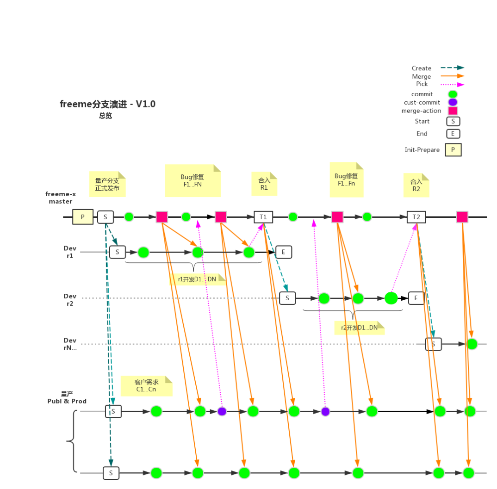
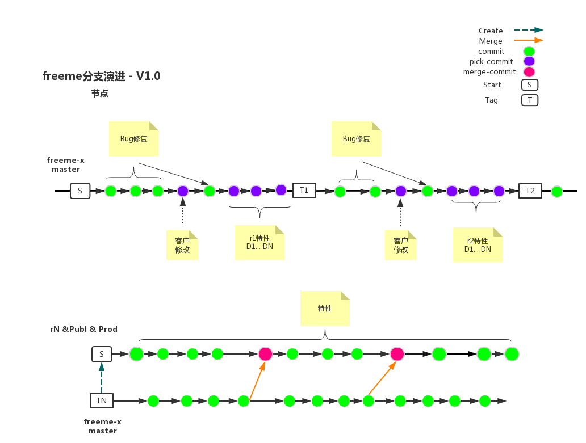
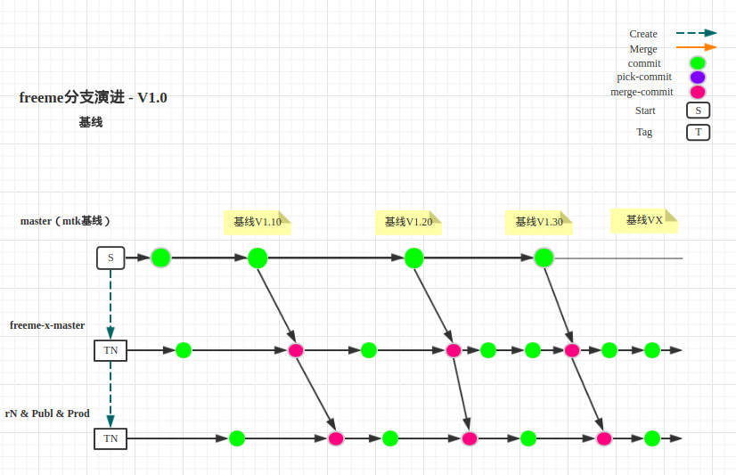

# Freeme 分支演进

[TOC]

## 修改记录

| 版本 | 修改日期 | 作者 | 修改内容 |
| :---| ----------| ---- | ---- |
| v1.0 | 2018.07.03 | 陈明 | 初版 |

## 总览

## 演进

### Step1 - Prepare
1. 获取 `mtk` 代码, 准备 `master(mtk) & driver` 分支并编译通过

2. 合并 `freeme` 编译框架并编译通过

3. 准备 `freeme-x-master` 分支(合并 `freeme` 特性)并编译通过

4. 测试及修复Bug

5. 基于 `freeme-x-master` 分支, 准备 `Prod & Publ` 量产分支

6. 基于 `freeme-x-master` 分支, 准备 `r1` 分支进行特性开发

### Step2 - Merge & Pick

1. 从 `freeme-x-master` Merge 提交到 `r1 & Prod & Publ`

2. 从 `Prod & Publ` Pick 提交到 `freeme-x-master`

3. r1 开发结束, pick 所有特性提交到 `freeme-x-master`, 并设置节点 T1

4. 从 `freeme-x-master` Merge 提交到 `Prod & Publ`

5. 基于`freeme-x-master`分支, 准备`r2`分支进行特性开发, `r1` 冻结开发

### Step3 - 基线

1. 从 `master` Merge 提交到 `freeme-x-master`
2. 从 `freeme-x-master` Merge 提交到 `rN & Prod & Publ`

循环步骤 (1 ~ 5)

## 注
1. freeme-8.1.1 开发过程中 r1 的角色与 freeme-x-master相同
2. 理解 `Merge` 与 `Pick` 的区别
