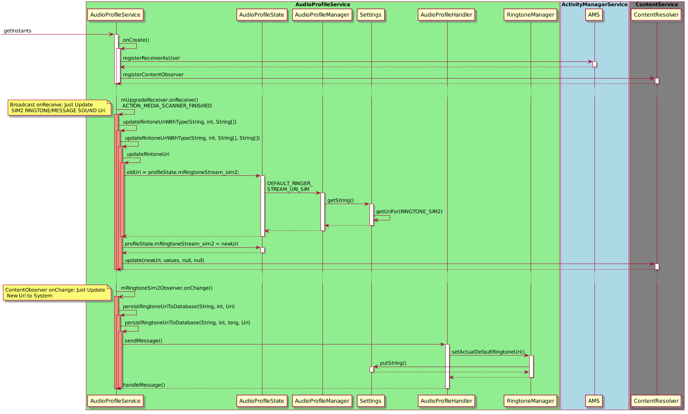
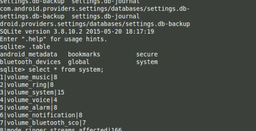
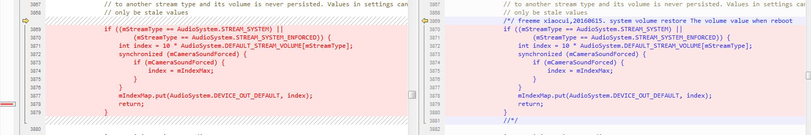

# Freeme Audio 说明文档

[TOC]
###  简介

本文档旨在总结目前```FreemeOS```针对Android Audio的```Feature```改动

###  情景模式

1. 新增音量类型

- sim卡1消息铃声

- sim卡2 消息铃声、来电铃声

```java
// 新增情景模式涉及模块整理
frameworks/base/
			|---services/core/java/com/
  			|						|---android/server/
  			|						|	 		 |---audio/AudioService.java
			|						|---mediatek/audioprofile/AudioProfileService.java
			|---media/java/com/
  			|				|---mediatek/audioprofile/
  			|				|			 		 |---AudioProfileManager.java
 			|				|			 		 |---AudioProfileState.java
			|				|---android/media
  			|						|---AudioSystem.java
			|						|---AudioManager.java
			|						|---MediaScanner.java
			|						|---RingtoneManager.java

build/target/product/full_base.mk
build/target/product/core_base.mk
```

- ```AudioProfileService``` 在检测到 **文件扫描结束** 和 **铃声路径改变** 时，会触发以下调用（其中涉及情景模式类型的模块都需要添加， **图中已sim2铃声为例** ）
  

### 声音资源
资源配置

```java
vendor/droi/freeme/frameworks/base/data/sounds/sounds.mk // freeme audio resource
vendor/droi/freeme/frameworks/base/data/sounds/original/sounds.mk // common audio resource
```

###  音量保存

```AudioSystem``` 中所有的默认音量均存在于 ```DEFAULT_STREAM_VOLUME``` 数组中，其保存于Settings.db中

```java
//SettingsProvider/src/com/android/providers/settings/DatabaseHelper.java

    private void loadVolumeLevels(SQLiteDatabase db) {
//... ...

            loadSetting(stmt, Settings.System.VOLUME_MUSIC,
                    AudioSystem.getDefaultStreamVolume(AudioManager.STREAM_MUSIC));
            loadSetting(stmt, Settings.System.VOLUME_RING,
                    AudioSystem.getDefaultStreamVolume(AudioManager.STREAM_RING));
            loadSetting(stmt, Settings.System.VOLUME_SYSTEM,
                    AudioSystem.getDefaultStreamVolume(AudioManager.STREAM_SYSTEM));
            loadSetting(
                    stmt,
                    Settings.System.VOLUME_VOICE,
                    AudioSystem.getDefaultStreamVolume(AudioManager.STREAM_VOICE_CALL));
            loadSetting(stmt, Settings.System.VOLUME_ALARM,
                    AudioSystem.getDefaultStreamVolume(AudioManager.STREAM_ALARM));
//... ...
        }
```



###  设置模块

（改变模块 ```通知栏和声音``` => ```声音```）

```java
Settings/src/com/mediatek/audioprofile/
                              |-------AudioProfileSettings // 轻ROM，界面布局
                              |-------Editprofile // 重ROM，界面布局
                              |-------CustomRingtoneManager.java
                              |-------CustomRingtonePickerActivity.java // 客制化铃声选择界面
                              |-------CustomRingtonePreference.java // 客制化铃声条目
                              |-------DefaultPreference.java
                              |-------DefaultRingtonePreference.java
                              |-------RingerVolumePreference.java
                              |-------RingtoneProfile.java
                              |-------SelectSimSettings.java

Settings/res_ext/
Settings/src/com/android/settings/
                            |-------Settings.java
                            |-------SettingsActivity.java
```

### FAQ

#### 重启时重置系统音量
   修改文件： ```frameworks/base/services/core/java/com/android/server/audio/AudioService.java```

  

#### 修改默认音量

以 ```system``` 为例

1. 修改系统 ```STREAM_SYSTEM``` 默认音量

```
frameworks/base/media/java/android/media/AudioSystem.java
```


2. 修改 ```AudioProfileManager``` 文件

```java
frameworks/base/media/java/com/mediatek/audioprofile/AudioProfileManager.java
```


####  Audio模式自动切换

按音量 - 键，默认显示为通知铃声，当减少音量到最低时，自动切换振动模式。

 

```java
frameworks/base/services/core/java/com/android/server/audio/AudioService.java
```


#### 如何修改声音资源文件
- 资源修改：文件


- 资源修改：mk


#### 如何不显示音量条

系统提供 ```LayoutParams``` 属性 ```FLAG_EX_NOSHOW_VOLUME``` 控制窗口是否显示音量条

```java
//frameworks/base/services/core/java/com/android/server/policy/PhoneWindowManager.java
public long interceptKeyBeforeDispatching(WindowState win, KeyEvent event, int policyFlags) {
 ... ...
        if(keyCode == KeyEvent.KEYCODE_VOLUME_UP ||
                keyCode == KeyEvent.KEYCODE_VOLUME_DOWN){
        	if(getFlagEx(win)){
       	       return -1;
        	}
        }
  ... ...
}

private boolean getFlagEx(WindowState win){
    boolean isShowVolume = false;
    if (win != null && win.getAttrs() != null) {
        final int flagEx = win.getAttrs().flagsEx;
        if ((flagEx & WindowManager.LayoutParams.FLAG_EX_NOSHOW_VOLUME) != 0) {
            isShowVolume = true;
            return isShowVolume;
        }
        isShowVolume = false;
    }
  return isShowVolume;
}

//frameworks/base/core/java/android/view/WindowManager.java
/** @hide */
public static final int FLAG_EX_NOSHOW_VOLUME = 0x00000010;
```
