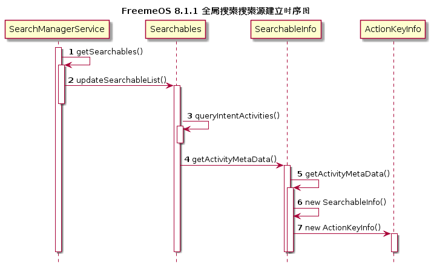
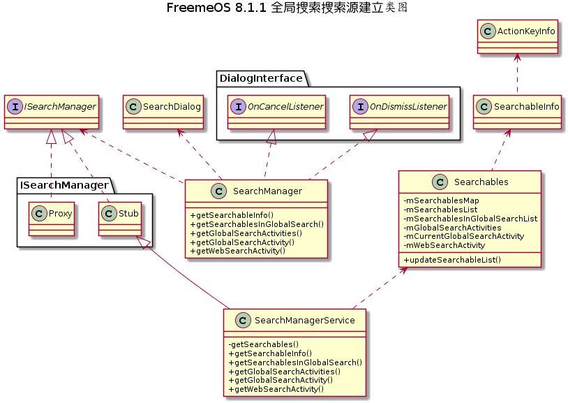
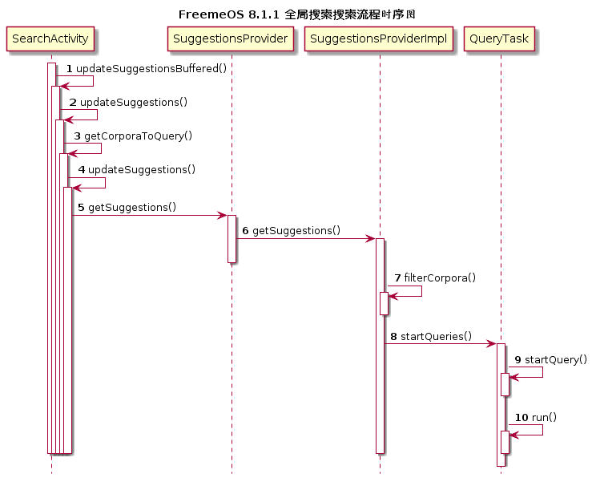

[TOC]

# 一、修改记录

| 版本 | 修改日期 | 作者 | 修改内容 |
| :---| ----------| ---- | ---- |
| v1.0 | 2018.09.25 | 王磊 | 初版 |

# 二、概述

全局搜索应用（ QuickSearchBox ）是 Android 系统中原生的应用程序，它的主要职能是接收用户的搜索请求，并将搜索请求传达给支持全局搜索的应用，应用程序执行搜索操作，并将搜索到的结果返回给全局搜索应用，全局搜索应用根据搜索结果渲染 UI 界面，当用户单击某一个搜索出来的结果项就会打开相应的应用程序，显示搜索结果的详细信息。

# 三、技术架构
Android 系统的全局搜索由搜索管理器（ SearchManager ）、全局搜索 AppWidget、全局搜索应用、支持全局搜索的应用（联系人、音乐、浏览器等）四大部分组成：

1. 搜索管理器：主要功能是对 Android 系统全局搜索提供支持，SearchManager 会通过 PackageManager 搜索系统中支持全局搜索的应用，这些支持全局搜索的应用我们称为搜索源，SearchManager 解析搜索源的配置信息并将这些配置信息封装成对象保存在 List 列表中供全局搜索应用使用。
2. 全局搜索 AppWidget：AppWidget 是搜索的入口，当用户需要使用全局搜索时会单击已经添加到桌面的全局搜索 AppWidget，这时会打开全局搜索应用。
3. 全局搜索应用：它的主要职能是接受用户的输入请求，启动异步搜索，将搜索到的结果显示。
4. 支持全局搜索的应用：每一个支持全局搜索的应用都需要实现一个 ContentProvider，通过这个 ContentProvider 向外提供数据，全局搜索应用会调用这些 ContentProvider 获取数据。

# 四、搜索源建立




当第一次进入全局搜索应用，会通过 SearchManager 获取搜索源信息

```
mSearchManager = (SearchManager) context.getSystemService(Context.SEARCH_SERVICE);
List<SearchableInfo> searchables = mSearchManager.getSearchablesInGlobalSearch();
```
getSearchablesInGlobalSearch 接口实现是在 SearchManagerService.java 中

```
@Override
public List<SearchableInfo> getSearchablesInGlobalSearch() {
    return getSearchables(UserHandle.getCallingUserId()).getSearchablesInGlobalSearchList();
}
```

Searchables.java 这个类记录了系统中可以被搜索到的组件的信息。

```
List<ResolveInfo> searchList;
final Intent intent = new Intent(Intent.ACTION_SEARCH);

long ident = Binder.clearCallingIdentity();
try {
    searchList = queryIntentActivities(intent,
            PackageManager.GET_META_DATA | PackageManager.MATCH_DEBUG_TRIAGED_MISSING);

    List<ResolveInfo> webSearchInfoList;
    final Intent webSearchIntent = new Intent(Intent.ACTION_WEB_SEARCH);
    webSearchInfoList = queryIntentActivities(webSearchIntent,
            PackageManager.GET_META_DATA | PackageManager.MATCH_DEBUG_TRIAGED_MISSING);

......

if (newSearchablesMap.get(new ComponentName(ai.packageName, ai.name)) == null) {
    SearchableInfo searchable = SearchableInfo.getActivityMetaData(mContext, ai,
            mUserId);
    if (searchable != null) {
        newSearchablesList.add(searchable);
        newSearchablesMap.put(searchable.getSearchActivity(), searchable);
        if (searchable.shouldIncludeInGlobalSearch()) {
            newSearchablesInGlobalSearchList.add(searchable);
        }
    }
}

List<ResolveInfo> newGlobalSearchActivities = findGlobalSearchActivities();

// Find the global search activity
ComponentName newGlobalSearchActivity = findGlobalSearchActivity(
        newGlobalSearchActivities);

// Find the web search activity
ComponentName newWebSearchActivity = findWebSearchActivity(newGlobalSearchActivity);

// Store a consistent set of new values
synchronized (this) {
    mSearchablesMap = newSearchablesMap;
    mSearchablesList = newSearchablesList;
    mSearchablesInGlobalSearchList = newSearchablesInGlobalSearchList;
    mGlobalSearchActivities = newGlobalSearchActivities;
    mCurrentGlobalSearchActivity = newGlobalSearchActivity;
    mWebSearchActivity = newWebSearchActivity;
}

```

在 SearchableInfo 类中 getActivityMetaData 方法，从代码中可以看到先 loadXmlMetaData() 加载 xml 文件，然后 getActivityMetaData() 获得 searchable。

```
XmlResourceParser xml =
        activityInfo.loadXmlMetaData(userContext.getPackageManager(), MD_LABEL_SEARCHABLE);
if (xml == null) {
    return null;
}
ComponentName cName = new ComponentName(activityInfo.packageName, activityInfo.name);

SearchableInfo searchable = getActivityMetaData(userContext, xml, cName);
```

getActivityMetaData() 的关键语句

```
result = new SearchableInfo(activityContext, attr, cName);
```

查看此构造方法，可以看出从 xml 文件中获得了 SearchableInfo 各成员变量。

```
TypedArray a = activityContext.obtainStyledAttributes(attr,
        com.android.internal.R.styleable.Searchable);
mSearchMode = a.getInt(com.android.internal.R.styleable.Searchable_searchMode, 0);
mLabelId = a.getResourceId(com.android.internal.R.styleable.Searchable_label, 0);
mHintId = a.getResourceId(com.android.internal.R.styleable.Searchable_hint, 0);
mIconId = a.getResourceId(com.android.internal.R.styleable.Searchable_icon, 0);
mSearchButtonText = a.getResourceId(
        com.android.internal.R.styleable.Searchable_searchButtonText, 0);
mSearchInputType = a.getInt(com.android.internal.R.styleable.Searchable_inputType,
        InputType.TYPE_CLASS_TEXT |
        InputType.TYPE_TEXT_VARIATION_NORMAL);

```

# 五、搜索流程



当用户在搜索栏中输入内容时，触发 mQueryTextView 的 SearchTextWatcher() 的 listener 函数运行，函数调用 updateSuggestionsBuffered()。在函数 updateSuggestionsBuffered() 里，将变量 mUpdateSuggestionsTask（runnable） 加入到 message queue，并延迟 100ms 运行。在 runnable 的 run 函数中调用 updateSuggestions()，后者的重要代码：

```
suggestions = getSuggestionsProvider().getSuggestions(query, corporaToQuery);
```

该代码的前一部分 getSuggestionsProvider() 获得 SuggestionsProvider 变量，由于 SuggestionsProvider 为接口，其实现类 SuggestionsProviderImpl，所以代码后半部分运行的是 SuggestionsProviderImpl.java 里的 getSuggestions() 函数。getSuggestions() 有两个部分，第一部分根据 query(查询内容) 获得搜索源列表，实现函数 filterCorpora()；第二部分给每个搜索源创建一个 QueryTask(本质为 runnable)。


先看第一部分，根据判断条件，获取更新后的搜索源列表，shouldQueryCorpus() 为判断函数，返回 true 表示将此搜索源添加到 corporaToQuery 中，反之则不添加。

```
public boolean shouldQueryCorpus(Corpus corpus, String query) {
    updateQuery(query);
    if (query.length() == 0
            && !corpus.isWebCorpus() // always query web, to warm up connection
            && !mConfig.showSuggestionsForZeroQuery()) {
            return false;
    }
    if (query.length() >= corpus.getQueryThreshold()) {
        if (!corpus.queryAfterZeroResults() && mEmptyCorpora.containsKey(corpus)) {
            if (DBG) Log.i(TAG, "Not querying " + corpus + ", returned 0 after "
                    + mEmptyCorpora.get(corpus));
            return false;
        }
        return true;
    }
    if (DBG) Log.d(TAG, "Query too short for corpus " + corpus);
    return false;
}
```


第二部分，QueryTask 的 startQueries() 函数中，给每个 corpus 创建 QueryTask。

```
for (SuggestionCursorProvider<C> provider : providers) {
    QueryTask.startQuery(query, maxResultsPerProvider, provider,
            executor, handler, consumer, onlyOneProvider);
}
```

之后，搜索会在 QueryTask 的 run() 函数中运行。

```
public void run() {
    final C cursor = mProvider.getSuggestions(mQuery, mQueryLimit, mTheOnlyOne);
    if (DBG) Log.d(TAG, "Suggestions from " + mProvider + " = " + cursor);
    Consumers.consumeCloseableAsync(mHandler, mConsumer, cursor);
}
```


# 六、应用程序如何支持全局搜索

如果想让某个应用程序支持全局搜索，必须对这个应用程序进行一系列配置，并实现可被外界访问的内容提供者向全局搜索应用提供搜索结果，根据配置信息，应用程序可被搜索框架识别为搜索源，全局搜索应用也可以通过解析配置信息组拼成 URI， 去请求应用程序的 ContentProvider 并获取搜索结果。

配置实现：

1、应用程序中应当存在一个Activity，这个 Activity 在 AndroidManifest.xml 中的基本配置，如下：

```
<!-- The contacts search/filter UI -->
<activity android:name="SearchResultsActivity"
    android:theme="@style/TallTitleBarTheme"
    android:label="@string/contactsList"
    android:excludeFromRecents="true">
<!-- 全局搜索支持　　开始 -->
<!-- 这个 intent-filter 是固定配置不需要改变，拷过去直接用 -->
<intent-filter>
      <action android:name="android.intent.action.SEARCH" />
      <category android:name="android.intent.category.DEFAULT" />
</intent-filter>
<!-- 这个 meta-data 也是固定配置不需要改动，它需要一个 xml 文件 searchable.xml -->
<meta-data android:name="android.app.searchable"
       android:resource="@xml/searchable" />
<!-- 全局搜索支持　　结束 -->
</activity>
```

说一下这个 Activity 的作用：第一，这样一个 Activity 在你的应用程序中是必须存在的，因为配置了上面代码后，这个 Activity 可以被识别为搜索源，应用就支持全局搜索了。第二，当搜索出结果信息后单击某一个结果项后会打开这个 Activity 显示搜索出的内容。

2、searchable.xml 配置：

```
<searchable xmlns:android="http://schemas.android.com/apk/res/android"
    android:icon="@drawable/ic_tab_contacts"
    <!-- 这个属性是固定的必须有-->
    android:label="@string/contactsList"
    android:hint="@string/searchHint"
    android:searchMode="queryRewriteFromText"
    <!-- 这个属性是固定的必须有-->
    android:includeInGlobalSearch="true"
    <!-- 这个 authority 是 ContentProvider 的 Authority -->
    android:searchSuggestAuthority="com.android.contacts"
    android:searchSuggestIntentAction="android.provider.Contacts.SEARCH_SUGGESTION_CLICKED"
    android:searchSuggestIntentData="content://com.android.contacts/contacts/lookup"
    android:searchSettingsDescription="@string/search_settings_description">
    <!-- allow green action key for search-bar and per-suggestion clicks -->
    <actionkey
        android:keycode="KEYCODE_CALL"
        android:queryActionMsg="call"
        android:suggestActionMsg="call" />
</searchable>
```

searchable.xml 配置参数详解

- android:label （String字符串，必须存在，一般为应用程序中Activity或Application的名称，在配置中包含

android:includeInGlobalSearch属性时起作用，在设置搜索范围时显示应用名称）。

- android:hint （String字符串，搜索输入框中的提示信息，格式为：”Search ***”）。

- android:searchMode （关键词，当搜索結果列表中的某一项获得焦点时，使用这一项的某些值进行重新搜索，信息包括二种，第一，

“queryRewriteFromData”，使用搜索結果Cursor中的”SUGGEST_COLUMN_INTENT_DATA”列值，第二，”queryRewriteFromText”，

使用搜索結果Cursor中的”SUGGEST_COLUMN_TEXT_1″列值）。

-  android:searchButtonText （String字符串，搜索按钮提示内容，默认是图片）。

- android:inputType （关键词，搜索框输入法类型）。

- android:imeOptions （关键词，搜索框输入法的设置选项）。

- android:searchSuggestAuthority （String字符串，提供搜索功能的ContentProvider的Authority）。

- android:searchSuggestPath （String字符串，请求搜索ContentProvider的URI的建议路径）。

- android:searchSuggestSelection （String字符串，Where条件，例：”uri like ?”）。

- android:searchSuggestIntentAction （String字符串，单击搜索結果列表中的某一项时，发出Intent对象中的Action）。

- android:searchSuggestIntentData （String字符串，单击搜索結果列表中的某一项时，发出Intent对象中的Data）。

- android:searchSuggestThreshold （int值，输入多少个字符后开始搜索）。

- android:includeInGlobalSearch （boolean值，是否支持全局搜索））。

- android:searchSettingsDescription （String字符串，搜索设置的描述信息）。

- android:queryAfterZeroResults （boolean值，”false” 如果搜索結果为零，下次搜索时则不会使用搜索源搜索，重启

SearchDialog后又可搜索）。

3、创建一个 ContentProvider， 供搜索应用程序访问


# 六、参考
1. [SearchManager API](https://developer.android.com/reference/android/app/SearchManager)
2. [搜索功能官方介绍](https://developer.android.com/guide/topics/search/)
