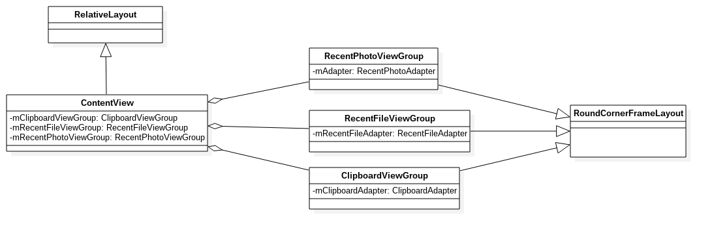
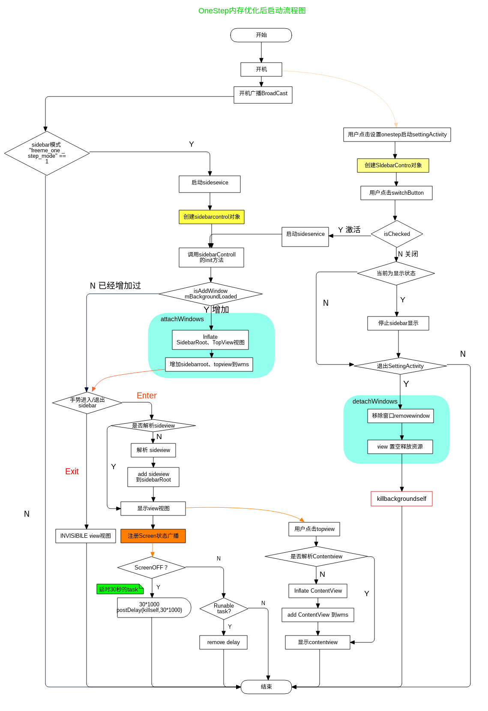

[TOC]

# 一、修改记录

| 版本 | 修改日期 | 作者 | 修改内容 |
| :---| ----------| ---- | ---- |
| v1.0 | 2018.08.25 | 张志伟/董春阳/李秋月 | 初版 |

# 二、什么是一步 (One Step)?

通过拖拽完成将信息发送至应用或联系人的动作，节省了在不同应用之间切换的诸多步骤，第一次打通了手持设备中应用间的边界，具体可查看 [oneStep 需求文档](http://10.20.40.17:8080/plugins/gitiles/freemeos/common/documents/+/master/freemeOS/system/features/OneStep/oneStep%E9%9C%80%E6%B1%82%E6%96%87%E6%A1%A3.md)。

# 三、详细实现

## 3.1、Feature 开关

```
FREEME_ONESTEP_SUPPORT = yes

ifeq ($(strip $(FREEME_ONESTEP_SUPPORT)),yes)
  PRODUCT_PROPERTY_OVERRIDES += ro.freeme.onestep_support=1
  PRODUCT_PACKAGES += FreemeOneStep
endif
```

## 3.2、存储

```
public static final String FREEME_ONESTEP_MODE = "freeme_onestep_mode";
public static final String FREEME_ONESTEP_SWITCHAPP_ENABLE = "freeme_switchapp_enable";
```

## 3.3、功能实现

### 3.3.1、framwork 层

- 1、类图关系


- 2、窗口加载流程图


- 3、drag 流程图

拖动以文件为例，其它与此类似。


- 4、剪切流程图

主要是涉及数据库的增删改查，过程和所给的流程图是一致的，故选其中一例予以讲解。


### 3.3.2、应用层

接下来我们从启动方式、DragEvent、应用添加以及应用移除四个方面详细介绍 Onestep 应用层面的业务逻辑。

1、OneStep 启动方式

Onestep 的启动有两种方式分为设置启动和手势启动，具体如下：

- 应用设置启动

当从点击应用里的 switch 时，会做如下几步操作：

```
1. 向 FreemeSystem 里写入键值 "freeme_one_step_mode"＝1 。
2.contentObserver 观察到数据被写入回调 onChange 方法。
3.onChange 判断是否是进入 sidebar 模式。
4.事件给到 oneStepManage 进入 sidebar 模式。
5.请求 thumbmodehelper 类做一些 sidebar 模式的状态参数变更以及窗口变换等操作。
6.回调到上层 sidebarcontroller 里的接口。
7.调用 show(true) 方法显示 TopView 和 SidebarRootView。
```

详细 SequenceDiagram:


- 手势启动

当我的 onestep 模式是开启的时候，我们可以从手机屏幕的左上角或右上角斜向屏幕中心滑动开启应用。

2、Onestep 的 DragEvent

OneStep 的拖拽事件在该应用上只是针对 Top 上的近期图片、文件、剪切三个视图使用。

```
1. 用户长按视图时回调 onLongclick 方法。
2. 在 onLongclick 里会去调用创建拖拽对象的接口。
3. 在接口里会去重写拖拽的尺寸位置和 shadow。
4. 触发 DragEvent 事件，事件被监听到。
5. onDrag(View v, DragEvent e) 被回调。
6. 在 onDrag 里判断Event类型做相应操作。
7. 当松开拖拽视图发生在监听对象上时，回调 handleDragEvent(Context context, DragEvent event)。
8. 最后在 handleDragEvent 里根据不同 Mime 创建 intent 启动 startActivity。
```

详细 sequenceDiagram:


3、OneStep 应用添加

接下来我们从添加应用和添加联系人两方面进行详细介绍添加。

a、 添加应用

```
1. 在应用主界面选择添加边栏应用快捷方式。
2. 界面会显示出所有已加载的应用，已经在边栏的会有红色已勾选，没有的是灰色。
3. 点击视图时会去调用 click 事件。
4. 判断 ischecked 状态，如果为 true 就将数据库里的数据删除并通知 adapter 更新数据，更改 ischecked 为 false。
5. 如果 ischecked为false，将数据添加到数据库并通知 adapter 更新数据，更改  ischecked 为 true。
```

详细 SequenceDiagram:


b、添加联系人

当前应用添加联系人主要有邮件和短信两种（原理相同，只举一例）。

```
1. 在应用主页面上选择添加联系人，然后选择联系人类型。
2. 选择联系会返回联系人的 Uri。
3. 创建 asynctask 查询数据库创建联系人对象。
4. 把联系人对象添加到数据库 "mms_contacts/contacts"。
```

详细 SequenceDiagram：


4、OneStep 应用移除

sidebar 里的应用长按，拖入垃圾桶就可以进行移除

```
1. 长按 itemview 触发 onlongclick 创建 Dragview。
2. 显示垃圾桶图标。
3. 将 Dragview 添加到 sidebarRootview。
4. 触发 Touch 事件的 move 监听。
5. 松开手指触发 ACTION_UP，判断是否在垃圾桶图标区域内。在区域内进行应用移除行为，不在进行动画自动移回原 sidebar 位置。
```

详细 SequenceDiagram：


## 3.4、OneStep 应用框架

项目主要使用了单例模式、适配器模式、观察者模式三种模式，目前不涉及第三方开源框架。

### 3.4.1、oneStep 的界面


### 3.4.2、应用架构介绍

总视图：


接下来我们从视图层、适配器层、数据层三个方面详细介绍一下。

1、视图层

- TopView (顶栏)

顶层栏视图容器类，继承自 FrameLayout，容纳三个图标按钮，即最近图片、文档、剪贴板。
功能：显示三个最近的图标按钮，处理它们的点击事件，带动画效果，显示 ContentView。

- SidebarRootView (侧边栏)

侧边栏根布局视图类，继承 FrameLayout，容纳所有侧边栏视图内容。
功能：主要处理侧边栏图标长按拖动效果的顶层处理，包括显示流程逻辑、动画、触摸事件。

- sidebarview

侧边栏显示列表内容的类，列表内容主要有三种，联系人、应用图标、分享组件图标，且还有几种是辅助拖拽效果的。
分两层显示，每层用一个 DragScrollView 承载，里面放 SidebarListView 视图组件，SidebarListView 存放应用图标。

功能

1. 接受系统拖拽目标的放置、动画、触摸事件的顶层处理，然后调起相应的应用，把信息发过去，类型有文字、图片等。
2. 设置、退出两个功能图标按钮。

- DragScrollView

继承自 ScrollView，容纳列表视图，主要处理触摸事件，同时支持拖动与滚动的功能。

- SidebarListView

侧边栏里的列表类继承 ListView，真正容纳图标的地方。
功能：显示图标列表、动画、图标长按事件监听与处理拖拽事件转发给 SidebarAdapter 的具体子类处理。


- ContentView (内容框)

内容视图总容器，继承自 RelativeLayout，主要用来承载三个最近图片、文件、剪切版等，为内容列表进行显隐、切换操作。

- ClipboardViewGroup

最近剪切板列表视图容器类，继承自 RoundCornerFrameLayout，内部容纳了一个 ListView，用来承载最近剪切板的条目，视图数据来自 ClipboardAdapter。

- RecentFileViewGroup

最近文件列表视图容器类，继承自 RoundCornerFrameLayout，内部容纳了一个 ListView，用来承载最近剪切板的条目，视图数据来自 RecentFileAdapter。

- RecentPhotoViewGroup

最近 photo 列表视图容器类，继承自 RoundCornerFrameLayout，内部容纳了一个 ListView，用来承载最近剪切板的条目，视图数据来自 RecentPhotoAdapter。



2、适配器层

- SidebarAdapter

侧边栏列表适配器抽象类，继承 BaseAdapter，
提供视图数据，数据来自其成员变量，数据层的各种 XXXManager 类单例。
关键是定义了拖拽事件的中转接口，子类必须实现来最终处理 DragEvent。

它有四个具体子类，分别是：

AppListAdapter：应用列表适配器。
ContactListAdapter：联系人列表适配器。
OngoingAdapter：一种状态。
ResolveInfoListAdapter：分享应用组件列表适配器。


- RecentPhotoAdapter，RecentFileAdapter，ClipboardAdapter

按名称分别对应上述 RecentXXXXGroup 的列表视图适配器类，继承自 BaseAdapter，
提供条目视图及绑定数据。


3、数据层

- DataManager

数据管理抽象类，定义了数据更新监听器接口，当有数据更新时，通知 XXXAdapter 适配器，然后更新到UI。
因为数据层，即 XXXManager 类，有自己的工作子线程，数据操作是异步的，数据变动完毕后，通过这些监听接口，通知到视图层。
它有几个主要的子类，见名知意，它是为对应的 Adapter 提供数据的。
这些 xxxManager 都是单例类，提供全局的数据访问。

- 侧边栏相关的是：

AppManager，ContactManager， OngoingManager， ResolveInfoManager
(ResolveInfoManager 实际并未继承 DataManager，但内部架构逻辑其实与其它三个一致)
内容视图相关的是：
RecentPhotoManager，RecentFileManager，RecentClipManager。


## 3.5、内存优化问题

为了给用户更好的使用体验，我们对 OneStep 应用的内存进行优化管理，保证在 OneStep 应用不显示的情况下拥有较小的内存占用。

### 内存优化前后生命周期对比

- 优化前的生命周期图


- 优化后的生命周期图



## 3.6、总结

1. OneStep 应用将用户最近操作的图片、文件、剪切项，通过 Android 的拖拽事件，实现文件快速分享，极大程度上减少了用户的操作步骤，节省了用户时间。
2. OneStep 应用在代码上保证了线程安全，同时为功能扩展提供了丰富的接口，便于后期扩展。应用的视图采用多用布局，结构上清晰明确，利于二次开发维护。
3. OneStep 应用目前可分享的内容较为局限，第三方应用兼容不丰富，且功能较为简单。
