[TOC]

# 一、 修改记录

| 版本 | 修改日期 | 作者 | 修改内容 |
| :---| ----------| ---- | ---- |
| v1.0 | 2018.08.13 | 白梅洁/李秋月 | 初版 |

# 二、产品结构

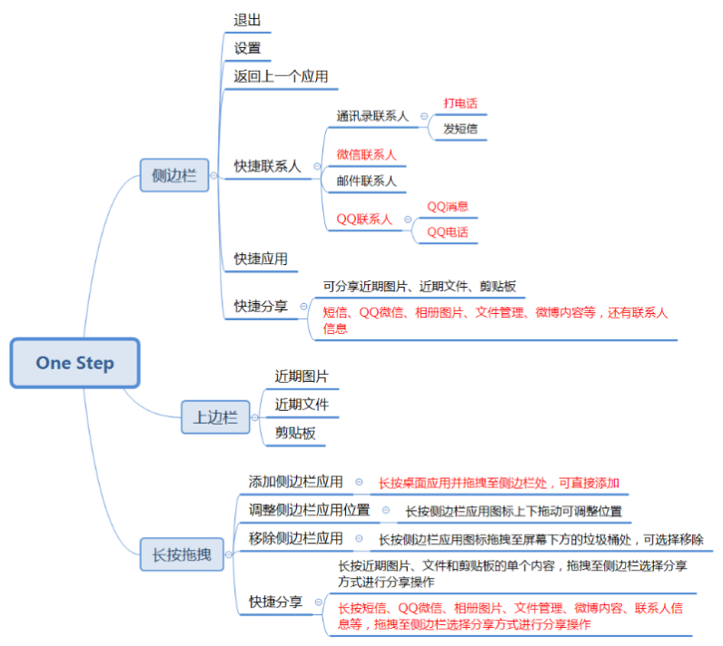

# 三、需求描述

## 3.1 进入、退出

| 需求| 描述 |
| :--- | -------|
| 用户场景 | 打开或退出“一步”|
| 优先级| 高 |
| 输入条件 | 在桌面左上角或右上角倾斜滑动；点击左上角或右上角的退出图标|
| 需求描述| 1、滑动进入“一步”界面，如右图；2、点击左上角或右上角的退出图标，退出返回至桌面，如左图|
| 补充说明| 退出图标没有长按操作，不可移除，不可调整位置|

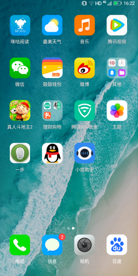
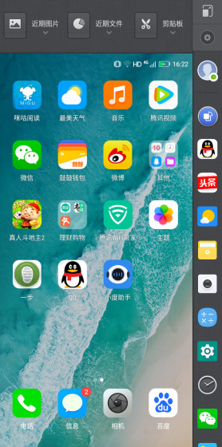

## 3.2 设置

| 需求| 描述 |
| :--- | -------|
| 优先级| 高 |
| 需求描述| 1、点击左上角或右上角的设置图标打开一步功能的设置界面，再次点击可退出该设置界面|
| 补充说明| 设置图标没有长按操作，不可移除，不可调整位置|

## 3.3 返回上一个应用

| 需求| 描述 |
| :--- | -------|
| 功能描述 | 可快速切换至上一个应用|
| 优先级| 高 |
| 输入条件 | 调出一步界面后点击侧边栏的对应图标|
| 需求描述| 1、点击侧边栏的返回至上一应用的图标，页面切换至上一个打开的应用界面，再次点击则切换回当前应用界面|
| 补充说明| 返回上一应用的图标没有长按操作，不可移除，不可调整位置|

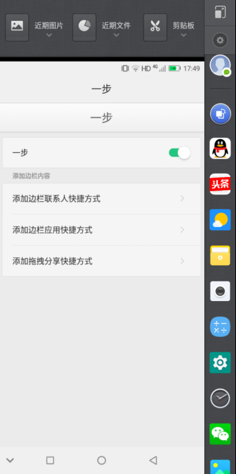

## 3.4 快捷联系人

| 需求| 描述 |
| :--- | -------|
| 功能描述 | 可快速跳转至联系人发送消息界面|
| 优先级| 高 |
| 输入条件 | 调出一步界面后点击侧边栏的对应图标|
| 需求描述| 1、添加通讯录联系人（R2），点击如左图中“通讯录联系人”进入联系人列表页，点击任意联系人添加相应图标至侧边栏上方；当前版本为短信联系人，点击进入联系人列表页，选择添加；2、添加邮件联系人，点击“邮件联系人”进入联系人列表页，仅显示有邮件信息的联系人，点击任意一个添加至侧边栏上方；3、添加微信联系人（R2），点击“微信联系人”进入微信界面，打开微信通讯录，点击进入好友详情页，点击右上角图标，选择“添加到桌面”；4、添加QQ联系人（R2），点击“QQ联系人”进入QQ界面，点击消息列表中要添加的联系人进入对话界面，点击右上角进入聊天设置界面，点击“添加桌面快捷方式”；5、点击侧边栏添加的通讯录联系人图标（R2），弹出选择框，如下左图，可选择打电话或发短信；当前版本为短信联系人，点击进入编辑短信界面；6、点击侧边栏添加的微信联系人图标，进入对应联系人的对话界面；7、点击侧边栏添加的邮件联系人图标，登录成功后进入编辑邮件界面；8、点击侧边栏添加的QQ联系人图标，弹出选择框，如下右图，可选择发送QQ消息或打QQ电话9、长按图标可查看图标名称，长按上下拖动可调整位置，长按拖拽至屏幕下方的垃圾桶处可移除|

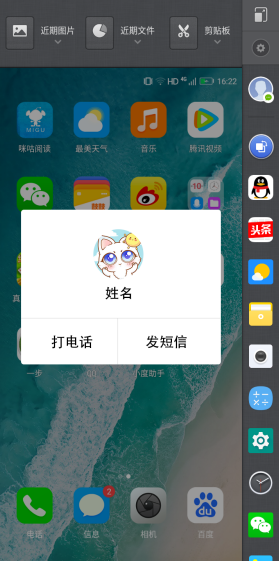

## 3.5 快捷应用

| 需求| 描述 |
| :--- | -------|
| 功能描述 | 可快速打开应用|
| 优先级| 高 |
| 输入条件 | 调出一步界面后点击侧边栏的对应图标|
| 需求描述| 1、在一步设置中选择添加应用图标；2、在桌面长按应用图标并拖拽至侧边栏位置可添加，若侧边栏已有该应用，则提示“该应用已存在”；3、长按侧边栏图标拖动可调整位置排序；4、长按侧边栏图标拖拽至屏幕下方的垃圾桶处可移除；5、长按可查看对应图标的名称|

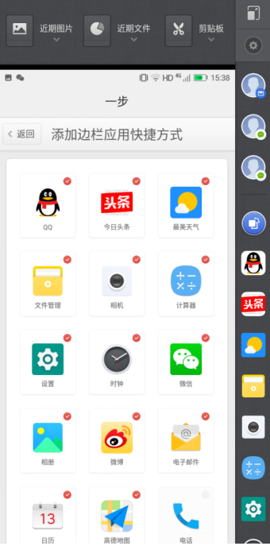

## 3.6 上边栏

| 需求| 描述 |
| :--- | -------|
| 功能描述 | 可快速打开近期图片、近期文件、剪贴板|
| 优先级| 高 |
| 输入条件 | 调出一步界面后点击上边栏的对应图标|
| 需求描述| 1、点击屏幕上方的“近期图片”“近期文件”“剪贴板”展开列表框，再次点击收起2、点击“近期图片”和“近期文件”列表内容可进入查看，点击“剪贴板”可复制对应的文字；3、点击列表框右上角的“清除”，弹出选项框，选择是否清除列表内容；4、点击“近期图片”的“打开相册”进入相册界面；5、长按列表框内的内容拖拽至侧边栏，可选择分享方式进行分享操作|

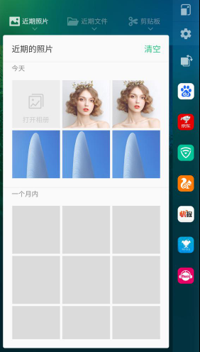
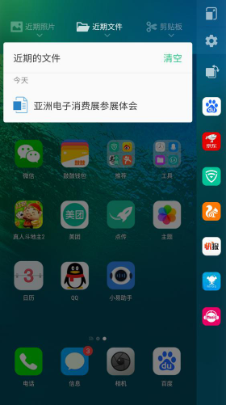

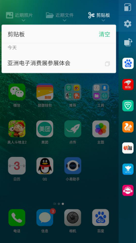
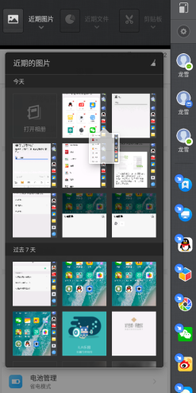

## 3.7 快捷分享（全局）R2

| 需求| 描述 |
| :--- | -------|
| 功能描述 | 可快速分享文字、文件或图片|
| 优先级| 中 |
| 需求描述| 1、在短信列表页长按短信或在短信详情页长按短信内容拖拽至侧边栏选择分享方式进行分享操作；2、在相册页面长按某张图片或选择多长图片后长按其中一张，拖拽至侧边栏选择分享方式进行分享操作；3、在联系人列表页长按某个联系人拖拽至侧边栏选择分享进行分享，分享的内容为该联系人的全部已有信息；4、在微博界面长按某条微博文字内容拖拽至侧边栏选择分享方式进行分享；或在其他内容类应用长按文字内容；5、长按微信或QQ消息文字内容、图片拖拽至侧边栏选择分享方式进行分享;6、在文件管理里，长按文件或图片拖拽至侧边栏选择分享方式进行分享|
| 补充说明| 图片为锤子手机截图，具体功能操作可参考锤子|

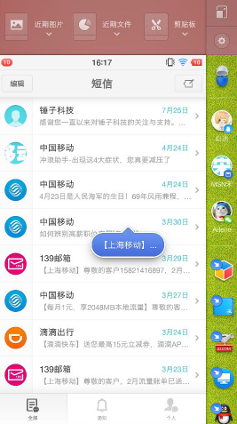
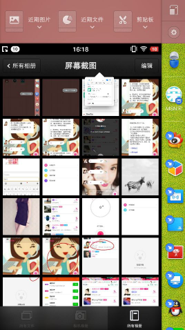

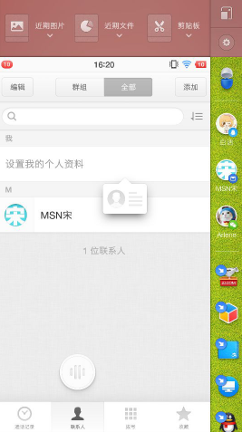
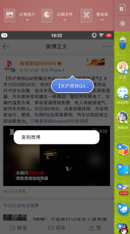

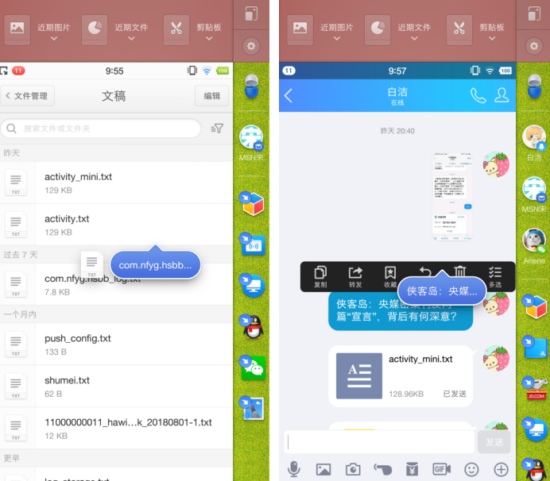
