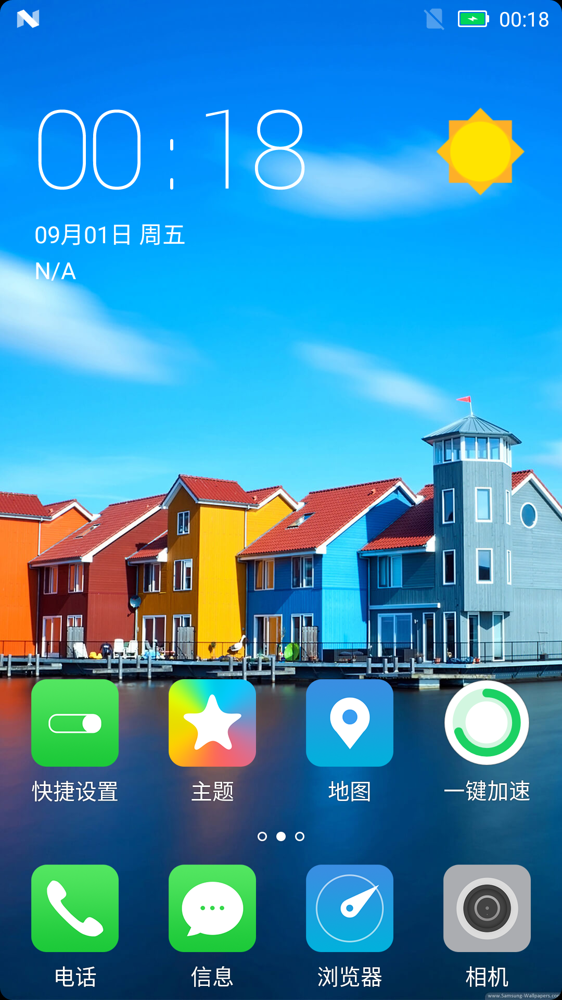

# 圆角屏幕特性简介

> Gerrit Topic: RoundedCornerDisplay

## 0x1 特性简介

该特性将原始硬件屏幕四个直角模拟为圆角，使屏幕看上去像一个圆角矩形，达到一定屏幕美化效果。

## 0x2 规格说明

1. 使用圆角矩形进行屏幕四角遮罩，并默认填充黑色达到和硬件屏幕混为一体的效果；
2. 提供四个角的圆角可配（左上、右上、左下、右下）；
3. 提供圆角半径可配（默认8dp）；
4. 提供圆角背景色可配（默认黑色）；
