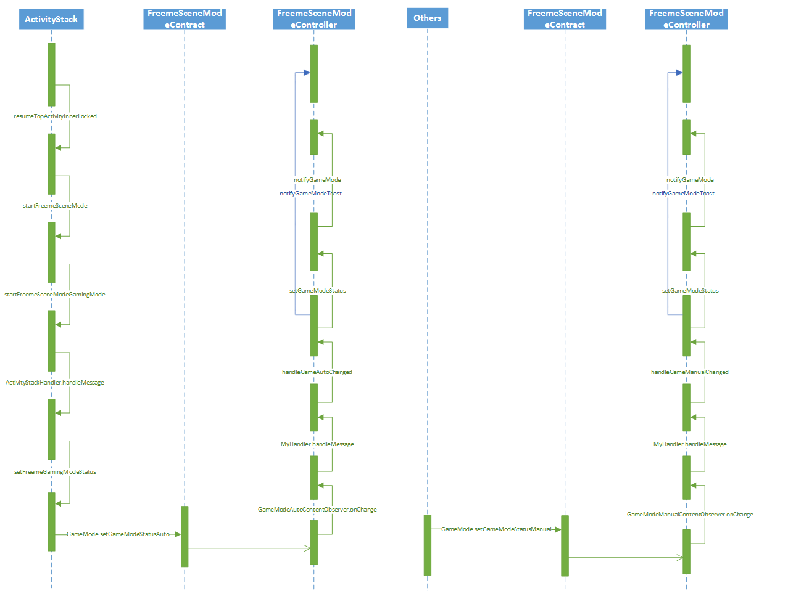

[TOC]

# 修改记录

| 版本 | 修改日期 | 作者 | 修改内容 |
|--------|--------|--------|--------|
| V1.0| 2018.07.03 | 赵泽红 | 创建 |

# 主要功能

- 来电免提接听
- 屏蔽悬浮通知
- 游戏省电
- 关闭自动亮度

## 来电免提接听
游戏模式开启时，来电接听后自动切到后台并开启免提

## 屏蔽悬浮通知
游戏模式开启时，屏蔽悬浮通知（来电闹钟除外）

## 游戏省电 (功能未实现)
游戏省电分为轻度省电和重度省电。该功能可能对部分游戏无效

- 关闭省电
- 轻度省电：降低游戏画面清晰度
- 重度省电：同时降低游戏画面清晰度和流畅度

## 关闭自动亮度
游戏模式开启时，暂时关闭自动亮度以保证遮挡时不受影响

- 自动亮度初始处于关闭状态，进出游戏模式时保持关闭状态不做任何操作。
- 自动亮度初始处于开启状态，进入游戏模式时关闭自动里亮度调节，退出时恢复开启状态。

# 添加游戏模式应用
打开列表中的应用时会自动开启游戏模式，退出时会自动关闭游戏模式。

- 未加入游戏模式列表的应用
- 屏蔽部分应用

 目前主要是系统应用，后续可收集数据进行扩充

- 推荐应用白名单

 还需要收集数据进行白名单扩充

- 其他应用

 排除以上两部分之后的剩余应用

# 游戏模式的实现

- 游戏模式应用列表维护
- 游戏模式信号的控制

## 游戏模式应用列表维护

使用系统自有的 appops.xml 文件进行维护。该文件存放于手机 /data/system/ 目录下。

```
<pkg n="com.mas.wawagame.cclord2.cooee">
<uid n="10088" p="false">
<op n="59" t="1532939723232" pu="0" />
<op n="60" t="1532939723232" pu="0" />
<op n="70" m="0" />
</uid>
</pkg>
```
```
<op n="70" m="0" />
```

其中 n 就是定义的类型，此处值为70（新增类别）代表游戏模式。
其中 m 有4个值 0（ALLOWED）, 1（IGNORED）, 2（ERRORED）, 3（DEFAULT）

应用列表的维护涉及到的 JAVA 文件主要是： AppOpsService.java 和 AppOpsManager.java 。
系统启动时就通过 AppOpsService.java 将 appops.xml 中的数据读入了缓存，系统结束时再将缓存中的数据写入到文件中。
在进行列表维护操作时通过 AppOpsManager.setMode 方法进行数据的更新。
AppOpsManager.setMode 方法调用的是 AppOpsService中的 setMode 方法

```
public void setMode(int code, int uid, String packageName, int mode) {
    try {
        mService.setMode(code, uid, packageName, mode);
    } catch (RemoteException e) {
        throw e.rethrowFromSystemServer();
    }
}
```

在 Activity 启动时 AppOpsManager.checkOp 方法进行数据的查询。
AppOpsManager.checkOp 方法调用的是 AppOpsService 中的 checkOperation 方法

```
public int checkOp(int op, int uid, String packageName) {
    try {
        int mode = mService.checkOperation(op, uid, packageName);
        if (mode == MODE_ERRORED) {
            throw new SecurityException(buildSecurityExceptionMsg(op, uid, packageName));
        }
        return mode;
    } catch (RemoteException e) {
        throw e.rethrowFromSystemServer();
    }
}
```

## 游戏模式信号的控制
目前采用的方案是在 SystemServer 中启动一个 service ，然后该 service 中监听游戏模式信号变化，进行一些相应操作。
使用 service 启动监听器的原因主要是基于状态信号变化之后的主动行为：

- Toast 提示用户进/出游戏模式。
- 部分功能需要主动调用实现。例如：开关自动亮度，发送/清除游戏模式通知。

信号控制分手动控制和自动控制。手动控制开启游戏模式的优先级更高。

- 手动控制

 手动控制即为点击控制按钮主动进出游戏模式；主要是 SystemUI 新增下拉通知控制按钮，和点击进入游戏模式时发送的通知进行关闭。

- 自动控制

 主要就是在进入 Activity 时判断是否是游戏应用，根据判断结果设置游戏模式信号




# 游戏模式对外API

通过 FreemeSceneModeContract.java 进行设置和读取。