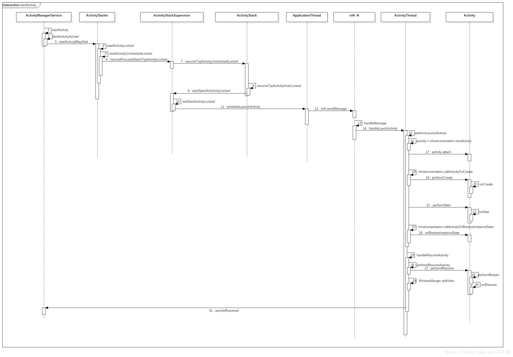
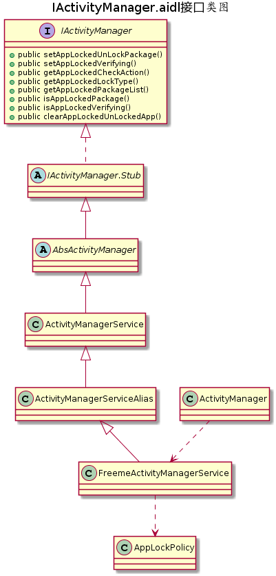
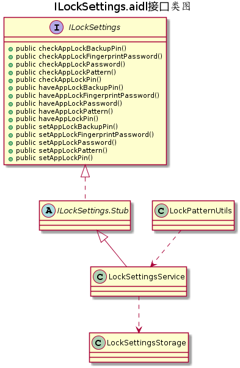
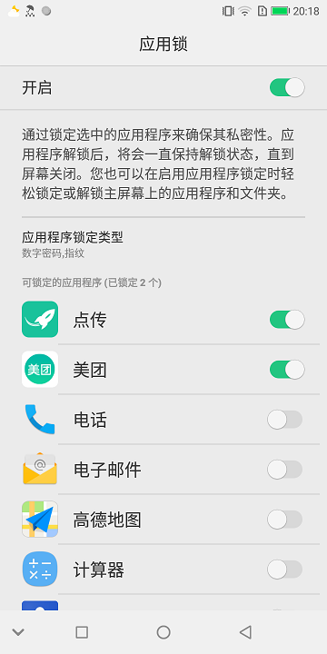
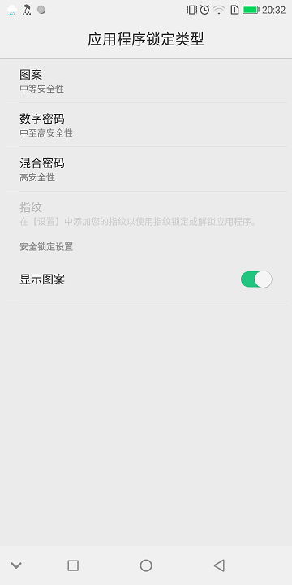

[TOC]
# 概念
所谓的应用锁，就是打开应用的时候，会先弹出解锁界面，解锁后才能打开应用。

# 方案
先看启动一个activity，系统都做了哪些工作。



基于这个时序图，有两个方案可以实现打开应用前先弹出解锁界面功能。

## 方案1
在步骤4，ActivityStarter.java中处理

1. 在Activity的intent传递阶段，篡改要启动的Activity，保存目标Activity信息，跳转至解锁界面。

2. 解锁成功，取出目标信息，跳转至目标Activity。

3. 取消解锁，退出解锁Activity

4. 耗时1~6ms，同步。

- 优点：先弹出解锁界面，解锁成功后再弹出目标界面。

- 缺点：无法控制从最近列表打开应用界面的情况。

## 方案2
在步骤21,27，Activity.java中处理

1. 在Activity显示流程中进行拦截，在其performStart()，performResume()的时候，判断是否需要显示解锁界面；若需要，则启动服务，弹出占满全屏的解锁FloatWindow。

2. 解锁成功，则移除FloatWindow，被遮盖住的目标Activity就显示出来

3. 取消解锁，在移除FloatWindow的时候，将被遮住的Acitivity也一并移除。

4. 耗时20~80ms，异步

- 优点：因为是在Activity显示流程中进行拦截，接近显示流程的终点，基本上不会出现方案1的遗漏。

- 缺点：正因为是在显示流程中进行拦截，会先弹出目标activity，然后再弹出解锁界面，解锁完成后，目标Activity才会显示出来。

---

综合以上两点，目前是方案1和方案2一起协同工作。

- 方案1主要负责从从laucher或者其他应用程序调用startActivity的情况
- 方案2主要负责从最近列表中打开的情况

# 实现

## 接口
下面是需要用到的接口之间的继承及调用关系。






## 方案1关键代码
\frameworks\base\services\core\java\com\android\server\am\ActivityStarter.java中的startActivity()方法

```
    //判断平台是否支持应用锁功能
    if (mService.SUPPORT_APPLOCK) {
        boolean isLaunchedFromRecents = (intent.getFlags() & Intent.FLAG_ACTIVITY_LAUNCHED_FROM_HISTORY) != 0;
        //判断是否满足以下所有条件
        //1.目标Activity正常，
        //2.目标Activity的包名与调用者包名不一致
        //3.目标Acitivity的应用没有处于验证状态
        //4.不是从最近列表中打开
        if (aInfo != null && aInfo.packageName != null && !aInfo.packageName.equals(callingPackage)
                && mService.isAppLockedPackage(aInfo.packageName)
                && !mService.isAppLockedVerifying(aInfo.packageName)
                && !isLaunchedFromRecents) {
            boolean skipLockWhenStart = AppLockPolicy.skipLockWhenStart(mService.mContext,
                    aInfo.packageName, intent);
            //判断intent中携带的数据是否会发生FileUriExposedException，若会，则返回true，不再进行篡改操作。
            if (!skipLockWhenStart) {
                //获取解锁界面的action
                String action = mService.getAppLockedCheckAction();
                Intent newIntent = new Intent(action);
                ActivityInfo appLockActivityInfo = mSupervisor.resolveActivity(newIntent, null,
                        startFlags, null, userId);
                if (appLockActivityInfo != null) {
                    //保存目标activity的intent和packageName
                    newIntent.putExtra(AppLockPolicy.LOCKED_PACKAGE_INTENT, intent);
                    newIntent.putExtra(AppLockPolicy.LOCKED_PACKAGE_NAME, aInfo.packageName);
                    //将解锁界面的ActivityInfo传递到下游
                    aInfo = appLockActivityInfo;
                    //配置解锁界面intent的包名，类名，flags等信息。
                    newIntent.setClassName(appLockActivityInfo.packageName, appLockActivityInfo.name);
                    newIntent.setFlags(newIntent.getFlags());
                    newIntent.addFlags(Intent.FLAG_ACTIVITY_MULTIPLE_TASK);
                    //将解锁界面的intent传递到下游
                    intent = newIntent;
                } else {
                    Slog.e(TAG, "can't resolve Activity, should't happen. check Action " + action);
                }
            }
        }
```
## 方案2关键代码
frameworks\base\core\java\android\app\Activity.java中的performStart()，performResume()方法

```
    private boolean mAppLockIsInMultiWindowMode;
    private final Runnable mAppLockCheckRunnable = new Runnable() {
        public void run() {
            checkAppLockState();
        }
    };

    private void checkAppLockState() {
        ActivityManager am = (ActivityManager) getSystemService(Context.ACTIVITY_SERVICE);
        String pkgName = getPackageName();
        boolean isLocked = am.isAppLockedPackage(pkgName);
        boolean isVerifying = am.isAppLockedVerifying(pkgName);
        //若当前应用已被锁定，没有处于验证状态，intent不为null，启动服务进行拦截
        if (isLocked && !isVerifying && getIntent() != null) {
            am.setAppLockedVerifying(pkgName, true);
            Intent intent = new Intent(AppLockPolicy.ACTION_CHECK_APPLOCK_SERVICE);
            intent.setPackage(AppLockPolicy.APPLOCK_PACKAGE);
            intent.putExtra(AppLockPolicy.LAUNCH_FROM_RESUME, true);
            intent.putExtra(AppLockPolicy.LOCKED_PACKAGE_NAME, pkgName);
            Intent targetIntent = new Intent();
            targetIntent.setAction(getIntent().getAction());
            targetIntent.setComponent(getIntent().getComponent());
            intent.putExtra(AppLockPolicy.LOCKED_PACKAGE_INTENT, targetIntent);
            startService(intent);
        }
    }
```

## 灭屏后加锁关键代码
vendor\freeme\frameworks\base\services-export\core\java\com\freeme\server\policy\FreemePhoneWindowManager.java

```
    @Override
    public void finishedGoingToSleep(int why) {
        super.finishedGoingToSleep(why);
        if (AppLockPolicy.isSupportAppLock()) {
            ActivityManager am = (ActivityManager) mContext.getSystemService(Context.ACTIVITY_SERVICE);
            if (am != null) {
                //灭屏后清除解锁标记
                am.clearAppLockedUnLockedApp();
            }
        }
    }
```

## 设置锁定类型关键代码
设置锁定类型复用了设置模块的代码，新增了以下标识与原生代码区分。

1. AppLockPolicy.KEY_FROM_APPLOCK
- true:调用者是AppLock
- false:调用者不是AppLock，目前应该是Settings

2. AppLockPolicy.KEY_APPLOCK_QUALITY:
- true:PIN码
- false:混合密码

3. AppLockPolicy.KEY_FOR_APPLOCK_BACKUP:
- true:带指纹解锁
- false:不带指纹解锁

FreemeAppLock\src\com\freeme\applock\settings\AppLockTypeFragment.java

```
    private static final String ACTIVITY_CHOOSELOCKGENERIC = "com.android.settings.password.ChooseLockGeneric";
    private static final String ACTIVITY_CHOOSELOCKPASSWORD = "com.android.settings.password.ChooseLockPassword";
    private static final String ACTIVITY_CHOOSELOCKPATTERN = "com.android.settings.password.ChooseLockPattern";
    @Override
    public boolean onPreferenceTreeClick(PreferenceScreen preferenceScreen, Preference preference) {
        if (preference.equals(mLockTypePattern)) {
            //跳转到ChooseLockPattern，图案解锁
            ComponentName componentName = new ComponentName(PACKAGE_SETTINGS, ACTIVITY_CHOOSELOCKPATTERN);
            Intent intent = new Intent();
            intent.putExtra(AppLockPolicy.KEY_FROM_APPLOCK, true);
            intent.putExtra("key_lock_method", "pattern");
            intent.setComponent(componentName);
            startActivityForResult(intent, LOCK_TYPE_PATTERN);
        } else if (preference.equals(mLockTypePin)) {
            //PIN码解锁
            StartChooseLockPassword(DevicePolicyManager.PASSWORD_QUALITY_NUMERIC);
        } else if (preference.equals(mLockTypePassword)) {
            //混合密码解锁
            StartChooseLockPassword(DevicePolicyManager.PASSWORD_QUALITY_ALPHABETIC);
        } else if (preference.equals(mLockTypeFinger)) {
            //指纹解锁要特别注意下，需要和以上三种解锁配合使用，防止指纹失效的时候无法解锁,即双重验证
            if (isFingerprintEnabled()) {
                int userId = ActivityManager.getCurrentUser();
                //检查指纹是否已注册
                if (mFingerprintManager.hasEnrolledFingerprints(userId)) {
                    Bundle bundle = new Bundle();
                    bundle.putBoolean("setToFingerprintNotConfirm", true);
                    identifyFinger(bundle);
                } else {
                    Intent intent = new Intent();
                    intent.setClassName(PACKAGE_SETTINGS, "com.android.settings.fingerprint.RegisterFingerprint");
                    intent.putExtra("previousStage", "app_lock");
                    intent.putExtra("fingerIndex", 1);
                    intent.putExtra("fromApplock", true);
                    startActivityForResult(intent, LOCK_TYPE_FINGERPRINT);
                }
            }
        }
        return super.onPreferenceTreeClick(preferenceScreen, preference);
    }

    //跳转到ChooseLockPassword
    private void StartChooseLockPassword(int quality) {
        DevicePolicyManager DPM = (DevicePolicyManager) getSystemService(Context.DEVICE_POLICY_SERVICE);
        int minLength = DPM.getPasswordMinimumLength(null);
        if (minLength < MIN_PASSWORD_LENGTH) {
            minLength = MIN_PASSWORD_LENGTH;
        }
        int maxLength = DPM.getPasswordMaximumLength(quality);
        ComponentName componentName = new ComponentName(PACKAGE_SETTINGS, ACTIVITY_CHOOSELOCKPASSWORD);
        Intent intent = new Intent();
        intent.setComponent(componentName);
        intent.putExtra("lockscreen.password_type", quality);
        intent.putExtra(ChooseLockConstant.PASSWORD_MIN_KEY, minLength);
        intent.putExtra(ChooseLockConstant.PASSWORD_MAX_KEY, maxLength);
        intent.putExtra(CONFIRM_CREDENTIALS, false);
        intent.putExtra(AppLockPolicy.KEY_FROM_APPLOCK, true);
        intent.putExtra(AppLockPolicy.KEY_APPLOCK_QUALITY, quality == DevicePolicyManager.PASSWORD_QUALITY_NUMERIC);
        startActivityForResult(intent, quality == DevicePolicyManager.PASSWORD_QUALITY_NUMERIC ? 2 : 3);
    }

    //检查当前锁定方式，若已带指纹，则不再重复设置　　　
    private int identifyFinger(Bundle bundle) {
        mFlags = bundle.getBoolean("setToFingerprintNotConfirm", false);
        if (Secure.getInt(getContentResolver(), FreemeSettings.Secure.FREEME_APPLOCK_LOCK_TYPE, AppLockPolicy.LOCK_TYPE_NONE)
                <= AppLockPolicy.LOCK_TYPE_FINGERPRINT) {
            setAppLockBackupKey(KEY_LOCK_TYPE_FINGER);
        }
        return 0;
    }

    //跳转到ChooseLockGeneric进行指纹+xxx双重验证
    private void setAppLockBackupKey(String key) {
        Intent mIntent = new Intent();
        mIntent.setClassName(PACKAGE_SETTINGS, ACTIVITY_CHOOSELOCKGENERIC);
        mIntent.putExtra("minimum_quality", DevicePolicyManager.PASSWORD_QUALITY_SOMETHING);
        mIntent.putExtra("hide_disabled_prefs", true);
        mIntent.putExtra(AppLockPolicy.KEY_FOR_APPLOCK_BACKUP, key);
        startActivityForResult(mIntent, FOR_APP_LOCK_BACKUP_KEY);
    }

```
下面跳转到设置模块看下后续是如何处理的。
vendor\freeme\packages\apps\FreemeSettings\src\com\android\settings\password\ChooseLockPattern.java

```
    @Override
    protected void onCreate(Bundle savedInstanceState) {
        ......
        //接收AppLock传递过来的参数mFromAppLock，mForAppLockBackupKey
        Intent intent = getIntent();
        boolean forFingerprint = intent
                .getBooleanExtra(ChooseLockSettingsHelper.EXTRA_KEY_FOR_FINGERPRINT, false);
        mFromAppLock = intent.getBooleanExtra(AppLockPolicy.KEY_FROM_APPLOCK, false);
        mForAppLockBackupKey = intent.getStringExtra(AppLockPolicy.KEY_FOR_APPLOCK_BACKUP) != null;
        .......
    }

    public void handleRightButton() {
        if (mUiStage.rightMode == RightButtonMode.Continue) {
            if (mUiStage != Stage.FirstChoiceValid) {
                throw new IllegalStateException("expected ui stage "
                        + Stage.FirstChoiceValid + " when button is "
                        + RightButtonMode.Continue);
            }
            updateStage(Stage.NeedToConfirm);
        } else if (mUiStage.rightMode == RightButtonMode.Confirm) {
            if (mUiStage != Stage.ChoiceConfirmed) {
                throw new IllegalStateException("expected ui stage " + Stage.ChoiceConfirmed
                        + " when button is " + RightButtonMode.Confirm);
            }
            //*/ freeme.yangzhengguang. 20180523. Applock
            if (mFromAppLock || mForAppLockBackupKey) {
                saveForAppLock();
                return;
            }
            //*/
            startSaveAndFinish();
        } else if (mUiStage.rightMode == RightButtonMode.Ok) {
            if (mUiStage != Stage.HelpScreen) {
                throw new IllegalStateException("Help screen is only mode with ok button, "
                        + "but stage is " + mUiStage);
            }
            mLockPatternView.clearPattern();
            mLockPatternView.setDisplayMode(DisplayMode.Correct);
            updateStage(Stage.Introduction);
        }
    }

    private void saveForAppLock() {
        LockPatternUtils utils = mChooseLockSettingsHelper.utils();
        boolean lockVirgin = !utils.isPatternEverChosen(UserHandle.myUserId());
        String patternSavedString = LockPatternUtils.patternToString(mChosenPattern);
        if (lockVirgin) {
            //显示解锁轨迹
            utils.setVisiblePatternEnabled(true, UserHandle.myUserId());
        }
        if (patternSavedString != null) {
            //保存图案密码
            utils.saveAppLockPassword(patternSavedString,
                    LockPatternUtils.AppLockType.Pattern, UserHandle.myUserId());
        }
        if (mForAppLockBackupKey) {
            //设置指纹解锁
            Settings.Secure.putInt(getActivity().getContentResolver(),
                    FreemeSettings.Secure.FREEME_APPLOCK_LOCK_TYPE, AppLockPolicy.LOCK_TYPE_FINGERPRINT_PATTERN);
        }
        getActivity().setResult(RESULT_FIRST_USER);
        getActivity().finish();
    }

```
vendor\freeme\packages\apps\FreemeSettings\src\com\android\settings\password\ChooseLockPassword.java

```
    if (mFromAppLock || mForAppLockBackupKey) {
        //保存Pin/Passwod
        mLockPatternUtils.saveAppLockPassword(mChosenPassword,
                mAppLock_isPin ? LockPatternUtils.AppLockType.PIN
                        : LockPatternUtils.AppLockType.Password,
                UserHandle.myUserId());
        if (mForAppLockBackupKey) {
            //设置指纹解锁
            Settings.Secure.putInt(getActivity().getContentResolver(),
                    FreemeSettings.Secure.FREEME_APPLOCK_LOCK_TYPE,
                    mAppLock_isPin ? AppLockPolicy.LOCK_TYPE_FINGERPRINT_PIN
                            : AppLockPolicy.LOCK_TYPE_FINGERPRINT_PASSWORD);
        }
        getActivity().setResult(RESULT_FIRST_USER);
        getActivity().finish();
        return;
    }

```
vendor\freeme\packages\apps\FreemeSettings\src\com\android\settings\password\ChooseLockGeneric.java

```
    if (quality >= DevicePolicyManager.PASSWORD_QUALITY_MANAGED) {
        intent = getLockManagedPasswordIntent(mUserPassword);
    } else if (quality >= DevicePolicyManager.PASSWORD_QUALITY_NUMERIC) {
        int minLength = mDPM.getPasswordMinimumLength(null, mUserId);
        if (minLength < MIN_PASSWORD_LENGTH) {
            minLength = MIN_PASSWORD_LENGTH;
        }
        final int maxLength = mDPM.getPasswordMaximumLength(quality);
        intent = getLockPasswordIntent(quality, minLength, maxLength);
        //*/ freeme.yangzhengguang. 20180523. Applock
        if (UserHandle.myUserId() < MAX_USER_ID) {
            if (mForAppLockBackupKey) {
                //传递KEY_FOR_APPLOCK_BACKUP,ChooseLockPassword以此判断是否打开指纹
                intent.putExtra(AppLockPolicy.KEY_FOR_APPLOCK_BACKUP, mAppLockBackupKey);
                //传递KEY_APPLOCK_QUALITY,ChooseLockPassword以此判断是PIN还是PASSWORD
                intent.putExtra(AppLockPolicy.KEY_APPLOCK_QUALITY,
                        quality == DevicePolicyManager.PASSWORD_QUALITY_NUMERIC);
            }
        }
        //*/
    } else if (quality == DevicePolicyManager.PASSWORD_QUALITY_SOMETHING) {
        intent = getLockPatternIntent();
        //*/ freeme.yangzhengguang. 20180523. Applock
        if (UserHandle.myUserId() < MAX_USER_ID) {
            if (mForAppLockBackupKey) {
                //传递KEY_FOR_APPLOCK_BACKUP,ChooseLockPattern以此判断是否打开指纹
                intent.putExtra(AppLockPolicy.KEY_FOR_APPLOCK_BACKUP, mAppLockBackupKey);
            }
        }
        //*/
    }

```
- 关于quality各个值对应的意义，有知道的同学帮忙告知下。

# 界面预览
- 应用锁开关

- 应用锁锁定类型的选择，目前有图案，数字密码，混合密码，图案+指纹，数字+指纹，混合+指纹。

- 应用锁可锁定的应用列表，可对此列表中的应用进行锁定。



- 设置锁定类型




