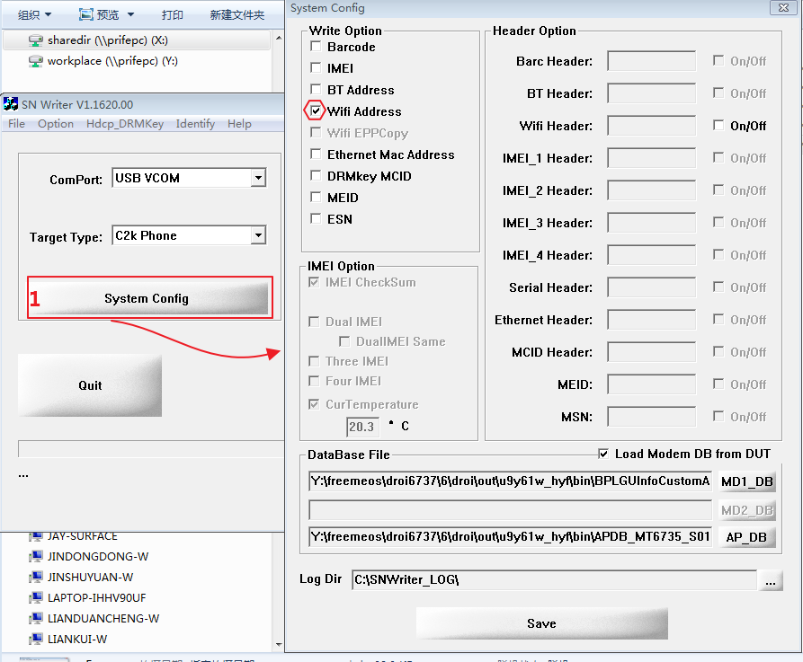
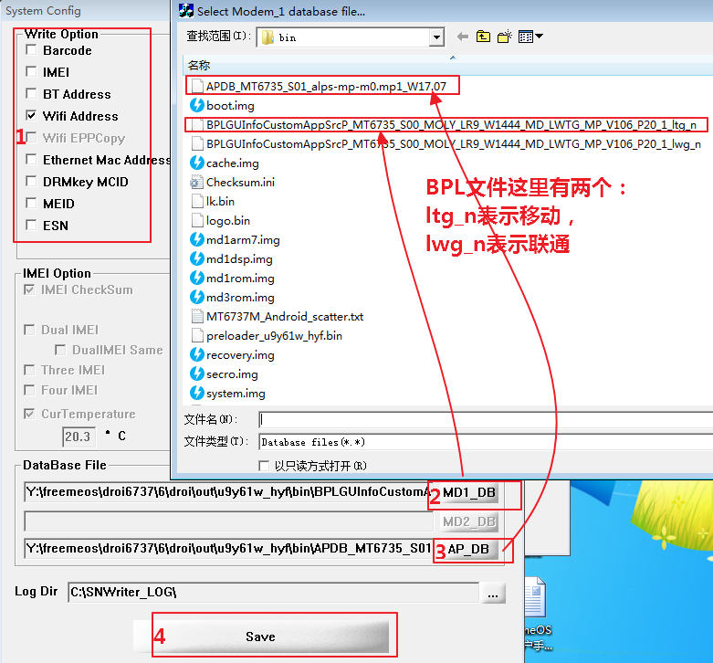
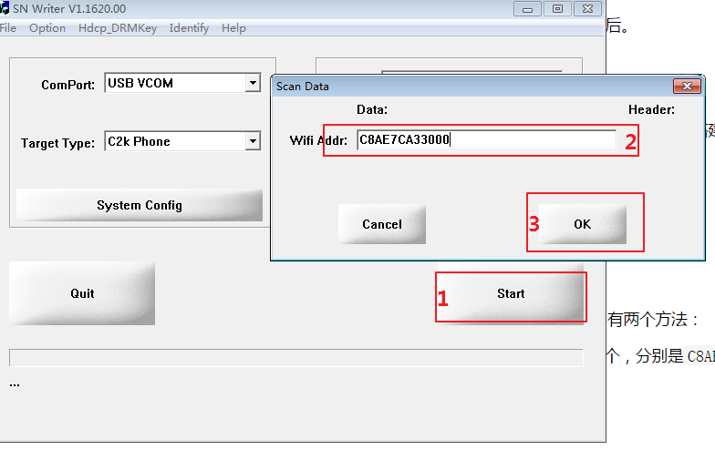
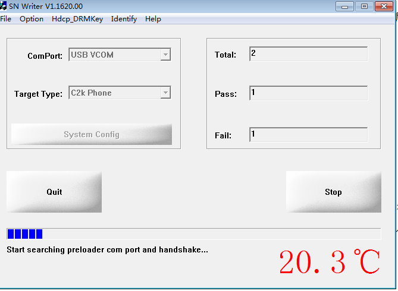
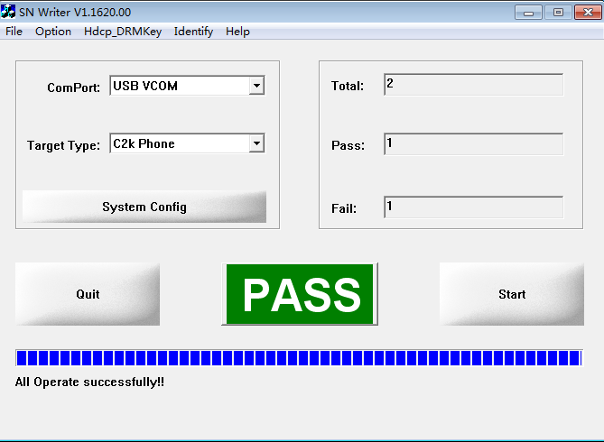

[TOC]

# 概述

本文讲解如何给MTK手机写入MAC地址（IMEI号、序列号等同理）

# 步骤

## 准备

为手机写入MAC地址，需要以下资源：

1. MTK提供的写号工具，位于`ftp://192.168.0.6/xx/xx`
2. 两个特殊的db文件（包含在ROM包中），CP组发布的ROM包都包含这两个文件。如果是自己编译的`ROM`，请使用`./publish`命令打包rom，在`droi/out/项目名/bin/`目录下可找到这两个文件。

## 写号

步骤见下图。

此时将手机关机，然后使用USB数据线连接PC与手机，如果出现下图则表示写号成功。

