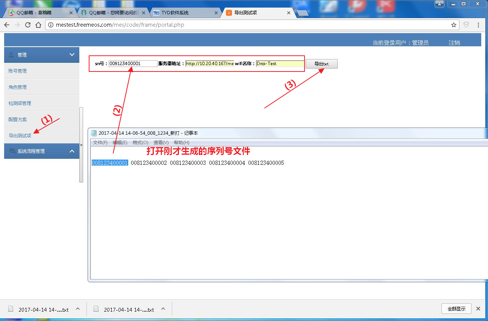

[TOC]

# 自动化测试概述

## 硬件构成

自动化测试盒是一套手机主板检测系统，硬件由三部分组成：

- 被测手机主板
- 夹具，用于固定被测手机主板、引出手机硬件检测触点、向提供主板必要接口（如电源和按键）
- 测试盒（也被称为box），通过夹具与被测手机主板连接，其内置SD卡可放置测试配置文件设定测试项集合

## 测试步骤

1. 将被测手机主板固定在夹具上，被测手机主板刷入支持自动化测试的ROM
2. 连接夹具和测试盒，给测试盒上电，待其启动完毕后（测试盒灯由蓝色变为红色），通过夹具给被测手机主板上电
3. 被测主板监测到已连接测试盒，则启动自动化测试程序
4. 被测主板与测试盒通信，读取测试盒SD卡中的测试配置文件，自动依次执行其中设定的测试项目，同时与测试盒通信，获得测试结果，并在屏幕上显示测试进度。
5. 全部测试项目运行完毕后，主板将连接指定wifi，连接成功后，将全部测试项结果上传服务器（该服务器也称为MES系统）

说明：wifi名称和MES服务器网址在测试盒测试配置文件中指定。

# MES系统

MES系统是用来管理手机的序列号生成、测试配置文件（box）生成、测试结果上传的服务器。

## 登陆

网址： [http://mestest.freemeos.com/mes/code/frame/portal.php](http://mestest.freemeos.com/mes/code/frame/portal.php)

- 用户名：`admin`
- 密码：`123456`

【待补充】

## 生成测试配置文件

打开`SN号生成`页面，需要填写以下参数：

- 机型
- 工厂订单
- 客户定单号
- 生成数量

# 测试须知

测试开始前，需要准备以下工作：

1. 向测试盒SD卡中放入测试项配置文件（后缀为`.box`），该文件可在MES系统上生成，生成方法参考MES系统一节
2. 手机写入`SN`号为mes生成测试项配置文件中的`SN`号
3. 手机写入的`MAC`地址为 **测试路由器** 所支持的MAC地址，见本节`路由器`小节

## 测试项

如果测试项异常，请联系`自动化测试程序测试项`负责人，见本文最后。

## 上传

测试项执行完成后会将测试结果上传到MES服务器。为了方便测试，已经在公司搭建了测试路由器和测试MES系统。

如果上传失败，请联系`自动化测试程序框架`负责人，见本文最后。

### 路由器

- 位置：20楼测试部门
- wifi名称：`Droi-Test`

该热点无密码，但限制了特定`MAC`地址才可连接。要想连接该wifi，有两个方法：

1. 被测手机需要写入特定的MAC地址，当前支持的MAC地址有三个，分别是`C8AE7CA11000`，`C8AE7CA22000`，`C8AE7CA33000`
2. 向路由器的MAC过滤添加新的MAC地址，

如有疑问请`联系路由器维护`负责人，见本文最后。

### MES上传网址

MES上传服务器网址： [http://10.20.40.167/mes/code/ataupload/upload.php]()

说明：

- 服务器域名地址为｀http://mestest.freemeos.com/mes/code/ataupload/upload.php｀，但自动化测试程序无法访问该网址，因为执行自动测试时，手机位于工厂模式下，此时没有启动dns服务，只能访问ip地址。
- 为防止ip变动，可在PC上打开cmd窗口执行`ping mestest.freemeos.com`获取该域名的ip地址，当前为`10.20.40.167`。

如有疑问请`MES系统`负责人，见本文最后。

# 各项目进度

当前各个项目上自动化测试项目进度说明如下：

项目名称 | 对应平台 | rom版本 | 是否支持wifi上传 | 是否支持测试项配置
------- | ------- | ------- | -------
WF5 | 80N | user | 支持 | 支持
V9C | 37M | eng | 支持 | 支持
V961Q_GXI3_A1_LN | 50L | eng | 待定 | 支持

# 各部分负责人

功能 | 部门 | 负责人
------- | ------- | -------
自动化测试程序测试项 | 驱动部 | 王聪
自动化测试程序框架 | freemeos | 朱忠凯
MES系统 | 云创 | 顾明飞
项目流程 | 项目部 | 黄永胜
路由器维护 | 运维部 | 李伟
rom生成 | cp组 | xx
