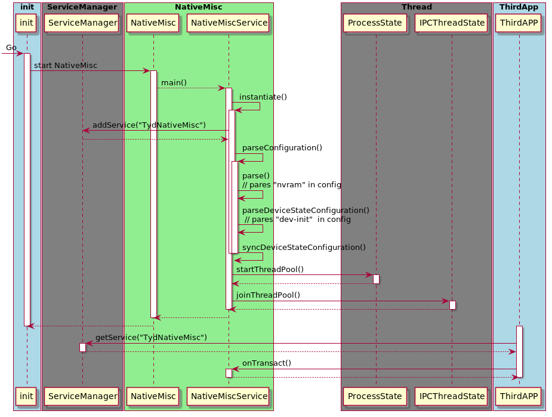

# Freeme NativeMisc说明

[TOC]

### 简介

```Freeme NativeMisc``` 旨在通过配置文件，对相关模块进行首次初始化或重置，同时通过注册服务，提供给上层接口调用，从而获取相关配置信息。

### 流程图



### 编译框架

- 依赖库

```
libNativeMisc
NativeMisc
INativeMisc
```

实现代码

```
  ... ...
  LOCAL_MODULE:= libNativeMisc
  LOCAL_MODULE_TAGS := optional
  LOCAL_SRC_FILES := \
      INativeMisc.cpp \
      NativeMiscService.cpp \
      IMEIUp.cpp \
      SensorCali.cpp \
      DeviceState.cpp \
      DeviceStateSpecific.cpp \
      DeviceStateSpecific_wifi.cpp \
      NvramProperties.cpp \
      util/fs_utils.cpp \
      util/properties_utils.cpp
  LOCAL_STATIC_LIBRARIES := \
      libnm_module_sensor \
      libnm_module_nvram \
  ... ...
```

  - 依赖库```libnm_module_sensor``` （```sensor```相关）
  - 依赖库```libnm_module_nvram```（读写```nvram```操作）

- 主程序```NativeMisc```

```
  ... ...
  LOCAL_MODULE:= NativeMisc
  LOCAL_MODULE_TAGS := optional
  LOCAL_SRC_FILES := main.cpp
  ... ...
  LOCAL_STATIC_LIBRARIES := \
      libNativeMisc
  ... ...
```

- 配置文件```nativemisc_config.json```

```
  ... ...
  LOCAL_MODULE := nativemisc_config.json
  ... ...
  LOCAL_MODULE_PATH := $(TARGET_OUT)/etc
  ... ...
```

### 配置文件解析

```
{
  "nvram": [
    /* Order is Important! */
    /* 
    {"key": "key_name", "length": value_length} // <template>
    */
  ],
  "dev-init": [
    /* Order is *NOT* Important. */
    /*
    { // <template>
      "key": "<key>",
      "bootable": "<false|true|system_property>",
      "type": "<int/long/string>",
      "node": "<kernel/node/to/write>|property:<...>",
      "persistent": "<nvram:<...>|[''|property:<...>]|specific:[...]>",
      ["default": "<system_property>"]
    }
    */
  ]
}
```

> 注：
>
> - nvram：模块表示保存于Nvram中的key值及属性，顺序很重要，请勿轻易改变
> - dev-init： 模块表示需要进行初始化的模块的的参数配置
> - key：区分各项
> - bootable：开机是否同步模块
> - type：存储值类型
> - node：需要写入的```kernel```位置或属性
> - persistent：存储键值或操作


### 执行过程解析

##### Demo配置

```
"nvram": [
    { "key": "sensor.cali.proximity", "length": 28 },
   ]
"dev-init": [
     {
      "key": "ssr.proximity.cali",
      "bootable": "ro.freeme.hw_sensor_proximity",
      "type": "string",
      "node": "/sys/bus/platform/drivers/als_ps/config",
      "persistent": "nvram:sensor.cali.proximity"
    }
   ]
```

##### 代码解析

```
/// main.c
int main(int argc, const char * const argv[])
{
  	// 初始化NativeMiscService
    NativeMiscService::instantiate();  /// 关键！！！

    ProcessState::self()->startThreadPool();
    IPCThreadState::self()->joinThreadPool();
    return 0;
}


///  NativeMiscService.cpp
void
NativeMiscService::instantiate()
{
  	// 添加系统服务，提供API
    defaultServiceManager()->addService(/*BnNativeMisc::descriptor*/BnNativeMisc::name,
            new NativeMiscService());
}

/// INativeMisc.cpp
IMPLEMENT_META_INTERFACE(NativeMisc, "NativeMisc");
const android::String16 INativeMisc::name("TydNativeMisc"); /// 初识话Service Name

/// NativeMiscService.cpp
NativeMiscService::NativeMiscService()
        : mVirtualNvram()
        , mDeviceStateSequence()
{
    ... ...
    // 解析配置
    parseConfiguration();
}

status_t
NativeMiscService::parseConfiguration()
{
    FILE* fp;
    if ((fp = fopen("/system/etc/nativemisc_config.json", "rb")) == NULL) {
       ... ...
    }
	... ...

    // 解析json 文件
    Json::Value root;
    Json::Reader reader;
    if (!reader.parse(fileBuf, root, false)) {
        ... ...
    }

  	// 解析配置 "nvram"
    mVirtualNvram.parse(root);
  	// 解析配置 "dev-init"
    parseDeviceStateConfiguration(root);
	... ...
}

/// VirtualNvramParser.cpp： 解析配置 "nvram"
status_t
VirtualNvram::parse(const Json::Value& content)
{
    const Json::Value rootNvram = content["nvram"];  
  	... ...

    const int size = rootNvram.size();
    for (int i = 0; i < size; ++i) {
        const Json::Value &jitem = rootNvram[i];

      	// 解析 {"key": "key_name", "length": value_length}，并保存于NvramItem中
        String8 key(jitem.get("key", "<<default>>").asCString());
        size_t  length(jitem["length"].asInt());

        sp<NvramItem> item = new NvramItem(key, start, length);
      	// 将所有的NvramItem保存在 mSequence 中，而其是一个 Vector<sp<NvramItem>>
        mSequence.push_back(item);

        // 更新起始位置，所以配置文件中 Nvram 顺序很重要，不能随便改
        start += length;
    }

    return NO_ERROR;
}

/// DeviceState.cpp： 解析配置 "dev-init"
status_t
NativeMiscService::parseDeviceStateConfiguration(const Json::Value& root)
{
    const Json::Value rootDevState = root["dev-init"];
    ... ...

    const int size = rootDevState.size();
    for (int i = 0; i < size; ++i) {
        const Json::Value &jitem = rootDevState[i];

        // key
        const Json::Value& vkey = jitem["key"];
		... ...
        sp<DeviceStateItem> item = new DeviceStateItem(String8(vkey.asCString()));
        // bootable: true & false
        const char* bootable = jitem["bootable"].asCString();
        ... ...

        // type: long & string & int
        const char* type = jitem["type"].asCString();
      	... ...

        // node: Property & File
        const char* node = jitem["node"].asCString();
      	... ...

        // persistent: nvram & specific & property
        const char* persistent = jitem["persistent"].asCString();
      	... ...

        // default
        const Json::Value& vdefault = jitem["default"];
      	... ...

        // 解析完成后，进行同步即初始化
        if (syncDeviceStateConfiguration(item) != NO_ERROR) {
            ... ...
        }
    }
}

status_t
NativeMiscService::syncDeviceStateConfiguration(const sp<DeviceStateItem> &item) {
    // 检查是否需要同步，true则进行同步
    switch (item->bootable.value) {
        case DeviceStateItem::bootable_t::eTrue:
        case DeviceStateItem::bootable_t::eFalse:
        case DeviceStateItem::bootable_t::eProperty:
        	... ...
    }

    // sync state
    switch (item->persistent.type) {
        /// 若 persistent_t 为eNvram类型则读取Nvram并写入节点或Property
        case DeviceStateItem::persistent_t::eNvram: 
        /// 若 persistent_t 为eProperty则读取Property值并写入节点或Property
        case DeviceStateItem::persistent_t::eProperty: 
        /// 若 persistent_t 为eSpecific则调用注册的函数
        case DeviceStateItem::persistent_t::eSpecific:
    }
    ... ...
}
```

### INativeMisc调用汇总

- ```package - Mms```  ：通过反射调用getDeviceUUID() 获取UUID

- ```package - EngineerMode``` ：：通过反射调用updateIMEI() 更新IMEI

- ```package - FreemePrivateNewsPage``` ：：通过反射调用getDeviceUUID() 获取UUID

- ```package - FreemePulicInfo``` ：：通过反射调用getDeviceUUID() 获取UUID

- ```package - Settings SensorCalibrationFragment``` ：：通过反射调用runSensorCali() 传感器校准

  ​
