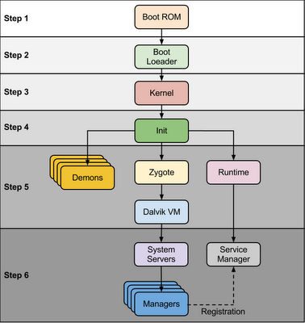
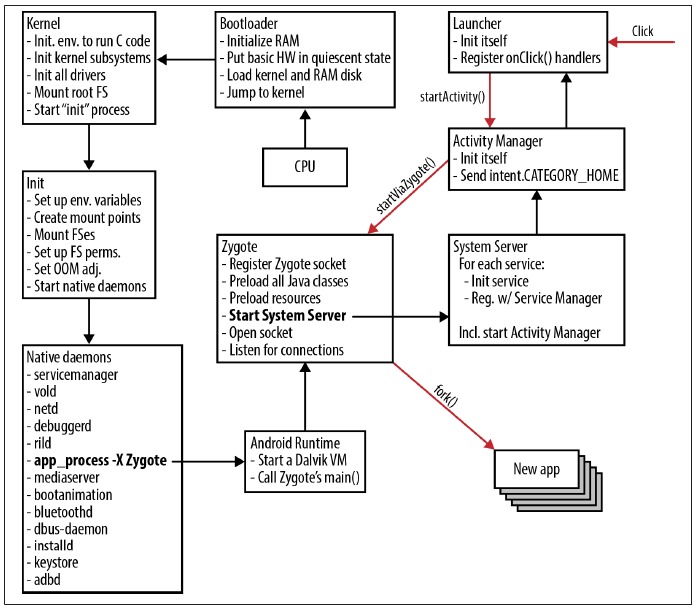

[TOC]

# 黑屏问题

## 问题描述

相关bug #0009649，#0009668，#0006965

## 背景知识

### 开机流程





### 开机动画

因为系统启动过程中，各种基础服务加载之后才能准备好应用启动的环境。这个时间较长，为了更好的用户体验，Android设计了启动动画（`bootanimation`）。这样启动动画在屏幕播放，系统后台繁忙地加载服务。

那么一个随之而来的问题就是开机动画何时结束？

显然当系统必要服务已经准备好，开机动画的使命已经完成，应该结束开机动画显示，具体有两种情况：

1. 如果用户设置锁屏，那么应在锁屏界面准备好之后，结束开机动画
2. 如果用户关闭锁屏，那么应该Launcher准备好之后，结束开机动画

上述两种情况下，良好的用户体验都不应该出现黑屏、闪烁等情况。

Android系统开机后，在系统并轮训判断当前系统是否准备完毕，是否应该结束开机动画。这部分代码参考： https://android.googlesource.com/platform/frameworks/base/+/6e2f395%5E%21/，见参考文献[2]

实际情况中，为了避免开机动画时间过长，Android做了妥协，限制开机动画最长30秒。如果超过这个时间，就会强制结束开机动画。这部分代码见参考文献[3]。

### preview window(又称为starting window)

为了优化手机体验，Android为设计了starting window。

>如SDK文档所述，每个应用启动之前都有Starting Window，用于衔接前一个应用的消亡和下一个应用的初始化
>At the beginning of a cold start, the system has three tasks. These tasks are:
>- Loading and launching the app.
>- Displaying a blank starting window for the app immediately after launch.
>- Creating the app process.

从AOSP的代码来看，这个说法并不准确，每个Activity都可以配置打开或关闭starting window。不良的设计会导致Activity的启动很慢（如加载大量图片资源），为了优化体验，AMS在启动Activity时先打开一个starting window，并应用该Activity的主题。

利用好starting window，可改善应用的启动体验。相关讨论见参考文献[5]

starting window流程很多，试举一条调用路径（这里可以利用动态调试时的callstack快速确定一条执行path）

```
// frameworks/base/services/core/java/com/android/server/am/ActivityStarter.java

    final int startActivityLocked(IApplicationThread caller, Intent intent, Intent ephemeralIntent,
            String resolvedType, ActivityInfo aInfo, ResolveInfo rInfo,
            IVoiceInteractionSession voiceSession, IVoiceInteractor voiceInteractor,
            IBinder resultTo, String resultWho, int requestCode, int callingPid, int callingUid,
            String callingPackage, int realCallingPid, int realCallingUid, int startFlags,
            ActivityOptions options, boolean ignoreTargetSecurity, boolean componentSpecified,
            ActivityRecord[] outActivity, ActivityStackSupervisor.ActivityContainer container,
            TaskRecord inTask) 
-->

    private int startActivityUnchecked(final ActivityRecord r, ActivityRecord sourceRecord,
            IVoiceInteractionSession voiceSession, IVoiceInteractor voiceInteractor,
            int startFlags, boolean doResume, ActivityOptions options, TaskRecord inTask) {

            }
-->
// frameworks/base/services/core/java/com/android/server/am/ActivityRecord.java
    final void startActivityLocked(ActivityRecord r, boolean newTask, boolean keepCurTransition,
            ActivityOptions options) {
            ...
            r.showStartingWindow(prev, showStartingIcon);
    }

-->
    void showStartingWindow(ActivityRecord prev, boolean createIfNeeded) {
        final CompatibilityInfo compatInfo =
                service.compatibilityInfoForPackageLocked(info.applicationInfo);
        final boolean shown = service.mWindowManager.setAppStartingWindow(
                appToken, packageName, theme, compatInfo, nonLocalizedLabel, labelRes, icon,
                logo, windowFlags, prev != null ? prev.appToken : null, createIfNeeded);
        if (shown) {
            mStartingWindowState = STARTING_WINDOW_SHOWN;
        }
    }

下面重点来分析

// frameworks/base/services/core/java/com/android/server/wm/WindowManagerService.java
    public boolean setAppStartingWindow(IBinder token, String pkg,
            int theme, CompatibilityInfo compatInfo,
            CharSequence nonLocalizedLabel, int labelRes, int icon, int logo,
            int windowFlags, IBinder transferFrom, boolean createIfNeeded) {
        ...
                final boolean windowIsTranslucent = ent.array.getBoolean(
                        com.android.internal.R.styleable.Window_windowIsTranslucent, false);
                final boolean windowIsFloating = ent.array.getBoolean(
                        com.android.internal.R.styleable.Window_windowIsFloating, false);
                final boolean windowShowWallpaper = ent.array.getBoolean(
                        com.android.internal.R.styleable.Window_windowShowWallpaper, false);
                final boolean windowDisableStarting = ent.array.getBoolean(
                        com.android.internal.R.styleable.Window_windowDisablePreview, false);
                if (windowIsTranslucent) {
                    return false;
                }
                if (windowIsFloating || windowDisableStarting) {
                    return false;
                }
                if (windowShowWallpaper) {
                    if (mWallpaperControllerLocked.getWallpaperTarget() == null) {
                        // If this theme is requesting a wallpaper, and the wallpaper
                        // is not currently visible, then this effectively serves as
                        // an opaque window and our starting window transition animation
                        // can still work.  We just need to make sure the starting window
                        // is also showing the wallpaper.
                        windowFlags |= FLAG_SHOW_WALLPAPER;
                    } else {
                        return false;
                    }

            if (transferStartingWindow(transferFrom, wtoken)) {
                return true;
            }
            ...
            Message m = mH.obtainMessage(H.ADD_STARTING, wtoken);
            mH.sendMessageAtFrontOfQueue(m);
    }
```

现在来重点分析WMS.setAppStartingWindow函数的执行流程。这段代码可以分为三个部分：

1）判断Activity的主题属性配置

从主题文件中读取`windowIsTranslucent`、`windowIsFloating`、`windowDisablePreview`、`windowShowWallpaper`这四个属性。

如果配置了 `windowIsTranslucent`、`windowIsFloating`、`windowDisablePreview`这三个属性任意一个为true，则立刻返回即不会添加starting window。

这段的意思是：如果一个应用的Activity的主题配置了透明窗口、浮动窗口、窗口禁用预览，这三个属性中的任何一个，那么就会禁用其startingWindow。这个很好理解，如果窗口都透明了，还创建startingwindow干什么呢？因为starting window的作用就是为了显示在Activity的真正窗口显示之前显示。既然窗口都透明了，而且用户并不能配置starting window的显示内容（是否能配置windowBackground属性，这个需要进一步验证）。

当配置了`windowShowWallpaper`时，则会检查当前系统的`wallpaper target`为空，则为其设置`FLAG_SHOW_WALLPAPER`属性，否则直接直接返回。这一句很重要，因为这一句会影响FallbackHome。

2）随后的`transferStartingWindow`主要在多个Activity都打开StartingWindow的情况下会有用。

3）最后这个函数发送`ADD_STARTING`消息会的，对应的消息接收处理处会真正执行`addWindow`的操作。

```
    final class H extends Handler {
        ...
        @Override
        public void handleMessage(Message msg) {
            if (DEBUG_WINDOW_TRACE) {
                Slog.v(TAG_WM, "handleMessage: entry what=" + msg.what);
            }

            switch (msg.what) {
                ...
                case ADD_STARTING: {
                    final AppWindowToken wtoken = (AppWindowToken)msg.obj;
                    final StartingData sd = wtoken.startingData;
                    ，，，
                    try {
                            view = mPolicy.addStartingWindow(
                                wtoken.token, sd.pkg, sd.theme, sd.compatInfo,
                                sd.nonLocalizedLabel, sd.labelRes, sd.icon,
                                sd.logo, sd.windowFlags, overrideConfig);
                    } catch (Exception e) {
                        Slog.w(TAG_WM, "Exception when adding starting window", e);
                    }
                ...
                }
            }
        }
    }

```

上面Policy.addStartingWindow会调用

```
//frameworks/base/services/core/java/com/android/server/policy/PhoneWindowManager.java

addStartingWindow() {

}
```

在其中配置窗口的属性并添加窗口到窗口栈、创建窗口的Surface等。

### 锁屏`LockScreen`

Android支持锁屏，用户可以在设置中打开或关闭。Lockscreen是由`Keyguard service`实现的。在开机过程中keyguard service也需要启动。

Lockscreen位于SystemUI进程中。并且其窗口其实是Android的状态栏(`StatusBar`)窗口。当用户锁屏时，StatusBar窗口会被扩展为全屏幕，然后上面会显示锁屏信息。

因为KeyguardService是应用程序，在Android启动过程的时机非常靠后，在系统基础服务之后。并且为了优化锁屏窗口显示体验，Android添加了`KeyguardScrim`窗口。

当要显示锁屏时，先显示`KeyguardScrim`窗口，随后它消亡，然后显示真正的`LockScreen`窗口（将`StatusBar`窗口设置为全屏）。

### `FallbackHome`

Android N引入了`FallbackHome`。代码位于：

```
packages/apps/Settings/src/com/android/settings/FallbackHome.java
```

该应用具有如下特点：

- 它是个Launcher，其AndroidManifest.xml中配置了`<category android:name="android.intent.category.HOME" />`。
- 正常启动（非刷机、恢复出厂设置后首次启动）时，该主题配置为透明（@android:style/Theme.Translucent.NoTitleBar）

1）问题：FallbackHome存在的情况下，如何启动真正的Launcher？

解答：其启动之后，然后轮训等待锁频广播，并通过`PackageManagerService`的`resolveActivity`方法检查当前PKMS是否已经监测到真正的Launcher了，是的话则`finish`自身。此时会回调到`ActivityManagerService`中，发现ActivityStack为空，则AMS会再调用`startHomeActivity`，从而启动真正的Launcher。

2）问题：FallbackHome的作用是什么？

解答：搞清楚原因的最准确、也最简单的方法就是从FallbackHome的提交记录中寻找蛛丝马迹。

在AOSP代码中查看到该文件最早的提交记录如下。

```
commit 9e9f7d11162df92bc430002423a281e22176de41
Author: Jeff Sharkey <jsharkey@android.com>
Date:   Mon Nov 30 13:28:19 2015 -0700

    Add fallback encryption-aware home screen.
    
    When the home screen selected by the user isn't encryption aware, we
    still need to put something on the ActivityStack.  For now, let's use
    an empty activity that knows how to dismiss itself when the
    credential-encrypted storage is unlocked; that's enough for the
    system to re-resolve the home intent and find the real home screen.
    
    Also follow method refactoring.
    
    Bug: 22358539
    Change-Id: Iebc4ad8d2dd62ada079cab03d5765f7631fd4beb
```

从提交信息来看FallbackHome的引入应该与Android 6.0之后支持加密有关。也就是说`FallbackHome`引入并不是为了遮蔽bootanimation结束后到启动自定义Launcher的过渡过程。（这里大伟哥的分析文档中给出的说法应是不严谨的）。此外，Android7.0之前没有FallbackHome时，开机启动并无黑屏现象。因此`FallbackHome`应该别有它途。

3). 问题：为什么开机时首先启动`FallbackHome`，另外开机之后应用通过隐式intent启动Launcher为什么不会再启动它？

解答： 这个问题分为两部分。

a). 为什么开机后通过隐式广播启动Launcher不会启动`FallbackHome`?

```
<!-- Triggered when user-selected home app isn't encryption aware -->
<activity android:name=".FallbackHome"
          android:excludeFromRecents="true"
          android:theme="@style/FallbackHome">
    <intent-filter android:priority="-1000">
        <action android:name="android.intent.action.MAIN" />
        <category android:name="android.intent.category.HOME" />
        <category android:name="android.intent.category.DEFAULT" />
    </intent-filter>
</activity>
```

Launcher的priority是`-1000`。而PackageManagerService中查找应用时，会以`priority`降序排列。

b). 为什么开机时会启动`FallbackHome`?

**以下为推测，尚未严谨的证据证明**

>从日志打印来看，FallbackHome的加载实际非常早，这可能是因为FallbackHome位于Settings应用有关。Settings应用作为核心关键应用启动时机应该是非常早，而且系统启动过程中PackageManagerService首次resolveIntent（寻找HOME INTENT时），第一次只会找到FallbackHome。

### 壁纸

从Android 7.0中，可以为LockScrenn设置单独的壁纸。

>在Android系统中，壁纸分为静态静态与动态两种。静态壁纸就是一张图片，而动态壁纸则以动画为表现形式。这两种形式看似差异很大，其实二者的本质是统一的。它们都是以一个`Service`的形式运行在系统后台，并在一个类型为`TYPE_WALLPAPER`的窗口上绘制内容。

>Android壁纸的实现和管理分为三个层次：

>- `WallpaperService`与`Engine`。由壁纸开发者实现。这一层主要体现了壁纸的实现原理。
>- `WallpaperManagerService`。系统服务，用于管理壁纸的运行与切换。这一层主要体现了Android对壁纸的管理方式。
>- `WindowManagerService`。用于计算壁纸窗口的Z序列、可见性以及为壁纸应用窗口动画。这一层主要体现了Android对壁纸窗口的管理方式。

**WMS对壁纸窗口的特殊处理**：壁纸存在的意义是为了其他窗口提供背景。当一个窗口希望壁纸作为背景时，可以将`FLAG_SHOW_WALLPAPER`标记加入其flags终归。当WMS监测到处于显示状态的窗口声明这以标记时。会将壁纸窗口衬于此窗口之下。于是用户便可以通过此窗口的透明区域看到壁纸窗口的内容。

**壁纸目标(`wallpaper target`)**：既然壁纸要衬托在声明了`FLAG_SHOW_WALLPAPER`标记的窗口之下，因此壁纸窗口的Z序列取决与声明了这个标记的窗口的Z序。在WMS中，声明了这个标记的窗口称为壁纸目标（wallpaper target）。所以确定壁纸窗口Z序列的核心工作就是寻找这个壁纸目标。

**寻找壁纸目标的策略**：系统中有多个窗口声明`FLAG_SHOW_WALLPAPER`，那么用于最高Z序并且用户可见的窗口即为壁纸目标。

### 窗口绘制

暂略

## bootanimation到Launcher启动

检测bootanimation是否应该继续的函数是WMS中的`checkWaitingForWindowsLocked`方法，具体如下。

```
    private boolean checkWaitingForWindowsLocked() {

        boolean haveBootMsg = false;
        boolean haveApp = false;
        // if the wallpaper service is disabled on the device, we're never going to have
        // wallpaper, don't bother waiting for it
        boolean haveWallpaper = false;
        boolean wallpaperEnabled = mContext.getResources().getBoolean(
                com.android.internal.R.bool.config_enableWallpaperService)
                && !mOnlyCore;
        boolean haveKeyguard = true;
        // TODO(multidisplay): Expand to all displays?
        final WindowList windows = getDefaultWindowListLocked();
        final int N = windows.size();
        for (int i=0; i<N; i++) {
            WindowState w = windows.get(i);
            if (w.isVisibleLw() && !w.mObscured && !w.isDrawnLw()) {
                return true;
            }
            if (w.isDrawnLw()) {
                if (w.mAttrs.type == TYPE_BOOT_PROGRESS) {
                    haveBootMsg = true;
                } else if (w.mAttrs.type == TYPE_APPLICATION) {
                    haveApp = true;
                } else if (w.mAttrs.type == TYPE_WALLPAPER) {
                    haveWallpaper = true;
                } else if (w.mAttrs.type == TYPE_STATUS_BAR) {
                    haveKeyguard = mPolicy.isKeyguardDrawnLw();
                }
            }
        }

        if (mSystemBooted && ((!haveApp && !haveKeyguard) ||
                (wallpaperEnabled && !haveWallpaper))) {
            return true;
        }

        return false;
    }        
```

其中通过`getDefaultWindowListLocked`获得当前系统所有的窗口，通过窗口的属性判断窗口，以下两个条件任一满足即继续等待

- 无`TYPE_APPLICATION`的窗口，同时无`keyguard`
- 使能壁纸、且壁纸系统还未准备完毕

不满足这两个条件，即认为系统已经启动完毕。

## 问题分析

有了上面的基础知识，现在可以具体分析启动时黑屏的问题了。

BUG描述是开机时，启动锁屏之前有检测到黑屏，由于壁纸窗口的存在，只要壁纸目标可以正确找到，那么WMS即可正确的绘制壁纸，如果窗口透明那么自然没有黑屏。

黑屏的主要原因即上面的逻辑判断太宽松了，什么时候适合点亮屏幕呢？

1）当无锁屏时

首先是KeyguardScrim作为壁纸目标，随后它消亡；FallbackHome作为壁纸目标；然后它消亡，唤起Launcher3，并且Launcher3作为壁纸目标。
理论上我们应该等Launcher3启动后，且它作为壁纸目标时再结束动画这样效果最好。但是由于FallbackHome的存在。只有结束bootanimation，系统才会发送解锁广播，FallbackHome才会finish自身，进一步触发AMS启动Launcher3。

既然如此，我们就需要想办法让FallbackHome变成一个透明窗口，并且可以显示壁纸。

2）有锁屏时

此时开机应直接进入LockScreen，而LockScreen的窗口其实是全屏的StatusBar，因此StatusBar应该绘制完毕且可以显示壁纸。

在Android 7.0中，LockScreen可以单独设置壁纸或者使用系统壁纸：

- 当使用系统壁纸时，StatusBar将具有`FLAG_SHOW_WALLPAPER`属性，因此会被作为作为壁纸目标，即当StatusBar作为壁纸目标时，即可结束动画
- 当使用LockScreen壁纸时，打印显示此时所有窗口都不会作为壁纸目标。（这一部分代码的逻辑需要进一步分析）

综上，即条件可以归纳为：

- 无锁屏时，FallbackHome已经绘制完毕，且作为壁纸目标时，结束开机动画
- 有锁屏且使用系统壁纸时，StatusBar窗口作为壁纸目标时，结束开机动画
- 有锁屏且使用锁屏壁纸时，当壁纸绘制完毕后，结束开机动画。

根据上面的分析实现代码：http://10.20.40.19:8080/#/c/4949/

这里涉及到两个问题：

- 如何判断系统当前是否使能锁屏？

这个问题很好解决，因为这个函数中有haveKeyguard的判断，当它为真时，自然存在使能了锁屏

- 有锁屏时，如何判断是否配置了独立的锁屏壁纸？

思考： 如果lockScreen使用系统壁纸时，StatusBar可以作为壁纸目标，而壁纸要成为壁纸目标必须具有`FLAG_SHOW_WALLPAPER`属性。

因此实现代码如下：http://10.20.40.19:8080/#/c/4872/3/base/services/core/java/com/android/server/wm/WindowManagerService.java

测试发现使用系统壁纸时，还是会有一定概率黑屏，通过添加日志发现，StatusBar窗口的`FLAG_SHOW_WALLPAPER`的时机也是在启动时添加的，因此并不能稳定的判断是否使用了独立锁屏壁纸的判断条件。

因此只好PhoneStatusBar代码进行分析其内部壁纸的实现代码。思考如下：如果能在StatusBar窗口创建时即确定是否使用了独立壁纸？那么通过一定方式，将该信息通知给WMS的`checkWaitingForWindowsLocked`。

## 遗留问题

有锁屏时且使用锁屏壁纸时，为什么StatusBar此时不再继续作为锁屏目标了？一个合理的推测是：KeyguardService自己绘制壁纸。这说明窗口显然是不透明的，也就自然不用再绘制系统壁纸，因此不需要作为锁屏目标。

那么如何保证锁屏已经将壁纸绘制完毕了呢？ 这需要进一步对锁屏内部壁纸实现分析。将上面的条件严格化。

相关代码位于：

```
//frameworks/base/packages/SystemUI/src/com/android/systemui/statusbar/phone/PhoneStatusBar.java

public class PhoneStatusBar extends BaseStatusBar implements DemoMode,
        DragDownHelper.DragDownCallback, ActivityStarter, OnUnlockMethodChangedListener,
        HeadsUpManager.OnHeadsUpChangedListener {
    ...
    /** If true, the lockscreen will show a distinct wallpaper */
    private static final boolean ENABLE_LOCKSCREEN_WALLPAPER = true;
    ...
    protected LockscreenWallpaper mLockscreenWallpaper;
    ...
        if (ENABLE_LOCKSCREEN_WALLPAPER) {
            mLockscreenWallpaper = new LockscreenWallpaper(mContext, this, mHandler);
        }

//frameworks/base/packages/SystemUI/src/com/android/systemui/statusbar/phone/LockscreenWallpaper.java

```

## 黑屏的第二阶段的原因

实际上从FreebackHome到启动Launcher3的黑屏原因如下：

>开机动画消失后直接进Launcher，在FallbackHome走Finish流程去设置Launcher的Starting Window时，FallbackHome窗口因为并没有被Remove，仍然作为Wallpaper Target，导致了Launcher的Starting Window没有获得Wallpaper FLAG，导致在Launcher的Starting Window显示的期间，墙纸无法显示，这也就是这段时间黑屏的原因。

这段的黑屏主要与StartingWindow有关以及Launcher3的实现有关。

- packages/apps/Launcher3/AndroidManifest.xml

```
        <activity
            android:name="com.android.launcher3.Launcher"
            android:launchMode="singleTask"
            android:clearTaskOnLaunch="true"
            android:stateNotNeeded="true"
            android:theme="@style/LauncherTheme"
            android:windowSoftInputMode="adjustPan"
            android:screenOrientation="nosensor"
            android:configChanges="keyboard|keyboardHidden|navigation"
            android:resumeWhilePausing="true"
            android:taskAffinity=""
            android:enabled="true">
            <intent-filter>
                <action android:name="android.intent.action.MAIN" />
                <category android:name="android.intent.category.HOME" />
                <category android:name="android.intent.category.DEFAULT" />
                <category android:name="android.intent.category.MONKEY"/>
            </intent-filter>
        </activity>
```

- packages/apps/Launcher3/res/values/styles.xml

```
    <style name="BaseLauncherTheme" parent="@android:style/Theme.DeviceDefault.Light.NoActionBar">
        <item name="android:windowBackground">@android:color/transparent</item>
        <item name="android:colorBackgroundCacheHint">@null</item>
        <item name="android:windowShowWallpaper">true</item>
        <item name="android:windowNoTitle">true</item>
    </style>

    <style name="LauncherTheme" parent="@style/BaseLauncherTheme"></style>
```

可见Launcher3的第一个Activity配置的系统属性是：

- 继承自Theme.DeviceDefault.Light.NoActionBar，那么starting window的三个属性检测将通过。
- windowShowWallpaper为真，会导致不会系统不会为Launcher3创建StartingWindow。
- 由于Launcher3是比较重量级的应用，其主界面需要较多的时间才能启动，这段时间中由于FallbackHome已经finish自己，而Launcher3的窗口内容未加载完毕，导致这段时间时间内没有窗口而黑屏。（这一段描述不够准确，需要进一步明确Activity启动时窗口创建以及显示的过程。）

解决思路：既然Laucnher3加载太慢，那就将它的starting window打开，并使其成为wallpaper target。这样绘制壁纸从而消除黑屏。

【这一段存疑】实验验证：设计一个简单的应用，其主Activity配置一下属性：

- 禁用starting window
- onCreate中延时一段时间

进入桌面之后，使用am命令直接启动该Activity。观察在onCreate中延时的这段时间里。屏幕是出现黑屏，还是保持上一个应用的窗口的显示？

推测：如果是保持上一个窗口的显示，那么对FallbackHome来说，是否只要它不finish自身而是startActivity启动新的Launcher就不会黑屏？因为此时这两种情形是等价的。

### 修改后导致开机变慢

因为开机动画设置了超时30S，如果`checkWaitingForWindowsLocked`不能正确的检测到系统准备好。就会导致bootanimation的超时后强制结束并执行后续流程。

开机时间可以通过 adb shell cat /proc/bootprof > bootprof.txt查看。

另外WindowManagerService中也有对BOOT的日志。

# 分析过程

## 实际分析过程

1. 拿到这个bug之后，根据描述，首先复现这个bug。当时没有仔细区分是锁屏时黑屏和非锁屏黑屏。
2. 首先确认该问题在Nexus6上是否存在。Android上是否修复了相关问题。测试发现Nexus6上刷入7.1.1自编译版本基本不会出现。此时怀疑三种情况：1）Google自己修复了这个bug；2）MTK添加的代码导致了这个bug；3）我们添加的代码导致了这个bug。在driver版本上编译测试发现该问题也存在，排除3)。
3. 思考Android的启动流程，AMS是如何启动Launcher3的。相关的代码在哪里，搜索`Android 启动 Launcher`关键字，通过分析帖子，定位代码关键点，这一步是为了快速了解相关背景知识。根据该知识很快定位到AMS中的`startHomeActivityLocked`。如果要自己分析，可以考虑所有的Activity都是通过AMS的startActivity相关接口启动的。利用Android Studio的框架调试技术在核心API处设置`日志断点`，将系统启动过程中所有Activity的包名和类名打印出来。
4. 在Nexus6P上刷入自己编译的AOSP ROM。通过调试发现开机时第一个启动的`Activity`居然是`FallbackHome`。试图Google未发现有效的帖子。利用Opengrok查看FallbackHome类代码位置，发现其位于Settings包中。因此思索FallbackHome的相关知识。并查看AOSP的代码日志。此时发现FallbackHome的一个提交。

```
commit 984079442fcf72ef1c449ae8bd56f165a82922f1
Author: Jorim Jaggi <jjaggi@google.com>
Date:   Tue Aug 2 11:53:12 2016 +0200

    Show progress user unlocking is delayed

    Sometimes it takes a while to unlock a user, for example, after an OTA.

    In these cases, we show a progress bar in FallbackHome so the user knows
    that something is happening.

    Fixes: 30213213
    Change-Id: Ie36a9b3107c32ff46a8890818d1f26ccf310ee6c

commit a616a0dd020e60c63e8a19f5415967447fdf3e93
Author: Jorim Jaggi <jjaggi@google.com>
Date:   Wed Jun 29 16:33:39 2016 -0700

    Fix ugly flash between boot animation and setup wizard (1/2)

    When FallbackHome is displayed before the setup wizard, we need to
    match the last frame of the boot animation in FallbackHome.

    Bug: 29054814
    Change-Id: I4f0096d398341c3749820177cebc26dea85cea05
```

从日志信息来看，下面的提交与黑屏有关，因此合并patch后继续测试，发现黑屏依然存在。

5. 思考FallbackHome为啥在startHomeActivity中启动、为啥开机之后不再启动它。并得到确定的答案。搞清楚FallbackHome和Launcher3的启动顺序。在这个过程中盲目地做了很多推测到时都失败了。
6. 同时在Nexus6上观测到黑色闪屏行为，开始思考，是否这个bug在官方代码里也存在，只是由于Nexus6硬件配置较高，因此难以复现。即前面第二步遗漏了这种情况。陈明在Google Android issues上以 `black screen`为管检测搜索，发现有人报告了类似问题。高通方案，低端机。开始强烈怀疑这是Android本身的bug。在模拟器上进一步测试，验证黑屏现象很严重。因此请向MTK提`e-service`，发现xupeng已经提了。
7. ...中间MTK和大伟哥的分析...，后来大伟哥综合自己的分析和MTK给出的方法，给出第一个解决方案，并编写分析文档
8. 测试发现使用了FreemeLiteLauncher之后，无锁屏时黑屏现象依然很明显。大伟哥做了针对性修复修复（即startingWindow中的处理）
9. 阅读大伟哥的分析文档之后，在Google issues上搜索到有人报告类似问题，并给出了自己的分析。
10. 测试报告开机时间延长了大约30S。bug转给我分析。反复阅读大伟哥文档和上面android issue的文档。发现其中讲解的一些概念如wallpaper target，keyguardScrim都不清楚其原理。因为日志文档最长出现的关键词即`wallpaper target`，因此决定先建立必要概念，仔细阅读《深入理解Android卷III》最后一章壁纸系统。搞清楚了壁纸的基本原理和相关概念。其中也反复强调`wallpaper target`的重要性。
11. 咨询大伟哥wallpaper相关代码类，告知WallpaperController。并询问其日志如何添加，告知`WindowManagerGlobal`类中可以打开相关日志。进一步阅读代码发现，该类可以使用dumpsys命令动态调整日志打开关闭。
12. 仔细分析大伟哥的解决方案，并试图完全理解其实现思路以及代码执行路径。由于此时bug是开机超时，显然这是`checkWaitingForWindowsLocked`没有真确的检测到动画结束的时机导致，全程返回`true`导致。
13. 对`checkWaitingForWindowsLocked`代码进行深入的分析，并添加日志，同时打开wallpaper的日志。开机启动时录像，并使用adb logcat抓取所有日志。日志添加方法如下：

```
```

通过对抓取日志的分析，确认系统启动过程中各个window出现顺序、属性、以及此时wallpaper target是谁。通过对各个条件的组合判断，发现代码实现的缺陷和粗略。逻辑上推导出细化方案。去WallpaperController中查看API。

## 总结定位类似问题的`root cause`的模式

相关日志可以在WindowManagerConfig.java中打开。

# 更进一步

## 对优化应用启动效果的启示

# 参考文献

1. 根据《深入理解Android卷III》8.4节
2. 动画结束检测逻辑

```
commit 6e2f395a86d557d2de4b52dda419a5f3eee00c84
Author: Craig Mautner <cmautner@google.com>
Date:   Tue Sep 9 14:26:41 2014 -0700

    Wait for animation complete before completing boot
    
    Defer the boot process in ActivityManagerService,
    WindowManagerService and PowerManagerService until the boot
    animation has completed.
    
    Fixes bug 16309312.
    
    Change-Id: Ic5e0d627ca4ded3e211c5d2afece89da40d34642
```

3. 开机启动30S超时逻辑

```
commit 29aae6f36e565b8f2a99f2193597b964bb800ee8
Author: Dianne Hackborn <hackbod@google.com>
Date:   Thu Aug 18 18:30:09 2011 -0700

    Fix issue #4279860: previous UI flashes before showing lock screen...
    
    ...(when turning display on after recently turning it off)
    
    Also clean up when we decide to turn the screen on to improve that
    transition.  There are still problems here with turning it on
    before the wallpaper gets dispayed.
```

4. 单独设置锁屏壁纸方法

在Launcher上按住屏幕不动，出现概览页面，点击左下“壁纸”按钮，挑选其他壁纸后，点击左上的“设置壁纸”，选择“锁屏屏幕”，即可单独设置锁屏壁纸。

5. 关于利用starting window优化应用启动速度的讨论

- http://www.tothenew.com/blog/disabling-the-preview-or-start-window-in-android/
- http://www.jianshu.com/p/662274d5d637
- http://www.cnblogs.com/sunzn/p/3407078.html