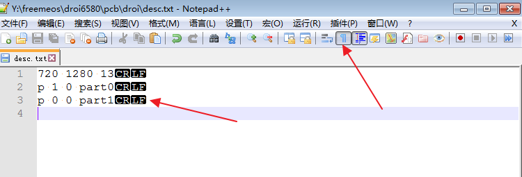
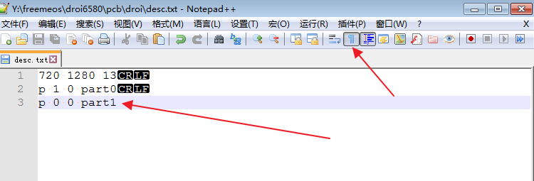

[TOC]

# 黑屏问题

## 现象

出现以下情况，即可判断为开机黑屏问题：

1. 首次开机，在出现开机向导（SetupWizard）之前，出现`2`到`5`秒左右的黑屏，然后开机向导界面出现。
2. 非首次开机，无论是否设置锁屏，启动动画结束之后，锁屏界面或者桌面出现前有一段事件黑屏

## 问题描述

相关bug #0009649，#0009668，#0006965

该bug属于Android7.0系统原生bug，Google未提供解决方案，MTK也未提供。这是我司自行修复的。

# 排查步骤

## 首次开机黑屏

### １.检查是否是CTS送测版本

`CTS`认证要求首次开机后，开机向导结束前必须是黑屏。打开CTS宏开关时黑屏为正常现象。

检查该版本是否是CTS送测版本，即是否`REEME_PRODUCT_FOR_CTS`宏开关设置为`yes`（位于droi/目录下项目的`ProjectConfig.mk`）。

### 2. 检查`SetupWizardCustom.apk`是否生成

前面提到黑屏是Android原生bug，原因就是开机向导的应用本身的实现将starting windows设置为不显示，而由于我们手机配置较低，真正的主窗口因为资源加载较慢导致显示时间过长，此时无窗口显示而出现黑屏。
我们的解决方法是使用Android的运行时资源覆盖机制，实现SetupWizardCustom.apk在运行时修改开机向导的部分窗口显示，使其透明显示壁纸，避免黑屏。

代码位于`vendor/partner_gms/apps/SetupWizardCustom`目录下。

检查该包是否正确生成，方法有两种：

- 手机检查，adb连接手机，进入`/system/vendor/overlay/`目录下，查看`SetupWizardCustom/SetupWizardCustom.apk`是否存在
- 如果存在代码环境，可进入`out/target/product/wf581_lg/system/vendor/overlay/`查看上述包是否存在；

必要时可以反编译该包与源代码对比，确认是否正确生成。

## 非首次开机黑屏

### 1. 检查开机动画包格式

开机动画包格式错误，会导致开机动画过早结束，而此时锁屏、桌面、开机向导等可能还未绘制完毕而出现黑屏。

开机动画包在手机上的路径为：`/system/media/bootanimation.zip`

```
adb pull /system/media/bootanimation.zip
```

解压该包中的`desc.txt`，检查该文件格式。Android代码要求该文件最后必须以换行符(`LF`，`ASCII`码为`0x0A`)结尾，该字符为不可见字符，请务必使用合适的编辑器检查：

- 使用`notepad++`，工具栏点击显示所有符号
- 使用`UltraEdit`，点击显示换行符
- 使用二进制编辑器打开该文件，检查最后一个字符是否为0x0A
- ubuntu命令行下可以使用`hd desc.txt`，或者`hexdump desc.txt`查看

部分效果图：

正确的desc.txt格式



错误的desc.txt格式



hd使用效果，以下是一个错误的`desc.txt`,最后一个字符是`31`，即数字`1`；而非`0A`

```
$ hd desc.txt
00000000  37 32 30 20 31 32 38 30  20 31 33 0d 0a 70 20 31  |720 1280 13..p 1|
00000010  20 30 20 70 61 72 74 30  0d 0a 70 20 30 20 30 20  | 0 part0..p 0 0 |
00000020  70 61 72 74 31                                    |part1|
00000025
```

### 2. 检查我们的修复提交是否合并该项目代码中

以80N平台为例子，修复黑屏相关提交为：

- http://10.20.40.17:8080/#/c/4872/
- http://10.20.40.17:8080/#/c/5123/
- http://10.20.40.17:8080/#/c/5078/

# 其他问题

如果上述检查后依然无法定位黑屏问题，可以联系FreemeOS组相关同事分析，以确认其他问题导致黑屏。