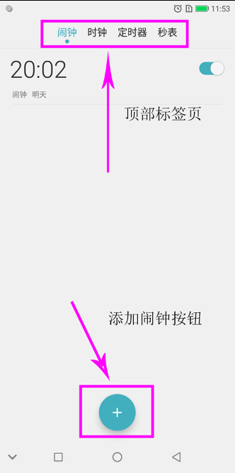
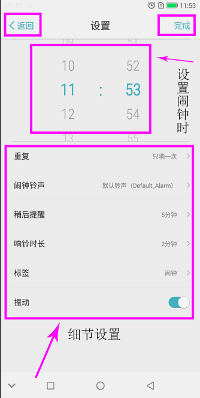
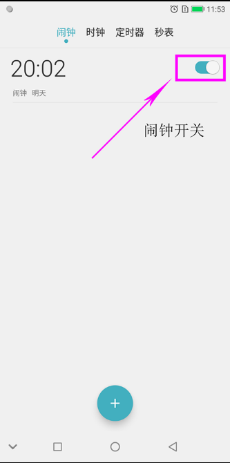
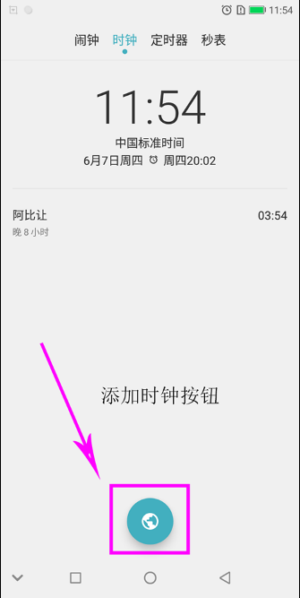
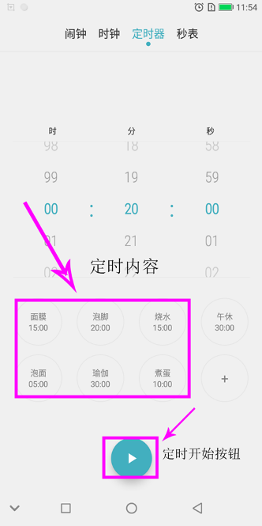
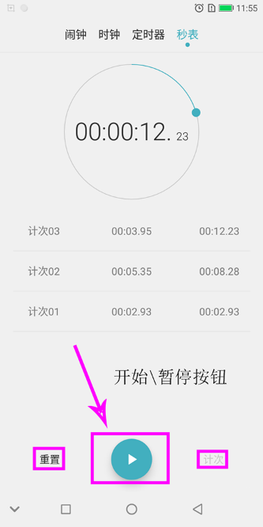

[TOC]

## 修改记录

| 版本 | 修改日期 | 作者 | 修改内容 |
| :---| ----------| ---- | ---- |
| v1.0 | 2018.06.07 | 李秋月 | 初版 |

## 1、时钟首页

#### a、点击顶部标签页：闹钟、时钟、定时器、秒表



四个 **tab** 相对应的 **fragment** 如下：

```
 闹钟：AlarmClockFragment.java
 时钟：ClockFragment.java
 定时器：TimerFragment.java
 秒表：StopwatchFragment.java
```


- 文件路径

vendor/freeme/packages/apps/FreemeDeskClock/src/com/android/deskclock/DeskClock.java

- 代码片段

```
    private final class TabChangeWatcher implements TabListener {
        @Override
        public void selectedTabChanged(UiDataModel.Tab oldSelectedTab,
                UiDataModel.Tab newSelectedTab) {
            // Update the view pager and tab layout to agree with the model.
            updateCurrentTab();

            ...

            if (DataModel.getDataModel().isApplicationInForeground()) {
                switch (newSelectedTab) {
                    case ALARMS:
                        Events.sendAlarmEvent(R.string.action_show, R.string.label_deskclock);
                        break;
                    case CLOCKS:
                        Events.sendClockEvent(R.string.action_show, R.string.label_deskclock);
                        break;
                    case TIMERS:
                        Events.sendTimerEvent(R.string.action_show, R.string.label_deskclock);
                        break;
                    case STOPWATCH:
                        Events.sendStopwatchEvent(R.string.action_show, R.string.label_deskclock);
                        break;
                }
            }

        }
    }
```

## 2、闹钟

#### a、添加闹钟按钮

- 文件路径

vendor/freeme/packages/apps/FreemeDeskClock/src/com/android/deskclock/AlarmClockFragment.java

- 代码片段

```
    @Override
    public void onFabClick(@NonNull ImageView fab) {
        mAlarmUpdateHandler.hideUndoBar();
        startCreatingAlarm();
    }

```



#### b、设置闹钟时间

- 文件路径

vendor/freeme/frameworks/base/core/java/com/freeme/widget/FreemeTimePicker.java

- 代码片段

```
    public interface OnTimeChangedListener {
        void onTimeChanged(FreemeTimePicker view, int hourOfDay, int minute);
    }
```

#### c、重复

- 文件路径

vendor/freeme/packages/apps/FreemeDeskClock/src/com/android/deskclock/settings/SetAlarm.java

- 代码片段

```
    @Override
    public void onClick(View v) {
        switch(v.getId()) {
            case R.id.alarm_repeat:
                Intent intent = new Intent(this, NewRepeat.class);
                int dayOfWeek = mTempSetAlarm.daysOfWeek.getBits();
                intent.putExtra("dayOfWeekInt", dayOfWeek);
                startActivityForResult(intent, RESULT_FOR_REPEAT);
                break;
        }

    ...

    }
```

#### d、闹钟铃声

- 文件路径

vendor/freeme/packages/apps/FreemeDeskClock/src/com/android/deskclock/settings/SetAlarm.java

- 代码片段

```
    @Override
    public void onClick(View v) {
        switch(v.getId()) {

        ...
            case R.id.alarm_ringtone:
                startActivityForResult(getRingtoneIntent(), RESULT_FOR_RINGTONE);
                break;
        ...
        }
    }
```

#### e、响铃时长

- 文件路径

vendor/freeme/packages/apps/FreemeDeskClock/src/com/android/deskclock/settings/SetAlarm.java

- 代码片段

```
    @Override
    public void onClick(View v) {
        switch(v.getId()) {
        ...
            case R.id.alarm_ringtone_duration:
                showDialogForID(RING_DURATION_DIALOG);
                break;
        ...
        }
    }


```

#### f、标签

- 文件路径

vendor/freeme/packages/apps/FreemeDeskClock/src/com/android/deskclock/settings/SetAlarm.java

- 代码片段

```
@Override
    public void onClick(View v) {
        switch(v.getId()) {
        ...
            case R.id.alarm_label:
                mEditAlarmLabel = new EditText(this);
                mEditAlarmLabel.setText(mAlarmLabelName.getText().toString());
                mEditAlarmLabel.setSelection(mAlarmLabelName.getText().length());
                showDialogForID(EDIT_LABEL_DIALOG);
                break;
        ...
        }
    }
```

#### g、振动开关

- 文件路径

vendor/freeme/packages/apps/FreemeDeskClock/src/com/android/deskclock/settings/SetAlarm.java

- 代码片段

```
@Override
    public void onClick(View v) {
        switch(v.getId()) {
        ...
            case R.id.vibrate:
                mTempSetAlarm.vibrate = mAlarmVirbrate.isChecked();
                break;
        ...
        }
    }
```

#### h、完成

- 文件路径

vendor/freeme/packages/apps/FreemeDeskClock/src/com/android/deskclock/settings/SetAlarm.java

- 代码片段

```
    @Override
    public boolean onOptionsItemSelected(MenuItem item) {
        switch (item.getItemId()) {
            case  R.id.save_alarm :
                AddOrUpdateAlarm();
                finish();
                break;
        ...
        }
        return true;
    }
```

#### i、返回

- 文件路径

vendor/freeme/packages/apps/FreemeDeskClock/src/com/android/deskclock/settings/SetAlarm.java

- 代码片段

```
    @Override
    public boolean onOptionsItemSelected(MenuItem item) {
        switch (item.getItemId()) {
        ...
            case android.R.id.home:
                onBackPressed();
                break;
        }
        return true;
    }
```



#### j、闹钟开关

- 文件路径

vendor/freeme/packages/apps/FreemeDeskClock/src/com/android/deskclock/alarms/dataadapter/AlarmItemViewHolder.java

- 代码片段

```
    onOff.setOnCheckedChangeListener(new CompoundButton.OnCheckedChangeListener() {
            @Override
            public void onCheckedChanged(CompoundButton compoundButton, boolean checked) {
                getItemHolder().getAlarmTimeClickHandler().setAlarmEnabled(
                        getItemHolder().item, checked);
            }
        });
```


## 3、时钟



#### a、添加时钟按钮

- 文件路径

vendor/freeme/packages/apps/FreemeDeskClock/src/com/android/deskclock/ClockFragment.java

- 代码片段

```
    @Override
    public void onFabClick(@NonNull ImageView fab) {
        startActivity(new Intent(getActivity(), CitySelectionActivity.class));
    }
```

## 4、定时器



#### a、定时内容

- 文件路径

vendor/freeme/packages/apps/FreemeDeskClock/src/com/android/deskclock/timer/FreemeTimerSetupView.java

- 代码片段

短按：

```
    @Override
    public void onItemClick(AdapterView<?> parent, View view, int position,
                            long id) {
        setFreemeNumpickerValue(position);
        view.setSelected(true);
        mGridSimpleAdapter.setSeletedPos(position);
        String lastItemTag = mGridSimpleAdapter.getSeletedItemLabel();
        setCreateImageStatus();
        if (position == mGridSimpleAdapter.getCount() - 1 && (lastItemTag.equals("+"))) {
            showAddGridItemDialog();
            return;
        }
    }
```

长按：

```
    @Override
    public boolean onItemLongClick(AdapterView<?> parent, View view, int
            position, long id) {
        int count = mGridSimpleAdapter.getCount();
        if((position == count- 1) && (count != GRID_ITEM_MAX_COUNT)) {
            reset();
            return true;
        }
        setFreemeNumpickerValue(position);
        view.setSelected(true);
        mGridSimpleAdapter.setSeletedPos(position);
        String mLabel = mGridSimpleAdapter.getSeletedItemLabel();
        String mTime = mGridSimpleAdapter.getSeletedItemTime();
        showDeleteConfirmDialog(mLabel, mTime, position);
        reset();
        return true;
    }
```

#### b、定时开始按钮

- 文件路径

vendor/freeme/packages/apps/FreemeDeskClock/src/com/android/deskclock/timer/TimerFragment.java

- 代码片段

```
@Override
    public void onFabClick(@NonNull ImageView fab) {

        ...
        } else if (mCurrentView == mCreateTimerView) {
            mCreatingTimer = true;
            try {
                // Create the new timer.
                final long timerLength = mCreateTimerView.getTimeInMillis();
                /*/freeme.liming
                final Timer timer = DataModel.getDataModel().addTimer(timerLength, "", false);
                /*/
                final Timer timer = DataModel.getDataModel().addTimer(timerLength, mCreateTimerView.getSeletedItemLabel(), false);
                //*/
                Events.sendTimerEvent(R.string.action_create, R.string.label_deskclock);

                // Start the new timer.
                DataModel.getDataModel().startTimer(timer);
                Events.sendTimerEvent(R.string.action_start, R.string.label_deskclock);

                // Display the freshly created timer view.
                mViewPager.setCurrentItem(0);
            } finally {
                mCreatingTimer = false;
            }
    }
```

## 5、秒表



#### a、秒表开始按钮

- 文件路径

vendor/freeme/packages/apps/FreemeDeskClock/src/com/android/deskclock/stopwatch/StopwatchFragment.java

- 代码片段

```
    @Override
    public void onFabClick(@NonNull ImageView fab) {
        toggleStopwatchState();
    }

    ...

    private void toggleStopwatchState() {
        if (getStopwatch().isRunning()) {
            doPause();
        } else {
            doStart(); //开始按钮
        }
    }
```

#### b、重置

- 文件路径

vendor/freeme/packages/apps/FreemeDeskClock/src/com/android/deskclock/stopwatch/StopwatchFragment.java

- 代码片段

```
    @Override
    public void onLeftButtonClick(@NonNull Button left) {
        doReset();
    }
```

#### c、计次

- 文件路径

vendor/freeme/packages/apps/FreemeDeskClock/src/com/android/deskclock/stopwatch/StopwatchFragment.java

- 代码片段

```
    @Override
    public void onRightButtonClick(@NonNull Button right) {
        switch (getStopwatch().getState()) {
            case RUNNING:
                doAddLap();
                break;
            case PAUSED:
                doShare();
                break;
        }
    }
```

#### d、暂停

- 文件路径

vendor/freeme/packages/apps/FreemeDeskClock/src/com/android/deskclock/stopwatch/StopwatchFragment.java

- 代码片段

```
    @Override
    public void onFabClick(@NonNull ImageView fab) {
        toggleStopwatchState();
    }

    ...

    private void toggleStopwatchState() {
        if (getStopwatch().isRunning()) {
            doPause(); //暂停
        } else {
            doStart();
        ...
    }
```


