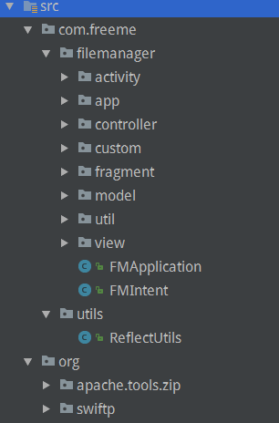
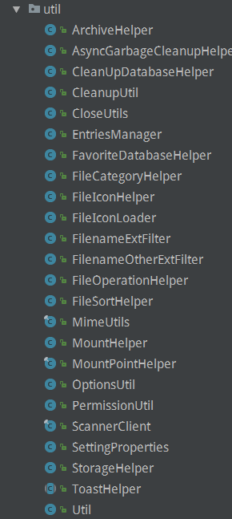
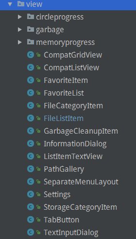
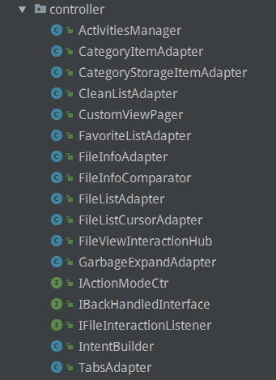
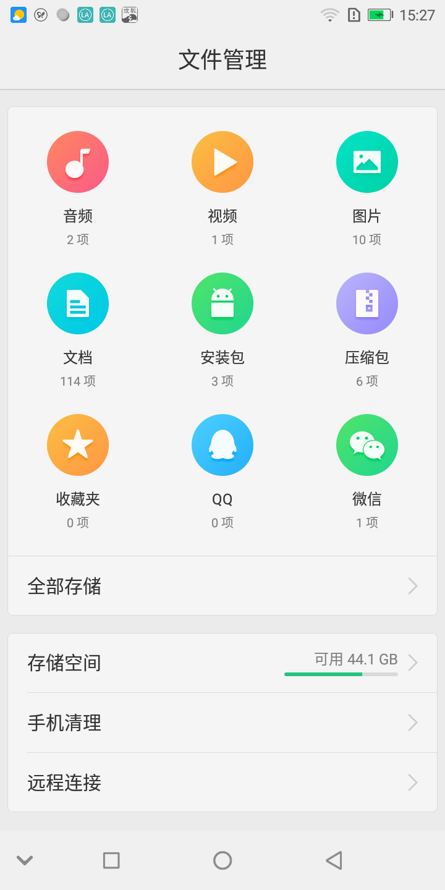
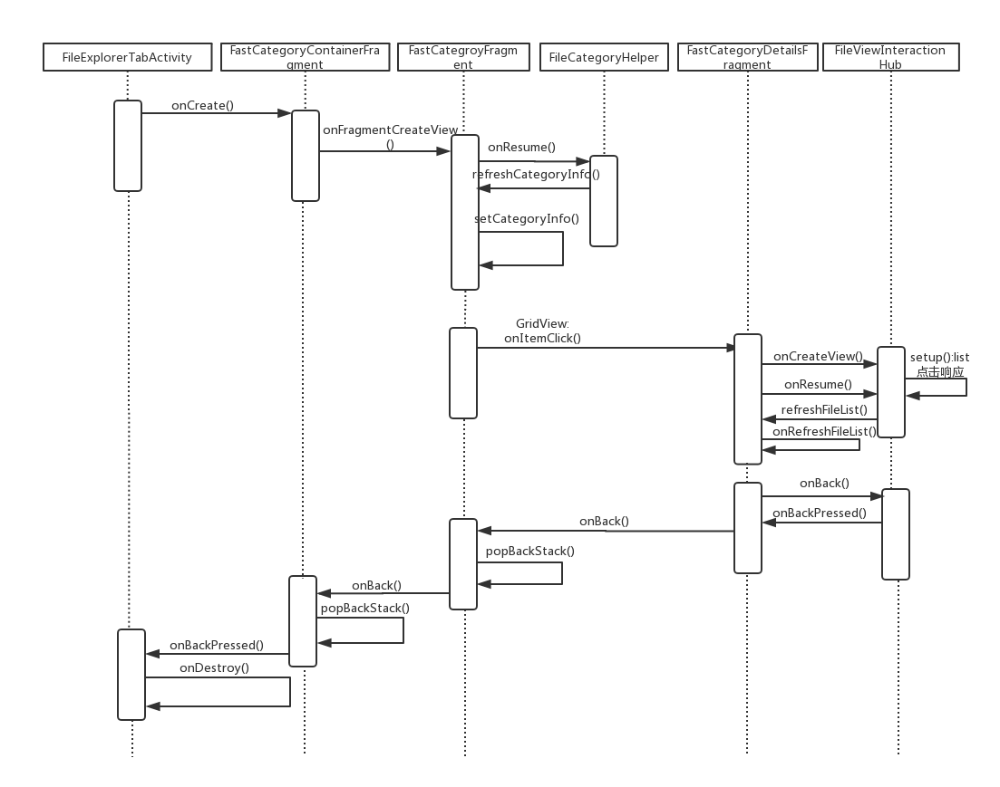
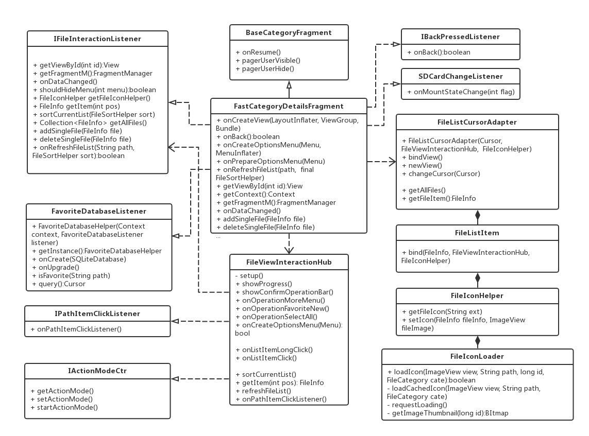

[TOC]

# 修改记录

| 版本 | 修改日期 | 作者 | 修改内容 |
| :---| ----------| ---- | ---- |
| v1.0 | 2018.07.06 | 龙雪芳 | 初版 |

# 一、架构模式简介

- MVC: Model-View-Controller, 经典模式。以 XML 布局为 V， Activity 或 Fragment 为 C， 数据实体为 M, 但是因为 XML 的局限性，所以其实我们还是需要在 Activity 或 Fragment 中对视图进行操作。
优点：开发迅速，结构易理解
缺点：View 也包含业务逻辑；界面业务逻辑多时，Controller 会变得很厚复杂，不方便维护。

- MVP: Model-View-Presenter, MVC 的演变模式, XML 配合 Activity 或 Fragment 为 V, 同时抽象出接口，界面相关业务抽离出来的 P 同时通过视图接口来更新 UI, 数据实体为 M, 将 View 和 Model 解耦。

- MVVM: Model-View-ViewModel, 是对 MVP 的一个优化模式，采用了双向绑定： View 的变动，自动反应在 ViewModel, 反之亦然。

**MVC, MVP 还是 MVVM？越高级的模式复杂性越高，实现起来也越难。文件管理立足于 MVC, 趋向 MVP 优化。**


# 二、文件管理包架构

文件管理项目架构:



从上面可以看出：架构分包，包括自实现和第三方开源库代码。自实现部分包括逻辑功能和通用功能。

## 第三方开源库代码

- 实现 zip 格式文件压缩解压开源库。
- 实现 ftp 远程连接 swiftp 开源库。

## 文件管理自实现部分

### 通用功能模块

#### util 包：




1. 工具类: Toast, 系统配置，文件类型获取，文件图标绘制，多媒体扫描等。
2. 权限管理：根据当前版本，设定请求的权限类型。
3. 数据库操作：针对应用自身的数据库操作，包括对预置数据库的操作。
4. 数据转换：单位转换，日期格式转换，挂载及文件信息转换。

#### view 包：



**view 包为自定义控件。**

1. RoundProgressBar: 圆形进度条部件
2. Memoryprogress: 自定义横向进度条
3. FilesListItem: listView 自定义 item
4. SeparateMenuLayout: 自定义popMenu

等等……

### 逻辑功能模块

#### controller 包：



1. 封装自己的 Application, BaseActivity 和 BaseFragment 类，最大可能的节省代码。
2. 视图实现分放于 activity 和 fragment 包。
3. listView, gridView, viewpager 等 adapter 处理统一放置于 controller 包中；同时，接口定义也放置在此包。

# 三、文件管理代码逻辑

## 文件管理样貌



文件管理首页分为 GridView 区域和 ListView 区域。

由于 ListView 区域目前需求显示条目数是固定的，为了优化应用打开速度，将其修改为线性布局直接加载。
GridView 的根据 position 将适配各自的 URI，适配情况如下：

```
switch (cat) {
    case Doc:
    case Apk:
    case Zip:
    case Other:
        uri = Files.getContentUri(volumeName);
        break;
    case Music:
        uri = Audio.Media.getContentUri(volumeName);
        break;
    case Video:
        uri = Video.Media.getContentUri(volumeName);
        break;
    case Picture:
        uri = Images.Media.getContentUri(volumeName);
        break;
```

其中，收藏夹是应用创建的 favorite 表来存储和读取对应的收藏内容；QQ，微信和全部存储通过扫描 path 获取数据。

## 文件管理时序图



从图上可看到 FileExplorerTabActivity 加载 Fragment，根据加载数据类型配置不同的 Fragment 和 adapter。

URI 适用 FastCategoryDetailsFragment 和 FastCategoryPictureDetailsFragment, 对应 CursorAdapter; path 适用 FastCategoryPathsDetailsFragment 和 FileExplorerViewFragment, 对应 ArrayAdapter<FileInfo>。

对于返回键的处理，和加载的顺序是相反的，优先处理 Fragment 内部的返回操作，例如 actionMode 退出、路径返回等；其次 fragment popBackStack(); 最后 activity 的返回退出响应。

```
@Override
public void onBackPressed() {
    IBackPressedListener backPressedListener = (IBackPressedListener) mBackHandedFragment;
    Log.v(TAG, "onBackPressed mHasSaveInstanceState = "+ mHasSaveInstanceState);
    if (mHasSaveInstanceState) {
        return;
    }
    if (!backPressedListener.onBack()) {
        getActionBar().setTitle(R.string.app_name);
        getActionBar().setDisplayHomeAsUpEnabled(false);
        super.onBackPressed();
    }
}
```

## 文件管理类图



以上类图以 FastCategoryDetailsFragment 为例绘制了类之间的关系，其他 fragment 相似。

fragment 通过 FileViewInteractionHub 实例将所有界面的操作，比如菜单功能、item 的长短按响应，进行统一处理，增加了代码的复用性；针对界面的差异性（例如 Menu 项不同），实例中带有一个 int 参数用以区分。

由于每个界面加载的数据是不相同的，所以通过在 Fragment 中重写 IFileInteractionListener 的 onRefreshFileList() 实现。ListView 适配器使用 CursorAdapter, item 部分信息直接从数据库中获取，对于 item 的图片显示，部分文件类型可以通过后缀名识别设置，缩略图功能则在 FileIconLoader 通过 cursor 中的原图转换得到, 目前使用的是系统原生 Thumbnails.getThumbnail 获取。

## 手机清理

手机清理在代码框架上沿用了文件管理，在此简单概述下不同之处。在首页新增 ViewPager 分页加载两个 fragment, SuggestFragment 使用 ExpandListView, DeepCleanFragment 中的详细列表仍然使用的是 FileListItem 用于加载显示项目，FileViewInteractionHub 用于项目的点击交互等操作处理。
