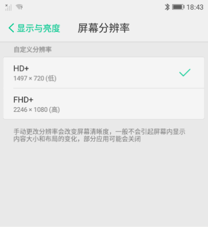

[TOC]

# 一、修改记录

| 版本 | 修改日期 | 作者 | 修改内容 |
| :----| ----------| ---- | ---- |
| v1.0 | 2018.07.26 | 王磊 | 初版 |


# 二、前言


1、华为: ROG 技术是一项华为为高端旗舰机型设计的一项即有省电延长待机功能的技术，用最简单的话来总结就是 1080p 分辨率的屏幕开启ROG技术后就会转变成 720p 分辨率，从屏幕上来达到省电技术。


2、三星： 高分辨率自然能带来更清晰的视觉体验，但是对处理器性能以及电池续航也带来一定的负担。现在手机屏幕一般都是 5 英寸到 7 英寸之间，而人眼对 300PPI 以上的图像就基本看不出颗粒感，使用 2K 甚至 4K 分辨率的屏幕难免让人感觉有些“大材小用”。三星 s7 安卓 7.0 系统引入了新功能，在省电模式中，用户可以自行更改屏幕分辨率。


# 三、功能实现

## 1、相关介绍
a、

| 简写 | 分辨率 | 名称 |
| :----| ----------| ---- | ---- |
| FWVGA | 854*480 | Full Wide VGA |
| qHD | 960*540 | 四分之一的全高清分辨率 |
| HD | 1280*720 | 高清 |
| FHD | 1920*1080 | 全高清 |
| WQHD | 2560X1440 | 2k |

HD+（1520*720）、FHD+(2280 *1080)、WQHD+ 这种基本都是在原有的规格基础上衍生出来的，反正目的就是让消费者看上去更高级一点。


b、下面图片可对比看下，不同分辨率下效果


## 2、自定义分辨率

### a、界面效果




### b、代码

1、在设置中，当选择要切换的屏幕分辨率后，会执行如下方法

```
private void changeResolutionMode(int mode) {
    // 更新数据库
    Settings.System.putInt(mContext.getContentResolver(),
            FreemeSettings.System.FREEME_APS_DISPLAY_RESOLUTION, mode);
    // 计算切换后的屏幕尺寸
    Point point = getTargetPoint(mode);
    // 计算切换后的屏像素幕密度
    int density = getToROGDensity(point);
    if (density >= 0) {
        // 将新的屏幕尺寸和屏幕像素密度传给 WMS 去处理
        changeScreenMode(point.x, point.y, density);
    }
}

```
2、具体实现

```
private Point getTargetPoint(int mode) {
    int targetHeight = 0;
    int targetWidth = 0;
    if (mode == APS_DISPLAY_RESOLUTION_WQHD) {
        targetWidth = 1440;
        targetHeight = (mRealScreenSize.y * 1440) / mRealScreenSize.x;
    } else if (mode == APS_DISPLAY_RESOLUTION_FHD) {
        targetWidth = 1080;
        targetHeight = (mRealScreenSize.y * 1080) / mRealScreenSize.x;
    } else if (mode == APS_DISPLAY_RESOLUTION_HD) {
        targetWidth = 720;
        targetHeight = (mRealScreenSize.y * 720) / mRealScreenSize.x;
    }
    return new Point(targetWidth, targetHeight);
}

private int getToROGDensity(Point point) {
    int realdpi = SystemProperties.getInt("ro.sf.lcd_density", 480);
    int targetWidth = point.x;
    int realScreenWidth = mRealScreenSize.x;
    if (targetWidth > realScreenWidth) {
        return -1;
    }
    int defaultRogdpi = (realdpi * targetWidth) / realScreenWidth;
    return defaultRogdpi;
}

private void changeScreenMode(int width, int height, int density) {
    try {
        mIWm.setForcedDisplayDensityAndSizeForUser(0, density, width, height, UserHandle.USER_CURRENT);
    } catch (RemoteException e) {
    }
}
```

3、WMS 中的核心代码

```
@Override
public void setForcedDisplayDensityAndSizeForUser(int displayId, int density,
                                                  int width, int height, int userId) {
    if (mContext.checkCallingOrSelfPermission(
            android.Manifest.permission.WRITE_SECURE_SETTINGS) !=
            PackageManager.PERMISSION_GRANTED) {
        throw new SecurityException("Must hold permission " +
                android.Manifest.permission.WRITE_SECURE_SETTINGS);
    }
    if (displayId != DEFAULT_DISPLAY) {
        throw new IllegalArgumentException("Can only set the default display");
    }

    // 在切换分辨率前 去冻结屏幕
    freezeScreen();
    final int targetUserId = ActivityManager.handleIncomingUser(Binder.getCallingPid(),
            Binder.getCallingUid(), userId, false,
            true, "setForcedDisplayDensityAndSizeForUser",
            null);
    long ident = Binder.clearCallingIdentity();
    try {
        synchronized (mWindowMap) {
            final int MIN_WIDTH = 200;
            final int MIN_HEIGHT = 200;
            final int MAX_SCALE = 2;
            // DisplayContent 会根据窗口的位置显示出窗口
            DisplayContent displayContent = mRoot.getDisplayContentOrCreate(displayId);
            if (displayContent != null) {
                width = Math.min(Math.max(width, MIN_WIDTH),
                        displayContent.mInitialDisplayWidth * MAX_SCALE);
                height = Math.min(Math.max(height, MIN_HEIGHT),
                        displayContent.mInitialDisplayHeight * MAX_SCALE);
                // 将新的屏幕尺寸和屏幕像素密度赋值给 DisplayContent
                displayContent.mBaseDisplayWidth = width;
                displayContent.mBaseDisplayHeight = height;
                displayContent.mBaseDisplayDensity = density;
                // 在这里延迟 1s 为了切换分辨后去解冻屏幕
                mH.removeMessages(H.UNFREEZE_SCREEN);
                mH.sendEmptyMessageDelayed(H.UNFREEZE_SCREEN, 1000);
                displayContent.updateBaseDisplayMetrics(width,
                        height, displayContent.mBaseDisplayDensity);
                reconfigureDisplayLocked(displayContent);
                // 存储新的屏幕尺寸和屏幕像素密度
                Settings.Global.putString(mContext.getContentResolver(),
                        Settings.Global.DISPLAY_SIZE_FORCED, width + "," + height);
                Settings.Secure.putStringForUser(mContext.getContentResolver(),
                        Settings.Secure.DISPLAY_DENSITY_FORCED,
                        Integer.toString(density), targetUserId);

                Settings.System.putInt(mContext.getContentResolver(),
                        FreemeSettings.System.FREEME_APS_ROG_DPI, density);
                Settings.System.putInt(mContext.getContentResolver(),
                        FreemeSettings.System.FREEME_APS_ROG_WIDTH, width);
                Settings.System.putInt(mContext.getContentResolver(),
                        FreemeSettings.System.FREEME_APS_ROG_HEIGHT, height);
            }
        }
    } finally {
        Binder.restoreCallingIdentity(ident);
    }
}
```

4、冻结屏幕，为了避免在切换分辨率时，屏幕出现闪烁等异常现象

```
public void freezeScreen() {
    try {
        IBinder surfaceFlinger = ServiceManager.getService("SurfaceFlinger");
        mIsFreezingScreen = true;
        if (surfaceFlinger != null) {
            Parcel data = Parcel.obtain();
            data.writeInterfaceToken("android.ui.ISurfaceComposer");
            data.writeInt(1);
            surfaceFlinger.transact(1025,data, null, 0);
            data.recycle();
        }
    } catch (RemoteException ex) {
        Log.e(TAG, "zcd startFreezingScreen: SurfaceFlinger is dead!");
    }
}
```

5、解冻屏幕，切换分辨率后解冻屏幕，使屏幕显示恢复正常

```
public void unfreezeScreen() {
    try {
        IBinder surfaceFlinger = ServiceManager.getService("SurfaceFlinger");
        if (surfaceFlinger != null) {
            Parcel data = Parcel.obtain();
            final Parcel reply = Parcel.obtain();
            data.writeInterfaceToken("android.ui.ISurfaceComposer");
            data.writeInt(0);
            surfaceFlinger.transact(1025,data, null, 0);
            mIsFreezingScreen = reply.readBoolean();
            data.recycle();
        }
    } catch (RemoteException ex) {
        Log.e(TAG, "zcd unfreezingScreen: SurfaceFlinger is dead!");
    }
}
```


## 3、智能分辨率

### a、待续......


# 四、调研友商实现

## 1、华为实现方案

### a、策略

1. 支持切换屏幕分辨率条件：
	- aps 宏开启 
	- 平台支持 
	- 屏幕分辨率是 FHD 或者 WQHD

2. 独立维护 HwAps app, 开机会自启动，并在后台启动一个 service

3. HwAps 中，首次开机会写入相关设置值，如：默认几种自定义分辨率、默认分辨率；默认是否开启智能分辨率

### b、代码

1、其核心代码在 HwWindowManagerService.java 中

```
public void setForcedDisplayDensityAndSize(int displayId, int density, int width, int height) {
    super.setForcedDisplayDensityAndSize(displayId, density, width, height);
    Slog.d(TAG, "setForcedDisplayDensityAndSize size: " + width + "x" + height);
    Slog.d(TAG, "setForcedDisplayDensityAndSize density: " + density);
    if (this.mContext.checkCallingOrSelfPermission("android.permission.WRITE_SECURE_SETTINGS") != 0) {
        throw new SecurityException("Must hold permission android.permission.WRITE_SECURE_SETTINGS");
    } else if (displayId != 0) {
        throw new IllegalArgumentException("Can only set the default display");
    } else {
        long ident = Binder.clearCallingIdentity();
        try {
            synchronized (this.mWindowMap) {
                DisplayContent displayContent = this.mRoot.getDisplayContentOrCreate(displayId);
                if (displayContent != null) {
                    width = Math.min(Math.max(width, 200), displayContent.mInitialDisplayWidth * 2);
                    height = Math.min(Math.max(height, 200), displayContent.mInitialDisplayHeight * 2);
                    displayContent.mBaseDisplayWidth = width;
                    displayContent.mBaseDisplayHeight = height;
                    displayContent.mBaseDisplayDensity = density;
                    this.mHwHandler.removeMessages(100);
                    this.mHwHandler.sendEmptyMessageDelayed(100, MSG_ROG_FREEZE_TIME_DELEAYED);
                    updateResourceConfiguration(displayId, density, width, height);
                    reconfigureDisplayLocked(displayContent);
                    ScreenRotationAnimation screenRotationAnimation = this.mAnimator.getScreenRotationAnimationLocked(displayId);
                    if (screenRotationAnimation != null) {
                        screenRotationAnimation.kill();
                    }
                    Global.putString(this.mContext.getContentResolver(), "display_size_forced", width + SmartcareProc.FIELED_SEPRATOR + height);
                    List<UserInfo> userList = UserManager.get(this.mContext).getUsers();
                    if (userList != null) {
                        for (int i = 0; i < userList.size(); i++) {
                            Secure.putStringForUser(this.mContext.getContentResolver(), "display_density_forced", Integer.toString(density), ((UserInfo) userList.get(i)).id);
                        }
                    }
                    SystemProperties.set("persist.sys.realdpi", density + "");
                    SystemProperties.set("persist.sys.rog.width", width + "");
                    SystemProperties.set("persist.sys.rog.height", height + "");
                }
            }
            Binder.restoreCallingIdentity(ident);
        } catch (Throwable th) {
            Binder.restoreCallingIdentity(ident);
        }
    }
}
```


## 2、三星显示方案

a、其核心代码在 SamsungWindowManagerService.java 中

```
public void setForcedDisplaySizeDensity(int displayId, int width, int height, int density, boolean bDefault) {
    if (this.mContext.checkCallingOrSelfPermission("android.permission.WRITE_SECURE_SETTINGS") != 0) {
        throw new SecurityException("Must hold permission android.permission.WRITE_SECURE_SETTINGS");
    } else if (displayId != 0 || checkSizeDensity(width, height, density)) {
        throw new IllegalArgumentException("input illegalArgument");
    } else {
        Slog.d(TAG, "setForcedDisplaySizeDensity w=" + width + " h=" + height + " density=" + density + " default=" + bDefault);
        try {
            this.mLastChangedDisplaySize = this.mService.mActivityManager.getPackageFromAppProcesses(Binder.getCallingPid());
            this.mLastChangedDisplaySize += " " + width + "x" + height + " " + density;
        } catch (RemoteException e) {
        }
        long ident = Binder.clearCallingIdentity();
        try {
            synchronized (this.mService.mWindowMap) {
                DisplayContent displayContent = this.mService.getDisplayContentLocked(displayId);
                if (displayContent != null) {
                    width = Math.min(Math.max(width, 200), displayContent.mInitialDisplayWidth * 2);
                    height = Math.min(Math.max(height, 200), displayContent.mInitialDisplayHeight * 2);
                    int prevDensity = displayContent.mBaseDisplayDensity;
                    displayContent.mPrevDisplayWidth = displayContent.mBaseDisplayWidth;
                    displayContent.mPrevDisplayHeight = displayContent.mBaseDisplayHeight;
                    displayContent.mBaseDisplayWidth = width;
                    displayContent.mBaseDisplayHeight = height;
                    displayContent.mBaseDisplayDensity = density;
                    displayContent.mBaseDisplayRect.set(0, 0, displayContent.mBaseDisplayWidth, displayContent.mBaseDisplayHeight);
                    WindowList windows = displayContent.getWindowList();
                    if (windows != null) {
                        for (int i = windows.size() - 1; i >= 0; i--) {
                            WindowState w = (WindowState) windows.get(i);
                            if (w.mHasSurface && w.mAppToken != null) {
                                if (WindowManagerDebugConfig.DEBUG_ORIENTATION) {
                                    Slog.v(TAG, "set mOrientationChanging of " + w);
                                }
                                w.mOrientationChanging = DEBUG;
                            }
                        }
                    }
                    this.mService.mWindowPlacerLocked.mOrientationChangeComplete = false;
                    this.mService.reconfigureDisplayLocked(displayContent);
                    if (!isDesktopModeChangePending()) {
                        Global.putString(this.mContext.getContentResolver(), "display_size_forced", width + "," + height);
                        Secure.putStringForUser(this.mContext.getContentResolver(), "display_density_forced", Integer.toString(density), 0);
                        if (bDefault) {
                            Secure.putStringForUser(this.mContext.getContentResolver(), "default_display_size_forced", width + "," + height, 0);
                            Secure.putStringForUser(this.mContext.getContentResolver(), "default_display_density_forced", Integer.toString(density), 0);
                        } else {
                            if (displayContent.mPrevDisplayWidth == displayContent.mBaseDisplayWidth && displayContent.mPrevDisplayHeight == displayContent.mBaseDisplayHeight) {
                                String densityStr = Secure.getStringForUser(this.mContext.getContentResolver(), "default_display_density_forced", 0);
                                if (densityStr != null && densityStr.length() > 0) {
                                    int i2 = 0;
                                    try {
                                        i2 = Integer.parseInt(densityStr);
                                        Slog.i(TAG, "previous default density : " + i2);
                                    } catch (NumberFormatException e2) {
                                    }
                                    if (i2 != 0) {
                                        i2 = (int) (((float) i2) * (((float) density) / ((float) prevDensity)));
                                        Slog.i(TAG, "current default density : " + i2);
                                        Secure.putStringForUser(this.mContext.getContentResolver(), "default_display_density_forced", Integer.toString(i2), 0);
                                    }
                                }
                            }
                        }
                    }
                    SystemProperties.set("persist.sys.display_density", Integer.toString((int) (((float) displayContent.mInitialDisplayDensity) * (((float) Math.min(displayContent.mBaseDisplayWidth, displayContent.mBaseDisplayHeight)) / ((float) Math.min(displayContent.mInitialDisplayWidth, displayContent.mInitialDisplayHeight))))));
                }
            }
            Binder.restoreCallingIdentity(ident);
        } catch (Throwable th) {
            Binder.restoreCallingIdentity(ident);
        }
    }
}
```

# 五、参考资料
1. [ANDROID: 设置显示窗口的SIZE和DENSITY](https://blog.csdn.net/lintao8613/article/details/79233485/)
2. [三星s7安卓7.0系统引入新功能，屏幕分辨率还能自行调节？](http://android.poppur.com/Samsung/galaxy-s7-1080p.html)
3. [关于华为ROG技术科普，不懂得小白们戳进来吧！](https://club.huawei.com/thread-1471737-1-1.html)
4. [华为EMUI 8.0/5.0对比：系统优化对续航提升有帮助](https://new.qq.com/omn/20171221/20171221A006CF.html)
