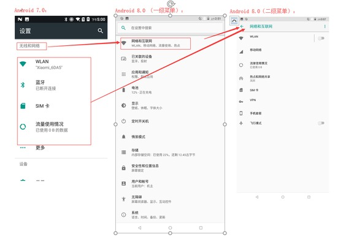
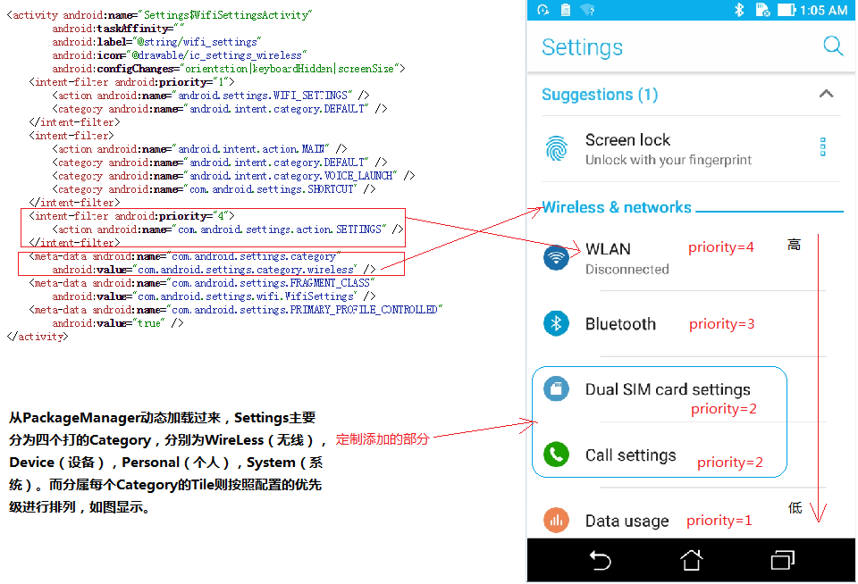
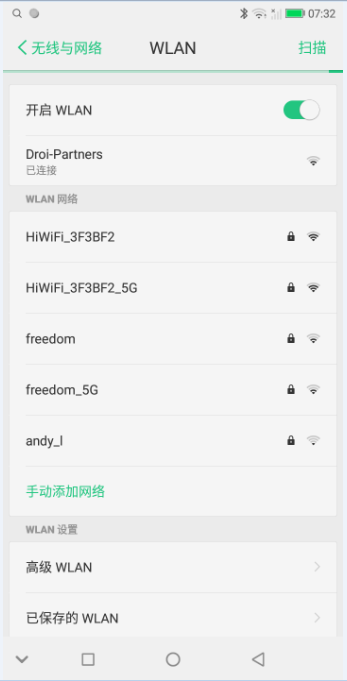
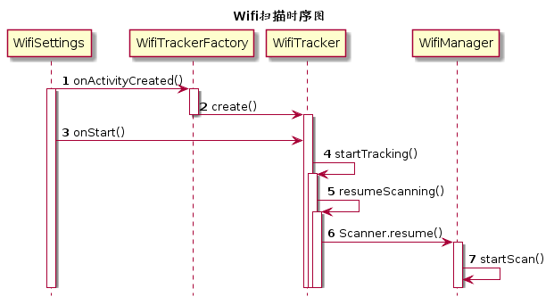

[TOC]

## 修改记录
| 版本 | 修改日期 | 作者 | 修改内容 |
| :---| ----------| ---- | ---- |
| v1.0 | 2018.06.05 | 王磊 | 初版 |
| v2.0 | 2018.06.15 | 王磊 | 更新 |

## 概要
从本次分享中，你能知道些什么？

- 设置相关介绍
- wifi扫描设置实现
- wifi列表加载
- wifi扫描机制


## 正文

### 设置介绍
O版本的设置界面相对于N有了一些变化，去掉了7.0上新加的侧滑菜单，O上面增加了顶级类别的菜单，之前一级菜单的部分菜单选项则移动到了二级界面里面。
如图：



1、 设置一级菜单是如何加载的？

在设置里的 AndroidManifest.xml 添加

```
<activity android:name="Settings$SimSettingsActivity"
        android:label="@string/sim_settings_title"
        android:icon="@drawable/ic_settings_sim"
        android:configChanges="orientation|screenSize|smallestScreenSize|screenLayout|keyboardHidden|mcc|mnc"
        android:taskAffinity="">
    <intent-filter android:priority="1">
        <action android:name="com.android.settings.sim.SIM_SUB_INFO_SETTINGS" />
        <category android:name="android.intent.category.DEFAULT" />
    </intent-filter>
    <intent-filter>
        <action android:name="android.intent.action.MAIN" />
        <category android:name="android.intent.category.DEFAULT" />
    </intent-filter>
    <intent-filter android:priority="2">
        <action android:name="com.android.settings.action.SETTINGS" />
    </intent-filter>
    <meta-data android:name="com.android.settings.category"
        android:value="com.android.settings.category.ia.wireless" />
    <meta-data android:name="com.android.settings.FRAGMENT_CLASS"
        android:value="com.android.settings.sim.SimSettings" />
</activity>
```

如图：


TileUtils.java：一二级界面动态加载的工具类

2、 添加第三方apk到Settings选项中？

在三方 apk 的 AndroidManifest.xml 中添加 


```
<activity
    android:name=".view.RunningBoosterMainActivity"
    android:configChanges="orientation|keyboardHidden|screenSize|mcc|mnc|navigation"
    android:label="@string/app_name"
    android:launchMode="singleTask">
    <intent-filter>
        <action android:name="android.intent.action.MAIN" />
        <action android:name="com.mediatek.runningboosterapp_ENTRANCE" />
        <category android:name="android.intent.category.DEFAULT" />
        <category android:name="android.intent.category.INFO" />
    </intent-filter>
    <intent-filter android:priority="5">
        <action android:name="com.android.settings.action.EXTRA_SETTINGS" />
    </intent-filter>

    //主要由此 meta-data 指定 item 显示在一级菜单界面
    <meta-data
        android:name="com.android.settings.category"
        android:value="com.android.settings.category.ia.homepage" />
    <meta-data
        android:name="com.android.settings.icon"
        android:resource="@drawable/ic_settings_rb" />
    <meta-data
        android:name="com.mediatek.settings.summary"
        android:value="com.mediatek.duraspeed.view.RbSummaryProvider" />
</activity>
```

二级菜单项也可以通过如下不同的 category ，在三方的清单配置文件里，配置相应的 meta-data 的 value 值进行过滤。

```
public final class CategoryKey {

    //控制显示在一级菜单界面
    public static final String CATEGORY_HOMEPAGE = "com.android.settings.category.ia.homepage";

    //控制显示在不同的二级界面，如：无线与网路（com.android.settings.category.ia.wireless）
    public static final String CATEGORY_NETWORK = "com.android.settings.category.ia.wireless";
    public static final String CATEGORY_DEVICE = "com.android.settings.category.ia.device";
    public static final String CATEGORY_APPS = "com.android.settings.category.ia.apps";
    public static final String CATEGORY_APPS_DEFAULT =
            "com.android.settings.category.ia.apps.default";
    public static final String CATEGORY_BATTERY = "com.android.settings.category.ia.battery";
    public static final String CATEGORY_DISPLAY = "com.android.settings.category.ia.display";
    public static final String CATEGORY_SOUND = "com.android.settings.category.ia.sound";
    public static final String CATEGORY_STORAGE = "com.android.settings.category.ia.storage";
    public static final String CATEGORY_SECURITY = "com.android.settings.category.ia.security";
    public static final String CATEGORY_SECURITY_LOCKSCREEN =
            "com.android.settings.category.ia.lockscreen";
    public static final String CATEGORY_ACCOUNT = "com.android.settings.category.ia.accounts";
    public static final String CATEGORY_ACCOUNT_DETAIL =
            "com.android.settings.category.ia.account_detail";
    public static final String CATEGORY_SYSTEM = "com.android.settings.category.ia.system";
    public static final String CATEGORY_SYSTEM_LANGUAGE =
            "com.android.settings.category.ia.language";
    public static final String CATEGORY_SYSTEM_DEVELOPMENT =
            "com.android.settings.category.ia.development";
    public static final String CATEGORY_NOTIFICATIONS =
            "com.android.settings.category.ia.notifications";

}
```

3、 如何快速定位到你需要找的设置界面？

SettingsActivity.java

对 initialFragmentName 进行 log 值打印，得到当前的 fragment 名称。

```
void launchSettingFragment(String initialFragmentName, boolean isSubSettings, Intent intent) {
    if (!mIsShowingDashboard && initialFragmentName != null) {
        // UP will be shown only if it is a sub settings
        if (mIsShortcut) {
            mDisplayHomeAsUpEnabled = isSubSettings;
        } else if (isSubSettings) {
            mDisplayHomeAsUpEnabled = true;
        } else {
            mDisplayHomeAsUpEnabled = false;
        }
        setTitleFromIntent(intent);

        Bundle initialArguments = intent.getBundleExtra(EXTRA_SHOW_FRAGMENT_ARGUMENTS);
        switchToFragment(initialFragmentName, initialArguments, true, false,
            mInitialTitleResId, mInitialTitle, false);
    } else {
        // Show search icon as up affordance if we are displaying the main Dashboard
        mDisplayHomeAsUpEnabled = true;
        mInitialTitleResId = R.string.dashboard_title;

        switchToFragment(DashboardSummary.class.getName(), null /* args */, false, false,
            mInitialTitleResId, mInitialTitle, false);
    }
}
```

### Wifi 设置界面
Wifi 设置界面的代码实现是在 WifiSettings.java 中，从布局中看到，界面主要包括Wifi开关，已连接Wifi列表，扫描到的Wifi列表以及Wifi设置
如图


布局实现在freeme_wifi_settings.xml

```
private void addPreferences() {
    /*/ freeme.wanglei, 20180227. redesign wifi settings
    addPreferencesFromResource(R.xml.wifi_settings);
    /*/
    addPreferencesFromResource(R.xml.freeme_wifi_settings);
    //*/
}
```

具体实现如下

```
<?xml version="1.0" encoding="utf-8"?>
<PreferenceScreen
        xmlns:android="http://schemas.android.com/apk/res/android"
        xmlns:settings="http://schemas.android.com/apk/res/com.android.settings"
        android:title="@string/wifi_settings"
        settings:keywords="@string/keywords_wifi">

    <PreferenceCategory android:key="connected_access_point">
        <SwitchPreference
            android:key="freeme_open_wifi"
            android:title="@string/freeme_open_wifi_title" />
    </PreferenceCategory>

    <PreferenceCategory android:key="access_points"
        android:title="@string/freeme_wifi_networks"/>

    <PreferenceCategory android:key="additional_settings"
        android:title="@string/freeme_wifi_settings" >
        <FreemeJumpPreference
                android:key="configure_settings"
                android:title="@string/freeme_wifi_configure_settings_preference_title"
                android:fragment="com.android.settings.wifi.ConfigureWifiSettings" />

        <FreemeJumpPreference
                android:key="saved_networks"
                android:title="@string/freeme_wifi_saved_access_points_label"
                android:fragment="com.android.settings.wifi.SavedAccessPointsWifiSettings" />
    </PreferenceCategory>

    <PreferenceCategory/>
</PreferenceScreen>
```

### Wifi扫描
在OnActivityCreate() 函数中首先创建了 WifiTracker 对象，经过分析发现这个类负责启动扫描附近可用的 wifi； 在 WifiTracker 的构造方法中定义了所有接收广播的 action，但这里还没有真正的注册广播接收者。


```
@Override
public void onActivityCreated(Bundle savedInstanceState) {
    super.onActivityCreated(savedInstanceState);

    //创建wifitracker对象
    mWifiTracker = WifiTrackerFactory.create(
            getActivity(), this, mBgThread.getLooper(), true, true, false);
    //获取wifi管理器，管理wifi的开启、关闭、扫描、建立连接、配置等信息
    mWifiManager = mWifiTracker.getManager();

    ......
}

WifiTracker(Context context, WifiListener wifiListener, Looper workerLooper,
    boolean includeSaved, boolean includeScans, boolean includePasspoints,
    WifiManager wifiManager, ConnectivityManager connectivityManager,
    NetworkScoreManager networkScoreManager, Looper currentLooper) {

    ......
    
    mFilter = new IntentFilter();
    //wifi状态改变(wifi打开、关闭等改变时会发送广播)
    mFilter.addAction(WifiManager.WIFI_STATE_CHANGED_ACTION);
    //扫描结束时发送的广播
    mFilter.addAction(WifiManager.SCAN_RESULTS_AVAILABLE_ACTION);
    //网络ID改变
    mFilter.addAction(WifiManager.NETWORK_IDS_CHANGED_ACTION);
    //正在连接的状态改变，比如添加删除网络
    mFilter.addAction(WifiManager.SUPPLICANT_STATE_CHANGED_ACTION);
    //网络配置改变
    mFilter.addAction(WifiManager.CONFIGURED_NETWORKS_CHANGED_ACTION);
    //链接配置改变
    mFilter.addAction(WifiManager.LINK_CONFIGURATION_CHANGED_ACTION);
    //网络状态改变
    mFilter.addAction(WifiManager.NETWORK_STATE_CHANGED_ACTION);
    //Received Signal Strength 
    //信号强度改变
    mFilter.addAction(WifiManager.RSSI_CHANGED_ACTION);

    ......
}
```

WifiEnabler.java 这个类是负责 wifi 开关的设置，监听wifi的状态，及时更新UI。

状态如下：

- 打开
- 正在打开
- 正在关闭
- 关闭


```
@Override
public void onStart() {
    super.onStart();

    // 创建WifiEnabler对象
    mWifiEnabler = createWifiEnabler();

    mWifiTracker.startTracking();

    ......
}
    
private WifiEnabler createWifiEnabler() {
    ......

    return new WifiEnabler(activity, new SwitchController(mOpenWifi),
            mMetricsFeatureProvider);
    }
```

在onStart()函数中wifi开关已经初始化好了，界面也按照wifi的状态显示了，那么可以开始根据wifi的开关状态来决定是否启动wifi扫描附近可用的热点。通过调用WifiTracker.java的startTracking()函数。

```
public void startTracking() {

    synchronized (mLock) {
        ......

        resumeScanning();
        if (!mRegistered) {
            //开始注册广播接收者
            mContext.registerReceiver(mReceiver, mFilter);
            ......
        }
    }
}

public void resumeScanning() {
    ......

    //清空扫描结果缓存的集合、接入点地址集合、id
    mWorkHandler.sendEmptyMessage(WorkHandler.MSG_RESUME);
    //判断wifi是否打开
    if (mWifiManager.isWifiEnabled()) {
        //wifi开关打开则开始扫描附近可用wifi
        mScanner.resume();
    }
}
```

实现扫描 wifi 的动作， 则是调用 WifiManager 里的 startScan() 方法。

```
@Override
public void handleMessage(Message message) {
    if (message.what != MSG_SCAN) return;
    if (mWifiManager.startScan()) {
        mRetry = 0;
    } else if (++mRetry >= 3) {//如果扫描次数操过三次，提示扫描失败，停止扫描
        mRetry = 0;
        if (mContext != null) {
            Toast.makeText(mContext, R.string.wifi_fail_to_scan, Toast.LENGTH_LONG).show();
        }
        return;
    }
    //每隔10秒，发起扫描的操作
    sendEmptyMessageDelayed(MSG_SCAN, WIFI_RESCAN_INTERVAL_MS);
}
```
如图：


### Wifi列表加载

在 WifiTracker.java 中， mContext.registerReceiver(mReceiver,mFilter)；注册广播接收者，去接收 wifi 相关状态改变的广播。

WorkHandler.MSG_UPDATE_ACCESS_POINTS：扫描到可用wifi后就更新接入点，把扫描到的接入点缓存到列表中

```
final BroadcastReceiver mReceiver = new BroadcastReceiver() {
    @Override
    public void onReceive(Context context, Intent intent) {
        String action = intent.getAction();

        //wifi状态改变时更新wifi状态
        if (WifiManager.WIFI_STATE_CHANGED_ACTION.equals(action)) {
            updateWifiState(intent.getIntExtra(WifiManager.EXTRA_WIFI_STATE,
                    WifiManager.WIFI_STATE_UNKNOWN));
        } 
        //扫描结果、网络配置(当WiFi列表中的网络添加、更新或者删除)、连接参数发生变化时，更新接入点列表。
        else if (WifiManager.SCAN_RESULTS_AVAILABLE_ACTION.equals(action)) {
            mWorkHandler
                    .obtainMessage(
                        WorkHandler.MSG_UPDATE_ACCESS_POINTS,
                        WorkHandler.CLEAR_STALE_SCAN_RESULTS,
                        0)
                    .sendToTarget();
        } else if (WifiManager.CONFIGURED_NETWORKS_CHANGED_ACTION.equals(action)
                || WifiManager.LINK_CONFIGURATION_CHANGED_ACTION.equals(action)) {
            mWorkHandler.sendEmptyMessage(WorkHandler.MSG_UPDATE_ACCESS_POINTS);
        } 
        //网络状态发生变化时
        else if (WifiManager.NETWORK_STATE_CHANGED_ACTION.equals(action)) {
            NetworkInfo info = intent.getParcelableExtra(WifiManager.EXTRA_NETWORK_INFO);

            if(mConnected.get() != info.isConnected()) {
                //设置连接状态
                mConnected.set(info.isConnected());
                //通知连接状态发生改变，回调onConnectedChanged()
                mMainHandler.sendEmptyMessage(MainHandler.MSG_CONNECTED_CHANGED);
            }

            //通知更新接入点列表
            mWorkHandler.obtainMessage(WorkHandler.MSG_UPDATE_NETWORK_INFO, info)
                    .sendToTarget();
            //通知更新网络信息
            mWorkHandler.sendEmptyMessage(WorkHandler.MSG_UPDATE_ACCESS_POINTS);
        } 
        //wifi信号强度发生改变
        else if (WifiManager.RSSI_CHANGED_ACTION.equals(action)) {
            NetworkInfo info =
                    mConnectivityManager.getNetworkInfo(mWifiManager.getCurrentNetwork());
            mWorkHandler.obtainMessage(WorkHandler.MSG_UPDATE_NETWORK_INFO, info)
                    .sendToTarget();
        }
    }
};
```

MainHandler.MSG_ACCESS_POINT_CHANGED：已有扫描结果，发消息通知 listeners ，在 WifiSettings 中更新 UI。

```
private void updateAccessPointsLocked(final List<ScanResult> newScanResults,
        List<WifiConfiguration> configs) {
    ......

    // Swap the current access points into a cached list.
    List<AccessPoint> cachedAccessPoints = new ArrayList<>(mInternalAccessPoints);
    ArrayList<AccessPoint> accessPoints = new ArrayList<>();

    ......

    // Pre-sort accessPoints to speed preference insertion
    Collections.sort(accessPoints);

    ......

    mInternalAccessPoints.clear();
    mInternalAccessPoints.addAll(accessPoints);

    mMainHandler.sendEmptyMessage(MainHandler.MSG_ACCESS_POINT_CHANGED);
}
```

在WifiSettings.java中， 通过调用 updateAccessPointPreferences() 方法去更新扫描到的 wifi 列表

```
private void updateAccessPointPreferences() {

        ......

        //更新已连接的Wifi列表
        int index =
                configureConnectedAccessPointPreferenceCategory(accessPoints) ? 1 : 0;
        //更新检测到的wifi列表
        int numAccessPoints = accessPoints.size();
        for (; index < numAccessPoints; index++) {
            AccessPoint accessPoint = accessPoints.get(index);
            // Ignore access points that are out of range.
            if (accessPoint.isReachable()) {
                String key = AccessPointPreference.generatePreferenceKey(accessPoint);
                hasAvailableAccessPoints = true;
                LongPressAccessPointPreference pref =
                        (LongPressAccessPointPreference) getCachedPreference(key);
                if (pref != null) {
                    pref.setOrder(index);
                    continue;
                }
                LongPressAccessPointPreference preference =
                        createLongPressActionPointPreference(accessPoint);
                preference.setKey(key);
                preference.setOrder(index);
                if (mOpenSsid != null && mOpenSsid.equals(accessPoint.getSsidStr())
                        && accessPoint.getSecurity() != AccessPoint.SECURITY_NONE) {
                    if (!accessPoint.isSaved() || isDisabledByWrongPassword(accessPoint)) {
                        onPreferenceTreeClick(preference);
                        mOpenSsid = null;
                    }
                }
                /// M: modify for cmcc feature @{
                // mAccessPointsPreferenceCategory.addPreference(preference);
                //添加到已检测的wifi列表中
                mWifiSettingsExt.addPreference(getPreferenceScreen(),
                        mAccessPointsPreferenceCategory, preference,
                        accessPoint.getConfig() != null);
                /// @}
                accessPoint.setListener(WifiSettings.this);
                preference.refresh();
            }
        }

        ......
    }
```


### Wifi 扫描机制介绍

一、Android O上的wifi扫描场景

Android O上的wifi扫描场景可以归结为以下四种：

- 1、 亮屏情况下，在Wifi settings界面，固定扫描。

```
时间间隔为10s
```

- 2、 亮屏情况下，非Wifi settings界面，二进制指数退避扫描，退避算法：interval*(2^n)。

```
最小间隔min=20s

最大间隔max=160s
```

- 3、 灭屏情况下，有保存网络时，若已连接，不扫描，否则，PNO扫描，即只扫描已保存的网络。

```
最小间隔min=20s

最大间隔max=60s
```

- 4、 无保存网络情况下，固定扫描，用于通知用户周围存在可用开放网络。

```
间隔为5min
```

另外，当打开wifi时、进入wifi settings时、亮屏时、灭屏时、连接状态变化时，都会触发扫描。

其中场景 **1** 的逻辑在 WifiTracker 中控制；

场景 **2~3** 的逻辑主要在 WifiConnectivityManager 中控制；

场景 **4** 的逻辑在 WifiStateMachine 中控制。


二、Wifi扫描功耗优化问题

Android手机一直以来都存在一个问题：待机时间短。

对于功耗优化，wifi扫描也可以做一些贡献。通过android wifi扫描场景的分析，结合wifi的具体使用场景，我们可以通过减少不必要的扫描来优化设备的功耗。

- **1.亮屏非wifi settings界面，没有保存热点时，不扫描。**

因为没有保存热点时，不存在自动连接的情况；用户需要连接热点时，必须进入wifi settings界面，而进入wifi settings界面时，会触发扫描；这种场景下的扫描只有一种作用：通知用户周围存在可用wifi。可以根据实际情况，对此场景进行优化。


- **2.亮屏非wifi settings界面，只保存一个且已连接，不扫描。**

这个场景也不存在自动连接的情况；用户需要更换热点时，必须进入wifi settings界面。此场景可以进行优化。


- **3.灭屏状态，没有保存热点时，不扫描。**

这个场景也没有必要进行扫描，可以进行优化。


- **4.已连接热点信号强度较强时，不需要考虑更换热点，在非wifi** settings界面，也可以不用进行扫描，优化功耗。


- **5.其他场景**

如更改扫描间隔进行优化，更改信号强度进行优化等等。


参考：[https://blog.csdn.net/h784707460/article/details/79658950](https://blog.csdn.net/h784707460/article/details/79658950)
