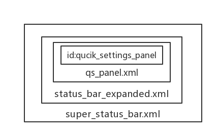
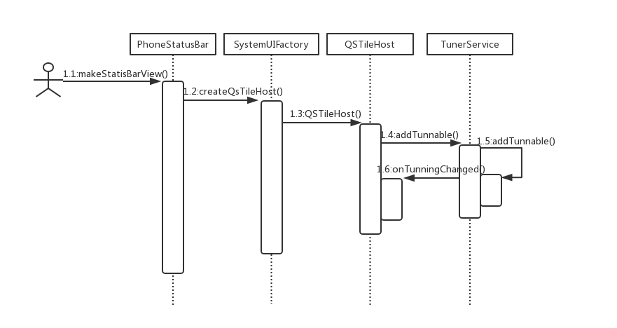

# SystemUI之快捷设置区域加载过程分析

| 版本 | 修改日期 | 作者 | 修改内容 |
| :----|------------|-----|------|
| V1.0 | 2018.09.03 | 宋妍 | 初版 |

## 一、布局构成



1.1、快捷设置区域的布局是由 StatusBar.java 的 makeStatusBarView() 统一加载，通过方法 inflateStatusBarWindow 方法加载布局 super_status_bar.xml。

```
protected void makeStatusBarView() {
    ......
    inflateStatusBarWindow(context);//加载布局的方法
    ......
}

protected void inflateStatusBarWindow(Context context) {
    mStatusBarWindow = (StatusBarWindowView) View.inflate(context,
            R.layout.super_status_bar, null);
}
```

1.2、super_status_bar.xml 中包含 status_bar_expanded.xml。

```
<include layout="@layout/status_bar_expanded"
    android:layout_width="match_parent"
    android:layout_height="match_parent"
    android:visibility="invisible" />
```

1.3、status_bar_expanded.xml 中包含 qs_panel.xml。

```
<FrameLayout
    android:id="@+id/qs_frame"
    android:layout="@layout/qs_panel"
    ...... />
```

1.4、qs_panel.xml 中 id 为 quick_settings_panel 即为我们所找的那个 SystemUI 上的快捷设置区域控件的 id。

```
<com.android.systemui.qs.QSContainerImpl
    ......
    <com.android.systemui.qs.QSPanel
        android:id="@+id/quick_settings_panel"
        android:layout_marginTop="@dimen/qs_panel_margin_top"
        android:layout_marginBottom="0dp" />
    ......
</com.android.systemui.qs.QSContainerImpl>

```

## 二、类说明



- QSTileHost ：实现QSHost接口，管理 Tile 状态的变化。用来创建和监听 Tile。
- Tunable ：接口，配置变化的回调。QSTileHost 实现这个接口。
- TunerService ：用来监听各种配置变化，TunerService 的实现类是 TunerServiceImpl。

## 三、代码控制流程

3.1、仍然是从 StatusBar.java 的 makeStatusBarView() 方法开始。

```
protected void makeStatusBarView() {
......
// Set up the quick settings tile panel
    View container = mStatusBarWindow.findViewById(R.id.qs_frame);//获取视图对象
    ......
    final QSTileHost qsh = SystemUIFactory.getInstance().createQSTileHost(mContext, this,
            mIconController);//创建并初始化 QSTileHost 对象
    ......
    if (qs instanceof QSFragment) {
        ((QSFragment) qs).setHost(qsh);//给QSFragment(QSPanel)设置 QSTileHost 对象
        mQSPanel = ((QSFragment) qs).getQsPanel();
    }
......
}

```

3.2、一步步分析，首先先实例化一个 View（qs_frame 包含一个 QSPanel 视图）对象，然后再去创建 QSTileHost 对象,然后将 QSTileHost 对象与 QSPanel 视图对象进行绑定，看一下 QSTileHost 的构造方法。

QSTileHost.java

```
public QSTileHost(Context context, StatusBar statusBar,
        StatusBarIconController iconController) {
    ......
    Dependency.get(TunerService.class).addTunable(this, TILES_SETTING);//使用 TunerService 去 Settings 中查询 key 为 TILES_SETTING 的值，即查询快捷设置菜单项
    ......
}

```

3.3、关键 Dependency.get(TunerService.class).addTunable(this, TILES_SETTING) ，使用 TunerService 去 Settings 中查询 key 为 TILES_SETTING 的值，即查询快捷设置菜单项，查询到的结果通过 onTuningChanged() 方法回调返回， TunerService 的实现类是 TunerServiceImpl。

TunerServiceImpl.java

```
private void addTunable(Tunable tunable, String key) {
    ......
    // Send the first state.
    String value = Settings.Secure.getStringForUser(mContentResolver, key, mCurrentUser);
    tunable.onTuningChanged(key, value);//查询到的结果通过 onTuningChanged () 方法回调返回
}

```

3.4、onTuningChanged 方法的实现在 QSTileHost 中，通过方法 loadTileSpecs 方法将 config.xml  中定义的标签内容 load 进来，通过 createTile 方法依次根据 xml 中的 String 生成对应的 Tile ，并将 Tile 保存在成员变量的 mTiles 集合中，最后回调 onTilesChanged() 方法，通知 QSPanel.java 对快捷设置选项显示更新。

```
@Override
public void onTuningChanged(String key, String newValue) {
    ......
    final List<String> tileSpecs = loadTileSpecs(mContext, newValue);//调用 loadTileSpecs 方法将 config.xml 的内容 load 进来
    ......
    tile = createTile(tileSpec);//在这里根据 String 生成 Tile
    ......
    newTiles.put(tileSpec,tile);
    ......
    mTiles.putAll(newTiles);
    ......

    for (int i = 0; i < mCallbacks.size(); i++) {
        mCallbacks.get(i).onTilesChanged();//这里回调 onTilesChanged() 方法，通知 StatusBar.java 对快捷设置选项显示更新
    }
}

```

3.5、onTilesChanged() 方法的实现是在 QSPanel.java 中重写的， setTile 方法是对 Tile 进行设置和刷新的重要方法，下面会详细说明。

```
@Override
public void onTilesChanged() {
    setTiles(mHost.getTiles());//该方法的作用下面会详细说明
}

```

3.6、至此 QSTileHost.java 的构造方法分析完成，然后再回到调用处 StatusBar.java 的  makeStatusBarView() 法继续分析，其中有一个视图绑定内容（QSTileHost）的语句 (( QSFragment)qs).setHost(qsh) ，分析完其中 qsh，我们继续分析视图 qs。

QSFragment.java

```
public void setHost(QSTileHost qsh) {
    mQSPanel.setHost(qsh, mQSCustomizer);//实质是将 QSPanel 和 qsh 绑定
}
```

QSPanel.java

```
public void setHost(QSTileHost host, QSCustomizer customizer) {
    mHost = host;
    mHost.addCallback(this);
    setTiles(mHost.getTiles());
}

```

3.7、而其中的 setTiles() 方法是不是很熟悉？它就是之前说到的对 Tile 进行设置和刷新的重要方法，该方法会先 remove 掉所有的 TileRecord 记录并移除所有的 tileView ，然后再重新调用 addTile() 创建  TileRecord 对象并赋值绑定相应的回调和点击事件（点击、双击、长按）接口，再将其保存到        ArrayList<TileRecord> mRecords 集合中，然后再去 addView()。

```
public void setTiles(Collection<QSTile> tiles, boolean collapsedView) {
    for (TileRecord record : mRecords) {
        mTileLayout.removeTile(record);
        record.tile.removeCallback(record.callback);
    }
    mRecords.clear();
    for (QSTile tile : tiles) {
        addTile(tile, collapsedView);
    }
}

```

3.8、重新调用 addTile() 创建 TileRecord 对象并赋值绑定相应的回调和点击事件（点击、双击、长按）接口。

```
protected TileRecord addTile(final QSTile tile, boolean collapsedView) {
    final TileRecord r = new TileRecord();
    r.tile = tile;
    r.tileView = createTileView(tile, collapsedView);
    final QSTile.Callback callback = new QSTile.Callback() {
        ......
    };
    r.tile.addCallback(callback);
    r.callback = callback;
    mRecords.add(r);

    if (mTileLayout != null) {
        mTileLayout.addTile(r);//mTileLayout是layout视图对象
    }

    return r;
}

```
3.9、将添加了 Tile 的视图对象添加到总视图中。

```
protected void setupTileLayout() {
    mTileLayout = (QSTileLayout) LayoutInflater.from(mContext).inflate(
        R.layout.qs_paged_tile_layout, this, false);
    mTileLayout.setListening(mListening);
    addView((View) mTileLayout);//把视图加入view
}

```
## 四、总结
至此就完成快捷区域加载显示的大致流程分析，通过了解快捷设置区域 Tile 的加载显示过程，我们就可以在快捷设置区域添加自定义的 Tile，然后再根据 Tile 的具体功能和操作添加具体的实现类即可。
