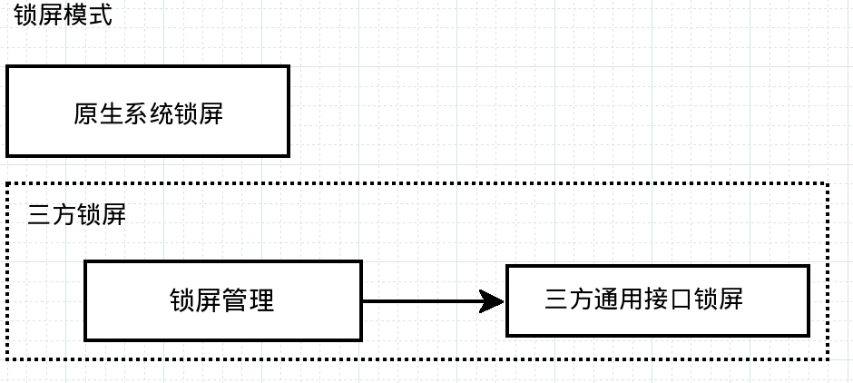

# 新锁屏框架介绍

[TOC]

## 一.锁屏结构

### 1.思路介绍


原生锁屏通过BackDrop中的ImageView(backdrop_back)来显示锁屏图片，当有音乐封面之类的显示时，

将壁纸图片换为音乐封面。由此可以知道原生系统中，锁屏壁纸页面对外展示的区域是在BackDropView中。

新锁屏框架依据原生的锁屏显示逻辑，将显示壁纸的backdrop_back替换为freeme_keyguard_lockscreen，

在freeme_keyguard_lockscreen中，使用keyguard_backdrop_back来显示原先backdrop_back中的内

容,使用custom_lockscreen来展示三方锁屏的内容。



如上图所示，新框架在结构上与原生锁屏处于同一层级，受父View BackDrop的控制,

锁屏管理除了提供给三方锁屏接口外，还控制原生锁屏与三方锁屏之间的切换，具体来讲就

是keyguard_backdrop_back和custom_lockscreen之前的显示切换。

新框架加入的位置是将原先的backdrop_back进行替换,如下面代码所示

super_status_bar.xml中的替换内容:

```
<!-- @{freeme.xiaohui,20180417.use freeme_keyguard_magazine
      instead of backdrop_back
<!-- 先前页面 -->      
<ImageView android:id="@+id/backdrop_back"
           android:layout_width="match_parent"
           android:scaleType="centerCrop"
           android:layout_height="match_parent" />
-->

<!-- 替代后的页面 -->
<include layout="@layout/freeme_keyguard_lockscreen"
    android:layout_width="match_parent"
    android:layout_height="match_parent"/>
<!-- @} -->
```

新锁屏中的页面布局(freeme_keyguard_lockscreen)：    

```
<!-- 原生锁屏 -->
<ImageView
    android:id="@+id/keyguard_backdrop_back"
    android:layout_width="match_parent"
    android:layout_height="match_parent"
    android:visibility="invisible"/>
<!-- 三方标准接入锁屏 -->
<FrameLayout
    android:id="@+id/custom_lockcsreen"
    android:layout_width="match_parent"
    android:layout_height="match_parent"
    android:visibility="invisible">
</FrameLayout>
```

### 2.结构介绍

在调用逻辑上,如下图所示，主要有两个:一个是新框架与SystemUI之间的交互，另外一个是三方APK和

新框架之间的交互。锁屏框架通过反射来调用三方APK中的方法，APK通过回调接口来调用锁屏框架中

的方法，来实现交互过程。

系统调用中主要依赖于4个接口:

|接口|说明|
| :-: | :--: |
|IFreemeMagazine|SystemUI对LockScreenManager的调用|
|IFreemeMagazineCallBack|LockScreenManager对SystemUI的回调|
|IFreemeCustomLockView|CustomLockViewManager对三方APK的调用|
|IFreemeCustomLockCallBack|三方APK对LockScreenManager进行回调.|


## 二.锁屏调用

### 1.三方APK注册锁屏接口

 在SettingsProvider中，提供如下两个接口来注册三方APK信息，FREEME_LOCKSCREEN_PACKAGE

 为三方APK的包名, FREEME_LOCKSCREEN_INDEX(暂时未用)：当一个APK中包含有多个锁屏时，需要

 以此值来选择加载哪一个。

```
public static final String FREEME_LOCKSCREEN_PACKAGE = "freeme_lockscreen_package";
public static final String FREEME_LOCKSCREEN_INDEX = "freeme_lockscreen_id";
```

新锁屏框架监听package的变化来加载对应的锁屏信息。


 当新锁屏框架框监听到Settings值变化时便开始上面的流程，当注册信息有settings的action时，

 会将当前的锁屏的设置注册到setting的设置页面中。注册后会有一个跳转入口。

 

### 2.锁屏调用三方APK接口

  当新的锁屏在加载时，会按照以下步骤来进行工作：

  * 1.init()，来初始化APK相关行为

  * 2.setCallback()，调置回调接口，此接口置于framework中，同时也会提供给APK一个lib包来调用.

  * 3.setListener()，备用，此处为handler回调，如无特需情况，此接口无用.

  * 4.getCustomLockView(),获取加载在锁屏上的View.

  * 5.getPanelHeight(),如有控制的panel返回panel的高度给systemui，如果没有panel返回:0.

  三方锁屏使用注意:

  如果锁屏带有panel，需要自行处理panel的滑动事件，panel默认从底部出来，这个是固定的。

  当panel一开始响应touch事件时,需要在一定阶断将当前的模式设置为MODE_SHOW_CUSTOM,此模式

  将会隐藏Keyguard界面的控制如:时间，通知，相机,使当前进入浏览模式,当新的通知来的时候，会

  退出浏览模式，系统通过setCurrentShowMode来通知三方apk当前系统的模式。

## 三.接口介绍

新锁屏框架的调用接口如下图所示:

 

 方法功能如下：

|功能|说明|
| :-: | :--: |
|init|调用锁屏后最先调用此函数|
|getCustomLockView|获取三方锁屏的根View|
|getPanelView|暂时无用|
|onScreenOn|亮屏事件|
|onScreenOff|灭屏事件|
|setListener|暂时无用|
|setCallback|设置回调接口|
|checkRuningStatus|查看APK的运行状态正常返回true|
|getPanelHeight|获取三方APK的PanelHeight|
|setCurrentShowMode|设置当前状态是否为浏览状态(如果是浏览状态,将当前点击事件传给三方锁屏的rootView)|

 三方锁屏的rootView


  

  回调方法功能如下：

|功能|说明|
| :-: | :-: |
|setKeyguardStatusVisibility|设置StatusView显示状态|
|setKeyguardNotifyVisibility|设置通知显示状态|
|setKeyguardBottomVisibility|设置通知BottoAreaView的显示状态|
|unLock|解锁/带Intent事件的解锁|
|setInsteadMode|替代模式 取代当前Panel的Touch事件(此模式时用三方锁屏的页面取代系统的锁屏页面)|
|updateCustomShowMode|用于通知系统当前是否处在浏览模式|
|setKeyguardStatusViewAlpha|设置KeyguardStatusView alpha|
|setKeyguardBottomViewAlpha|设置KeyguardBottomView alpha|
|setKeyguardImgTitle|设置当前图片的Title|
|setKeyguardThemMode|设置锁屏样式|

替代模式时锁屏页面(updateCustomShowMode):


锁屏样式设置如下图(setKeyguardThemMode)：


## 四.三方APK接入锁屏步骤

### 1.声明锁屏信息

在三方APK的AndroidManifest中加入如下Receiver信息:

锁屏框架通过固定的action字串来检测是否为要加载的锁屏，通过其中带的meta-data信息加载

相应的控件。

```
<receiver
    android:name=".RegisterReceiver"
    android:directBootAware="true">
    <intent-filter>
        <action android:name="freeme.systemui.lockscreen.register" />
    </intent-filter>

    <meta-data
        android:name="lockscreen_id"
        android:value="@integer/register_id" />
    <meta-data
        android:name="lockscreen_class"
        android:value="@string/register_class" />
    <meta-data
        android:name="lockscreen_action"
        android:value="@string/register_action" />
</receiver>

```

lockscreen_id: 当一个APK里包有多个锁屏壁纸时，用此字段来做区分,如果只有一个默认为0

lockscreen_class: 锁屏壁纸和新锁屏框架交互的主类

lockscreen_action: 锁屏注册到setting页面的主类,如果没有，写空值

Demo APK注册配置如下:

```
<integer name="register_id">0</integer>
 <string name="register_class">com.freeme.lockscreendemo.Demo.Demo</string>
 <string name="register_action">com.freeme.lockscreendemo.demo.CustomSettings</string>

```

### 2.实现反射调用接口:

反射调用接口文件为IFreemeCustomLockView.java,封装的lib库中有一个抽象类（FreemeCustomLockView），

可以继承这个抽象类，类中相关接口在接口介绍中已有。

### 3.注册

  在SettingsProvider中，有如下字段：

```  
public static final String FREEME_LOCKSCREEN_PACKAGE = "freeme_lockscreen_package";
public static final String FREEME_LOCKSCREEN_INDEX = "freeme_lockscreen_id";
```

写放注册的id信息和package信息， 新锁屏框架只监听package的变动，先写入id,再写入package便可

以进入锁屏更新流程

[三方锁屏DEMO Project](http://10.20.40.17:8080/#/admin/projects/FreemeOS/common/lockscreen/FreemeLockscreenDemo)
