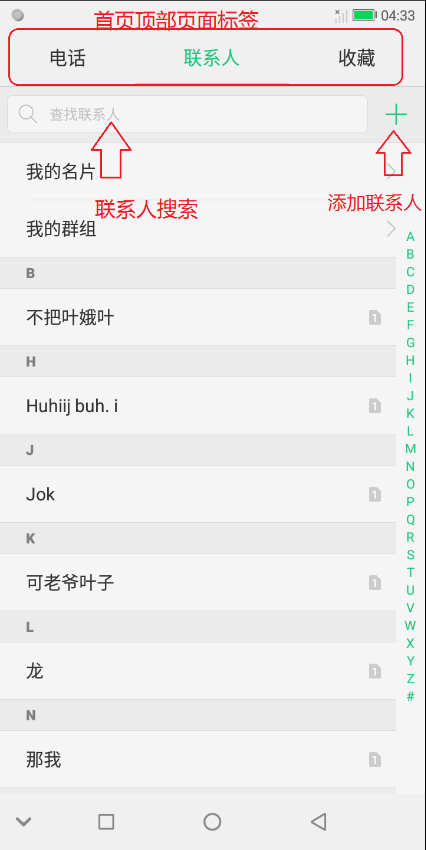
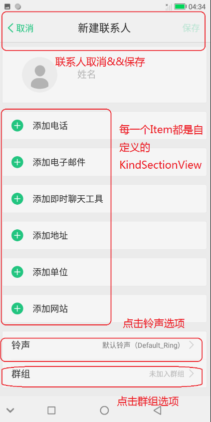
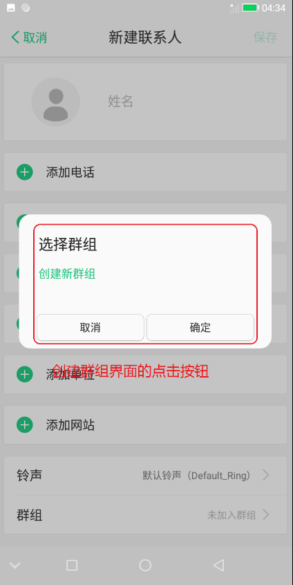

[TOC]

# 电话、联系人点击事件整理

## 一 、首页 （点击顶部页面标签）

首页界面



文件路径：

> vendor/mediatek/proprietary/packages/apps/Dialer/freeme/dialer/src/com/freeme/dialer/app/list/FreemeListsFragment.java

对应代码：

```
    @Override
    public void onPageSelected(int position) {
        PerformanceReport.recordClick(actionTypeList[position]);

        LogUtil.i("FreemeListsFragment.onPageSelected", "position: %d", position);
        mTabIndex = mAdapter.getRtlPosition(position);

        // Show the tab which has been selected instead.
        mShowVoicemailTabAfterVoicemailStatusIsFetched = false;

        final int count = mOnPageChangeListeners.size();
        for (int i = 0; i < count; i++) {
            mOnPageChangeListeners.get(i).onPageSelected(position);
        }
        sendScreenViewForCurrentPosition();

        if (mCurrentPage instanceof FreemeCallLogFragment) {
            ((FreemeCallLogFragment) mCurrentPage).onNotVisible();
        }
        mCurrentPage = mAdapter.getItem(position);
        if (mCurrentPage instanceof FreemeCallLogFragment) {
            ((FreemeCallLogFragment) mCurrentPage).onVisible();
        }
    }
```

## 二 、电话

### 全部通话 && 未接来电

文件路径:

> vendor/mediatek/proprietary/packages/apps/Dialer/freeme/dialer/src/com/freeme/dialer/app/calllog/FreemeCallLogFragment.java

对应代码：

```
    @Override
    public void onClick(View v) {
        switch (v.getId()) {
            // 全部通话
            case R.id.call_logs_all:
                updateCallLogsFilter(CallLogQueryHandler.CALL_TYPE_ALL);
                break;
            // 未接电话
            case R.id.call_logs_missed:
                updateCallLogsFilter(CallLog.Calls.MISSED_TYPE);
                break;
            default:
                break;
        }
    }
```

## 三 、联系人

### 1.点击搜索

文件路径：

> vendor/mediatek/proprietary/packages/apps/Dialer/freeme/dialer/src/com/freeme/dialer/contactsfragment/FreemeContactsFragment.java

对应代码：

```
    @Nullable
    @Override
    public View onCreateView(LayoutInflater inflater, ViewGroup container,
                             Bundle savedInstanceState) {
            ...
            //目前mSearchEdit只有textChangeListener监听,如果需要点击事件的话，可自行添加setOnClickListener。
            mSearchEdit = mSarchContainer.findViewById(R.id.freeme_search_edit);
            mSearchEdit.addTextChangedListener(this);
            ...
    }

    //监听mSearchEdit内容变化
    @Override
    public void onTextChanged(CharSequence s, int start, int before, int count) {
        if (s.equals(mQueryString)) {
            return;
        }
        isSearchMode = !TextUtils.isEmpty(s);
        if (adapter != null) {
            adapter.setSearchMode(isSearchMode);
        }
        if (!TextUtils.equals(mQueryString, s)) {
            mQueryString = s.toString();
            if (PermissionsUtil.hasContactsReadPermissions(getContext())) {
                getLoaderManager().restartLoader(LOADER_ID_LOAD_CONTACTS_DATA, null, this);
            }
        }
    }
```

### 2.点击添加联系人图标

文件路径 ：

> vendor/mediatek/proprietary/packages/apps/Dialer/freeme/dialer/src/com/freeme/dialer/contactsfragment/FreemeContactsFragment.java

对应代码：

```
    @Nullable
    @Override
    public View onCreateView(LayoutInflater inflater, ViewGroup container,
                             Bundle savedInstanceState) {
            ...
            //添加联系人
            mAddNewContact = mSarchContainer.findViewById(R.id.add_new_contacts);
            mAddNewContact.setOnClickListener(this);
            ...
    }

    //onclick
    @Override
    public void onClick(View v) {
        DialerUtils.startActivityWithErrorToast(getContext(), IntentUtil.getNewContactIntent(),
                R.string.add_contact_not_available);
        ///M: disable view's clickable in 1000ms to avoid double or trible click.
        DialerUtils.disableViewClickableInDuration(v, 1000 /*ms*/);
    }
```

## 四 、新建联系人

创建联系人界面




### 1.取消 && 保存

文件路径

> vendor/mediatek/proprietary/packages/apps/Contacts/src/com/android/contacts/editor/ContactEditorFragment.java

对应代码:

```
    @Override
    public boolean onOptionsItemSelected(MenuItem item) {
        //返回
        if (item.getItemId() == android.R.id.home) {
            return revert();
        }

        ...

        final int id = item.getItemId();
        //保存
        if (id == R.id.menu_save) {
            Log.d(TAG, "[onOptionsItemSelected]save");
            return save(SaveMode.CLOSE);
        }
        ...

        return false;
    }
```

### 2.点击添加电话、电子邮件、即时聊天工具、地址、单位、网站

针对添加联系人界面的点击事件，可以去看下添加的各个选项是如何动态加载的，每一个item都是一个KindSectionView自定义View。所以点击事件也是在里面做处理的。

文件路径：

> vendor/mediatek/proprietary/packages/apps/Contacts/src/com/android/contacts/editor/KindSectionView.java

对应代码：

```
    @Override
    protected void onFinishInflate() {
        super.onFinishInflate();
        setDrawingCacheEnabled(true);
        setAlwaysDrawnWithCacheEnabled(true);

        mLayoutInflater = (LayoutInflater) getContext().getSystemService(
                Context.LAYOUT_INFLATER_SERVICE);

        mEditors = (ViewGroup) findViewById(R.id.kind_editors);
        /*/freeme.zhangjunjian, 20180117. redesign contact editor
        mIcon = (ImageView) findViewById(R.id.kind_icon);
        //*/
        //*/freeme.zhangjunjian, 20180207. redesign contact editors
        mAddFieldBtn = (TextView) findViewById(R.id.add_field_button);
        mAddField = (LinearLayout) findViewById(R.id.freeme_add_field);
        //各个item点击事件
        mAddField.setOnClickListener(new OnClickListener() {
            @Override
            public void onClick(View v) {
                mNewFieldNext = true;
                mEditors.setVisibility(VISIBLE);
                mAddField.setBackgroundResource(R.drawable.freeme_content_bottom_bg_selector);
                updateEmptyEditors(true);
                int count = mEditors.getChildCount();
                mEditors.getChildAt(count - 1).requestFocus();
            }
        });
        //*/
    }
```

### 3.点击添加铃声

文件路径

> vendor/mediatek/proprietary/packages/apps/Contacts/src/com/android/contacts/editor/RawContactEditorView.java

对应代码

```
    //添加点击监听事件 && 点击事件
    private void addRingSelector() {
        final OnClickListener mRingContactListener = new OnClickListener() {
            @Override
            public void onClick(View v) {
                addContactRingSelector();
            }
        };
        mRingContact.setOnClickListener(mRingContactListener);
    }
```

### 4.点击添加群组

创建群组界面



#### (1)点击群组

文件路径：

> vendor/mediatek/proprietary/packages/apps/Contacts/src/com/android/contacts/editor/GroupMembershipView.java

对应代码

```
    private void updateView() {
        ...
        // 添加mGroupListontact监听
        if (mGroupListContact == null) {
            mGroupListContact=(LinearLayout) findViewById(R.id.group_list);
            mGroupList = (TextView) findViewById(R.id.contact_group);
            mGroupListContact.setOnClickListener(this);
        }
        ...
    }

    //如果需要添加操作可以在下面的onClick事件里面添加
    @Override
    public void onClick(View v) {
        ...
        ...
    }
```

##### (2)创建新群组

文件路径：

> vendor/mediatek/proprietary/packages/apps/Contacts/src/com/android/contacts/editor/GroupMembershipView.java

对应代码：

```
    @Override
    public void onItemClick(AdapterView<?> parent, View view, int position, long id) {
        ...
        if (list.isItemChecked(count - 1)) {
            list.setItemChecked(count - 1, false);
            createNewGroup();
            return;
        }
        ...
    }
```
##### (3)创建群组界面取消 && 创建群组界面确定

文件路径：

> vendor/mediatek/proprietary/packages/apps/Contacts/freeme/src/com/freeme/contacts/group/FreemeGroupNameEditDialogFragment.java

对应代码：

```
    @Override
    public void onClick(View v) {
        AlertDialog.Builder builder = new AlertDialog.Builder(getContext());
        builder.setTitle(R.string.editor_group_selection)
                .setView(listView)
                .setCancelable(true)
                //取消
                .setNegativeButton(android.R.string.cancel, null)
                //确定
                .setPositiveButton(android.R.string.ok, new DialogInterface.OnClickListener() {
                    @Override
                    public void onClick(DialogInterface dialog, int which) {
                        updateView();
                    }
                });
        mDialog = builder.create();
        mDialog.show();
    }
```


