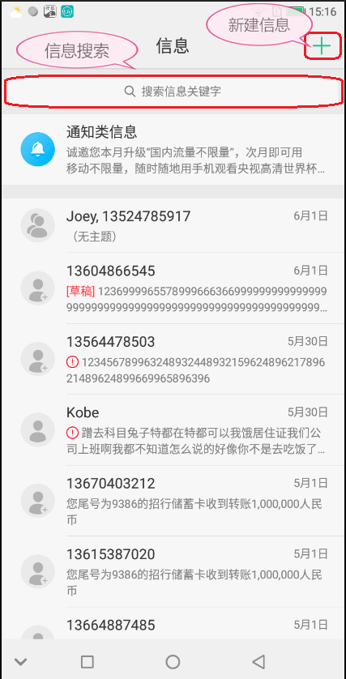
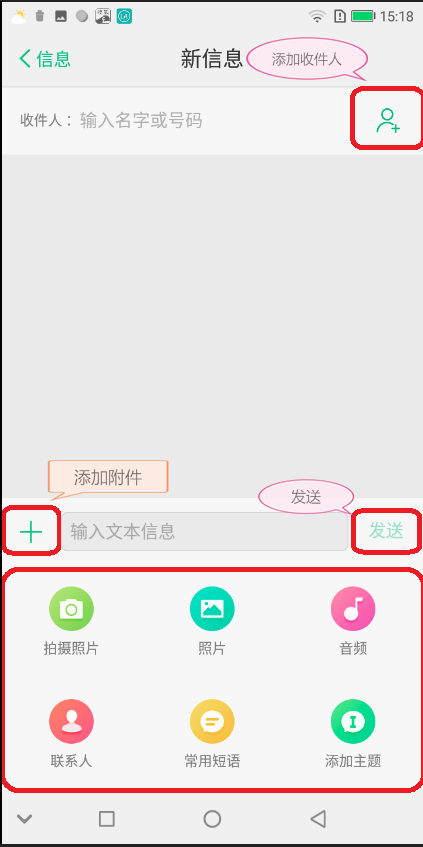

[TOC]

# 整理说明

本次短信点击事件整理文档基于 FreemeOS 8.1 版本的 FreemeMms（freeme-8.1.1_r1），截止当前（2018-06-04）最新版本。

# 信息列表页



## 新建短信

- 文件路径

> vendor/freeme/packages/apps/FreemeMms/src/com/android/mms/ui/BootActivity.java


- 代码片段

```
@Override
public boolean onOptionsItemSelected(MenuItem item) {
    switch (item.getItemId()) {
        case R.id.action_compose_new:
            if (mIsSmsEnabled) {
                createNewMessage();
            } else {
                // Display a toast letting the user know they can not compose.
                if (mComposeDisabledToast == null) {
                    mComposeDisabledToast = Toast.makeText(this,
                            R.string.compose_disabled_toast, Toast.LENGTH_SHORT);
                }
                mComposeDisabledToast.show();
            }
            break;
        case android.R.id.home:
            backFromNotificationList();
            break;
        default:
            break;
    }

    return false;
}
```

## 信息搜索

- 文件路径

> vendor/freeme/packages/apps/FreemeMms/src/com/android/mms/ui/BootActivity.java

- 代码片段


```
private void updateSearchView(BootActivity bootActivity, Message msg) {
    if (bootActivity.mSearchView == null) {
        bootActivity.mSearchView = bootActivity.getViewFromStub(R.id.search_view,
                R.id.search_view_stub);

        bootActivity.mSearchView.setOnClickListener(new View.OnClickListener() {
            @Override
            public void onClick(View v) {
                String extraSelection = null;
                if (bootActivity.mListAdapter != null
                        && bootActivity.mListAdapter.isNotificationList()) {
                    extraSelection = NOTIFICATION_LIST_SELECTION;
                }
                ...
            }
        });
    }
    ...
}
```

# 信息详情页



## 添加收件人

- 文件路径

> vendor/freeme/packages/apps/FreemeMms/src/com/android/mms/ui/ComposeMessageActivity.java

- 代码片段


```
@Override
public void onClick(View v) {
    ...
    } else if ((v == mRecipientsPicker)) {
        /// M: Code analyze 013, Get contacts from Contact app . @{
        //launchMultiplePhonePicker();
        if (recipientCount() >= RECIPIENTS_LIMIT_FOR_SMS) {
            Toast.makeText(ComposeMessageActivity.this,
                    R.string.cannot_add_recipient, Toast.LENGTH_SHORT).show();
        } else {
            /// M: fix bug ALPS00444752, dis-clickble when showing ContactPicker
            if (!mShowingContactPicker) {
                addContacts(mRecipientsEditor != null
                        ? (RECIPIENTS_LIMIT_FOR_SMS - mRecipientsEditor.getNumbers().size())
                                : RECIPIENTS_LIMIT_FOR_SMS, REQUEST_CODE_PICK);
            }
        }

    }
}
```

## 发送

- 文件路径

> vendor/freeme/packages/apps/FreemeMms/src/com/android/mms/ui/ComposeMessageActivity.java

- 代码片段


```
@Override
public void onClick(View v) {
    ...
    /*/ Freeme.linqingwei, 20170623. redesign send button for 7.2 style.
    if (v == mSendButtonSms || v == mSendButtonMms) {
    //*/
    if (v == mSendButton) {
    //*/
        MmsLog.d(TAG, "onClick send button click!");
        if (mSendButtonCanResponse) {
            ...
            mSendButtonCanResponse = false;
            if (isPreparedForSending()) {
                /// M: Since sending message here, why not disable button 'Send'??
                updateSendButtonState(false);
                checkRecipientsCount();
                mUiHandler.sendEmptyMessageDelayed(MSG_RESUME_SEND_BUTTON,
                        RESUME_BUTTON_INTERVAL);
            } else {
                mSendButtonCanResponse = true;
                unpreparedForSendingAlert();
            }
        }
    ...
    }
}
```

## 添加附件

- 文件路径

> vendor/freeme/packages/apps/FreemeMms/src/com/android/mms/ui/ComposeMessageActivity.java

- 代码片段


```
private void initShareResource() {
    mShareButton = (ImageButton) findViewById(R.id.share_button);
    mShareButton.setOnClickListener(new View.OnClickListener() {
        @Override
        public void onClick(View v) {
            if (mShowKeyBoardFromShare) {
                showSharePanelOrKeyboard(false, true);
            } else {
                showSharePanelOrKeyboard(true, false);
                if (!(mTextEditor.hasFocus()
                        || (mSubjectTextEditor != null && mSubjectTextEditor.hasFocus()))) {
                    mTextEditor.requestFocus();
                }
            }
        }
    });
    mSharePanel = (FreemeSharePanel) findViewById(R.id.share_panel);
    mSharePanel.setHandler(mIpMsgHandler);
    showSharePanelOrKeyboard(false, false);
}
```

## 拍摄照片

- 文件路径

> vendor/freeme/packages/apps/FreemeMms/src/com/android/mms/ui/ComposeMessageActivity.java

- 代码片段


```
private void doMmsAction(final int action) {
    int commonAttachmentType = 0;

    switch (action) {
        case FreemeSharePanel.ATTACH_TAKE_PICTURE:
            commonAttachmentType = AttachmentTypeSelectorAdapter.TAKE_PICTURE;
            break;

        ...
    }

    // replace attachment
    addAttachment(commonAttachmentType, false);
}
```

## 选择照片

- 文件路径

> vendor/freeme/packages/apps/FreemeMms/src/com/android/mms/ui/ComposeMessageActivity.java

- 代码片段


```
private void doMmsAction(final int action) {
    int commonAttachmentType = 0;

    switch (action) {
        ...

        case FreemeSharePanel.ATTACH_ADD_IMAGE:
            commonAttachmentType = AttachmentTypeSelectorAdapter.ADD_IMAGE;
            break;

        ...
    }

    // replace attachment
    addAttachment(commonAttachmentType, false);
}
```

## 添加音频

- 文件路径

> vendor/freeme/packages/apps/FreemeMms/src/com/android/mms/ui/ComposeMessageActivity.java

- 代码片段


```
private void doMmsAction(final int action) {
    int commonAttachmentType = 0;

    switch (action) {
        ...

        case FreemeSharePanel.ATTACH_ADD_SOUND:
            commonAttachmentType = AttachmentTypeSelectorAdapter.ADD_SOUND;
            break;

        ...
    }

    // replace attachment
    addAttachment(commonAttachmentType, false);
}
```
## 添加联系人

- 文件路径

> vendor/freeme/packages/apps/FreemeMms/src/com/android/mms/ui/ComposeMessageActivity.java

- 代码片段


```
private void doMmsAction(final int action) {
    int commonAttachmentType = 0;

    switch (action) {
        ...

        case FreemeSharePanel.ATTACH_ADD_VCARD:
            commonAttachmentType = AttachmentTypeSelectorAdapter.ADD_VCARD;
            break;

        ...
    }

    // replace attachment
    addAttachment(commonAttachmentType, false);
}
```

## 添加常用短语

- 文件路径

> vendor/freeme/packages/apps/FreemeMms/src/com/android/mms/ui/ComposeMessageActivity.java

- 代码片段


```
private void doMmsAction(final int action) {
    int commonAttachmentType = 0;

    switch (action) {
        ...

        case FreemeSharePanel.ATTACH_COMMON_PHRASES:
            commonAttachmentType=AttachmentTypeSelectorAdapter.ADD_COMMON_PHRASES;
            break;

        ...
    }

    // replace attachment
    addAttachment(commonAttachmentType, false);
}
```

## 添加主题

- 文件路径

> vendor/freeme/packages/apps/FreemeMms/src/com/android/mms/ui/ComposeMessageActivity.java

- 代码片段


```
private void doMmsAction(final int action) {
    int commonAttachmentType = 0;

    switch (action) {
        ...

        case FreemeSharePanel.ATTACH_ADD_SUBJECT:
            commonAttachmentType=AttachmentTypeSelectorAdapter.ADD_SUBJECT;
            break;
        default:
            hideSharePanel();
            return;
    }

    // replace attachment
    addAttachment(commonAttachmentType, false);
}
```