[TOC]

# 修改记录

| 版本 | 修改日期 | 作者 | 修改内容 |
| :---| ----------| ---- | ---- |
| v1.0 | 2018.06.13 | 林庆伟 | 初版 |

# 说明

本文档基于 MTK Android O 版本，默认信息 App 为 Mms

> vendor/mediatek/proprietary/packages/apps/Mms

Mms 作为默认短信 App，可以管理信息，包括编辑、查看、删除、发送、接收等操作。本文档主要整理 Mms 发送、接收信息的流程。

# 发送信息

## 预处理

信息在发送之前首先会经过一些有效性检查或准备，例如检查收件人、信息内容，选择发送卡等预处理。

### 流程图

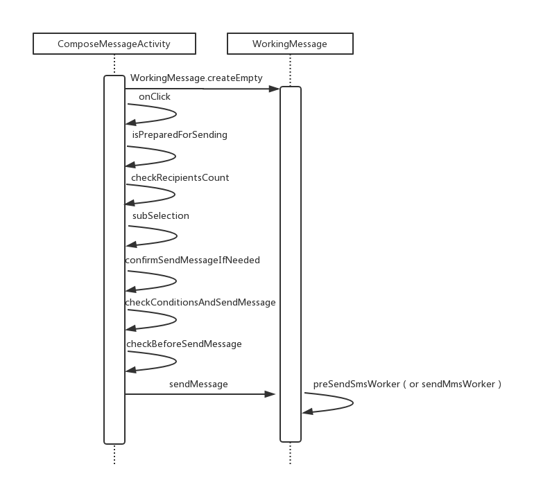

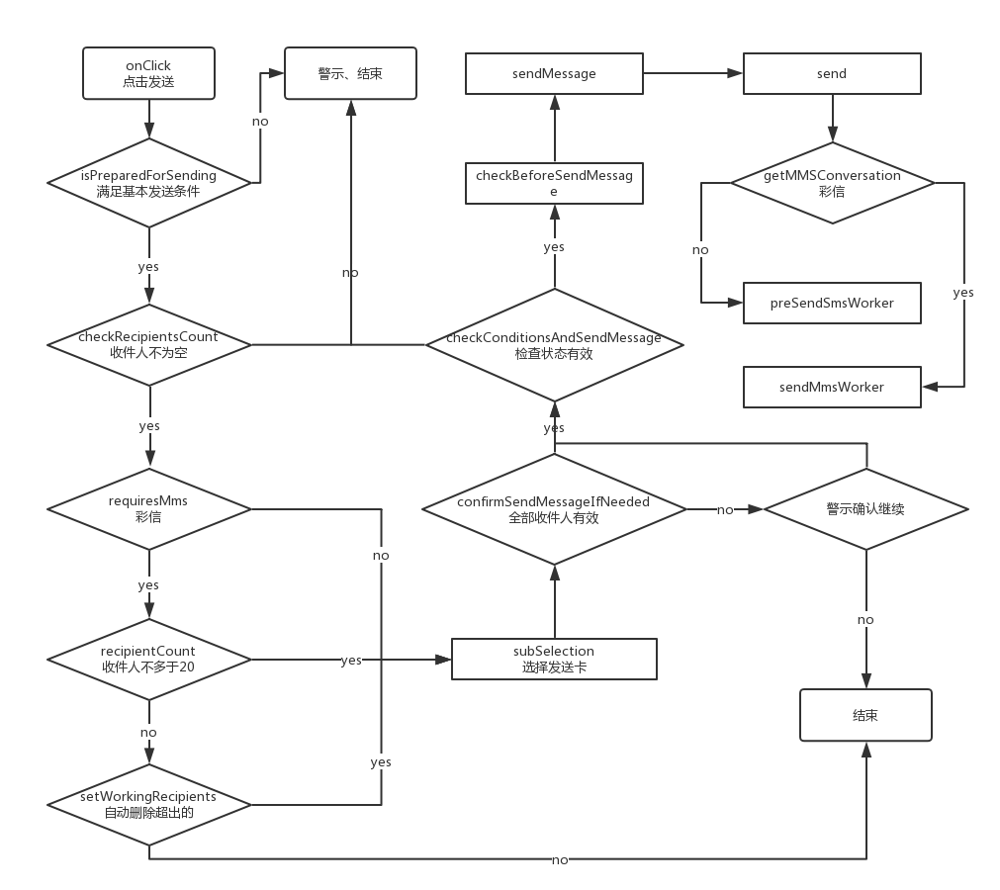

### 流程解析

> src/com/android/mms/ui/ComposeMessageActivity.java

```
@Override
public void onClick(View v) {
    ...

    if (v == mSendButtonSms || v == mSendButtonMms) {
        MmsLog.d(TAG, "onClick send button click!");
        if (mSendButtonCanResponse) {

            mSendButtonCanResponse = false;
            if (isPreparedForSending()) {
                /// M: Since sending message here, why not disable button 'Send'??
                updateSendButtonState(false);
                checkRecipientsCount();
                ...
            } else {
                mSendButtonCanResponse = true;
                unpreparedForSendingAlert();
            }
        }
    }

    ...
}
```
点击发送按钮（mSendButtonSms）后，首先根据状态变量 mSendButtonCanResponse 决定是否响应点击操作，然后通过 isPreparedForSending 方法判断是否具备了发送条件：

```
private boolean isPreparedForSending() {
    // 收件人编辑框可见，即新建信息，收件人可能为空
    if (isRecipientsEditorVisible()) {
        String recipientText = mRecipientsEditor.getText() == null ?
                "" : mRecipientsEditor.getText().toString();

        return mSubCount > 0 && !TextUtils.isEmpty(recipientText) && mIsSmsEnabled
                && (mWorkingMessage.hasAttachment() || mWorkingMessage.hasText()
                        || mWorkingMessage.hasSubject());

    // 收件人编辑框不可见，即会话已存在，收件人不为空
    } else {
        return mSubCount > 0 && mIsSmsEnabled && (mWorkingMessage.hasAttachment()
                || mWorkingMessage.hasText()
                        || mWorkingMessage.hasSubject());
    }
}
```
基本发送条件：

- mSubCount > 0 (至少一张 SIM 卡)
- !TextUtils.isEmpty(recipientText) (收件人不为空)
- mIsSmsEnabled （Mms 是默认短信应用）
- (mWorkingMessage.hasAttachment() || mWorkingMessage.hasText() || mWorkingMessage.hasSubject()) （信息内容至少含有附件、文字、主题三者之一）

首先要满足上述基本条件，否则会弹出警示对话框。

满足上述基本条件后，首先 disable 发送按钮，防止连续点击；然后检查收件人数量：

```
private void checkRecipientsCount() {
    ...
    // 收件人编辑框可见，判断新建收件人是否为空白字符
    boolean isRecipientsEditorEmpty = isRecipientsEditorVisible()
            && "".equals(mRecipientsEditor.getText().toString().replaceAll(";", "")
                    .replaceAll(",", "").trim());
    // 收件人编辑框不可见，判断会话收件人是否为空白字符
    boolean isConversationRecipientEmpty = !isRecipientsEditorVisible()
            && "".equals(mConversation.getRecipients().serialize().replaceAll(";", "")
                    .replaceAll(",", ""));
    ...
    // 彩信（MMS）收件人数量限制
    if (mWorkingMessage.requiresMms() && (recipientCount() > mmsLimitCount)) {
        // 弹出警示对话框，将删除超出限制个数的收件人
        ...
        // 确认自动删除则进行选卡，否则结束
        subSelection();
        ...
    } else {
        // 收件人不能为空白字符
        if ((isRecipientsEditorVisible() && isRecipientsEditorEmpty)
                || (!isRecipientsEditorVisible() && isConversationRecipientEmpty)) {
            // 弹出警示对话框
            ...
        } else {
            /// M: reply message with the card directly if
            /// only one card related in conversation
            subSelection();
        }
    }
}
```

校验收件人数量：

- 默认限制彩信（MMS）最大收件人数量为 20
- 这里并没有校验短信（SMS）收件人数量，但实际上 Mms 默认限制了最大为 100
- 进一步对收件人判空，防止收件人为空白字符

通过校验后进入 subSelection 选择发送卡，原生逻辑是：

- 单卡或默认卡
- 多卡并无默认卡，弹出对话框选卡

FreemeMms 8.1 版本对选择发送卡的逻辑做了修改，主要体现在多卡选择上，淡化默认卡设置。用户可即时选择任一卡，否则“默认”使用卡1发送。选定 mSeletedSubId，殊途同归，最终都是到 confirmSendMessageIfNeeded


```
private void confirmSendMessageIfNeeded() {
    ...
    // 已存在会话，收件人已被确认，直接进行下一步检查
    if (!isRecipientsEditorVisible()) {
        /// M: Code analyze 030, Check condition before sending message.@{
        checkConditionsAndSendMessage(true);
        /// @}
        return;
    }

    // 彩信（MMS）
    boolean isMms = mWorkingMessage.requiresMms();
    ...

    // 新建信息需要检查收件人是否有效
    if (mRecipientsEditor.hasInvalidRecipient(isMms)) {
        ...
        // 存在无效收件人时提示用户
        ...
        // 忽略提示，继续发送
        checkConditionsAndSendMessage(true);
        // 响应提示，停止发送
        ...
    } else {
        /// M: Code analyze 030, Check condition before
        /// sending message.(All recipients are valid.)@{
        checkConditionsAndSendMessage(true);
        /// @}
    }
}
```

经过收件人有效性检查后，通过 checkConditionsAndSendMessage 继续发送流程


```
// 参数 bCheckEcmMode 代表是否检查当前 Phone 处于紧急状态
public void checkConditionsAndSendMessage(final boolean bCheckEcmMode) {
    // check pin
    if (mSelectedSubId <= 0) {
        mSelectedSubId = SubscriptionManager.getDefaultSubscriptionId();
    }

    ...
    final CellConnMgr cellConnMgr = new CellConnMgr(getApplicationContext());
    final int state = cellConnMgr.getCurrentState(mSelectedSubId, CellConnMgr.STATE_FLIGHT_MODE
            | CellConnMgr.STATE_SIM_LOCKED | CellConnMgr.STATE_RADIO_OFF);
    MmsLog.d(TAG, "CellConnMgr, state is " + state);
    ///M: WFC: Do not show pop-up, if wfc is OFF @ {
    // 检查当前 Phone 是否处于飞行模式或已选择 SIM 卡是否处于关闭状态
    if (!MtkTelephonyManagerEx.getDefault().isWifiCallingEnabled(mSelectedSubId) &&
        (((state & CellConnMgr.STATE_FLIGHT_MODE) == CellConnMgr.STATE_FLIGHT_MODE ) || ((state & CellConnMgr.STATE_RADIO_OFF) == CellConnMgr.STATE_RADIO_OFF ) ||
            ((state & (CellConnMgr.STATE_FLIGHT_MODE | CellConnMgr.STATE_RADIO_OFF))
                == (CellConnMgr.STATE_FLIGHT_MODE | CellConnMgr.STATE_RADIO_OFF))))  {
        ...
    // 检查当前已选则 SIM 卡被锁卡
    } else if ((state & CellConnMgr.STATE_SIM_LOCKED) == CellConnMgr.STATE_SIM_LOCKED) {

        ...

    } else {
        ...
        checkBeforeSendMessage(bCheckEcmMode);

    }
}

private void checkBeforeSendMessage(boolean bCheckEcmMode) {
    ...
    sendMessage(bCheckEcmMode);
}
```

再经过对当前 Phone 及 SIM 卡状态有效检查后，通过 sendMessage 继续发送流程


```
public void sendMessage(boolean bCheckEcmMode) {
    // 彩信（MMS）并且有幻灯片（图片、音频、视频）或附件时，要检查大小
    if (mWorkingMessage.requiresMms() && (mWorkingMessage.hasSlideshow()
        || mWorkingMessage.hasAttachment())) {
        int messageSize = 0;
        messageSize = mWorkingMessage.getCurrentMessageSize();
        MmsLog.d(TAG, "Compose.sendMessage(): messageSize=" + messageSize);
        // 不能超出默认 300K 限制
        if (messageSize > MmsConfig.getUserSetMmsSizeLimit(true)) {
            MessageUtils.showErrorDialog(ComposeMessageActivity.this,
                    R.string.exceed_message_size_limitation,
                    R.string.exceed_message_size_limitation, 0, 0);
            updateSendButtonState();
            return;
        }
    }
    // 检查紧急状态
    if (bCheckEcmMode) {
        ...
    }
    ...
    // 获取所有收件人
    /// M: Code analyze 011, use another method for performance.(update mDebugRecipients)@{
    ContactList contactList = isRecipientsEditorVisible() ?
        mRecipientsEditor.constructContactsFromInput(false) : getRecipients();
    mDebugRecipients = contactList.serialize();
    /// @}

    ...
    // 进入 WorkingMessage 处理流程
    /// M:the method is extend to support gemini @{
    mWorkingMessage.send(mDebugRecipients, mSelectedSubId);
    MmsLog.d(TAG, "Compose.sendMessage(): after sendMessage. mConversation.ThreadId="
                + mConversation.getThreadId()
                + ", MessageCount=" + mConversation.getMessageCount());
    /// @}

    ...

}
```
最后经过对彩信（MMS，如果是）大小和紧急状态的检查，检查流程基本结束，开始通过 WorkingMessage 发送信息。

> src/com/android/mms/data/WorkingMessage.java


```
/**
 * Send this message over the network.  Will call back with onMessageSent() once
 * it has been dispatched to the telephony stack.  This WorkingMessage object is
 * no longer useful after this method has been called.
 *
 * @throws ContentRestrictionException if sending an MMS and uaProfUrl is not defined
 * in mms_config.xml.
 * M: Code analyze 047, For new feature ALPS00316567,
 * extend this method for msim, add a parameter for subId
 */
public void send(final String recipientsInUI, final int subId) {
    MmsLog.d(MmsApp.TXN_TAG, "Enter send(). subId = " + subId);
    ...

    // We need the recipient list for both SMS and MMS.
    final Conversation conv = mConversation;
    final String msgTxt = mText.toString();
    final SplitToMmsAndSmsConversation spliter =
        new SplitToMmsAndSmsConversation(conv, msgTxt);

    // 彩信（MMS）
    if (spliter.getMMSConversation() != null) {
        ...

        // Do the dirty work of sending the message off of the main UI thread.
        new Thread(new Runnable() {
            public void run() {
                MtkSendReq sendReq = makeMtkSendReq(spliter.getMMSConversation(), subject);

                ...

                sendMmsWorker(spliter.getMMSConversation(),
                        mmsUri, persister, slideshow, sendReq, subId);
                ...
                updateSendStats(spliter.getMMSConversation());

                ...
            }
        }, "WorkingMessage.send MMS").start();
        ...
    }
    // 短信（SMS）
    if (spliter.getSMSConversation() != null) {
        new Thread(new Runnable() {
            public void run() {
                ...
                preSendSmsWorker(spliter.getSMSConversation(), msgTxt, recipientsInUI, subId,
                        (spliter.getMMSConversation() != null) ? true : false);
                /// @}
                updateSendStats(spliter.getSMSConversation());
            }
        }, "WorkingMessage.send SMS").start();

        ...
    }

}
```
在 WorkingMessage 中对短信 （SMS） 和彩信（MMS）分别做处理，它们的发送方式不一样，先看短信（SMS）的发送方式。

## 发送 SMS

短信（SMS）的发送需要上层应用调用 framework 中相应 API 实现，framework 完成发送后会反馈具体结果给到上层应用。下面就先分析发送短信在 Mms 中的处理。

### 在 Mms 中的处理


#### 流程图


#### 流程解析


```
private void preSendSmsWorker(Conversation conv, String msgText, String recipientsInUI,
            int subId, boolean hasBeenSplit) {
    ...
    // 更新 UI，隐藏收件人编辑框、信息编辑框，更新标题等
    mStatusListener.onPreMessageSent();

    ...
    // 获取会话ID（threadId）
    // Make sure we are still using the correct thread ID for our recipient set.
    long threadId = conv.ensureThreadId();
    // 获取收件人
    String semiSepRecipients = conv.getRecipients().serialize();

    ...
    // 发送
    // just do a regular send. We're already on a non-ui thread so no need to fire
    // off another thread to do this work.
    /// M: Code analyze 047, For new feature ALPS00316567, add a parameter for msim . @{
    sendSmsWorker(msgText, semiSepRecipients, threadId, subId);
    /// @}
    // 删除草稿
    // Be paranoid and clean any draft SMS up.
    deleteDraftSmsMessage(threadId);
    ...
}

private void sendSmsWorker(String msgText,
        String semiSepRecipients, long threadId, int subId) {
    String[] dests = TextUtils.split(semiSepRecipients, ";");
    // 构建 MessageSender，主要参数有收件人地址，信息文本，会话ID，发送卡ID
    MessageSender sender = new SmsMessageSender(mActivity, dests, msgText, threadId, subId);

    try {
        sender.sendMessage(threadId);

        // Make sure this thread isn't over the limits in message count
        Recycler.getSmsRecycler().deleteOldMessagesByThreadId(mActivity, threadId);
    } catch (Exception e) {
        Log.e(TAG, "Failed to send SMS message, threadId=" + threadId, e);
    }
    // 更新 UI，刷新信息列表，显示“正在发送中”
    mStatusListener.onMessageSent();
    MmsWidgetProvider.notifyDatasetChanged(mActivity);
}
```
其中 sendSmsWorker 方法的参数之一 threadId 的获取：


```
public synchronized long ensureThreadId(boolean scrubForMmsAddress) {
    ...

    MmsLog.d(TAG, "ensureThreadId(): before: ThreadId=" + mThreadId);
    if (mThreadId <= 0 || (mThreadId > 0 && mNeedForceUpdateThreadId)) {
        mThreadId = getOrCreateThreadId(mContext, mRecipients, scrubForMmsAddress);
        mNeedForceUpdateThreadId = false;
    }
    MmsLog.d(TAG, "ensureThreadId(): after: ThreadId=" + mThreadId);

    ...

    return mThreadId;
}

private static long getOrCreateThreadId(Context context,
        ContactList list, final boolean scrubForMmsAddress) {
    HashSet<String> recipients = new HashSet<String>();
    ...
    long retVal = 0;
    try {
        retVal = Threads.getOrCreateThreadId(context, recipients);
    } catch (IllegalArgumentException e) {
        LogTag.error("Can't get or create the thread id");
        return 0;
    }
    ...

    return retVal;
}
```
> /frameworks/base/telephony/java/android/telephony/Telephony.java


```
/**
 * Given the recipients list and subject of an unsaved message,
 * return its thread ID.  If the message starts a new thread,
 * allocate a new thread ID.  Otherwise, use the appropriate
 * existing thread ID.
 *
 * <p>Find the thread ID of the same set of recipients (in any order,
 * without any additions). If one is found, return it. Otherwise,
 * return a unique thread ID.</p>
 */
public static long getOrCreateThreadId(
        Context context, Set<String> recipients) {
    Uri.Builder uriBuilder = THREAD_ID_CONTENT_URI.buildUpon();

    for (String recipient : recipients) {
        if (Mms.isEmailAddress(recipient)) {
            recipient = Mms.extractAddrSpec(recipient);
        }

        uriBuilder.appendQueryParameter("recipient", recipient);
    }

    Uri uri = uriBuilder.build();
    //if (DEBUG) Rlog.v(TAG, "getOrCreateThreadId uri: " + uri);

    Cursor cursor = SqliteWrapper.query(context, context.getContentResolver(),
            uri, ID_PROJECTION, null, null, null);
    if (cursor != null) {
        try {
            if (cursor.moveToFirst()) {
                return cursor.getLong(0);
            } else {
                Rlog.e(TAG, "getOrCreateThreadId returned no rows!");
            }
        } finally {
            cursor.close();
        }
    }

    Rlog.e(TAG, "getOrCreateThreadId failed with " + recipients.size() + " recipients");
    throw new IllegalArgumentException("Unable to find or allocate a thread ID.");
}
```
根据收件人集合查找 threadId，找不到则新建 threadId，即新建信息对话。继续看 MessageSender

> src/com/android/mms/transaction/MessageSender.java


```
public interface MessageSender {
    public static final String RECIPIENTS_SEPARATOR = ";";

    /**
     * Send the message through MMS or SMS protocol.
     * @param token The token to identify the sending progress.
     *
     * @return True if the message was sent through MMS or false if it was
     *         sent through SMS.
     * @throws MmsException Error occurred while sending the message.
     */
    boolean sendMessage(long token) throws MmsException;
}
```

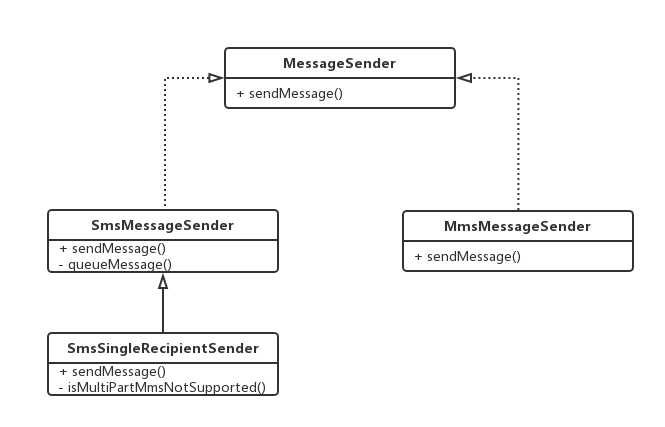

MessageSender 定义了 sendMessage 方法，发送短信（SMS）的实现是 SmsMessageSender

> src/com/android/mms/transaction/SmsMessageSender.java


```
public boolean sendMessage(long token) throws MmsException {
    // In order to send the message one by one, instead of sending now, the message will split,
    // and be put into the queue along with each destinations
    return queueMessage(token);
}

private boolean queueMessage(long token) throws MmsException {
    /// M:
    MmsLog.i(MmsApp.TXN_TAG, "queueMessage()");
    // 再次检查信息内容和收集人不能为空
    if ((mMessageText == null) || mMessageText.isEmpty() || (mNumberOfDests == 0)) {
        // Don't try to send an empty message.
        throw new MmsException("Null message body or dest.");
    }
    // 发送报告
    SharedPreferences prefs = PreferenceManager.getDefaultSharedPreferences(mContext);
    boolean requestDeliveryReport =
        prefs.getBoolean(mSubId + "_" + SmsPreferenceActivity.SMS_DELIVERY_REPORT_MODE,
            DEFAULT_DELIVERY_REPORT_MODE);
    MmsLog.d(MmsApp.TXN_TAG, "SMS DR request=" + requestDeliveryReport);
    /// @}
    long timeStamp = System.currentTimeMillis();
    // 遍历收件人，每个收件人发一封
    for (int i = 0; i < mNumberOfDests; i++) {
        try {
            ...
            // 加入发送队列，即写入数据库
            Sms.addMessageToUri(mSubId,
                mContext.getContentResolver(),
                Uri.parse("content://sms/queued"), mDests[i],
                mMessageText, null, mTimestamp,
                true /* read */,
                requestDeliveryReport,
                mThreadId);
        } catch (SQLiteException e) {
            if (LogTag.DEBUG_SEND) {
                Log.e(TAG, "queueMessage SQLiteException", e);
            }
            SqliteWrapper.checkSQLiteException(mContext, e);
        }
    }
    // 通知 SmsReceiverService 发送
    // Notify the SmsReceiverService to send the message out
    mContext.sendBroadcast(new Intent(SmsReceiverService.ACTION_SEND_MESSAGE,
            null,
            mContext,
            SmsReceiver.class));
    return false;
}
```

> /frameworks/base/telephony/java/android/telephony/Telephony.java


```
/**
 * Add an SMS to the given URI with thread_id specified.
 *
 * @param resolver the content resolver to use
 * @param uri the URI to add the message to
 * @param address the address of the sender
 * @param body the body of the message
 * @param subject the psuedo-subject of the message
 * @param date the timestamp for the message
 * @param read true if the message has been read, false if not
 * @param deliveryReport true if a delivery report was requested, false if not
 * @param threadId the thread_id of the message
 * @param subId the subscription which the message belongs to
 * @return the URI for the new message
 * @hide
 */
public static Uri addMessageToUri(int subId, ContentResolver resolver,
        Uri uri, String address, String body, String subject,
        Long date, boolean read, boolean deliveryReport, long threadId) {
    ContentValues values = new ContentValues(8);
    Rlog.v(TAG,"Telephony addMessageToUri sub id: " + subId);

    values.put(SUBSCRIPTION_ID, subId);
    values.put(ADDRESS, address);
    if (date != null) {
        values.put(DATE, date);
    }
    values.put(READ, read ? Integer.valueOf(1) : Integer.valueOf(0));
    values.put(SUBJECT, subject);
    values.put(BODY, body);
    if (deliveryReport) {
        values.put(STATUS, STATUS_PENDING);
    }
    if (threadId != -1L) {
        values.put(THREAD_ID, threadId);
    }
    return resolver.insert(uri, values);
}
```
SmsMessageSender 的主要作用就是分析收件人地址，得到收件人的个数，然后把信息按每个收信人都放入待发送的队列中，如果有多个收件人就是群发。这样就得到了一个短信发送队列 “content://sms/queued”，短信的数目就是收信人的个数。然后将 SmsReceiverService.ACTION_SEND_MESSAGE 使用广播通知 SmsReceiver

> src/com/android/mms/transaction/SmsReceiver.java


```
/**
 * Handle incoming SMSes.  Just dispatches the work off to a Service.
 */
public class SmsReceiver extends BroadcastReceiver {
    ...

    @Override
    public void onReceive(Context context, Intent intent) {
        ...

        onReceiveWithPrivilege(context, intent, false);
    }

    protected void onReceiveWithPrivilege(Context context, Intent intent, boolean privileged) {
        ...

        MmsLog.d(MmsApp.TXN_TAG, "SmsReceiver: onReceiveWithPrivilege(). SubId = "
                        + intent.getIntExtra(PhoneConstants.SUBSCRIPTION_KEY,
                                SubscriptionManager.INVALID_SUBSCRIPTION_ID)
            + ", Action = " + intent.getAction()
            + ", result = " + getResultCode());
        intent.setClass(context, SmsReceiverService.class);
        intent.putExtra("result", getResultCode());
        beginStartingService(context, intent);
    }

    /**
     * Start the service to process the current event notifications, acquiring
     * the wake lock before returning to ensure that the service will run.
     */
    public static void beginStartingService(Context context, Intent intent) {
        ...
        context.startService(intent);
        ...
    }

    ...
}
```
SmsReceive 并没有做 Action 判断，而是直接中转给 SmsReceiverService 处理

> src/com/android/mms/transaction/SmsReceiverService.java


```
/**
 * This service essentially plays the role of a "worker thread", allowing us to store
 * incoming messages to the database, update notifications, etc. without blocking the
 * main thread that SmsReceiver runs on.
 */
public class SmsReceiverService extends Service implements ISmsReceiverServiceCallback {
    private ServiceHandler mServiceHandler;
    //private Looper mServiceLooper;
    static HandlerThread sSmsTHandler = null;

    @Override
    public void onCreate() {
        ...
        // Start up the thread running the service.  Note that we create a
        // separate thread because the service normally runs in the process's
        // main thread, which we don't want to block.
        if (sSmsTHandler == null) {
            sSmsTHandler = new HandlerThread(TAG, Process.THREAD_PRIORITY_BACKGROUND);
            sSmsTHandler.start();
        }
        ...
        mServiceHandler = new ServiceHandler(sSmsTHandler.getLooper());
        ...
    }

    @Override
    public int onStartCommand(Intent intent, int flags, int startId) {
        ...
        // Temporarily removed for this duplicate message track down.
        MmsLog.d(MmsApp.TXN_TAG, "onStartCommand SmsReceiverService");

        ...

        // 通过 Handler 对当前请求的 Acition 进行处理
        Message msg = mServiceHandler.obtainMessage();
        msg.arg1 = startId;
        msg.obj = intent;
        mServiceHandler.sendMessage(msg);
        return Service.START_NOT_STICKY;
    }

    private final class ServiceHandler extends Handler {
        ...

        /**
         * Handle incoming transaction requests.
         * The incoming requests are initiated by the MMSC Server or by the MMS Client itself.
         */
        @Override
        public void handleMessage(Message msg) {
            /// M:
            MmsLog.dpi(MmsApp.TXN_TAG, "Sms handleMessage :" + msg);
            int serviceId = msg.arg1;
            Intent intent = (Intent) msg.obj;
            ...
            // KK migration, for default MMS function.
            if (intent != null && MmsConfig.isSmsEnabled(getApplicationContext())) {
                String action = intent.getAction();
                ....
                } else if (ACTION_SEND_MESSAGE.endsWith(action)) {
                    // 发送处理
                    handleSendMessage();
                }
                ...
            }
            ...
        }
    }

    private void handleSendMessage() {
        MmsLog.d(MmsApp.TXN_TAG, "handleSendMessage()");
        if (!mSending) {
            // 当前没有其他任务时就触发发送的操作
            sendFirstQueuedMessage();
        }
    }
}
```
SmsReceiverService 并不只负责接收信息，它其实是负责短信（SMS）收发的 Service，这个 Service 被创建时，会创建一个子线程（HandlerThread）以及该线程的 Handler 对象（ServiceHandler），扮演一个“工作线程”的角色。先看其对发送短信（ACTION_SEND_MESSAGE）的处理


```
public synchronized void sendFirstQueuedMessage() {
    ...
    boolean success = true;
    // 待发送队列
    // get all the queued messages from the database
    final Uri uri = Uri.parse("content://sms/queued");

    String selection = null;
    selection = Sms.SUBSCRIPTION_ID + " NOT IN " + "(" + getNoServiceSimString() + ")";

    ContentResolver resolver = getContentResolver();
    Cursor c = SqliteWrapper.query(this, resolver, uri,
                    SEND_PROJECTION, selection, null, "date ASC");
                    // date ASC so we send out in
                    // same order the user tried
                    // to send messages.
    if (c != null) {
        try {
            // 发送队列中第一条短信
            if (c.moveToFirst()) {
                ...
                // 构建 SmsSingleRecipientSender 发送
                SmsMessageSender sender = new SmsSingleRecipientSender(this,
                        address, msgText, threadId, status == Sms.STATUS_PENDING,
                        msgUri, subId);

                ...

                sender.sendMessage(SendingProgressTokenManager.NO_TOKEN);;
                mSending = true;

                ...
        } finally {
            c.close();
        }
    }
    if (success) {
        // We successfully sent all the messages in the queue. We don't need to
        // be notified of any service changes any longer.
        unRegisterForServiceStateChanges();
    }
}
```
将数据库中的当前要发送的短信队列取出来，然后取出队列中第一个短信任务，通过 SmsSingleRecipientSender 的 sendMessage 方法发送出去。

> src/com/android/mms/transaction/SmsSingleRecipientSender.java


```
public boolean sendMessage(long token) throws MmsException {
    ...
    // 编码
    /// M:Code analyze 002,add a variable to caculate the length of sms @{
    int codingType = SmsMessage.ENCODING_UNKNOWN;

    MtkSmsManager smsManager = MtkSmsManager.getSmsManagerForSubscriptionId(mSubId);
    ArrayList<String> messages = null;
    ...
    // 拆分长信息
    /// M:Code analyze 003,add a parameter codingType to caculate length of sms @{
    messages = smsManager.divideMessage(mMessageText, codingType);
    /// @}
    // 格式化收件人号码
    // remove spaces and dashes from destination number
    // (e.g. "801 555 1212" -> "8015551212")
    // (e.g. "+8211-123-4567" -> "+82111234567")
    /// M:Code analyze 004, comment the line,using customized striping pattern to mDest @{
    //mDest = PhoneNumberUtils.stripSeparators(mDest);
    /** M: remove space from des number (e.g. "801 555 1212" -> "8015551212") @{ */
    mDest = mDest.replaceAll(" ", "");
    mDest = mDest.replaceAll("-", "");
    /// @}
    mDest = Conversation.verifySingleRecipient(mContext, mThreadId, mDest);
    ...
    int messageCount = messages.size();
    /// M:
    MmsLog.d(MmsApp.TXN_TAG, "SmsSingleRecipientSender: sendMessage(), Message Count=" + messageCount);

    if (messageCount == 0) {
        // Don't try to send an empty message.
        throw new MmsException("SmsMessageSender.sendMessage: divideMessage returned " + "empty messages. Original message is \"" + mMessageText + "\"");
    }

    // 移至“发件箱”（OutBox）
    boolean moved = Sms.moveMessageToFolder(mContext, mUri, Sms.MESSAGE_TYPE_OUTBOX, 0);
    if (!moved) {
        throw new MmsException("SmsMessageSender.sendMessage: couldn't move message " + "to outbox: " + mUri);
    }
    ...
    ArrayList<PendingIntent> deliveryIntents =  new ArrayList<PendingIntent>(messageCount);
    ArrayList<PendingIntent> sentIntents = new ArrayList<PendingIntent>(messageCount);

    for (int i = 0; i < messageCount; i++) {
        // 如果需要发送报告，在最后一条（拆分）短信附加 PendingIntent
        if (mRequestDeliveryReport && (i == (messageCount - 1))) {
            if (!mOpSmsSenderExt.sendOpMessage(mContext, mSubId, deliveryIntents)) {
                // TODO: Fix: It should not be necessary to
                // specify the class in this intent.  Doing that
                // unnecessarily limits customizability.
                deliveryIntents.add(PendingIntent.getBroadcast(
                        mContext, 0,
                        new Intent(
                                MessageStatusReceiver.MESSAGE_STATUS_RECEIVED_ACTION,
                                mUri,
                                mContext,
                                MessageStatusReceiver.class)
                                        .putExtra(PhoneConstants.SUBSCRIPTION_KEY, mSubId),
                                0));
            }
        } else {
            deliveryIntents.add(null);
        }
        // 每条（拆分）短信均附加用于反馈的 PendingIntent
        Intent intent  = new Intent(SmsReceiverService.MESSAGE_SENT_ACTION,
                mUri,
                mContext,
                SmsReceiver.class);
        // 在最后一条（拆分）短信添加的 Pendingintent 中增加附加数据
        if (i == messageCount - 1) {
            intent.putExtra(SmsReceiverService.EXTRA_MESSAGE_SENT_SEND_NEXT, true);
        }
        // 标记拆分的长短信
        /// M:Code analyze 008, add for concatenation msg @{
        if (messageCount > 1) {
            intent.putExtra(SmsReceiverService.EXTRA_MESSAGE_CONCATENATION, true);
        }
        /// @}
        ...
        intent.putExtra(PhoneConstants.SUBSCRIPTION_KEY, mSubId);
        /// M:Code analyze 007, comment the line,using different
        /// requestCode for every sub_message @{
        sentIntents.add(PendingIntent.getBroadcast(mContext, i, intent, 0));
        /// @}
    }
    try {
        /// M:Code analyze 008, print log @{
        MmsLog.dpi(MmsApp.TXN_TAG, "\t Destination\t= " + mDest
                + "\t ServiceCenter\t= " + mServiceCenter
                + "\t Message\t= " + messages
                + "\t uri\t= " + mUri
                + "\t subId\t= " + mSubId
                + "\t CodingType\t= " + codingType);
        /// @}

        // 是否支持多页发送
        boolean isMultiPartNotSupported = isMultiPartMmsNotSupported();
        if (isMultiPartNotSupported == true) {
            // 备选方案，循环遍历发送
            //In case multipart SMS is not supported
            for (int msgSegemtSent = 0; msgSegemtSent < messageCount; msgSegemtSent++) {
                smsManager.sendTextMessage(mDest,
                mServiceCenter,
                messages.get(msgSegemtSent),
                sentIntents.get(msgSegemtSent),
                deliveryIntents.get(msgSegemtSent));
            }

        } else if (!mOpSmsSenderExt.sendMessage(mContext,
                         mSubId, mDest, mServiceCenter, messages, sentIntents, deliveryIntents)) {
            // 默认支持多页发送
            smsManager.sendMultipartTextMessageWithEncodingType(mDest, mServiceCenter,
            messages, codingType, sentIntents, deliveryIntents);
        }
        ...
    } catch (Exception ex) {
        Log.e(TAG, "SmsMessageSender.sendMessage: caught", ex);
        throw new MmsException("SmsMessageSender.sendMessage: caught " + ex +
                " from SmsManager.sendTextMessage()");
    }
    ...
    return false;
}
```
SmsSingleRecipientSender 类继承自 SmsMessageSender，首先调用 SmsManager 的 divideMessage 方法来把短信拆分成适合发送的几个部分。GSM 标准允许的短信长度为 140 字节，常用的中文编码每个汉字需要两个字节，即 70 个汉字；如果使用纯英文的 ASCII 编码，每个字符只需要 7bit，即 160 个 ASCII 字符。如果信息过长，不能一次发送完成，就需要分成几页来分次发送，Mms 默认最大支持 3 页，超出 3 页将会自动转化为彩信（MMS）。

同时会把短信移动到发件箱（OutBox）。在通过 SmsManager 发送短信之前，还添加了两个 Intent：

- MessageStatusReceiver.MESSAGE_STATUS_RECEIVED_ACTION：如果需要发送报告，则当所有（拆分）短信发送完毕后，发送该 Intent，作为送达的通知
- SmsReceiverService.MESSAGE_SENT_ACTION：分割后的短信，每发送一页，都会发送该 Intent，其中最后一页中该 Intent 还会附加 EXTRA_MESSAGE_SENT_SEND_NEXT=true 的数据，用于标识短信已发送

同样，SmsReceiverService 并不是自己去监听这两个 Action，而是由 SmsReceiver 来监听，然后再中转给 SmsReceiverService 进行处理，后面会讲到。

最后调用 SmsManager.sendMultipartTextMessage 交由 framework 来发送短信，至此 SMS 的发送流程开始进入 framework 处理。

这里先不分析 framework 中的处理，先看看 Mms 对短信发送完成 MESSAGE_SENT_ACTION 的处理。根据前面的分析，接收该 Action 的是 SmsReceiver，实际的处理还是在 SmsReceiverService 中：

```
@Override
public void handleMessage(Message msg) {
    /// M:
    MmsLog.dpi(MmsApp.TXN_TAG, "Sms handleMessage :" + msg);
    ...
    // KK migration, for default MMS function.
    if (intent != null && MmsConfig.isSmsEnabled(getApplicationContext())) {
        String action = intent.getAction();

        int error = intent.getIntExtra("errorCode", 0);
        ...

        if (MESSAGE_SENT_ACTION.equals(intent.getAction())) {
            handleSmsSent(intent, error);
        }
        ...
    }
    ...
}

private void handleSmsSent(Intent intent, int error) {
    /// M:
    int resultCode = intent != null ? intent.getIntExtra("result", 0) : 0;
    MmsLog.d(MmsApp.TXN_TAG, "handleSmsSent(), errorcode= "
            + error + "resultCode=" + resultCode);
    Uri uri = intent.getData();
    mSending = false;
    // EXTRA_MESSAGE_SENT_SEND_NEXT=true 标志整条短信已发送完成
    boolean sendNextMsg = intent.getBooleanExtra(EXTRA_MESSAGE_SENT_SEND_NEXT, false);

    ...

    int subId = intent.getIntExtra(PhoneConstants.SUBSCRIPTION_KEY,
            SubscriptionManager.INVALID_SUBSCRIPTION_ID);
    if (!SubscriptionManager.isValidSubscriptionId(subId)) {
        Log.e(TAG, "subId in handleSmsSent() is invalid!");
        return;
    }

    int phoneId = SubscriptionManager.getPhoneId(subId);
    String inEcm = TelephonyManager.getTelephonyProperty(phoneId,
            TelephonyProperties.PROPERTY_INECM_MODE, null);

    if (resultCode == Activity.RESULT_OK) {
        /// M:
        MmsLog.d(MmsApp.TXN_TAG, "handleSmsSent(), result is RESULT_OK");
        ...
        /// M:Code analyze 016,change logic for just only
        /// checking one part of long sms is sent failed
        /// or not,if yes,means this long sms is sent failed,no need move it to other boxes @{
        if (sendNextMsg) { //this is the last part of a sms.a long sms's part is sent ordered.
            Cursor cursor = SqliteWrapper.query(this, getContentResolver(),
                                        uri, new String[] {Sms.TYPE}, null, null, null);
            if (cursor != null) {
                try {
                    if ((cursor.getCount() == 1) && cursor.moveToFirst()) {
                        int smsType = 0;
                        smsType = cursor.getInt(0);
                        // if smsType is failed, that means at least one
                        // part of this long sms is sent failed.
                        // then this long sms is sent failed.
                        // so we shouldn't move it to other boxes.just keep it in failed box.
                        if (smsType != Sms.MESSAGE_TYPE_FAILED) {
                            // 将已发送成功的短信移入“已发送”（SentBox）
                            //move sms from out box to sent box
                            if (!Sms.moveMessageToFolder(this,
                                    uri, Sms.MESSAGE_TYPE_SENT, error)) {
                                Log.e(TAG, "handleSmsSent: failed to move message "
                                            + uri + " to sent folder");
                            }
                        }
                    }
                } finally {
                    cursor.close();
                }
            }
        }
        /// @}
        // 继续发送给其他收件人
        if (sendNextMsg) {
            sendFirstQueuedMessage();
        }

        // Update the notification for failed messages since they may be deleted.
        MessagingNotification.nonBlockingUpdateSendFailedNotification(this);
    } else if ((!Boolean.parseBoolean(inEcm)) &&
            ((resultCode == SmsManager.RESULT_ERROR_RADIO_OFF)
            || (resultCode == SmsManager.RESULT_ERROR_NO_SERVICE))) {
        /// M:Code analyze 018,print error type @{
        if (resultCode == SmsManager.RESULT_ERROR_RADIO_OFF) {
            MmsLog.d(MmsApp.TXN_TAG, "handleSmsSent(), result is RESULT_ERROR_RADIO_OFF");
        } else if (resultCode == SmsManager.RESULT_ERROR_NO_SERVICE) {
            MmsLog.d(MmsApp.TXN_TAG, "handleSmsSent(), result is RESULT_ERROR_NO_SERVICE");
        } else {
            MmsLog.d(MmsApp.TXN_TAG, "handleSmsSent(), radio state is start");
        }
        /// @}
        ...
        registerForServiceStateChanges(subId);
        // We couldn't send the message, put in the queue to retry later.
        /// M:Code analyze 019, if smsType is failed, that means at least one part of this long
        /// sms is sent failed.then this long sms is sent failed. @{
        Cursor cursor = SqliteWrapper.query(this, getContentResolver(),
                                        uri, new String[] {Sms.TYPE}, null, null, null);
        if (cursor != null) {
            try {
                if ((cursor.getCount() == 1) && cursor.moveToFirst()) {
                    int smsType = 0;
                    smsType = cursor.getInt(0);
                    // if smsType is failed, that means at least one
                    // part of this long sms is sent failed.
                    // then this long sms is sent failed.
                    // so we shouldn't move it to other boxes.just keep it in failed box.
                    // 异常发送失败，继续加入排队
                    if (smsType != Sms.MESSAGE_TYPE_FAILED) {
                        Sms.moveMessageToFolder(this, uri, Sms.MESSAGE_TYPE_QUEUED, error);
                        MmsLog.d(MmsApp.TXN_TAG, "move message " + uri + " to queue folder");
                        mToastHandler.post(new Runnable() {
                            public void run() {
                                Toast.makeText(SmsReceiverService.this,
                                        getString(R.string.message_queued),
                                        Toast.LENGTH_SHORT).show();
                            }
                        });
                    } else {
                        MmsLog.d(MmsApp.TXN_TAG, "One or more part was failed," +
                            " should not move to queue folder.");
                    }
                }
            } finally {
                cursor.close();
            }
        }
        /// @}

    } else {
        //ALPS03198359/ALPS03200348 : Update status only when it is in outbox.
        //Since msg-Id of deleted message will be taken by new message .
        //So on update from URI wrong message(new) will be updated
        Cursor cursor = SqliteWrapper.query(this, getContentResolver(),
                                        uri, new String[] {Sms.TYPE}, null, null, null);
        if (cursor != null) {
            try {
                if ((cursor.getCount() == 1) && cursor.moveToFirst()) {
                    int smsType = 0;
                    smsType = cursor.getInt(0);
                    // 发送失败
                    if (smsType == Sms.MESSAGE_TYPE_OUTBOX) {
                        messageFailedToSend(uri, error);
                        if (resultCode == SmsManager.RESULT_ERROR_FDN_CHECK_FAILURE) {
                            mToastHandler.post(new Runnable() {
                                public void run() {
                                    Toast.makeText(SmsReceiverService.this,
                                    getString(R.string.fdn_check_failure),
                                    Toast.LENGTH_SHORT).show();
                                }
                            });
                        }
                    }
                }
            } finally {
                cursor.close();
            }
        }
        // 继续发送给其他收件人
        if (sendNextMsg) {
            sendFirstQueuedMessage();
        }
    }
}
```

如果满足以下条件：

- resultCode == Activity.RESULT_OK
- EXTRA_MESSAGE_SENT_SEND_NEXT=true
- smsType != Sms.MESSAGE_TYPE_FAILED

则代表整条短信发送成功，将其从 "content://sms/queued" 队列移动到 "content://sms/sent" 队列。然后在 sendFirstQueuedMessage 中继续处理，根据前面的分析，首先检查是否有未发送的短信，对于单收件人则发送流程全部结束；而对于多收件人的情况，由于之前只发送出去了第一条短信，而且已经将已发送的短信从该队列移出，因此此时的队列中只有其他收件人的短信，然后取出其中的第一条，再次进入发送通道，接下来的流程和之前的相同，直到全部发送完成。

### 在 framework 中的处理

短信的发送最终还是通过调用 framework 中相应的 API 实现的，下面开始分析在 framework 以及 RIL层中的发送流程。

#### 流程图


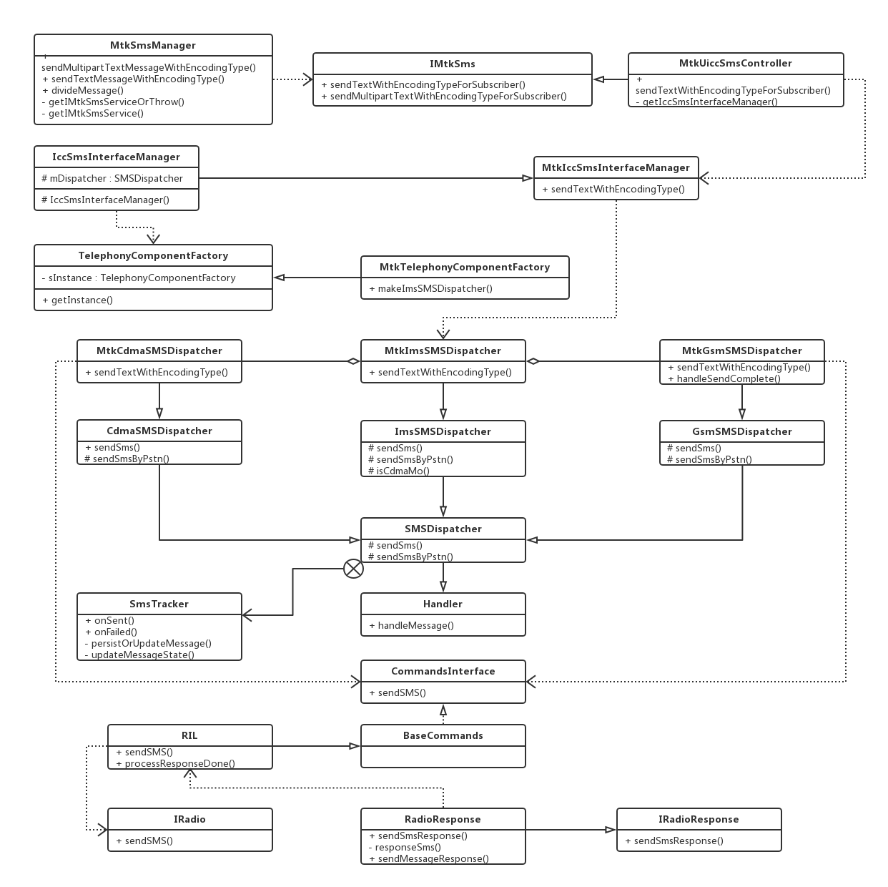

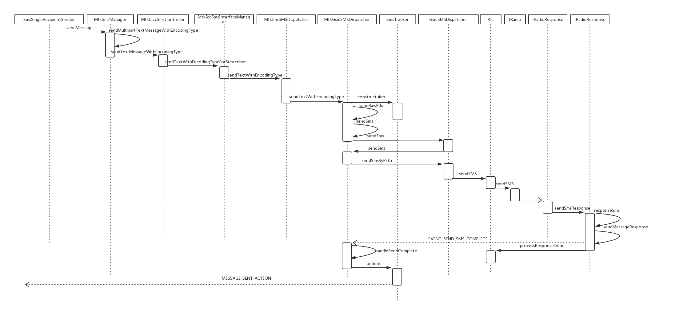


#### 流程解析

以 Mms 调用的 API 为例：

> /vendor/mediatek/proprietary/frameworks/opt/telephony-base/java/mediatek/telephony/MtkSmsManager.java


```
/**
 * Send a multi-part text based SMS.  The callee should have already
 * divided the message into correctly sized parts by calling
 * <code>divideMessage</code>.
 *
 * @param subId subscription identity
 * @param destAddr the address to send the message to
 * @param scAddr is the service center address or null to use
 *   the current default SMSC
 * @param parts an <code>ArrayList</code> of strings that, in order,
 *   comprise the original message
 * @param encodingType the encoding type of message(gsm 7-bit, unicode or automatic)
 * @param sentIntents if not null, an <code>ArrayList</code> of
 *   <code>PendingIntent</code>s (one for each message part) that is
 *   broadcast when the corresponding message part has been sent.
 *   The result code will be <code>Activity.RESULT_OK<code> for success,
 *   or one of these errors:<br>
 *   <code>RESULT_ERROR_GENERIC_FAILURE</code><br>
 *   <code>RESULT_ERROR_RADIO_OFF</code><br>
 *   <code>RESULT_ERROR_NULL_PDU</code><br>
 *   For <code>RESULT_ERROR_GENERIC_FAILURE</code> each sentIntent may include
 *   the extra "errorCode" containing a radio technology specific value,
 *   generally only useful for troubleshooting.<br>
 *   The per-application based SMS control checks sentIntent. If sentIntent
 *   is NULL the caller will be checked against all unknown applicaitons,
 *   which cause smaller number of SMS to be sent in checking period.
 * @param deliveryIntents if not null, an <code>ArrayList</code> of
 *   <code>PendingIntent</code>s (one for each message part) that is
 *   broadcast when the corresponding message part has been delivered
 *   to the recipient.  The raw pdu of the status report is in the
 *   extended data ("pdu").
 *
 * @throws IllegalArgumentException if destinationAddress or data are empty
 *
 * @internal
 * @hide
 */
public void sendMultipartTextMessageWithEncodingType(String destAddr, String scAddr,
        ArrayList<String> parts, int encodingType, ArrayList<PendingIntent> sentIntents,
        ArrayList<PendingIntent> deliveryIntents) {
    Rlog.d(TAG, "sendMultipartTextMessageWithEncodingType, encoding=" + encodingType);
    ...

    // 多页信息
    if (parts != null && parts.size() > 1) {
        ...
    // 单页信息
    } else {
        PendingIntent sentIntent = null;
        PendingIntent deliveryIntent = null;
        if (sentIntents != null && sentIntents.size() > 0) {
            sentIntent = sentIntents.get(0);
        }
        Rlog.d(TAG, "get sentIntent: " + sentIntent);
        if (deliveryIntents != null && deliveryIntents.size() > 0) {
            deliveryIntent = deliveryIntents.get(0);
        }
        Rlog.d(TAG, "send single message");
        if (parts != null) {
            Rlog.d(TAG, "parts.size = " + parts.size());
        }
        String text = (parts == null || parts.size() == 0) ? "" : parts.get(0);
        Rlog.d(TAG, "pass encoding type " + encodingType);
        sendTextMessageWithEncodingType(destAddr, scAddr, text, encodingType, sentIntent,
                deliveryIntent);
    }
}

public void sendTextMessageWithEncodingType(String destAddr, String scAddr, String text,
        int encodingType, PendingIntent sentIntent, PendingIntent deliveryIntent) {
    Rlog.d(TAG, "sendTextMessageWithEncodingType, text=" + text + ", encoding=" + encodingType);
    ...

    try {
        IMtkSms iccISms = getIMtkSmsServiceOrThrow();
        if (iccISms != null) {
            iccISms.sendTextWithEncodingTypeForSubscriber(getSubscriptionId(),
                ActivityThread.currentPackageName(), destAddr, scAddr, text, encodingType,
                sentIntent, deliveryIntent, true /*persistMessageForCarrierApp*/);
        }
    } catch (RemoteException ex) {
        Rlog.d(TAG, "RemoteException");
    }
}

/**
 * Returns the IMtkSms service, or throws an UnsupportedOperationException if
 * the service does not exist.
 */
private static IMtkSms getIMtkSmsServiceOrThrow() {
    IMtkSms iccISms = getIMtkSmsService();
    if (iccISms == null) {
        throw new UnsupportedOperationException("SmsEx is not supported");
    }
    return iccISms;
}

private static IMtkSms getIMtkSmsService() {
    return IMtkSms.Stub.asInterface(ServiceManager.getService("imtksms"));
}
```
不管是多页还是单页 SMS， 最终都是使用 IMtkSms.aidl 通过 IPC 调用实现。IMtkSms.aidl 是 MTK 对 AOSP 中 ISms.aidl 的定制实现。下面以单页为例：

> /vendor/mediatek/proprietary/frameworks/opt/telephony/src/java/com/mediatek/internal/telephony/MtkUiccSmsController.java


```
/**
 * Send an SMS with specified encoding type.
 *
 * @param subId subscription identity
 * @param callingPackage the calling packages
 * @param destAddr the address to send the message to
 * @param scAddr the SMSC to send the message through, or NULL for the
 *  default SMSC
 * @param text the body of the message to send
 * @param encodingType the encoding type of content of message(GSM 7-bit, Unicode or Automatic)
 * @param sentIntent if not NULL this <code>PendingIntent</code> is
 *  broadcast when the message is sucessfully sent, or failed.
 *  The result code will be <code>Activity.RESULT_OK<code> for success,
 *  or one of these errors:<br>
 *  <code>RESULT_ERROR_GENERIC_FAILURE</code><br>
 *  <code>RESULT_ERROR_RADIO_OFF</code><br>
 *  <code>RESULT_ERROR_NULL_PDU</code><br>
 *  For <code>RESULT_ERROR_GENERIC_FAILURE</code> the sentIntent may include
 *  the extra "errorCode" containing a radio technology specific value,
 *  generally only useful for troubleshooting.<br>
 *  The per-application based SMS control checks sentIntent. If sentIntent
 *  is NULL the caller will be checked against all unknown applications,
 *  which cause smaller number of SMS to be sent in checking period.
 * @param deliveryIntent if not NULL this <code>PendingIntent</code> is
 *  broadcast when the message is delivered to the recipient.  The
 *  raw pdu of the status report is in the extended data ("pdu").
 * @param persistMessageForNonDefaultSmsApp whether to save the sent message into SMS DB for a
 *   non-default SMS app.
 */
public void sendTextWithEncodingTypeForSubscriber(int subId, String callingPackage,
        String destAddr, String scAddr, String text, int encodingType, PendingIntent sentIntent,
        PendingIntent deliveryIntent, boolean persistMessageForNonDefaultSmsApp) {
    MtkIccSmsInterfaceManager iccSmsIntMgr = getIccSmsInterfaceManager(subId);
    if (iccSmsIntMgr != null) {
        iccSmsIntMgr.sendTextWithEncodingType(callingPackage, destAddr, scAddr, text,
            encodingType, sentIntent, deliveryIntent, persistMessageForNonDefaultSmsApp);
    } else {
        Rlog.e(LOG_TAG, "sendTextWithEncodingTypeForSubscriber iccSmsIntMgr is null for" + "subscription: " + subId);
        sendErrorInPendingIntent(sentIntent, SmsManager.RESULT_ERROR_GENERIC_FAILURE);
    }
}

/**
 * get sms interface manager object based on subscription.
 **/
private @Nullable MtkIccSmsInterfaceManager getIccSmsInterfaceManager(int subId) {
    if (!isActiveSubId(subId)) {
        Rlog.e(LOG_TAG, "Subscription " + subId + " is inactive.");
        return null;
    }

    int phoneId = SubscriptionController.getInstance().getPhoneId(subId) ;
    //Fixme: for multi-subscription case
    if (!SubscriptionManager.isValidPhoneId(phoneId)
            || phoneId == SubscriptionManager.DEFAULT_PHONE_INDEX) {
        phoneId = 0;
    }

    try {
        return (MtkIccSmsInterfaceManager)
            ((Phone)mPhone[(int)phoneId]).getIccSmsInterfaceManager();
    } catch (NullPointerException e) {
        Rlog.e(LOG_TAG, "Exception is :"+e.toString()+" For subscription :"+subId );
        e.printStackTrace();
        return null;
    } catch (ArrayIndexOutOfBoundsException e) {
        Rlog.e(LOG_TAG, "Exception is :"+e.toString()+" For subscription :"+subId );
        e.printStackTrace();
        return null;
    }
}
```
根据 Phone 对象获取 MtkIccSmsInterfaceManager，它继承自 IccSmsInterfaceManager

> /frameworks/opt/telephony/src/java/com/android/internal/telephony/IccSmsInterfaceManager.java


```
/**
 * IccSmsInterfaceManager to provide an inter-process communication to
 * access Sms in Icc.
 */
public class IccSmsInterfaceManager {
    protected SMSDispatcher mDispatcher;
    ...
    protected IccSmsInterfaceManager(Phone phone) {
        ...
        // MTK-START
        // Modified for sub class
        //mDispatcher = new ImsSMSDispatcher(phone,
        //        phone.mSmsStorageMonitor, phone.mSmsUsageMonitor);
        mDispatcher = TelephonyComponentFactory.getInstance().makeImsSMSDispatcher(phone,
                phone.mSmsStorageMonitor, phone.mSmsUsageMonitor);
        // MTK-END
    }
    ...
}
```
> /vendor/mediatek/proprietary/frameworks/opt/telephony/src/java/com/mediatek/internal/telephony/MtkIccSmsInterfaceManager.java


```
public class MtkIccSmsInterfaceManager extends IccSmsInterfaceManager {
    ...
    public void sendTextWithEncodingType(String callingPackage, String destAddr, String scAddr, String text,
        int encodingType, PendingIntent sentIntent, PendingIntent deliveryIntent, boolean persistMessage) {
        mPhone.getContext().enforceCallingPermission(
        Manifest.permission.SEND_SMS, "Sending SMS message");

        ...

        ((MtkImsSMSDispatcher)mDispatcher).sendTextWithEncodingType(destAddr, scAddr, text,
            encodingType, sentIntent, deliveryIntent, null/*messageUri*/, callingPackage, persistMessage);
    }
    ...
}
```
首先检查是否具有 “SEND_SMS” 权限，再通过 SmsDispatcher 进行发送，MTK对此进行了定制，通过 IccSmsInterfaceManager 的构造方法可以发现，MTK 通过工厂类来获取 SmsDispatcher.

> /frameworks/opt/telephony/src/java/com/android/internal/telephony/TelephonyComponentFactory.java


```
/**
 * This class has one-line methods to instantiate objects only. The purpose is to make code
 * unit-test friendly and use this class as a way to do dependency injection. Instantiating objects
 * this way makes it easier to mock them in tests.
 */
public class TelephonyComponentFactory {
    private static TelephonyComponentFactory sInstance;
    ...
    public static TelephonyComponentFactory getInstance() {
        if (sInstance == null) {
            String className = "com.mediatek.internal.telephony.MtkTelephonyComponentFactory";
            String classPackage = "/system/framework/mediatek-telephony-common.jar";
            Class<?> clazz = null;
            try {
                clazz = Class.forName(className, false, ClassLoader.getSystemClassLoader());
                Rlog.d(LOG_TAG, "class = " + clazz);
                Constructor clazzConstructfunc = clazz.getConstructor();
                Rlog.d(LOG_TAG, "constructor function = " + clazzConstructfunc);
                sInstance = (TelephonyComponentFactory) clazzConstructfunc.newInstance();
            } catch (Exception  e) {
                Rlog.e(LOG_TAG, "No MtkTelephonyComponentFactory! Used AOSP for instead!");
                sInstance = new TelephonyComponentFactory();
            }
        }
        return sInstance;
    }

    ...

}
```
实例化其子类 MtkTelephonyComponentFactory

> /vendor/mediatek/proprietary/frameworks/opt/telephony/src/java/com/mediatek/internal/telephony/MtkTelephonyComponentFactory.java


```
public class MtkTelephonyComponentFactory extends TelephonyComponentFactory {
    ...
    /**
     * Create ImsSMSDispatcher
     */
    public ImsSMSDispatcher makeImsSMSDispatcher(Phone phone,
            SmsStorageMonitor storageMonitor, SmsUsageMonitor usageMonitor) {
        return new MtkImsSMSDispatcher(phone, storageMonitor, usageMonitor);
    }
    ...
}
```
通过类型转换也可知 SmsDispatcher 的实例为其子类 MtkImsSMSDispatcher 的实现

> /vendor/mediatek/proprietary/frameworks/opt/telephony/src/java/com/mediatek/internal/telephony/MtkImsSMSDispatcher.java

```
protected void sendTextWithEncodingType(String destAddr, String scAddr,
        String text, int encodingType, PendingIntent sentIntent,
        PendingIntent deliveryIntent, Uri messageUri, String callingPkg,
        boolean persistMessage) {
    if (isCdmaMo()) {
        ((MtkCdmaSMSDispatcher) mCdmaDispatcher).sendTextWithEncodingType(destAddr,
                scAddr, text, encodingType, sentIntent, deliveryIntent, messageUri, callingPkg, persistMessage);
    } else {
        ((MtkGsmSMSDispatcher)mGsmDispatcher).sendTextWithEncodingType(destAddr, scAddr, text,
                encodingType, sentIntent, deliveryIntent, messageUri, callingPkg,
                persistMessage);
    }
}
```
根据当前网络类型选择不同的 SMSDispatcher，下面以 MtkGsmSMSDispatcher 为例：

> /vendor/mediatek/proprietary/frameworks/opt/telephony/src/java/com/mediatek/internal/telephony/gsm/MtkGsmSMSDispatcher.java


```
public void sendTextWithEncodingType(String destAddr, String scAddr, String text,
        int encodingType, PendingIntent sentIntent, PendingIntent deliveryIntent,
        Uri messageUri, String callingPkg, boolean persistMessage) {
    ...
    // 对短信内容进行编码
    int encoding = encodingType;
    TextEncodingDetails details = SmsMessage.calculateLength(text, false);
    if (encoding != details.codeUnitSize &&
            (encoding == SmsConstants.ENCODING_UNKNOWN ||
            encoding == SmsConstants.ENCODING_7BIT)) {
        Rlog.d(TAG, "[enc conflict between details[" + details.codeUnitSize
                + "] and encoding " + encoding);
        details.codeUnitSize = encoding;
    }

    // 将收件人地址与信息内容进行编码封装成 pdu 格式
    SmsMessage.SubmitPdu pdu = SmsMessage.getSubmitPdu(
            scAddr, destAddr, text, (deliveryIntent != null),
            null, encoding, details.languageTable, details.languageShiftTable);

    if (pdu != null) {
        // 继续封装成 SmsTracker，用于追踪 SMS 在 RIL 中的处理
        HashMap map = getSmsTrackerMap(destAddr, scAddr, text, pdu);
        SmsTracker tracker = getSmsTracker(map, sentIntent, deliveryIntent, getFormat(),
                messageUri, false /*isExpectMore*/, text /*fullMessageText*/, true /*isText*/,
                persistMessage);
        // 优先使用运营商内置服务
        String carrierPackage = getCarrierAppPackageName();
        if (carrierPackage != null) {
            Rlog.d(TAG, "Found carrier package.");
            TextSmsSender smsSender = new TextSmsSender(tracker);
            smsSender.sendSmsByCarrierApp(carrierPackage, new SmsSenderCallback(smsSender));
        } else {
            // 一般都没有运营商内置服务
            Rlog.v(TAG, "No carrier package.");
            sendRawPdu(tracker);
        }
    } else {
        Rlog.e(TAG,
                "GsmSMSDispatcher.sendTextWithEncodingType(): getSubmitPdu() returned null");
        if (sentIntent != null) {
            try {
                sentIntent.send(RESULT_ERROR_NULL_PDU);
            } catch (CanceledException ex) {
                Rlog.e(TAG, "failed to send back RESULT_ERROR_NULL_PDU");
            }
        }
    }
}

@Override
public void sendRawPdu(SmsTracker tracker) {
    // 从 SmsTracker 取出 pdu
    HashMap map = tracker.getData();
    byte pdu[] = (byte[]) map.get("pdu");
    // 短信发送是否可用
    if (mSmsSendDisabled) {
        Rlog.e(TAG, "Device does not support sending sms.");
        tracker.onFailed(mContext, RESULT_ERROR_NO_SERVICE, 0/*errorCode*/);
        return;
    }
    // pdu 是否为空
    if (pdu == null) {
        Rlog.e(TAG, "Empty PDU");
        tracker.onFailed(mContext, RESULT_ERROR_NULL_PDU, 0/*errorCode*/);
        return;
    }
    // 发送 SMS 的 package 有效
    // Get calling app package name via UID from Binder call
    PackageManager pm = mContext.getPackageManager();
    String[] packageNames = pm.getPackagesForUid(Binder.getCallingUid());

    if (packageNames == null || packageNames.length == 0) {
        // Refuse to send SMS if we can't get the calling package name.
        Rlog.e(TAG, "Can't get calling app package name: refusing to send SMS");
        tracker.onFailed(mContext, RESULT_ERROR_GENERIC_FAILURE, 0/*errorCode*/);
        return;
    }

    ...

    // checkDestination() returns true if the destination is not a premium short code or the
    // sending app is approved to send to short codes. Otherwise, a message is sent to our
    // handler with the SmsTracker to request user confirmation before sending.
    // 检查目标地址
    if (checkDestination(tracker)) {
        // check for excessive outgoing SMS usage by this app
        // 检查是否允许应用程序发送所请求的新短消息数量，一般返回 true
        if (!mUsageMonitor.check(appInfo.packageName, SINGLE_PART_SMS)) {
            sendMessage(obtainMessage(EVENT_SEND_LIMIT_REACHED_CONFIRMATION, tracker));
            return;
        }

        sendSms(tracker);
    }

    if (PhoneNumberUtils.isLocalEmergencyNumber(mContext, tracker.mDestAddress)) {
        new AsyncEmergencyContactNotifier(mContext).execute();
    }
}

@Override
protected void sendSms(SmsTracker tracker) {
    HashMap<String, Object> map = tracker.getData();

    byte pdu[] = (byte[]) map.get("pdu");

    boolean isReadySend = false;
    synchronized (mSTrackersQueue) {
        if (mSTrackersQueue.isEmpty() || mSTrackersQueue.get(0) != tracker) {
            Rlog.d(TAG, "Add tracker into the list: " + tracker);
            mSTrackersQueue.add(tracker);
        }
        if (mSTrackersQueue.get(0) == tracker) {
            isReadySend = true;
        }
    }

    if (!isReadySend) {
        Rlog.d(TAG, "There is another tracker in-queue and is sending");
        return;
    }

    super.sendSms(tracker);
}
```
将 SmsTracker 加入队列，调用父类 sendSms 方法

> /frameworks/opt/telephony/src/java/com/android/internal/telephony/gsm/GsmSMSDispatcher.java


```
@Override
protected void sendSms(SmsTracker tracker) {
    HashMap<String, Object> map = tracker.getData();

    byte pdu[] = (byte[]) map.get("pdu");

    if (tracker.mRetryCount > 0) {
        Rlog.d(TAG, "sendSms: "
                + " mRetryCount=" + tracker.mRetryCount
                + " mMessageRef=" + tracker.mMessageRef
                + " SS=" + mPhone.getServiceState().getState());

        // per TS 23.040 Section 9.2.3.6:  If TP-MTI SMS-SUBMIT (0x01) type
        //   TP-RD (bit 2) is 1 for retry
        //   and TP-MR is set to previously failed sms TP-MR
        if (((0x01 & pdu[0]) == 0x01)) {
            pdu[0] |= 0x04; // TP-RD
            pdu[1] = (byte) tracker.mMessageRef; // TP-MR
        }
    }
    Rlog.d(TAG, "sendSms: "
            + " isIms()=" + isIms()
            + " mRetryCount=" + tracker.mRetryCount
            + " mImsRetry=" + tracker.mImsRetry
            + " mMessageRef=" + tracker.mMessageRef
            + " SS=" + mPhone.getServiceState().getState());

    sendSmsByPstn(tracker);
}
```
首先判断重试次数，如果大于0，会根据协议对 pdu 进行额外处理。继续看 MtkGsmSMSDispatcher 中的 sendSmsByPstn 方法


```
@Override
protected void sendSmsByPstn(SmsTracker tracker) {
    // 判断手机状态
    int ss = mPhone.getServiceState().getState();
    // if sms over IMS is not supported on data and voice is not available...
    // MTK-START
    // For the Wifi calling, We need to support sending SMS when radio is power off
    // and wifi calling is enabled. So we need to pass the SMS sending request to the
    // modem when radio is OFF.
    if (!isIms() && ss != ServiceState.STATE_IN_SERVICE
            && !mTelephonyManager.isWifiCallingAvailable()) {
    // MTK-END
        tracker.onFailed(mContext, getNotInServiceError(ss), 0/*errorCode*/);
        // MTK-START
        Message delay = obtainMessage(EVENT_DELAY_SEND_MESSAGE_QUEUE, tracker);
        // Delay 10 milliseconds to avoid ANR in lots of wait to send messages inside
        sendMessageDelayed(delay, 10);
        // MTK-END
        return;
    }

    HashMap<String, Object> map = tracker.getData();

    byte smsc[] = (byte[]) map.get("smsc");
    byte[] pdu = (byte[]) map.get("pdu");
    // 发送完成的消息
    Message reply = obtainMessage(EVENT_SEND_SMS_COMPLETE, tracker);

    // sms over gsm is used:
    //   if sms over IMS is not supported AND
    //   this is not a retry case after sms over IMS failed
    //     indicated by mImsRetry > 0
    if (0 == tracker.mImsRetry && !isIms()) {
        if (tracker.mRetryCount > 0) {
            // per TS 23.040 Section 9.2.3.6:  If TP-MTI SMS-SUBMIT (0x01) type
            //   TP-RD (bit 2) is 1 for retry
            //   and TP-MR is set to previously failed sms TP-MR
            if (((0x01 & pdu[0]) == 0x01)) {
                pdu[0] |= 0x04; // TP-RD
                pdu[1] = (byte) tracker.mMessageRef; // TP-MR
            }
        }
        if (tracker.mRetryCount == 0 && tracker.mExpectMore) {
            mCi.sendSMSExpectMore(IccUtils.bytesToHexString(smsc),
                    IccUtils.bytesToHexString(pdu), reply);
        } else {
            mCi.sendSMS(IccUtils.bytesToHexString(smsc),
                    IccUtils.bytesToHexString(pdu), reply);
        }
    } else {
        mCi.sendImsGsmSms(IccUtils.bytesToHexString(smsc),
                IccUtils.bytesToHexString(pdu), tracker.mImsRetry,
                tracker.mMessageRef, reply);
        // increment it here, so in case of SMS_FAIL_RETRY over IMS
        // next retry will be sent using IMS request again.
        tracker.mImsRetry++;
    }
}
```
自此就开始调用 mCi，即 CommandsInterface，进入 RIL 层

> /frameworks/opt/telephony/src/java/com/android/internal/telephony/RIL.java


```
@Override
public void sendSMS(String smscPdu, String pdu, Message result) {
    IRadio radioProxy = getRadioProxy(result);
    if (radioProxy != null) {
        // 构建 RILRequest
        RILRequest rr = obtainRequest(RIL_REQUEST_SEND_SMS, result,
                mRILDefaultWorkSource);

        // Do not log function args for privacy
        if (RILJ_LOGD) riljLog(rr.serialString() + "> " + requestToString(rr.mRequest));

        GsmSmsMessage msg = constructGsmSendSmsRilRequest(smscPdu, pdu);

        try {
            radioProxy.sendSms(rr.mSerial, msg);
            mMetrics.writeRilSendSms(mPhoneId, rr.mSerial, SmsSession.Event.Tech.SMS_GSM,
                    SmsSession.Event.Format.SMS_FORMAT_3GPP);
        } catch (RemoteException | RuntimeException e) {
            handleRadioProxyExceptionForRR(rr, "sendSMS", e);
        }
    }
}
```
这里使用到了 HIDL（Hardware Interface Definition Language），用于指定 HAL 与其用户之间接口的一个接口描述语言，实际上是用于进行进程间通信（Inter-process Communication，IPC）的，即 Binder 化（Binderized）。Android 中本来有 AIDL，架构在 Android Binder 之上，用来定义 Android 基于 Binder 通信的 Client 与 Service 之间的接口。HIDL 也是类似的作用，只不过定义的是 Android Framework 与 Android HAL 实现之间的接口。HIDL 在 Android O 中被全面使用，其诞生目的是使 Android 可以在不重新编译 HAL 的情况下对 framework 进行 OTA 升级。IRadio 位于 HAL 层，开始转入 modem 处理，不在分析范围，不过可以看看 IRadio.hal

> /hardware/interfaces/radio/1.0/IRadio.hal


```
/**
 * Send an SMS message
 *
 * @param serial Serial number of request.
 * @param message GsmSmsMessage as defined in types.hal
 *
 * Response function is IRadioResponse.sendSmsResponse()
 *
 * Based on the return error, caller decides to resend if sending sms
 * fails. RadioError:SMS_SEND_FAIL_RETRY means retry (i.e. error cause is 332)
 * and RadioError:GENERIC_FAILURE means no retry (i.e. error cause is 500)
 */
oneway sendSms(int32_t serial, GsmSmsMessage message);
```
由注释推断其响应函数在 IRadioResponse 中，通过 sendSmsResponse 返回处理结果

> /hardware/interfaces/radio/1.0/IRadioResponse.hal


```
/**
 * @param info Response info struct containing response type, serial no. and error
 * @param sms Response to sms sent as defined by SendSmsResult in types.hal
 *
 * Valid errors returned:
 *   RadioError:NONE
 *   RadioError:RADIO_NOT_AVAILABLE
 *   RadioError:SMS_SEND_FAIL_RETRY
 *   RadioError:NETWORK_REJECT
 *   RadioError:INVALID_STATE
 *   RadioError:INVALID_ARGUMENTS
 *   RadioError:NO_MEMORY
 *   RadioError:REQUEST_RATE_LIMITED
 *   RadioError:INVALID_SMS_FORMAT
 *   RadioError:SYSTEM_ERR
 *   RadioError:ENCODING_ERR
 *   RadioError:INVALID_SMSC_ADDRESS
 *   RadioError:MODEM_ERR
 *   RadioError:NETWORK_ERR
 *   RadioError:INTERNAL_ERR
 *   RadioError:REQUEST_NOT_SUPPORTED
 *   RadioError:INVALID_MODEM_STATE
 *   RadioError:NETWORK_NOT_READY
 *   RadioError:OPERATION_NOT_ALLOWED
 *   RadioError:NO_RESOURCES
 *   RadioError:CANCELLED
 *   RadioError:SIM_ABSENT
 */
oneway sendSmsResponse(RadioResponseInfo info, SendSmsResult sms);
```
参考 IRadio，根据函数名查找 IRadioResponse 在 RIL 中的实现

> /frameworks/opt/telephony/src/java/com/android/internal/telephony/RadioResponse.java


```
/**
 * @param responseInfo Response info struct containing response type, serial no. and error
 * @param sms Response to sms sent as defined by SendSmsResult in types.hal
 */
public void sendSmsResponse(RadioResponseInfo responseInfo,
                            SendSmsResult sms) {
    responseSms(responseInfo, sms);
}

private void responseSms(RadioResponseInfo responseInfo, SendSmsResult sms) {
    RILRequest rr = mRil.processResponse(responseInfo);

    if (rr != null) {
        SmsResponse ret = new SmsResponse(sms.messageRef, sms.ackPDU, sms.errorCode);
        if (responseInfo.error == RadioError.NONE) {
            sendMessageResponse(rr.mResult, ret);
        }
        mRil.processResponseDone(rr, responseInfo, ret);
    }
}

/**
 * Helper function to send response msg
 * @param msg Response message to be sent
 * @param ret Return object to be included in the response message
 */
public static void sendMessageResponse(Message msg, Object ret) {
    if (msg != null) {
        AsyncResult.forMessage(msg, ret, null);
        msg.sendToTarget();
    }
}
```
如果 response error 为 RadioError.NONE，则发送 “EVENT_SEND_SMS_COMPLETE” 返回到 SMSDispatcher。然后执行打印错误信息，释放资源等操作：

> /frameworks/opt/telephony/src/java/com/android/internal/telephony/RIL.java


```
/**
 * This is a helper function to be called at the end of all RadioResponse callbacks.
 * It takes care of sending error response, logging, decrementing wakelock if needed, and
 * releases the request from memory pool.
 * @param rr RILRequest for which response callback was called
 * @param responseInfo RadioResponseInfo received in the callback
 * @param ret object to be returned to request sender
 */
public void processResponseDone(RILRequest rr, RadioResponseInfo responseInfo, Object ret) {
    if (responseInfo.error == 0) {
        if (RILJ_LOGD) {
            riljLog(rr.serialString() + "< " + requestToString(rr.mRequest)
                    + " " + retToString(rr.mRequest, ret));
        }
    } else {
        if (RILJ_LOGD) {
            riljLog(rr.serialString() + "< " + requestToString(rr.mRequest)
                    + " error " + responseInfo.error);
        }
        rr.onError(responseInfo.error, ret);
    }
    mMetrics.writeOnRilSolicitedResponse(mPhoneId, rr.mSerial, responseInfo.error,
            rr.mRequest, ret);
    if (rr != null) {
        if (responseInfo.type == RadioResponseType.SOLICITED) {
            decrementWakeLock(rr);
        }
        rr.release();
    }
}
```
SMSDispatcher 收到 EVENT_SEND_SMS_COMPLETE，表示（拆分）短信发送完成（并不一定发送成功）

> /frameworks/opt/telephony/src/java/com/android/internal/telephony/SMSDispatcher.java


```
@Override
public void handleMessage(Message msg) {
    switch (msg.what) {
    case EVENT_SEND_SMS_COMPLETE:
        // An outbound SMS has been successfully transferred, or failed.
        handleSendComplete((AsyncResult) msg.obj);
        break;
    ...
    }
}
```
其在 MtkGsmSMSDispatcher 的实现：


```
/**
 * Called when SMS send completes. Broadcasts a sentIntent on success.
 * On failure, either sets up retries or broadcasts a sentIntent with
 * the failure in the result code.
 *
 * @param ar AsyncResult passed into the message handler.  ar.result should
 *           an SmsResponse instance if send was successful.  ar.userObj
 *           should be an SmsTracker instance.
 */
protected void handleSendComplete(AsyncResult ar) {
    SmsTracker tracker = (SmsTracker) ar.userObj;
    PendingIntent sentIntent = tracker.mSentIntent;
    // 发送下一个
    handleSendNextTracker(tracker);

    if (ar.result != null) {
        tracker.mMessageRef = ((SmsResponse)ar.result).mMessageRef;
    } else {
        Rlog.d(TAG, "SmsResponse was null");
    }

    if (ar.exception == null) {
        if (ENG) Rlog.d(TAG, "SMS send complete. Broadcasting intent: " + sentIntent);
        // 发送报告
        if (tracker.mDeliveryIntent != null) {
            // Expecting a status report.  Add it to the list.
            deliveryPendingList.add(tracker);
        }
        tracker.onSent(mContext);
    } else {
        if (ENG) Rlog.d(TAG, "SMS send failed");

        int ss = mPhone.getServiceState().getState();

        if ( tracker.mImsRetry > 0 && ss != ServiceState.STATE_IN_SERVICE) {
            // This is retry after failure over IMS but voice is not available.
            // Set retry to max allowed, so no retry is sent and
            //   cause RESULT_ERROR_GENERIC_FAILURE to be returned to app.
            tracker.mRetryCount = MAX_SEND_RETRIES;

            Rlog.d(TAG, "handleSendComplete: Skipping retry: "
            +" isIms()="+isIms()
            +" mRetryCount="+tracker.mRetryCount
            +" mImsRetry="+tracker.mImsRetry
            +" mMessageRef="+tracker.mMessageRef
            +" SS= "+mPhone.getServiceState().getState());
        }

        // if sms over IMS is not supported on data and voice is not available...
        if (!isIms() && ss != ServiceState.STATE_IN_SERVICE) {
            tracker.onFailed(mContext, getNotInServiceError(ss), 0/*errorCode*/);
        // MTK-START: No need to retry due to modem has already retry it
        ...
        // MTK-END: No need to retry due to modem has already retry it
        } else {
            int errorCode = 0;
            if (ar.result != null) {
                errorCode = ((SmsResponse)ar.result).mErrorCode;
            }
            int error = RESULT_ERROR_GENERIC_FAILURE;
            if (((CommandException)(ar.exception)).getCommandError()
                    == CommandException.Error.FDN_CHECK_FAILURE) {
                error = RESULT_ERROR_FDN_CHECK_FAILURE;
            }
            tracker.onFailed(mContext, error, errorCode);
        }
    }
}
```
发送完成后，首先从 AsyncResult 中取出 SmsTracker， 再从 SmsTracker 中取出 PendingIntent。SmsTracker 队列中存在则继续发送下一个，当前发送有异常则尝试 retry 或者执行 SmsTracker 的 onFailed 方法，否则执行 OnSent 方法


```
/**
 * Handle the sent of a single part message or a part of a multipart message
 *
 * @param context The Context
 */
public void onSent(Context context) {
    // is single part or last part of multipart message
    boolean isSinglePartOrLastPart = true;
    if (mUnsentPartCount != null) {
        isSinglePartOrLastPart = mUnsentPartCount.decrementAndGet() == 0;
    }
    if (isSinglePartOrLastPart) {
        int messageType = Sms.MESSAGE_TYPE_SENT;
        if (mAnyPartFailed != null && mAnyPartFailed.get()) {
            messageType = Sms.MESSAGE_TYPE_FAILED;
        }
        // MTK_START: use AsyncTask to access database
        //persistOrUpdateMessage(context, messageType, 0/*errorCode*/);
        new AsyncPersistOrUpdateTask(context, messageType, 0, 0, false).execute();
        return;
        // MTK-END
    }
    ...
}

/**
 * Handle a failure of a single part message or a part of a multipart message
 *
 * @param context The Context
 * @param error The error to send back with
 * @param errorCode
 */
public void onFailed(Context context, int error, int errorCode) {
    ...
    // is single part or last part of multipart message
    boolean isSinglePartOrLastPart = true;
    if (mUnsentPartCount != null) {
        isSinglePartOrLastPart = mUnsentPartCount.decrementAndGet() == 0;
    }
    if (isSinglePartOrLastPart) {
        // MTK_START: use AsyncTask to access database
        /*
        persistOrUpdateMessage(context, Sms.MESSAGE_TYPE_FAILED, errorCode);
        */
        new AsyncPersistOrUpdateTask(context, Sms.MESSAGE_TYPE_FAILED,
                errorCode, error, true).execute();
        return;
        // MTK-END
    }
    ...
}

/**
 * Async Task to persist or update message.
 */
class AsyncPersistOrUpdateTask extends AsyncTask<Void, Void, Void> {

    ...

    @Override
    protected Void doInBackground(Void... params) {
        persistOrUpdateMessage(mContext, mMessageType, mErrorCode);
        return null;
    }

    @Override
    protected void onPostExecute(Void result) {
        if (mSentIntent != null) {
            try {
                // Extra information to send with the sent intent
                Intent fillIn = new Intent();
                if (mMessageUri != null) {
                    // Pass this to SMS apps so that they know where it is stored
                    fillIn.putExtra("uri", mMessageUri.toString());
                }
                if (mFail && (mErrorCode != 0)) {
                    fillIn.putExtra("errorCode", mErrorCode);
                }
                if (mUnsentPartCount != null) {
                    // Is multipart and last part
                    fillIn.putExtra(SEND_NEXT_MSG_EXTRA, true);
                }
                int szPdu = 0;
                int smscLength = 0;
                int pduLength = 0;
                if (mData != null) {
                    if (mData.get("smsc") != null) {
                        smscLength = ((byte[]) mData.get("smsc")).length;
                    }
                    if (mData.get("pdu") != null) {
                        pduLength = ((byte[]) mData.get("pdu")).length;
                    }
                    szPdu = smscLength + pduLength;
                }
                fillIn.putExtra(PDU_SIZE, szPdu);
                if (!mFail) {
                    fillIn.putExtra(MSG_REF_NUM, mMessageRef);
                    Rlog.d(TAG, "message reference number : " + mMessageRef);
                    mSentIntent.send(mContext, Activity.RESULT_OK, fillIn);
                } else {
                    mSentIntent.send(mContext, mError, fillIn);
                }
            } catch (CanceledException ex) {
                Rlog.e(TAG, "Failed to send result");
            }
        }
    }
}

/**
 * Persist or update an SMS depending on if we send a new message or a stored message
 *
 * @param context
 * @param messageType The message folder for this SMS, FAILED or SENT
 * @param errorCode The current error code for this SMS or SMS part
 */
private void persistOrUpdateMessage(Context context, int messageType, int errorCode) {
    if (mMessageUri != null) {
        updateMessageState(context, messageType, errorCode);
    } else {
        mMessageUri = persistSentMessageIfRequired(context, messageType, errorCode);
    }
}

/**
 * Set the final state of a message: FAILED or SENT
 *
 * @param context The Context
 * @param messageType The final message type
 * @param errorCode The error code
 */
private void updateMessageState(Context context, int messageType, int errorCode) {
    if (mMessageUri == null) {
        return;
    }
    final ContentValues values = new ContentValues(2);
    values.put(Sms.TYPE, messageType);
    values.put(Sms.ERROR_CODE, errorCode);
    final long identity = Binder.clearCallingIdentity();
    try {
        if (SqliteWrapper.update(context, context.getContentResolver(), mMessageUri,     values, null/*where*/, null/*selectionArgs*/) != 1) {
            Rlog.e(TAG, "Failed to move message to " + messageType);
        }
    } finally {
        Binder.restoreCallingIdentity(identity);
    }
}
```
更新发送状态（MESSAGE_TYPE_SENT or MESSAGE_TYPE_FAILED）并通过 PendingIntent 返回给 Mms（SmsReceiver） 相关信息，短信的发送在 framework 中的处理至此结束。

## 发送 MMS

彩信（MMS）与短信（SMS）的发送流程并不完全一致，与分析发送 SMS 一样，首先分析发送 MMS 在 Mms 中的处理流程。

### 在 Mms 中的处理

根据前面的分析，在 WorkingMessage 中进行分别处理，对于 MMS，首先将 MMS 封装成 MtkSendReq，然后通过 sendMmsWorker 发送。

#### 流程图


#### 流程解析

```
private void sendMmsWorker(Conversation conv, Uri mmsUri, MtkPduPersister persister,
            SlideshowModel slideshow, MtkSendReq sendReq, int subId) {
    long threadId = 0;
    Cursor cursor = null;
    boolean newMessage = false;
    try {
        // 标识为草稿
        // Put a placeholder message in the database first
        DraftCache.getInstance().setSavingDraft(true);
        // 更新 UI
        mStatusListener.onPreMessageSent();

        ...
        // 获取会话 ID
        threadId = conv.ensureThreadId();

        MmsLog.dpi(TAG, "sendMmsWorker: update draft MMS message " + mmsUri +
                    " threadId: " + threadId);

        // 处理收件人
        // One last check to verify the address of the recipient.
        String[] dests = conv.getRecipients().getNumbers(true /* scrub for MMS address */);

        newMessage = mmsUri == null;
        // 更新 Message Uri
        if (newMessage) {
            // check if a draft is already present for current thread
            final String selection = Mms.THREAD_ID + " = " + threadId;
            cursor = SqliteWrapper.query(mActivity, mContentResolver, Mms.Draft.CONTENT_URI,
                    MMS_DRAFT_PROJECTION, selection, null, null);
            if (cursor == null) {
                Log.d(TAG, "[readDraftMmsMessage] cursor is null");
            }
            try {
                if (cursor != null) {
                    if (cursor.moveToFirst()) {
                        Uri uri = ContentUris.withAppendedId(Mms.Draft.CONTENT_URI,
                                cursor.getLong(MMS_ID_INDEX));
                        Log.d(TAG, "retrieved uri = " + uri);
                        mMessageUri = mmsUri = uri;
                        newMessage = mmsUri == null;
                    }
                }
            } finally {
                if (cursor != null) {
                    cursor.close();
                }
            }

        }
        // 存入数据库
        if (newMessage) {
            // Write something in the database so the new message will appear as sending
            ContentValues values = new ContentValues();
            values.put(Mms.MESSAGE_BOX, Mms.MESSAGE_BOX_OUTBOX);
            values.put(Mms.THREAD_ID, threadId);
            values.put(Mms.MESSAGE_TYPE, MtkPduHeaders.MESSAGE_TYPE_SEND_REQ);
            /// M: Code analyze 047, For new feature ALPS00316567, add a parameter for msim. @{
            values.put(Telephony.BaseMmsColumns.SUBSCRIPTION_ID, subId);
            /// @}
            mmsUri = SqliteWrapper.insert(mActivity, mContentResolver, Mms.Outbox.CONTENT_URI,
                    values);
        }

        ...
    } finally {
        if (cursor != null) {
            cursor.close();
        }
    }

    try {
        // 保存 MtkSendReq
        MmsDraftData res = DraftManager.getInstance()
                .saveDraft(DraftManager.SYNC_SAVE_ACTION, threadId,
                mmsUri, slideshow, sendReq, mActivity, null);
        if (res != null) {
            if (res.getMessageUri() != null) {
                MmsLog.dpi(TAG_DRAFT, "[sendMmsWorker] mmsUir : " + mmsUri);
                mmsUri = res.getMessageUri();
            }
        }

        // 删除草稿
        // Be paranoid and clean any draft SMS up.
        deleteDraftSmsMessage(threadId);
    } finally {
        DraftCache.getInstance().setSavingDraft(false);
    }

    ...

    try {
        // 构造 MmsMessageSender，其主要参数有 Message Uri，附件大小，发送卡 ID
        MessageSender sender = new MmsMessageSender(mActivity, mmsUri,
                slideshow.getCurrentSlideshowSize(), subId);
        // 发送
        if (!sender.sendMessage(threadId)) {
            // The message was sent through SMS protocol, we should
            // delete the copy which was previously saved in MMS drafts.
            SqliteWrapper.delete(mActivity, mContentResolver, mmsUri, null, null);
        }
        /// M: add for fix issue ALPS00804679 @{
        else {
            Log.d(TAG, "sendMmsWorker: sendMessage success, mark draft false. threadId = "
                    + threadId);
            DraftCache.getInstance().setSavingDraft(true);
            conv.setDraftState(false);
            // 取消标识为草稿
            DraftCache.getInstance().setSavingDraft(false);
        }
        ///@}

        /// M : Fix CR : ALPS01798784, while after send the MMS, lock the screen
        /// the conversation message count will set to be 0, and the threadid will be
        /// set to be 0, so while unlock the screen,
        /// the message will not show in the message list @{
        // 更新 UI
        mStatusListener.onMessageSent();
        /// @}

        // Make sure this thread isn't over the limits in message count
        Recycler.getMmsRecycler().deleteOldMessagesByThreadId(mActivity, threadId);
    } catch (Exception e) {
        Log.e(TAG, "Failed to send message: " + mmsUri + ", threadId=" + threadId, e);
    }
    MmsWidgetProvider.notifyDatasetChanged(mActivity);
}
```
与发送 SMS 类似，通过构建 MessageSender 来实现发送：

> src/com/android/mms/transaction/MmsMessageSender.java


```
public boolean sendMessage(long token) throws MmsException {
    // Load the MMS from the message uri
    MmsLog.d(MmsApp.TXN_TAG, "MmsMessageSender, sendMessage uri: " + mMessageUri);
    // 处理 pdu
    ...

    /// M:Code analyze 002,the uri of pdu moved from draft to outbox @{
    Uri sendUri = null;
    /// @}
    // 将彩信移动到发件箱
    // Move the message into MMS Outbox.
    if (!mMessageUri.toString().startsWith(Mms.Draft.CONTENT_URI.toString())) {
        // If the message is already in the outbox (most likely because we created a "primed"
        // message in the outbox when the user hit send), then we have to manually put an
        // entry in the pending_msgs table which is where TransacationService looks for
        // messages to send. Normally, the entry in pending_msgs is created by the trigger:
        // insert_mms_pending_on_update, when a message is moved from drafts to the outbox.
        ContentValues values = new ContentValues(7);

        values.put(PendingMessages.PROTO_TYPE, MmsSms.MMS_PROTO);
        values.put(PendingMessages.MSG_ID, messageId);
        values.put(PendingMessages.MSG_TYPE, pdu.getMessageType());
        values.put(PendingMessages.ERROR_TYPE, 0);
        values.put(PendingMessages.ERROR_CODE, 0);
        values.put(PendingMessages.RETRY_INDEX, 0);
        values.put(PendingMessages.DUE_TIME, 0);

        SqliteWrapper.insert(mContext, mContext.getContentResolver(),
                PendingMessages.CONTENT_URI, values);
        /// M:Code analyze 002,the uri of pdu moved from draft to outbox @{
        sendUri = mMessageUri;
        /// @}
    } else {
        /// M:Code analyze 002,the uri of pdu moved from draft to outbox @{
        sendUri = p.move(mMessageUri, Mms.Outbox.CONTENT_URI);
        MmsLog.d(MmsApp.TXN_TAG, "MmsMessageSender, move mms from draftBox to outBox");
        /// @}
    }
    ...
    mContext.startService(new Intent(mContext, TransactionService.class));

    return true;
}
```
WorkingMessage 主要是对 MMS 做了 pdu 封装处理，然后启动 TransactionService 继续发送流程

> src/com/android/mms/transaction/TransactionService.java


```
/**
 * The TransactionService of the MMS Client is responsible for handling requests
 * to initiate client-transactions sent from:
 * <ul>
 * <li>The Proxy-Relay (Through Push messages)</li>
 * <li>The composer/viewer activities of the MMS Client (Through intents)</li>
 * </ul>
 * The TransactionService runs locally in the same process as the application.
 * It contains a HandlerThread to which messages are posted from the
 * intent-receivers of this application.
 * <p/>
 * <b>IMPORTANT</b>: This is currently the only instance in the system in
 * which simultaneous connectivity to both the mobile data network and
 * a Wi-Fi network is allowed. This makes the code for handling network
 * connectivity somewhat different than it is in other applications. In
 * particular, we want to be able to send or receive MMS messages when
 * a Wi-Fi connection is active (which implies that there is no connection
 * to the mobile data network). This has two main consequences:
 * <ul>
 * <li>Testing for current network connectivity ({@link android.net.NetworkInfo#isConnected()} is
 * not sufficient. Instead, the correct test is for network availability
 * ({@link android.net.NetworkInfo#isAvailable()}).</li>
 * <li>If the mobile data network is not in the connected state, but it is available,
 * we must initiate setup of the mobile data connection, and defer handling
 * the MMS transaction until the connection is established.</li>
 * </ul>
 */
public class TransactionService extends Service implements Observer, ITransactionServiceCallback {
    ...

    @Override
    public void onCreate() {
        MmsLog.d(MmsApp.TXN_TAG, "Creating TransactionService");
        // Start up the thread running the service.  Note that we create a
        // separate thread because the service normally runs in the process's
        // main thread, which we don't want to block.
        HandlerThread thread = new HandlerThread("TransactionService");
        thread.start();

        mServiceLooper = thread.getLooper();
        mServiceHandler = new ServiceHandler(mServiceLooper);
        ...
    }

    @Override
    public int onStartCommand(Intent intent, int flags, int startId) {
        if (intent != null) {
            Message msg = null;
            MmsLog.d(MmsApp.TXN_TAG, "onStartCommand action = " + intent.getAction());
            ...
            msg = mServiceHandler.obtainMessage(EVENT_NEW_INTENT);
            ...
            msg.arg1 = startId;
            msg.obj = intent;
            mServiceHandler.sendMessage(msg);
        }
        return Service.START_NOT_STICKY;
    }

    private final class ServiceHandler extends Handler {
        public ServiceHandler(Looper looper) {
            super(looper);
        }

        /**
         * Handle incoming transaction requests.
         * The incoming requests are initiated by the MMSC Server or by the
         * MMS Client itself.
         */
        @Override
        public void handleMessage(Message msg) {
            ...

            switch (msg.what) {
                case EVENT_NEW_INTENT:
                    onNewIntent((Intent) msg.obj, msg.arg1);
                    break;

                ...
            }
        }
    }

    public void onNewIntent(Intent intent, int serviceId) {
        ...

        MmsLog.i(MmsApp.TXN_TAG, "onNewIntent: serviceId: " + serviceId + ": " + intent.getExtras()
                + " intent=" + intent);

        String action = intent.getAction();
        ...
        // For launching NotificationTransaction and test purpose.
        TransactionBundle args = new TransactionBundle(intent.getIntExtra(
                TransactionBundle.TRANSACTION_TYPE, Transaction.READREC_TRANSACTION),
                intent.getStringExtra(TransactionBundle.URI));
        int subId = intent.getIntExtra(PhoneConstants.SUBSCRIPTION_KEY,
                SubscriptionManager.INVALID_SUBSCRIPTION_ID);
        MmsLog.d(MmsApp.TXN_TAG, "onNewIntent ACTION else subId = " + subId);
        if (!SubscriptionManager.isValidSubscriptionId(subId)) {
            MmsLog.e(MmsApp.TXN_TAG, "onNewIntent subId error, " + args.toString()
                    + ", subId = " + subId);
        } else {
            launchTransaction(serviceId, args, noNetwork, subId);
        }
        ...

    }

    private void launchTransaction(int serviceId, TransactionBundle txnBundle, boolean noNetwork,
            int subId) {
        ...
        Message msg = mServiceHandler.obtainMessage(EVENT_TRANSACTION_REQUEST);
        msg.arg1 = serviceId;
        MmsLog.d(MmsApp.TXN_TAG, "launchTransaction subId = " + subId);
        if (subId <= Long.MAX_VALUE) {
            msg.arg2 = (int) subId & 0xFFFFFFFF;
        } else {
            Log.e(TAG, "launchTransaction: subId is too large, impossible!!!");
        }
        msg.obj = txnBundle;

        ...
        mServiceHandler.sendMessage(msg);
    }
}
```
WorkingMessage 直接启动 TransactionService，并没有任何 Action，经过 onNewIntent 处理后，通过 EVENT_TRANSACTION_REQUEST 继续


```
case EVENT_TRANSACTION_REQUEST:
    MmsLog.d(MmsApp.TXN_TAG, "EVENT_TRANSACTION_REQUEST");
    int serviceId = msg.arg1;
    int subId = msg.arg2;
    try {
        TransactionBundle args = (TransactionBundle) msg.obj;
        MmsLog.d(MmsApp.TXN_TAG, "EVENT_TRANSACTION_REQUEST MmscUrl=" +
            args.getMmscUrl() + " proxy port: " + args.getProxyAddress() +
            " subId = " + subId);

        // Set the connection settings for this transaction.
        // If these have not been set in args, load the default settings.
        String mmsc = args.getMmscUrl();

        int transactionType = args.getTransactionType();

        ...

        // Create appropriate transaction
        switch (transactionType) {
            ...
            case Transaction.SEND_TRANSACTION:
                MmsLog.d(MmsApp.TXN_TAG, "TRANSACTION REQUEST: SEND_TRANSACTION");
                transaction = new SendTransaction(
                    TransactionService.this, serviceId,
                    mmsc, args.getUri(), subId);
                break;
            ...
        }

        if (!processTransaction(transaction)) {
            transaction = null;
            return;
        }
    ...
    return;
```
TransactionService，与短信（SMS）的 SmsReceiverService 类似，是负责处理彩信（MMS）的 Service，可以发送、接收等。对于 TransactionService 来讲，所有的需要处理的流程，无论是发送还是接收，都是一个 Transaction。它内部有两个队列，一个是当前正在处理（processing）的 Transaction，一个是待处理（pending）的 Transaction。它维护这两个队列，然后从待处理的队列中取出第一个，放入正在处理的队列中，并处理这个 Transaction，也就是调用 Transaction.process() 方法


```
/**
 * Internal method to begin processing a transaction.
 * @param transaction the transaction. Must not be {@code null}.
 * @return {@code true} if process has begun or will begin. {@code false}
 * if the transaction should be discarded.
 * @throws IOException if connectivity for MMS traffic could not be
 * established.
 */
private boolean processTransaction(Transaction transaction)
    throws IOException {
    MmsLog.i(MmsApp.TXN_TAG, "process Transaction");
    // Check if transaction already processing
    synchronized (mProcessing) {
        ...
        MmsLog.i(MmsApp.TXN_TAG, "Adding transaction to 'mProcessing' list: "
                + transaction);
        mProcessing.add(transaction);
    }

    ...
    // Attach to transaction and process it
    transaction.attach(TransactionService.this);
    transaction.process();
    ...

}
```
> src/com/android/mms/transaction/SendTransaction.java


```
/**
 * The SendTransaction is responsible for sending multimedia messages
 * (M-Send.req) to the MMSC server.  It:
 *
 * <ul>
 * <li>Loads the multimedia message from storage (Outbox).
 * <li>Packs M-Send.req and sends it.
 * <li>Retrieves confirmation data from the server  (M-Send.conf).
 * <li>Parses confirmation message and handles it.
 * <li>Moves sent multimedia message from Outbox to Sent.
 * <li>Notifies the TransactionService about successful completion.
 * </ul>
 */
public class SendTransaction extends Transaction implements Runnable {
    private Thread mThread;

    ...

    @Override
    public void process() {
        mThread = new Thread(this, "SendTransaction");
        mThread.start();
    }

    public void run() {
        Log.d(MmsApp.TXN_TAG, "SendTransaction: run");
        ...

        try {
            // 根据 Message Uri 获取 pdu
            final MtkPduPersister persister = MtkPduPersister.getPduPersister(mContext);
            final SendReq sendReq =  (SendReq) persister.load(mUri);
            if (sendReq == null) {
                Log.w(MmsApp.TXN_TAG, "Send req is null!");
                return;
            }
            byte[] datas = new MtkPduComposer(mContext, sendReq).make();
            mPduFile = createPduFile(datas, SEND_REQ_NAME + mUri.getLastPathSegment());
            if (mPduFile == null) {
                Log.w(MmsApp.TXN_TAG, "create pdu file req failed!");
                return;
            }
            // 处理后反馈的 Intent
            Log.d(MmsApp.TXN_TAG, "SendTransaction mUri:" + mUri);
            final Intent intent = new Intent(TransactionService.ACTION_TRANSACION_PROCESSED,
                    mUri,
                    mContext,
                    MmsReceiver.class);
            intent.putExtra(PhoneConstants.SUBSCRIPTION_KEY, mSubId);

            PendingIntent sentIntent = PendingIntent.getBroadcast(mContext, 0, intent,
                    PendingIntent.FLAG_UPDATE_CURRENT);
            MmsLog.dpi(MmsApp.TXN_TAG, "send MMS with param, mUri = "
            + mUri + " mPdufile = " + mPduFile + ", subId = " + mSubId);
            Uri pduFileUri = FileProvider.getUriForFile(
                    mContext, MMS_FILE_PROVIDER_AUTHORITIES, mPduFile);
            /// M: Add MmsService configure param @{
            // 发送
            SmsManager.getSmsManagerForSubscriptionId(mSubId).sendMultimediaMessage(mContext,
                    pduFileUri, null,
                    MmsConfig.getMmsServiceConfig(), sentIntent);
        /// @}
        } catch (Throwable t) {
            Log.e(TAG, Log.getStackTraceString(t));
            getState().setState(FAILED);
            getState().setContentUri(mUri);
            notifyObservers();
        }
    }
}
```
发送彩信是一个 SendTransaction，它的 process() 方法负责发送彩信（MMS），它会创建一个独立的线程来做，因此不会阻塞 TransactionService，处理服务就可以再处理其他的 Transaction。它会先从数据库中取出彩信 Pdu、SendReq，创建 Pdu File，创建 PendingIntent 用于返回结果给 MmsReceiver。最后通过 SmsManager 的 sendMultimediaMessage 方法发送彩信（MMS），由此进入 framework 处理。

先看 Mms 处理来自 framework 的反馈，同发送 SMS 类似，发送结果会通过 PendingIntent 返回，再回到 Mms 的 MmsRecevier

> src/com/android/mms/transaction/MmsReceiver.java


```
/**
 * Handle incoming Mms transaction finished.
 */
public class MmsReceiver extends BroadcastReceiver {
    @Override
    public void onReceive(Context context, Intent intent) {
        onReceiveWithPrivilege(context, intent, false);
    }

    protected void onReceiveWithPrivilege(Context context, Intent intent, boolean privileged) {
        MmsLog.d(
                MmsApp.TXN_TAG, "MmsReceiver: onReceiveWithPrivilege(). sub Id = "
                        + intent.getIntExtra(PhoneConstants.SUBSCRIPTION_KEY,
                                SubscriptionManager.INVALID_SUBSCRIPTION_ID)
            + ", Action = " + intent.getAction()
            + ", result = " + getResultCode()
            + ", uri = " + intent.getStringExtra(TransactionBundle.URI));
        intent.setClass(context, TransactionService.class);
        intent.putExtra("result", getResultCode());
        beginStartingService(context, intent);
    }

    /**
     * Start the service to process the current event notifications, acquiring
     * the wake lock before returning to ensure that the service will run.
     */
    public static void beginStartingService(Context context, Intent intent) {
        context.startService(intent);
    }
}
```
MmsReceiver 也只是负责监听 “ACTION_TRANSACION_PROCESSED”，中转交给 TransactionService 处理

> src/com/android/mms/transaction/TransactionService.java


```
@Override
public int onStartCommand(Intent intent, int flags, int startId) {
    if (intent != null) {
        Message msg = null;
        MmsLog.d(MmsApp.TXN_TAG, "onStartCommand action = " + intent.getAction());
        if (ACTION_TRANSACION_PROCESSED.equals(intent.getAction())) {
            ...
            msg = mServiceHandler.obtainMessage(EVENT_TRANSACTION_PROCESSED);
        }
        ...
        msg.arg1 = startId;
        msg.obj = intent;
        mServiceHandler.sendMessage(msg);
    }
    return Service.START_NOT_STICKY;
}

@Override
public void handleMessage(Message msg) {
    ...
    switch (msg.what) {
        ...
        case EVENT_TRANSACTION_PROCESSED:
            MmsLog.d(MmsApp.TXN_TAG, "EVENT_TRANSACTION_PROCESSED");
            handleTransactionProcessed((Intent) msg.obj, msg.arg1);
            break;
        ...
    }
    ...
}

private void handleTransactionProcessed(Intent intent, int serviceId) {
    ...

    String bundleUri = intent.getData().toString();
    Transaction transaction = getTransactionById(bundleUri);
    int result = intent.getIntExtra("result", SmsManager.MMS_ERROR_UNSPECIFIED);
    MmsLog.d(MmsApp.TXN_TAG, "handleTransactionProcessed(), result = " + result
            + "bundleUri = " + bundleUri + " transaction = " + transaction);
    if (transaction != null && transaction.getUri() != null) {
        transaction.getState().setContentUri(transaction.getUri());
        if (result == Activity.RESULT_OK) {
            if (transaction instanceof NotificationTransaction) {
                result = ((NotificationTransaction) transaction).checkPduResult();
            } else if (transaction instanceof RetrieveTransaction) {
                result = ((RetrieveTransaction) transaction).checkPduResult();
            } else if (transaction instanceof SendTransaction) {
                result = ((SendTransaction) transaction).
                        checkSendResult(
                                intent.getByteArrayExtra(SmsManager.EXTRA_MMS_DATA));
            }
        }
        ...

        if (result == Activity.RESULT_OK) {
            transaction.getState().setState(TransactionState.SUCCESS);
            setTransactionStatus(intent, transaction);
        }

        ...
        transaction.notifyObservers();
    ...
    }
}
```
这里仅以发送成功为例，追踪发送彩信（MMS）的状态

> src/com/android/mms/transaction/SendTransaction.java


```
public int checkSendResult(byte[] response) {
    try {
        int result = Activity.RESULT_OK;
        ...

        int messageStatus = result == Activity.RESULT_OK ?
                Telephony.Mms.MESSAGE_BOX_SENT : Telephony.Mms.MESSAGE_BOX_FAILED;
        final ContentValues values = new ContentValues(3);
        values.put(Telephony.Mms.MESSAGE_BOX, messageStatus);
        if (conf != null) {
            values.put(Telephony.Mms.RESPONSE_STATUS, conf.getResponseStatus());
            values.put(Telephony.Mms.MESSAGE_ID,
                    MtkPduPersister.toIsoString(conf.getMessageId()));
        }
        SqliteWrapper.update(mContext, mContext.getContentResolver(), mUri, values,
                null, null);
        return result;
    } catch (SQLiteException e) {
        Log.e(MmsApp.TXN_TAG, "MtkSendRequest.updateStatus: can not update message", e);
        return SmsManager.MMS_ERROR_UNSPECIFIED;
    } catch (RuntimeException e) {
        Log.e(MmsApp.TXN_TAG, "MtkSendRequest.updateStatus: can not parse response", e);
        return SmsManager.MMS_ERROR_UNSPECIFIED;
    } finally {
        if (mPduFile != null) {
            mPduFile.delete();
        }
    }
}
```
更新数据库，会自动更新 UI，发送彩信（MMS）的整个流程结束。

### 在 framework 中的处理

再来看调用 framework 的实现：

#### 流程图

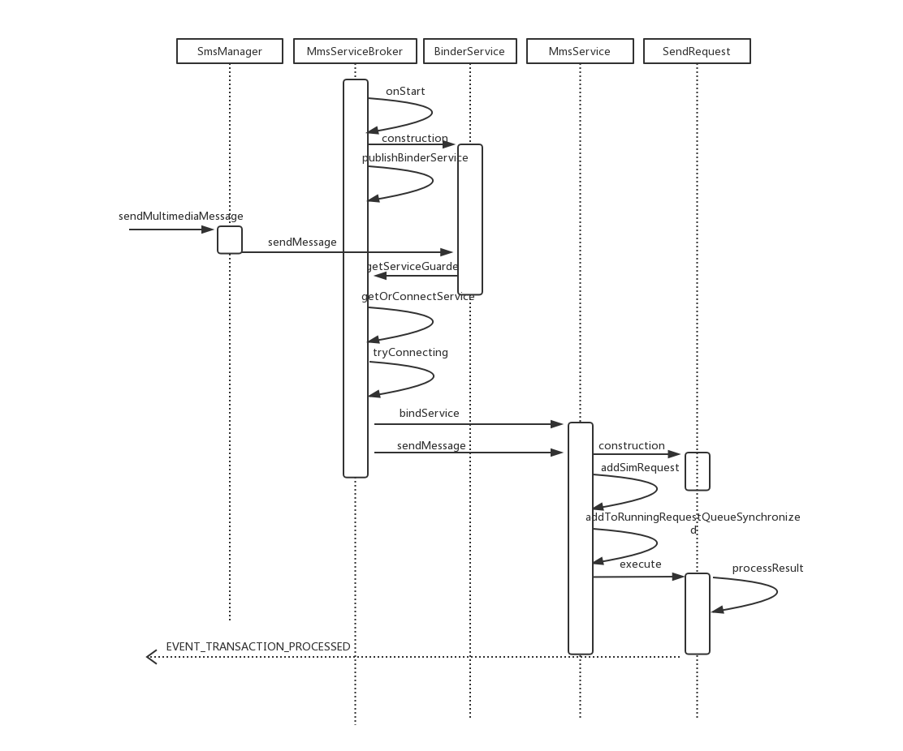

#### 流程解析

> /frameworks/base/telephony/java/android/telephony/SmsManager.java


```
/**
 * Send an MMS message
 *
 * @param context application context
 * @param contentUri the content Uri from which the message pdu will be read
 * @param locationUrl the optional location url where message should be sent to
 * @param configOverrides the carrier-specific messaging configuration values to override for
 *  sending the message.
 * @param sentIntent if not NULL this <code>PendingIntent</code> is
 *  broadcast when the message is successfully sent, or failed
 * @throws IllegalArgumentException if contentUri is empty
 */
public void sendMultimediaMessage(Context context, Uri contentUri, String locationUrl,
        Bundle configOverrides, PendingIntent sentIntent) {
    ...
    try {
        final IMms iMms = IMms.Stub.asInterface(ServiceManager.getService("imms"));
        if (iMms == null) {
            return;
        }

        iMms.sendMessage(getSubscriptionId(), ActivityThread.currentPackageName(), contentUri,
                locationUrl, configOverrides, sentIntent);
    } catch (RemoteException e) {
        // Ignore it
    }
}
```
IMms.aidl 的实现在 MmsServiceBroker 中

> /frameworks/base/services/core/java/com/android/server/MmsServiceBroker.java


```
**
 * This class is a proxy for MmsService APIs. We need this because MmsService runs
 * in phone process and may crash anytime. This manages a connection to the actual
 * MmsService and bridges the public SMS/MMS APIs with MmsService implementation.
 */
public class MmsServiceBroker extends SystemService {
    private static final ComponentName MMS_SERVICE_COMPONENT =
            new ComponentName("com.android.mms.service", "com.android.mms.service.MmsService");
    ...

    // The actual MMS service instance to invoke
    private volatile IMms mService;

    ...

    private final Handler mConnectionHandler = new Handler() {
        @Override
        public void handleMessage(Message msg) {
            switch (msg.what) {
                case MSG_TRY_CONNECTING:
                    tryConnecting();
                    break;
                default:
                    Slog.e(TAG, "Unknown message");
            }
        }
    };

    private ServiceConnection mConnection = new ServiceConnection() {
        @Override
        public void onServiceConnected(ComponentName name, IBinder service) {
            Slog.i(TAG, "MmsService connected");
            synchronized (MmsServiceBroker.this) {
                mService = IMms.Stub.asInterface(Binder.allowBlocking(service));
                MmsServiceBroker.this.notifyAll();
            }
        }

        ...
    };

    ...

    @Override
    public void onStart() {
        publishBinderService("imms", new BinderService());
    }

    private void tryConnecting() {
        Slog.i(TAG, "Connecting to MmsService");
        synchronized (this) {
            if (mService != null) {
                Slog.d(TAG, "Already connected");
                return;
            }
            final Intent intent = new Intent();
            intent.setComponent(MMS_SERVICE_COMPONENT);
            try {
                if (!mContext.bindService(intent, mConnection, Context.BIND_AUTO_CREATE)) {
                    Slog.e(TAG, "Failed to bind to MmsService");
                }
            } catch (SecurityException e) {
                Slog.e(TAG, "Forbidden to bind to MmsService", e);
            }
        }
    }

    private IMms getOrConnectService() {
        synchronized (this) {
            if (mService != null) {
                return mService;
            }
            // Service is not connected. Try blocking connecting.
            Slog.w(TAG, "MmsService not connected. Try connecting...");
            mConnectionHandler.sendMessage(
                    mConnectionHandler.obtainMessage(MSG_TRY_CONNECTING));
            ...

            if (mService != null) {
                // Success
                return mService;
            }
            ...
        }
    }

    /**
     * Make sure to return a non-empty service instance. Return the connected MmsService
     * instance, if not connected, try connecting. If fail to connect, return a fake service
     * instance which returns failure to service caller.
     *
     * @return a non-empty service instance, real or fake
     */
    private IMms getServiceGuarded() {
        final IMms service = getOrConnectService();
        if (service != null) {
            return service;
        }
        return mServiceStubForFailure;
    }

    ...

    // Service API calls implementation, proxied to the real MmsService in "com.android.mms.service"
    private final class BinderService extends IMms.Stub {
        private static final String PHONE_PACKAGE_NAME = "com.android.phone";

        @Override
        public void sendMessage(int subId, String callingPkg, Uri contentUri,
                String locationUrl, Bundle configOverrides, PendingIntent sentIntent)
                        throws RemoteException {
            Slog.d(TAG, "sendMessage() by " + callingPkg);
            mContext.enforceCallingPermission(Manifest.permission.SEND_SMS, "Send MMS message");
            ...
            contentUri = adjustUriForUserAndGrantPermission(contentUri,
                    CarrierMessagingService.SERVICE_INTERFACE,
                    Intent.FLAG_GRANT_READ_URI_PERMISSION);
            getServiceGuarded().sendMessage(subId, callingPkg, contentUri, locationUrl,
                    configOverrides, sentIntent);
        }
        ...
    }

    ...
}
```
MmsServiceBroker 其实是 MmsService 的代理，通过 bindService 绑定 MmsService。MmsService 是 “com.android.mms.service” 中的一个 Service，运行在 “com.android.phone” 进程中

> /packages/services/Mms/AndroidManifest.xml


```
<manifest xmlns:android="http://schemas.android.com/apk/res/android"
          xmlns:androidprv="http://schemas.android.com/apk/prv/res/android"
          package="com.android.mms.service"
          coreApp="true"
          android:sharedUserId="android.uid.phone">
    ...
    <application android:label="MmsService"
                 android:process="com.android.phone"
                 android:usesCleartextTraffic="true">

        <service android:name=".MmsService"
                 android:enabled="true"
                 android:exported="true"/>

    </application>
</manifest>
```
既然是通过 bindService 实现，则查看 MmsService 的实现


```
/**
 * System service to process MMS API requests
 */
public class MmsService extends Service implements MmsRequest.RequestManager {
    ...

    private IMms.Stub mStub = new IMms.Stub() {
        @Override
        public void sendMessage(int subId, String callingPkg, Uri contentUri,
                String locationUrl, Bundle configOverrides, PendingIntent sentIntent)
                        throws RemoteException {
            LogUtil.d("sendMessage");
            ...

            final SendRequest request = new SendRequest(MmsService.this, subId, contentUri,
                    locationUrl, sentIntent, callingPkg, configOverrides, MmsService.this);

            ...
            addSimRequest(request);
            ...
        }

        ...
    }

    ...

    @Override
    public IBinder onBind(Intent intent) {
        return mStub;
    }

    ...
}
```
MmsService 的 onBind 方法返回的 mStub 正是 IMms.aidl 的实现，从 sendMessage 方法可以看出每一次发送彩信均会形成一个 SendRequest，并将其加入到 request 队列中：


```
@Override
public void addSimRequest(MmsRequest request) {
    if (request == null) {
        LogUtil.e("Add running or pending: empty request");
        return;
    }
    LogUtil.d("Current running=" + mRunningRequestCount + ", "
            + "current subId=" + mCurrentSubId + ", "
            + "pending=" + mPendingSimRequestQueue.size());
    synchronized (this) {
        ...
        addToRunningRequestQueueSynchronized(request);
        ...
    }
}

private void addToRunningRequestQueueSynchronized(final MmsRequest request) {
    LogUtil.d("Add request to running queue for subId " + request.getSubId());
    // Update current state of running requests
    final int queue = request.getQueueType();
    ...
    // Send to the corresponding request queue for execution
    mRunningRequestExecutors[queue].execute(new Runnable() {
        @Override
        public void run() {
            try {
                request.execute(MmsService.this, getNetworkManager(request.getSubId()));
            }
            ...
        }
    });
}
```
SendRequest 继承自 MmsRequest（抽象类，其实现类还有 DownloadRequest）


```
/**
 * Base class for MMS requests. This has the common logic of sending/downloading MMS.
 */
public abstract class MmsRequest {
    ...
    /**
     * Execute the request
     *
     * @param context The context
     * @param networkManager The network manager to use
     */
    public void execute(Context context, MmsNetworkManager networkManager) {
        final String requestId = this.toString();
        LogUtil.i(requestId, "Executing...");
        int result = SmsManager.MMS_ERROR_UNSPECIFIED;
        int httpStatusCode = 0;
        byte[] response = null;
        // TODO: add mms data channel check back to fast fail if no way to send mms,
        // when telephony provides such API.
        if (!ensureMmsConfigLoaded()) { // Check mms config
            LogUtil.e(requestId, "mms config is not loaded yet");
            result = SmsManager.MMS_ERROR_CONFIGURATION_ERROR;
        } else if (!prepareForHttpRequest()) { // Prepare request, like reading pdu data from user
            LogUtil.e(requestId, "Failed to prepare for request");
            result = SmsManager.MMS_ERROR_IO_ERROR;
        } else { // Execute
            long retryDelaySecs = 2;
            // Try multiple times of MMS HTTP request, depending on the error.
            for (int i = 0; i < RETRY_TIMES; i++) {
                try {
                    networkManager.acquireNetwork(requestId);
                    final String apnName = networkManager.getApnName();
                    LogUtil.d(requestId, "APN name is " + apnName);
                    try {
                        ApnSettings apn = null;
                        try {
                            apn = ApnSettings.load(context, apnName, mSubId, requestId);
                        } catch (ApnException e) {
                            // If no APN could be found, fall back to trying without the APN name
                            if (apnName == null) {
                                // If the APN name was already null then don't need to retry
                                throw (e);
                            }
                            LogUtil.i(requestId, "No match with APN name: "
                                    + apnName + ", try with no name");
                            apn = ApnSettings.load(context, null, mSubId, requestId);
                        }
                        LogUtil.i(requestId, "Using " + apn.toString());
                        response = doHttp(context, networkManager, apn);
                        result = Activity.RESULT_OK;
                        // Success
                        break;
                    } finally {
                        networkManager.releaseNetwork(requestId, this instanceof DownloadRequest);
                    }
                }
                ...
            }
        }
        processResult(context, result, response, httpStatusCode);
    }

    /**
     * Process the result of the completed request, including updating the message status
     * in database and sending back the result via pending intents.
     *  @param context The context
     * @param result The result code of execution
     * @param response The response body
     * @param httpStatusCode The optional http status code in case of http failure
     */
    public void processResult(Context context, int result, byte[] response, int httpStatusCode) {
        final Uri messageUri = persistIfRequired(context, result, response);

        // Return MMS HTTP request result via PendingIntent
        final PendingIntent pendingIntent = getPendingIntent();
        if (pendingIntent != null) {
            boolean succeeded = true;
            // Extra information to send back with the pending intent
            Intent fillIn = new Intent();
            if (response != null) {
                succeeded = transferResponse(fillIn, response);
            }
            if (messageUri != null) {
                fillIn.putExtra("uri", messageUri.toString());
            }
            if (result == SmsManager.MMS_ERROR_HTTP_FAILURE && httpStatusCode != 0) {
                fillIn.putExtra(SmsManager.EXTRA_MMS_HTTP_STATUS, httpStatusCode);
            }
            try {
                if (!succeeded) {
                    result = SmsManager.MMS_ERROR_IO_ERROR;
                }
                pendingIntent.send(context, result, fillIn);
            } catch (PendingIntent.CanceledException e) {
                LogUtil.e(this.toString(), "Sending pending intent canceled", e);
            }
        }

        revokeUriPermission(context);
    }
    ...
}
```
"com.android.mms.service" 就是为了实现数据业务的短连接，临时建立数据连接，当发送彩信（MMS）等业务需求完成，会自动释放掉。

# 接收信息

信息的发送是自上层 APP 端至底层 Modem 的流程，接收则是自底层到上层。这里讲的接收流程从 RIL 接收到 modem 的上报开始。

## 在 framework 中的处理

modem 收到信息后, 上报给 RIL，也是通过 HIDL 实现。

### 流程图

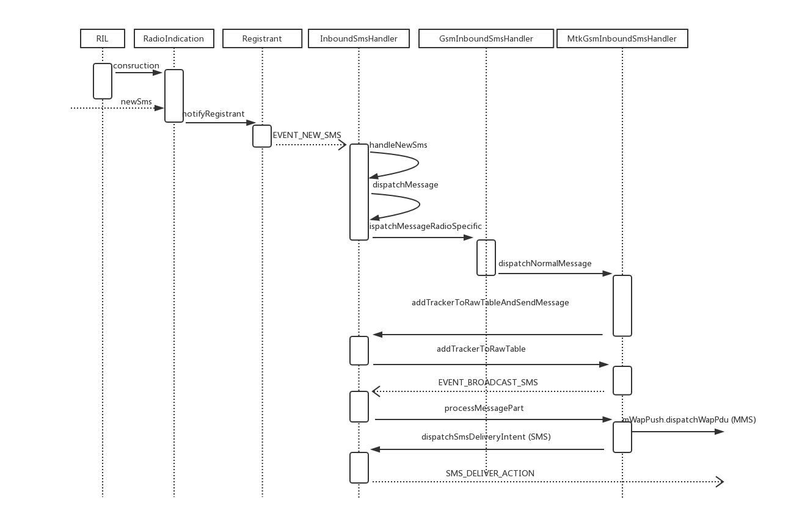

### 流程解析

首先看看 RIL 的部分类关系图：

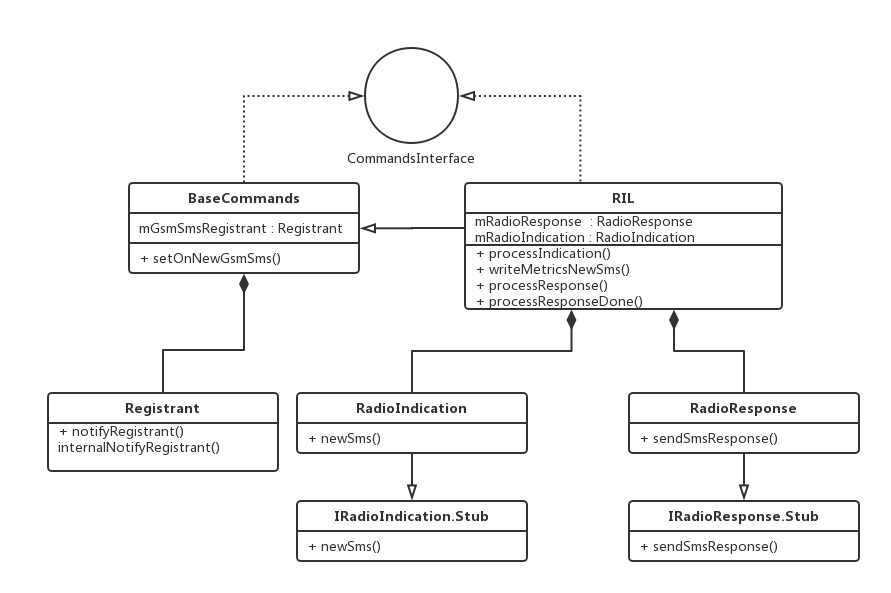

RIL 这个类继承了 BaseCommands 类，实现了 CommandInterface 接口，有 RadioIndication 和 RadioResponse 两个成员。从这两个类的名字就可以看出 RadioResponse 用于处理 modem 对 AP 侧 request 的 response，这个也在前面分析过；而 RadioIndication 用于处理 modem 主动上报的消息，参照 SMS 的发送流程，找到其在对应接收流程中 HAL 的实现：

> /hardware/interfaces/radio/1.0/IRadioIndication.hal


```
/**
 * Indicates when new SMS is received.
 * Callee must subsequently confirm the receipt of the SMS with a
 * acknowledgeLastIncomingGsmSms()
 *
 * Server must not send newSms() nor newSmsStatusReport() messages until a
 * acknowledgeLastIncomingGsmSms() has been received
 *
 * @param type Type of radio indication
 * @param pdu PDU of SMS-DELIVER represented as byte array.
 *        The PDU starts with the SMSC address per TS 27.005 (+CMT:)
 */
oneway newSms(RadioIndicationType type, vec<uint8_t> pdu);
```

RadioIndication 的实现：

> /frameworks/opt/telephony/src/java/com/android/internal/telephony/RadioIndication.java


```
public class RadioIndication extends IRadioIndication.Stub {
    ...
    public void newSms(int indicationType, ArrayList<Byte> pdu) {
        ...

        SmsMessage sms = SmsMessage.newFromCMT(pduArray);
        if (mRil.mGsmSmsRegistrant != null) {
            mRil.mGsmSmsRegistrant.notifyRegistrant(new AsyncResult(null, sms, null));
        }
    }
    ...
}
```
RadioIndication 把 pdu 封装成 SmsMessage，然后调用 mRil.mGsmSmsRegistrant 的 notifyRegistrant(AsyncResult ar) 方法。

这里需要注意 mGsmSmsRegistrant 这个对象，它是在 RIL 的父类 BaseCommands 中声明的：

> /frameworks/opt/telephony/src/java/com/android/internal/telephony/BaseCommands.java

```
public abstract class BaseCommands implements CommandsInterface {
    ...

    protected Registrant mGsmSmsRegistrant;
    ...

    @Override
    public void setOnNewGsmSms(Handler h, int what, Object obj) {
        mGsmSmsRegistrant = new Registrant (h, what, obj);
    }
}
```

> /frameworks/base/core/java/android/os/Registrant.java

```
public class Registrant {
    public Registrant(Handler h, int what, Object obj) {
        refH = new WeakReference(h);
        this.what = what;
        userObj = obj;
    }

    ...

    public void notifyRegistrant(AsyncResult ar) {
        internalNotifyRegistrant (ar.result, ar.exception);
    }

    /*package*/ void internalNotifyRegistrant (Object result, Throwable exception) {
        Handler h = getHandler();

        if (h == null) {
            clear();
        } else {
            Message msg = Message.obtain();
            msg.what = what;
            msg.obj = new AsyncResult(userObj, result, exception);
            h.sendMessage(msg);
        }
    }

}
```

即通过调用 setOnNewGsmSms 方法给这个 Registrant 指定 Handler，待发送的消息类型 what 以及待处理对象 obj。

在 GsmInboundSmsHandler 的构造方法中找到该调用:

> /frameworks/opt/telephony/src/java/com/android/internal/telephony/gsm/GsmInboundSmsHandler.java

```
public class GsmInboundSmsHandler extends InboundSmsHandler {
    ...
    /**
     * Create a new GSM inbound SMS handler.
     */
    private GsmInboundSmsHandler(Context context, SmsStorageMonitor storageMonitor,
            Phone phone) {
        ...
        phone.mCi.setOnNewGsmSms(getHandler(), EVENT_NEW_SMS, null);
        ...
    }
}
```

GsmInboundSmsHandler 继承自 InboundSmsHandler，InboundSmsHandler 又继承自 StateMachine

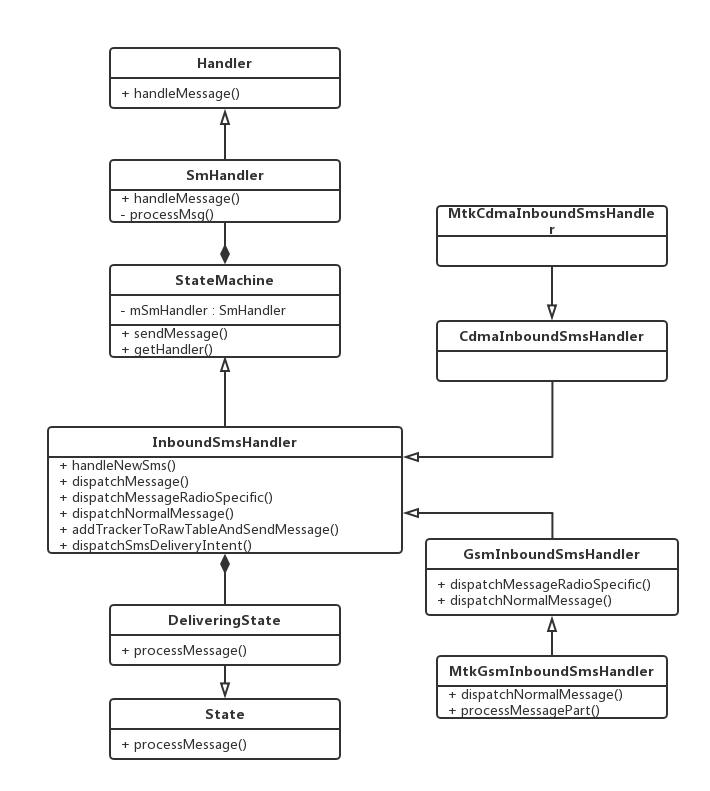

> /frameworks/base/core/java/com/android/internal/util/StateMachine.java

```
public class StateMachine {
    ...
    private SmHandler mSmHandler;
    ...

    private static class SmHandler extends Handler {
        ...
    }

    ...

    /**
     * @return Handler, maybe null if state machine has quit.
     */
    public final Handler getHandler() {
        return mSmHandler;
    }
    ...
}
```

StateMachine 及其子类应用的是状态机模式，主要用于处理信息中的各种状态处理。通过以上分析可看出 notifyRegistrant 方法的实质是向 SmHandler 发送一个 EVENT_NEW_SMS 消息，消息包含的对象是 SmsMessage。

继续查看 SmHandler 处理消息的方法：

```
/**
 * Handle messages sent to the state machine by calling
 * the current state's processMessage. It also handles
 * the enter/exit calls and placing any deferred messages
 * back onto the queue when transitioning to a new state.
 */
 @Override
public final void handleMessage(Message msg) {
    ...
    msgProcessedState = processMsg(msg);
    ...
}

/**
 * Process the message. If the current state doesn't handle
 * it, call the states parent and so on. If it is never handled then
 * call the state machines unhandledMessage method.
 * @return the state that processed the message
 */
private final State processMsg(Message msg) {
    StateInfo curStateInfo = mStateStack[mStateStackTopIndex];
    ...

    if (isQuit(msg)) {
        transitionTo(mQuittingState);
    } else {
        while (!curStateInfo.state.processMessage(msg)) {
            /**
             * Not processed
             */
            curStateInfo = curStateInfo.parentStateInfo;
            if (curStateInfo == null) {
            /**
             * No parents left so it's not handled
             */
            mSm.unhandledMessage(msg);
            break;
            }
        ...
        }
    }
    ...
}
```
SmHandler 的 handleMessage 方法主要是调用 processMsg 方法来处理消息。这里要注意到 curStateInfo.state 是一个 State 对象，主要包括在 InboundSmsHandler 类中定义的几个内部类，DefaultState、StartupState、IdleState、DeliveringState、WaitingState 这五个 State之间相关转换。

> /frameworks/opt/telephony/src/java/com/android/internal/telephony/InboundSmsHandler.java

```
/**
 * This class broadcasts incoming SMS messages to interested apps after storing them in
 * the SmsProvider "raw" table and ACKing them to the SMSC. After each message has been
 * broadcast, its parts are removed from the raw table. If the device crashes after ACKing
 * but before the broadcast completes, the pending messages will be rebroadcast on the next boot.
 *
 * <p>The state machine starts in {@link IdleState} state. When the {@link SMSDispatcher} receives a
 * new SMS from the radio, it calls {@link #dispatchNormalMessage},
 * which sends a message to the state machine, causing the wakelock to be acquired in
 * {@link #haltedProcessMessage}, which transitions to {@link DeliveringState} state, where the message
 * is saved to the raw table, then acknowledged via the {@link SMSDispatcher} which called us.
 *
 * <p>After saving the SMS, if the message is complete (either single-part or the final segment
 * of a multi-part SMS), we broadcast the completed PDUs as an ordered broadcast, then transition to
 * {@link WaitingState} state to wait for the broadcast to complete. When the local
 * {@link BroadcastReceiver} is called with the result, it sends {@link #EVENT_BROADCAST_COMPLETE}
 * to the state machine, causing us to either broadcast the next pending message (if one has
 * arrived while waiting for the broadcast to complete), or to transition back to the halted state
 * after all messages are processed. Then the wakelock is released and we wait for the next SMS.
 */
public abstract class InboundSmsHandler extends StateMachine {
    ...

    /**
     * In the delivering state, the inbound SMS is processed and stored in the raw table.
     * The message is acknowledged before we exit this state. If there is a message to broadcast,
     * transition to {@link WaitingState} state to send the ordered broadcast and wait for the
     * results. When all messages have been processed, the halting state will release the wakelock.
     */
    // MTK-START
    // Modification for sub class
    public class DeliveringState extends State {
    // MTK-END
        ...
        @Override
        public boolean processMessage(Message msg) {
            log("DeliveringState.processMessage:" + msg.what);
            switch (msg.what) {
                case EVENT_NEW_SMS:
                    // handle new SMS from RIL
                    handleNewSms((AsyncResult) msg.obj);
                    sendMessage(EVENT_RETURN_TO_IDLE);
                    return HANDLED;

                ...
            }
        }
        ...
    }

    ...

    private void handleNewSms(AsyncResult ar) {
        if (ar.exception != null) {
            loge("Exception processing incoming SMS: " + ar.exception);
            return;
        }

        int result;
        try {
            SmsMessage sms = (SmsMessage) ar.result;
            result = dispatchMessage(sms.mWrappedSmsMessage);
        } catch (RuntimeException ex) {
            loge("Exception dispatching message", ex);
            result = Intents.RESULT_SMS_GENERIC_ERROR;
        }

        // RESULT_OK means that the SMS will be acknowledged by special handling,
        // e.g. for SMS-PP data download. Any other result, we should ack here.
        if (result != Activity.RESULT_OK) {
            boolean handled = (result == Intents.RESULT_SMS_HANDLED);
            notifyAndAcknowledgeLastIncomingSms(handled, result, null);
        }
    }
    ...
}
```
InboundSmsHandler 是一个状态机，有五个状态，主要用于处理接收 SMS 相关状态。在调试过程中，主要是两个状态的转换，当第一次调用 SmHandler 的 processMsg 方法时，curStateInfo.state.processMessage(msg) 是通过 WaitingState 类的 processMessage 方法处理消息，然后无法进行处理返回后，通过 curStateInfo.parentStateInfo 把 WaitingState 变成其父状态 DeliveringState。然后再调用 DeliveringState 的 processMessage 方法进行信息处理。

对 EVENT_NEW_SMS 的处理是取出 SmsMessage，再调用 dispatchMessage 方法。

```
/**
 * Process an SMS message from the RIL, calling subclass methods to handle 3GPP and
 * 3GPP2-specific message types.
 *
 * @param smsb the SmsMessageBase object from the RIL
 * @return a result code from {@link android.provider.Telephony.Sms.Intents},
 *  or {@link Activity#RESULT_OK} for delayed acknowledgment to SMSC
 */
private int dispatchMessage(SmsMessageBase smsb) {
    // If sms is null, there was a parsing error.
    if (smsb == null) {
        loge("dispatchSmsMessage: message is null");
        return Intents.RESULT_SMS_GENERIC_ERROR;
    }

    ...

    return dispatchMessageRadioSpecific(smsb);
}

/**
 * Process voicemail notification, SMS-PP data download, CDMA CMAS, CDMA WAP push, and other
 * 3GPP/3GPP2-specific messages. Regular SMS messages are handled by calling the shared
 * {@link #dispatchNormalMessage} from this class.
 *
 * @param smsb the SmsMessageBase object from the RIL
 * @return a result code from {@link android.provider.Telephony.Sms.Intents},
 *  or {@link Activity#RESULT_OK} for delayed acknowledgment to SMSC
 */
protected abstract int dispatchMessageRadioSpecific(SmsMessageBase smsb);
```
dispatchMessageRadioSpecific 为抽象方法，其实现在 InboundSmsHandler 的子类中，其直接子类有 CdmaInboundSmsHandler 和 GsmInboundSmsHandler，下面以后者为例：

> /frameworks/opt/telephony/src/java/com/android/internal/telephony/gsm/GsmInboundSmsHandler.java


```
/**
 * This class broadcasts incoming SMS messages to interested apps after storing them in
 * the SmsProvider "raw" table and ACKing them to the SMSC. After each message has been
 */
public class GsmInboundSmsHandler extends InboundSmsHandler {
    ...
    /**
     * Handle type zero, SMS-PP data download, and 3GPP/CPHS MWI type SMS. Normal SMS messages
     * are handled by {@link #dispatchNormalMessage} in parent class.
     *
     * @param smsb the SmsMessageBase object from the RIL
     * @return a result code from {@link android.provider.Telephony.Sms.Intents},
     *  or {@link Activity#RESULT_OK} for delayed acknowledgment to SMSC
     */
    @Override
    protected int dispatchMessageRadioSpecific(SmsMessageBase smsb) {
        SmsMessage sms = (SmsMessage) smsb;
        // 0 级信息
        if (sms.isTypeZero()) {
            // Some carriers will send visual voicemail SMS as type zero.
            int destPort = -1;
            SmsHeader smsHeader = sms.getUserDataHeader();
            if (smsHeader != null && smsHeader.portAddrs != null) {
                // The message was sent to a port.
                destPort = smsHeader.portAddrs.destPort;
            }
            VisualVoicemailSmsFilter
                    .filter(mContext, new byte[][]{sms.getPdu()}, SmsConstants.FORMAT_3GPP,
                            destPort, mPhone.getSubId());
            // As per 3GPP TS 23.040 9.2.3.9, Type Zero messages should not be
            // Displayed/Stored/Notified. They should only be acknowledged.
            log("Received short message type 0, Don't display or store it. Send Ack");
            return Intents.RESULT_SMS_HANDLED;
        }

        // Send SMS-PP data download messages to UICC. See 3GPP TS 31.111 section 7.1.1.
        if (sms.isUsimDataDownload()) {
            UsimServiceTable ust = mPhone.getUsimServiceTable();
            return mDataDownloadHandler.handleUsimDataDownload(ust, sms);
        }

        boolean handled = false;
        if (sms.isMWISetMessage()) {
            updateMessageWaitingIndicator(sms.getNumOfVoicemails());
            handled = sms.isMwiDontStore();
            if (DBG) log("Received voice mail indicator set SMS shouldStore=" + !handled);
        } else if (sms.isMWIClearMessage()) {
            updateMessageWaitingIndicator(0);
            handled = sms.isMwiDontStore();
            if (DBG) log("Received voice mail indicator clear SMS shouldStore=" + !handled);
        }
        if (handled) {
            return Intents.RESULT_SMS_HANDLED;
        }

        if (!mStorageMonitor.isStorageAvailable() &&
                sms.getMessageClass() != SmsConstants.MessageClass.CLASS_0) {
            // It's a storable message and there's no storage available.  Bail.
            // (See TS 23.038 for a description of class 0 messages.)
            return Intents.RESULT_SMS_OUT_OF_MEMORY;
        }

        return dispatchNormalMessage(smsb);
    }
    ...
}
```
根据信息类型做了不同处理，以普通信息为例，MTK 对 GsmInboundSmsHandler 有定制处理：

> /vendor/mediatek/proprietary/frameworks/opt/telephony/src/java/com/mediatek/internal/telephony/gsm/MtkGsmInboundSmsHandler.java


```
/**
 * Dispatch a normal incoming SMS. This is called from {@link #dispatchMessageRadioSpecific}
 * if no format-specific handling was required. Saves the PDU to the SMS provider raw table,
 * creates an {@link InboundSmsTracker}, then sends it to the state machine as an
 * {@link #EVENT_BROADCAST_SMS}. Returns {@link Intents#RESULT_SMS_HANDLED} or an error value.
 *
 * @param sms the message to dispatch
 * @return {@link Intents#RESULT_SMS_HANDLED} if the message was accepted, or an error status
 */
@Override
protected int dispatchNormalMessage(SmsMessageBase sms) {
    SmsHeader smsHeader = sms.getUserDataHeader();
    MtkInboundSmsTracker tracker;

    if ((smsHeader == null) || (smsHeader.concatRef == null)) {
        // 短信息
        // Message is not concatenated.
        int destPort = -1;
        if (smsHeader != null && smsHeader.portAddrs != null) {
            // The message was sent to a port.
            destPort = smsHeader.portAddrs.destPort;
            if (DBG) log("destination port: " + destPort);
        }

        tracker = (MtkInboundSmsTracker)(
                TelephonyComponentFactory.getInstance().makeInboundSmsTracker(sms.getPdu(),
                sms.getTimestampMillis(), destPort, is3gpp2(), false,
                sms.getOriginatingAddress(), sms.getDisplayOriginatingAddress(),
                sms.getMessageBody()));
        tracker.setSubId(mPhone.getSubId());
    }
    ...

    // de-duping is done only for text messages
    // destPort = -1 indicates text messages, otherwise it's a data sms
    return addTrackerToRawTableAndSendMessage(tracker,
            tracker.getDestPort() == -1 /* de-dup if text message */);
}
```
把 SmsMessage 封装到 MtkInboundSmsTracker，回到 InboundSmsHandler 继续处理。

```
/**
 * Helper to add the tracker to the raw table and then send a message to broadcast it, if
 * successful. Returns the SMS intent status to return to the SMSC.
 * @param tracker the tracker to save to the raw table and then deliver
 * @return {@link Intents#RESULT_SMS_HANDLED} or {@link Intents#RESULT_SMS_GENERIC_ERROR}
 * or {@link Intents#RESULT_SMS_DUPLICATED}
 */
protected int addTrackerToRawTableAndSendMessage(InboundSmsTracker tracker, boolean deDup) {
    switch(addTrackerToRawTable(tracker, deDup)) {
    case Intents.RESULT_SMS_HANDLED:
        sendMessage(EVENT_BROADCAST_SMS, tracker);
        return Intents.RESULT_SMS_HANDLED;
    ...
    }
}
```
调用 addTrackerToRawTable 方法将 pdu 插入数据库，以 RESULT_SMS_HANDLED 为例，调用 StateMachine 的 sendMessage 方法发送 EVENT_BROADCAST_SMS 消息，消息包含的对象是 MtkInboundSmsTracker。经过 SmHandler 再次处理消息后，最终还是在 DeliveringState 中处理：

```
@Override
public boolean processMessage(Message msg) {
    log("DeliveringState.processMessage:" + msg.what);
    switch (msg.what) {
        ...
        case EVENT_BROADCAST_SMS:
            // if any broadcasts were sent, transition to waiting state
            InboundSmsTracker inboundSmsTracker = (InboundSmsTracker) msg.obj;
            if (processMessagePart(inboundSmsTracker)) {
                sendMessage(EVENT_UPDATE_TRACKER, inboundSmsTracker);
                transitionTo(mWaitingState);
            } else {
                // if event is sent from SmsBroadcastUndelivered.broadcastSms(), and
                // processMessagePart() returns false, the state machine will be stuck in
                // DeliveringState until next message is received. Send message to
                // transition to idle to avoid that so that wakelock can be released
                log("No broadcast sent on processing EVENT_BROADCAST_SMS in Delivering " +
                    "state. Return to Idle state");
                    sendMessage(EVENT_RETURN_TO_IDLE);
            }
        return HANDLED;
        ...
    }
}
```

MtkGsmInboundSmsHandler 对 processMessagePart 的定制实现：

```
/**
 * Process the inbound SMS segment. If the message is complete, send it as an ordered
 * broadcast to interested receivers and return true. If the message is a segment of an
 * incomplete multi-part SMS, return false.
 * @param tracker the tracker containing the message segment to process
 * @return true if an ordered broadcast was sent; false if waiting for more message segments
 */
protected boolean processMessagePart(InboundSmsTracker tracker) {
    int messageCount = tracker.getMessageCount();
    byte[][] pdus;
    int destPort = tracker.getDestPort();
    boolean block = false;

    if (messageCount == 1) {
        // 短信息
        // single-part message
        pdus = new byte[][]{tracker.getPdu()};
        // 黑名单拦截
        block = BlockChecker.isBlocked(mContext, tracker.getDisplayAddress());
    } else {
        // 长信息
        // multi-part message
        ...
    }

    // Do not process null pdu(s). Check for that and return false in that case.
    List<byte[]> pduList = Arrays.asList(pdus);
    if (pduList.size() == 0 || pduList.contains(null)) {
        loge("processMessagePart: returning false due to " +
                (pduList.size() == 0 ? "pduList.size() == 0" : "pduList.contains(null)"));
        return false;
    }

    SmsBroadcastReceiver resultReceiver = new SmsBroadcastReceiver(tracker);

    ...
    // 彩信（MMS）
    if (destPort == SmsHeader.PORT_WAP_PUSH) {
        // Build up the data stream
        ...
        int result;
        // Put the extra information on bundle
        if (MtkSmsCommonEventHelper.isWapPushSupport()) {
            log("dispatch wap push pdu with addr & sc addr");
            Bundle bundle = new Bundle();
            if (!(((MtkInboundSmsTracker)tracker).is3gpp2WapPdu())) {
                mediatek.telephony.MtkSmsMessage sms =
                        mediatek.telephony.MtkSmsMessage.createFromPdu(
                        pdus[0], tracker.getFormat());
                if (sms != null) {
                    bundle.putString(MtkTelephony.WapPush.ADDR, sms.getOriginatingAddress());
                    String sca = sms.getServiceCenterAddress();
                    if (sca == null) {
                        /* null for app is not a item, it needs to transfer to empty string */
                        sca = "";
                    }
                    bundle.putString(MtkTelephony.WapPush.SERVICE_ADDR, sca);
                }
            } else {
                //for CDMA, all info has been parsed into tracker before
                bundle.putString(MtkTelephony.WapPush.ADDR, tracker.getAddress());
                bundle.putString(MtkTelephony.WapPush.SERVICE_ADDR, "");
            }

            result = ((MtkWapPushOverSms)mWapPush).dispatchWapPdu(output.toByteArray(),
                    resultReceiver, this, bundle);
        } else {
            //int result = mWapPush.dispatchWapPdu(output.toByteArray(), resultReceiver, this);
            log("dispatch wap push pdu");
            result = mWapPush.dispatchWapPdu(output.toByteArray(), resultReceiver, this);
        }
        if (DBG) log("dispatchWapPdu() returned " + result);
        // MTK-END

        // result is Activity.RESULT_OK if an ordered broadcast was sent
        if (result == Activity.RESULT_OK) {
            return true;
        } else {
            deleteFromRawTable(tracker.getDeleteWhere(), tracker.getDeleteWhereArgs(),
                    MARK_DELETED);
            return false;
        }
    }

    // 黑名单删除
    if (block) {
        deleteFromRawTable(tracker.getDeleteWhere(), tracker.getDeleteWhereArgs(),
                DELETE_PERMANENTLY);
        return false;
    }

    ...
    dispatchSmsDeliveryIntent(pdus, tracker.getFormat(), destPort, resultReceiver);
    ...

    return true;
}
```


processMessagePart 会对短信息长短信分别处理，然后再分开处理彩信（MMS）与短信（SMS），调用 WapPushOverSms 的 dispatchWapPdu 处理彩信；调用 InboundSmsHandler 中的 dispatchSmsDeliveryIntent 处理短信。

```
/**
 * Creates and dispatches the intent to the default SMS app, appropriate port or via the {@link
 * AppSmsManager}.
 *
 * @param pdus message pdus
 * @param format the message format, typically "3gpp" or "3gpp2"
 * @param destPort the destination port
 * @param resultReceiver the receiver handling the delivery result
 */
// MTK-START
protected void dispatchSmsDeliveryIntent(byte[][] pdus, String format, int destPort,
        SmsBroadcastReceiver resultReceiver) {
// MTK-END
    Intent intent = new Intent();
    intent.putExtra("pdus", pdus);
    intent.putExtra("format", format);

    if (destPort == -1) {
        intent.setAction(Intents.SMS_DELIVER_ACTION);
        // Direct the intent to only the default SMS app. If we can't find a default SMS app
        // then sent it to all broadcast receivers.
        // We are deliberately delivering to the primary user's default SMS App.
        ComponentName componentName = SmsApplication.getDefaultSmsApplication(mContext, true);
        if (componentName != null) {
            // Deliver SMS message only to this receiver.
            intent.setComponent(componentName);
            log("Delivering SMS to: " + componentName.getPackageName() +
                " " + componentName.getClassName());
        } else {
            intent.setComponent(null);
        }

        // TODO: Validate that this is the right place to store the SMS.
        if (SmsManager.getDefault().getAutoPersisting()) {
            final Uri uri = writeInboxMessage(intent);
            if (uri != null) {
                // Pass this to SMS apps so that they know where it is stored
                intent.putExtra("uri", uri.toString());
            }
        }

        // Handle app specific sms messages.
        AppSmsManager appManager = mPhone.getAppSmsManager();
        if (appManager.handleSmsReceivedIntent(intent)) {
            // The AppSmsManager handled this intent, we're done.
            dropSms(resultReceiver);
            return;
        }
    } else {
        intent.setAction(Intents.DATA_SMS_RECEIVED_ACTION);
        Uri uri = Uri.parse("sms://localhost:" + destPort);
        intent.setData(uri);
        intent.setComponent(null);
        // Allow registered broadcast receivers to get this intent even
        // when they are in the background.
        intent.addFlags(Intent.FLAG_RECEIVER_INCLUDE_BACKGROUND);
    }

    Bundle options = handleSmsWhitelisting(intent.getComponent());
    dispatchIntent(intent, android.Manifest.permission.RECEIVE_SMS,
            AppOpsManager.OP_RECEIVE_SMS, options, resultReceiver, UserHandle.SYSTEM);
}
```
首先获取默认的短信 App，如果有默认的，则只向默认应用发送 Intent，否则向所有注册监听 SMS_DELIVER_ACTION 的 receiver 发送。


## 接收 SMS

### 流程图

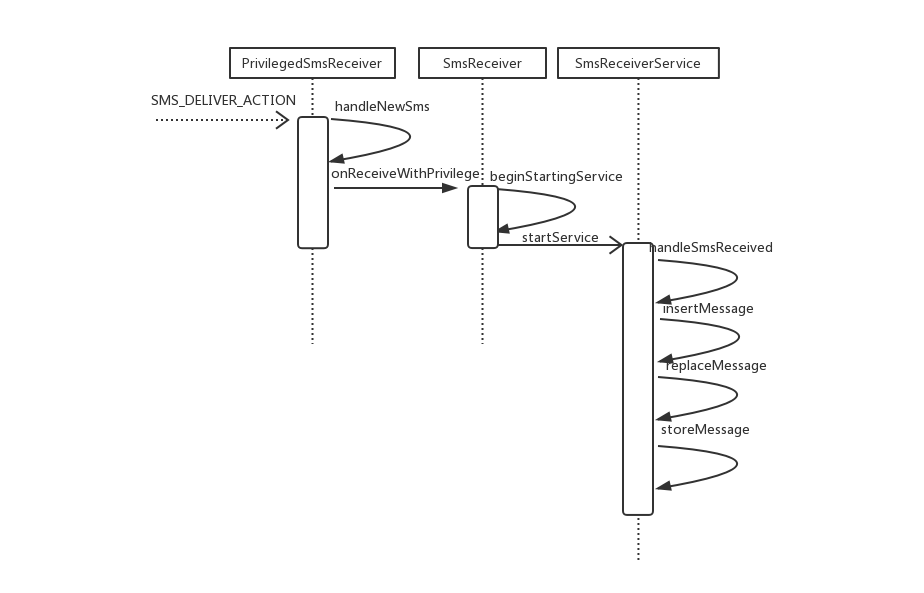

### 流程解析

Mms 中接收 SMS_DELIVER_ACTION 的 receiver 是 PrivilegedSmsReceiver

> src/com/android/mms/transaction/PrivilegedSmsReceiver.java


```
<!-- Require sender permissions to prevent SMS spoofing -->
<receiver android:name=".transaction.PrivilegedSmsReceiver"
    android:permission="android.permission.BROADCAST_SMS">
    <intent-filter>
        <action android:name="android.provider.Telephony.SMS_DELIVER" />
    </intent-filter>
</receiver>

/**
 * This class exists specifically to allow us to require permissions checks on SMS_RECEIVED
 * broadcasts that are not applicable to other kinds of broadcast messages handled by the
 * SmsReceiver base class.
 */
public class PrivilegedSmsReceiver extends SmsReceiver {
    @Override
    public void onReceive(Context context, Intent intent) {
        ...

        // Pass the message to the base class implementation, noting that it
        // was permission-checked on the way in.
        onReceiveWithPrivilege(context, intent, true);
    }
}
```
PrivilegedSmsReceiver 继承自 SmsReceiver，也是直接中转给 SmsReceiverService 处理：

```
private void handleSmsReceived(Intent intent, int error) {
    MtkSmsMessage[] msgs = MtkSms.Intents.getMessagesFromIntent(intent);

    /// M:Code analyze 022, check null @{
    if (msgs == null) {
        MmsLog.e(MmsApp.TXN_TAG, "getMessagesFromIntent return null.");
        return;
    }

    String format = intent.getStringExtra("format");
    /// M:Code analyze 023, the second argument is change for passing simId info @{
    Uri messageUri = null;


    if (messageUri == null) {
        try {
            messageUri = insertMessage(this, msgs, error, format);
        } catch (IllegalArgumentException e) {
            MmsLog.e(TAG, "Save message fail:" + e.getMessage(), e);
            return;
        }
    }

    /// M:Code analyze 024, print log @{
    SmsMessage tmpsms = (SmsMessage) msgs[0];
    MmsLog.dpi(MmsApp.TXN_TAG, "handleSmsReceived" + (tmpsms.isReplace() ? "(replace)" : "")
        + " messageUri: " + messageUri
        + ", address: " + tmpsms.getOriginatingAddress()
        + ", body: " + tmpsms.getMessageBody());
    /// @}

    if (messageUri != null) {
        long threadId = MessagingNotification.getSmsThreadId(this, messageUri);
        // Called off of the UI thread so ok to block.
        MessagingNotification.blockingUpdateNewMessageIndicator(this, threadId, false, null);

        /// M:Code analyze 025,CMCC new sms dialog @{
        if (NotificationPreferenceActivity.isPopupNotificationEnable()) {
            new MmsDialogNotifyUtils(this).notifyNewSmsDialog(messageUri);
        }
        /// @}
    /// M:Code analyze 026, add else branch,that means this message is not saved successfully,
    /// because its type is class 0,just show on phone and no need to save @{
    } else {
        // 0 级信息
        SmsMessage sms = (SmsMessage) msgs[0];
        SmsMessage msg = SmsMessage.createFromPdu(sms.getPdu(), format);
        if (msg == null) {
            MmsLog.e(MmsApp.TXN_TAG, "createFromPdu return null.");
            return;
        }
        CharSequence messageChars = msg.getMessageBody();
        if (messageChars == null) {
            MmsLog.e(MmsApp.TXN_TAG, "getMessageBody return null.");
            return;
        }
        String message = messageChars.toString();
        if (!TextUtils.isEmpty(message)) {
            //MessagingNotification.notifyClassZeroMessage(this, msgs[0]
            //        .getOriginatingAddress());
        }
    }
    /// @}
}

/**
 * If the message is a class-zero message, display it immediately
 * and return null.  Otherwise, store it using the
 * <code>ContentResolver</code> and return the
 * <code>Uri</code> of the thread containing this message
 * so that we can use it for notification.
 * This is the version to handle MtkSmsMessages
 */
private Uri insertMessage(Context context, MtkSmsMessage[] msgs, int error, String format) {
    // Build the helper classes to parse the messages.
    if (msgs == null) {
        MmsLog.e(MmsApp.TXN_TAG, "insertMessage:getMessagesFromIntent return null.");
        return null;
    }
    /// @}
    MtkSmsMessage sms = msgs[0];
    if (sms != null) {
        if (sms.getMessageClass() == SmsMessage.MessageClass.CLASS_0) {
            MmsLog.d(MmsApp.TXN_TAG, "insertMessage: display class 0 message!");
            displayClassZeroMessage(context, (SmsMessage[]) msgs, format);
            return null;
        } else if (sms.isReplace()) {
            MmsLog.d(MmsApp.TXN_TAG, "insertMessage: is replace message!");
            return replaceMessage(context, msgs, error);
        } else {
            MmsLog.d(MmsApp.TXN_TAG, "insertMessage: stored directly!");
            return storeMessage(context, msgs, error);
        }
    }
    return null;
}
```
SmsReceiverService 会先检查短信的类型，如果是 Class0 短信，直接显示，不做任何其他的处理，即不会存储到数据库中，也不会在通知栏做 Notification。对于其他短信，会进行替换现有的消息，或是当作新消息插入。原则就是如果在数据库中已有的短信中，与新来的短信的原始地址和协议标识都一样，那么就把其替换成新进的短信，否则就当作新短信插入。

具体的替换流程：先用新进的短信生成一个 ContentValues，再用短信的地址和协议标识当作条件到数据库中去查询，如果查到了，就替换，否则就存储。

存储的流程，也是先生成一个 CotentValues，然后取出短信的 Thread Id 和地址，地址要与联系人数据库同步一下，以保证是能识别的地址。把 ContentValues 插入到数据库中，返回插入后得到的短信 Uri。监控数据库更新可引起 UI 刷新。

## 接收 MMS

### 流程图

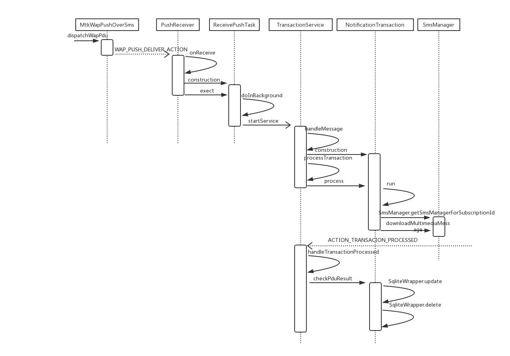

### 流程解析

根据前面的分析，彩信的接收流程在 MtkGsmInboundSmsHandler 中由 WapPushOverSms 继续处理，下面以其定制实现 MtkWapPushOverSms 为例:

> /vendor/mediatek/proprietary/frameworks/opt/telephony/src/java/com/mediatek/internal/telephony/MtkWapPushOverSms.java


```
/**
 * WAP push handler class.
 *
 * @hide
 */
public class MtkWapPushOverSms extends WapPushOverSms {
    ...
    /**
     * Dispatches inbound messages that are in the WAP PDU format. See
     * wap-230-wsp-20010705-a section 8 for details on the WAP PDU format.
     *
     * @param pdu The WAP PDU, made up of one or more SMS PDUs
     * @return a result code from {@link android.provider.Telephony.Sms.Intents}, or
     *         {@link Activity#RESULT_OK} if the message has been broadcast
     *         to applications
     */
    @Override
    public int dispatchWapPdu(byte[] pdu, BroadcastReceiver receiver, InboundSmsHandler handler) {
        DecodedResult result = decodeWapPdu(pdu, handler);
        if (result.statusCode != Activity.RESULT_OK) {
            return result.statusCode;
        }

        ...

        Intent intent = new Intent(Intents.WAP_PUSH_DELIVER_ACTION);
        intent.setType(result.mimeType);
        intent.putExtra("transactionId", result.transactionId);
        intent.putExtra("pduType", result.pduType);
        intent.putExtra("header", result.header);
        intent.putExtra("data", result.intentData);
        intent.putExtra("contentTypeParameters", result.contentTypeParameters);
        SubscriptionManager.putPhoneIdAndSubIdExtra(intent, result.phoneId);
        // MTK-START
        intent.putExtra("wspHeaders", result.headerList);

        if (bundle != null) {
            Rlog.d(TAG, "put addr info into intent 2");
            intent.putExtra(MtkTelephony.WapPush.ADDR, bundle.getString(MtkTelephony.WapPush.ADDR));
            intent.putExtra(MtkTelephony.WapPush.SERVICE_ADDR, bundle.getString(
                    MtkTelephony.WapPush.SERVICE_ADDR));
        }
        // MTK-END

        // Direct the intent to only the default MMS app. If we can't find a default MMS app
        // then sent it to all broadcast receivers.
        ComponentName componentName = SmsApplication.getDefaultMmsApplication(mContext, true);
        Bundle options = null;
        if (componentName != null) {
            // Deliver MMS message only to this receiver
            intent.setComponent(componentName);
            ...
        }

        handler.dispatchIntent(intent, getPermissionForType(result.mimeType),
                getAppOpsPermissionForIntent(result.mimeType), options, receiver,
                UserHandle.SYSTEM);
        return Activity.RESULT_OK;
    }
    ...
}
```
与接收 SMS 类似，WapPushOverSms 会优先向默认短信 App 发送 WAP_PUSH_DELIVER_ACTION 的 Intent，告知短信 App 接收彩信（MMS）。这个 Intent 会含有一个 “data “  的 byte 数组，这个 byte 数组是关于这个彩信的一些信息的描述，它是一个 NotificationInd，里面含有彩信的一些信息，比如发送者手机号码，彩信的 ContentLocation（URL）等。在 Mms 中负责接收的则是 PushReceiver

> src/com/android/mms/transaction/PushReceiver.java


```
<receiver android:name=".transaction.PushReceiver"
    android:permission="android.permission.BROADCAST_WAP_PUSH">
    <intent-filter>
        <action android:name="android.provider.Telephony.WAP_PUSH_DELIVER" />
        <data android:mimeType="application/vnd.wap.mms-message" />

        ...

    </intent-filter>
</receiver>

/**
 * Receives Intent.WAP_PUSH_RECEIVED_ACTION intents and starts the
 * TransactionService by passing the push-data to it.
 */
public class PushReceiver extends BroadcastReceiver {
    ...
    @Override
    public void onReceive(Context context, Intent intent) {
        ...

        // KK migration, for default MMS function.
        // The changes in this project update the in-box SMS/MMS app to use the new
        // intents for SMS/MMS delivery.
        // And caused by just one receiver can receive WAP_PUSH_DELIVER_ACTION broadcast on KK,
        // so move handle WAPPUSH message action from WapPushReceiver to here, and WapPushReceiver
        // been removed, WapPush message directly send to WapPushReceiverService to handle. /// @{
        if (intent.getAction().equals(WAP_PUSH_DELIVER_ACTION)) {
            Log.v(TAG, "Received PUSH Intent: " + intent + " support WAPPUSH? "
                    + FeatureOption.MTK_WAPPUSH_SUPPORT);
            ...

            if (MmsContentType.MMS_MESSAGE.equals(intent.getType())) {
                /// M:Code analyze 004,unknown, raise priority @{
                MmsLog.d(MmsApp.TXN_TAG, "raise priority");
                raisePriority(context, true);
                /// @}

                if (!OpMessageUtils.getOpMessagePlugin().getOpPushReceiverExt()
                        .onReceive(context, intent, MmsPushReceiveService.class)) {
                    new ReceivePushTask(context).execute(intent);
                }
            }

            ...
        }
        /// @}
    }

    ...

    private class ReceivePushTask extends AsyncTask<Intent, Void, Void> {
        ...

        @Override
        protected Void doInBackground(Intent... intents) {
            Intent intent = intents[0];
            /// M:
            int subId = intent.getIntExtra(PhoneConstants.SUBSCRIPTION_KEY,
                    SubscriptionManager.INVALID_SUBSCRIPTION_ID);
            MmsLog.d(MmsApp.TXN_TAG, "PushReceiver, do In Background, subId= " + subId);
            // Get raw PDU push-data from the message and parse it
            byte[] pushData = intent.getByteArrayExtra("data");
            MtkPduParser parser = new MtkPduParser(
                    pushData, PduParserUtil.shouldParseContentDisposition(subId));
            int type = 0;
            try {
                GenericPdu pdu = parser.parse();

                if (null == pdu) {
                    Log.e(TAG, "Invalid PUSH data");
                    return null;
                }

                MtkPduPersister p = MtkPduPersister.getPduPersister(mContext);
                ContentResolver cr = mContext.getContentResolver();
                type = pdu.getMessageType();
                long threadId = -1;
                switch (type) {
                    ...
                    case MESSAGE_TYPE_NOTIFICATION_IND: {
                        ...
                        MmsLog.d(MmsApp.TXN_TAG, "type=MESSAGE_TYPE_NOTIFICATION_IND");
                        NotificationInd nInd = (NotificationInd) pdu;

                        ...

                        // Start service to finish the notification transaction.
                        Intent svc = new Intent(mContext, TransactionService.class);
                        svc.putExtra(TransactionBundle.URI, uri.toString());
                        svc.putExtra(TransactionBundle.TRANSACTION_TYPE,
                                Transaction.NOTIFICATION_TRANSACTION);
                        svc.putExtra(PhoneConstants.SUBSCRIPTION_KEY, subId);
                        /// @}
                        mContext.startService(svc);
                        MmsWidgetProvider.notifyDatasetChanged(mContext);
                        break;
                    }
                    ...
                }
            }
            ...
            return null;
        }
    }
    ...
}
```
初步解析 pdu，进行一定处理后，继续分发给 TransactionService 处理：


```
/**
 * Handle incoming transaction requests.
 * The incoming requests are initiated by the MMSC Server or by the
 * MMS Client itself.
 */
@Override
public void handleMessage(Message msg) {
    ...
    switch (msg.what) {
        ...

        case EVENT_TRANSACTION_REQUEST:
            ...

            switch (transactionType) {
                case Transaction.NOTIFICATION_TRANSACTION:
                    String uri = args.getUri();
                    MmsLog.d(MmsApp.TXN_TAG,
                            "TRANSACTION REQUEST: NOTIFICATION_TRANSACTION, uri="
                            + uri);
                    if (uri != null) {
                        transaction = new NotificationTransaction(
                                        TransactionService.this, serviceId,
                                        uri, subId);
                    }
                    ...
                    break;
            ...
    }
    ...
}
```
启动 NotificationTransaction 进行处理：

> src/com/android/mms/transaction/NotificationTransaction.java


```
/**
 * The NotificationTransaction is responsible for handling multimedia
 * message notifications (M-Notification.ind).  It:
 *
 * <ul>
 * <li>Composes the notification response (M-NotifyResp.ind).
 * <li>Sends the notification response to the MMSC server.
 * <li>Stores the notification indication.
 * <li>Notifies the TransactionService about succesful completion.
 * </ul>
 *
 * NOTE: This MMS client handles all notifications with a <b>deferred
 * retrieval</b> response.  The transaction service, upon succesful
 * completion of this transaction, will trigger a retrieve transaction
 * in case the client is in immediate retrieve mode.
 */
public class NotificationTransaction extends Transaction implements Runnable {
    ...
    public void run() {
        MmsLog.d(MmsApp.TXN_TAG, "NotificationTransaction: run");
        DownloadManager downloadManager = DownloadManager.getInstance();
        boolean autoDownload = allowAutoDownload(mContext, mSubId);
        try {
            if (LOCAL_LOGV) {
                Log.v(TAG, "Notification transaction launched: " + this);
            }

            ...
            mPduFile = createPduFile(null, RETRIEVE_RESULT_NAME + mUri.getLastPathSegment());
            mPduFile.setWritable(true, false);

            Log.d(MmsApp.TXN_TAG, "NotificationTransaction mUri:" + mUri);
            final Intent intent = new Intent(TransactionService.ACTION_TRANSACION_PROCESSED,
                    mUri,
                    mContext,
                    MmsReceiver.class);
            intent.putExtra(PhoneConstants.SUBSCRIPTION_KEY, mSubId);

            PendingIntent downloadedIntent = PendingIntent.getBroadcast(mContext, 0, intent,
                    PendingIntent.FLAG_UPDATE_CURRENT);

            SmsManager manager = SmsManager.getSmsManagerForSubscriptionId(mSubId);
            Log.d(MmsApp.TXN_TAG, "download MMS with param, mContentLocation = " + mContentLocation
                    + ", mUri = " + mUri + ", subId" + mSubId);

            /// M: Add MmsService configure param @{
            Uri pduFileUri = FileProvider.getUriForFile(
                    mContext, MMS_FILE_PROVIDER_AUTHORITIES, mPduFile);
            manager.downloadMultimediaMessage(mContext, mContentLocation, pduFileUri,
                    MmsConfig.getMmsServiceConfig(), downloadedIntent);
            /// @}
            ...
        } catch (Throwable t) {
            getState().setState(FAILED);
            getState().setContentUri(mUri);
            notifyObservers();
            Log.e(TAG, Log.getStackTraceString(t));
        }
    }
    ...
}
```
构建一个 ACTION_TRANSACION_PROCESSED 的 PendingIntent，交给 SmsManager 去下载彩信


```
/**
 * Download an MMS message from carrier by a given location URL
 *
 * @param context application context
 * @param locationUrl the location URL of the MMS message to be downloaded, usually obtained
 *  from the MMS WAP push notification
 * @param contentUri the content uri to which the downloaded pdu will be written
 * @param configOverrides the carrier-specific messaging configuration values to override for
 *  downloading the message.
 * @param downloadedIntent if not NULL this <code>PendingIntent</code> is
 *  broadcast when the message is downloaded, or the download is failed
 * @throws IllegalArgumentException if locationUrl or contentUri is empty
 */
public void downloadMultimediaMessage(Context context, String locationUrl, Uri contentUri,
        Bundle configOverrides, PendingIntent downloadedIntent) {
    ...
    try {
        final IMms iMms = IMms.Stub.asInterface(ServiceManager.getService("imms"));
        if (iMms == null) {
            return;
        }
        iMms.downloadMessage(
                getSubscriptionId(), ActivityThread.currentPackageName(), locationUrl,
                contentUri, configOverrides, downloadedIntent);
    } catch (RemoteException e) {
        // Ignore it
    }
}
```
同发送彩信（MMS）类似，通过 MmsService 去建立短连接下载短信，这里就不再做分析，直接回到 TransactionService 查看 ACTION_TRANSACION_PROCESSED 的处理：


```
private void handleTransactionProcessed(Intent intent, int serviceId) {
    ...

    if (result == Activity.RESULT_OK) {
        if (transaction instanceof NotificationTransaction) {
            result = ((NotificationTransaction) transaction).checkPduResult();
        }
        ...
    }

    ...
}
```
最终还是 NotificationTransaction 来做处理


```
public int checkPduResult() {
    ...
    MtkPduPersister persister = MtkPduPersister.getPduPersister(mContext);
    Uri messageUri = persister.persist(
            pdu,
            Telephony.Mms.Inbox.CONTENT_URI,
            true/*createThreadId*/,
            true/*groupMmsEnabled*/,
            null/*preOpenedFiles*/);
    if (messageUri == null) {
        Log.e(MmsApp.TXN_TAG, "checkPduResult: can not persist message");
        return SmsManager.MMS_ERROR_UNSPECIFIED;
    }
    mMessageUri = messageUri.toString();
    // Update some of the properties of the message
    final ContentValues values = new ContentValues();
    values.put(Telephony.Mms.DATE, System.currentTimeMillis() / 1000L);
    values.put(Telephony.Mms.READ, 0);
    values.put(Telephony.Mms.SEEN, 0);
    String creator = ActivityThread.currentPackageName();
    if (!TextUtils.isEmpty(creator)) {
        values.put(Telephony.Mms.CREATOR, creator);
    }
    values.put(Telephony.Mms.SUBSCRIPTION_ID, mSubId);
    if (SqliteWrapper.update(
        mContext,
        mContext.getContentResolver(),
        messageUri,
        values,
        null/*where*/,
        null/*selectionArg*/) != 1) {
        Log.e(MmsApp.TXN_TAG, "persistIfRequired: can not update message");
    }
    // Delete the corresponding NotificationInd
    SqliteWrapper.delete(mContext,
        mContext.getContentResolver(),
        Telephony.Mms.CONTENT_URI,
        LOCATION_SELECTION,
        new String[]{
                Integer.toString(MtkPduHeaders.MESSAGE_TYPE_NOTIFICATION_IND),
                mContentLocation
        });
    return Activity.RESULT_OK;
    ...
}
```
通过短连接从 MMSC 获取 pdu，经过处理后用 PduPersister 把其写入数据库，到这里一个彩信的接收就算完成了。剩下的就是，因为已经获得了彩信的数据，所以要把先前的通知信息（NotificationInd）删除掉。因为数据库已经有所改变，所以 UI 会收到 ContentChanged 事件，刷新 UI 列表，新信息就会显示出来。
