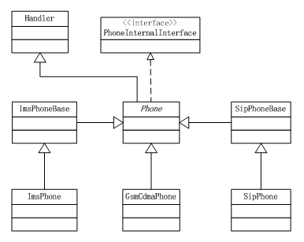

[TOC]

# 修改记录
| 版本 | 修改日期 | 作者 | 修改内容 |
|------|------|------|-------|
| V1.0| 2018.06.14 | 赵泽红 | 创建 |

# 设计模式
## 1. 工厂模式
是 Java 中最常用的设计模式之一。这种类型的设计模式属于创建型模式，它提供了一种创建对象的最佳方式。
### a. 简单工厂模式
简单工厂模式是专门定义一个类来负责创建其他类的实例，被创建的实例通常都具有共同的父类。它又称为静态工厂方法模式。它的实质是由一个工厂类根据传入的参数，动态决定应该创建哪一个产品类（这些产品类继承自一个父类或接口）的实例。简单工厂模式的创建目标，所有创建的对象都是充当这个角色的某个具体类的实例。在这个模式中，工厂类是整个模式的关键所在。它包含必要的判断逻辑，能够根据外界给定的信息，决定究竟应该创建哪个具体类的对象。用户在使用时可以直接根据工厂类去创建所需的实例，而无需了解这些对象是如何创建以及如何组织的。有利于整个软件体系结构的优化。


**优点：**工厂类含有必要的判断逻辑，可以决定在什么时候创建哪一个产品类的实例，客户端可以免除直接创建产品对象的责任，而仅仅“消费”产品。简单工厂模式通过这种做法实现了对责任的分割。简单工厂模式能够根据外界给定的信息，决定究竟应该创建哪个具体类的对象。通过它，外界可以从直接创建具体产品对象的尴尬局面中摆脱出来。外界与具体类隔离开来，偶合性低。明确区分了各自的职责和权力，有利于整个软件体系结构的优化。

**缺点：**当产品有复杂的多层等级结构时，工厂类只有自己，以不变应万变，就是模式的缺点。因为工厂类集中了所有产品创建逻辑，一旦不能正常工作，整个系统都要受到影响。系统扩展困难，一旦添加新产品就不得不修改工厂逻辑（如果要增加一个产品，则需要修改工厂类，增加 if/else 分支，或者增加一个 case 分支），有可能造成工厂逻辑过于复杂,违背了“开放-封闭”原则（OCP）。另外，简单工厂模式通常使用静态工厂方法，这使得无法由子类继承，造成工厂角色无法形成基于继承的等级结构。

**适用范围：**工厂类负责创建的对象比较少，客户只知道传入了工厂类的参数，对于是如何创建对象（逻辑）不关心。

### b. 工厂方法模式
工厂方法是粒度很小的设计模式，因为模式的表现只是一个抽象的方法。提前定义用于创建对象的接口，让子类决定实例化具体的某一个类，即在工厂和产品中间增加接口，工厂不再负责产品的创建，由接口针对不同条件返回具体的类实例，由具体类实例去实现。工厂方法模式是简单工厂模式的衍生，解决了许多简单工厂模式的问题。首先完全实现“开放-封闭”原则，实现了可扩展。其次实现更复杂的层次结构，可以应用于产品结果复杂的场合。工厂方法模式是对简单工厂模式进行了抽象。有一个抽象的 Factory 类（可以是抽象类和接口），这个类将不在负责具体的产品生产，而是只制定一些规范，具体的生产工作由其子类去完成。在这个模式中，工厂类和产品类往往可以依次对应。即一个抽象工厂对应一个抽象产品，一个具体工厂对应一个具体产品，这个具体的工厂就负责生产对应的产品。


**优点：**工厂方法模式是为了克服简单工厂模式的缺点（主要是为了满足 OCP）而设计出来的。简单工厂模式的工厂类随着产品类的增加需要增加很多方法（或代码），而工厂方法模式每个具体工厂类只完成单一任务，代码简洁。工厂方法模式完全满足 OCP，即它有非常良好的扩展性。

**缺点：**不易于维护，假如某个具体产品类需要进行一定的修改，很可能需要修改对应的工厂类。当同时需要修改多个产品类的时候，对工厂类的修改会变得相当麻烦。

**适用范围：**当一个类不知道它所必须创建对象的类或一个类希望由子类来指定它所创建的对象时，当类将创建对象的职责委托给多个帮助子类中的某一个，并且你希望将哪一个帮助子类是代理者这一信息局部化的时候，可以使用工厂方法。

### c. 抽象工厂模式
抽象工厂模式是围绕一个超级工厂创建其他工厂。该超级工厂又称为其他工厂的工厂。抽象工厂模式是所有形态的工厂模式中最为抽象和最具一般性的一种形态。抽象工厂模式是指当有多个抽象角色时，使用的一种工厂模式。抽象工厂模式可以向客户端提供一个接口，使客户端在不必指定产品的具体的情况下，创建多个产品族中的产品对象。它有多个抽象产品类，每个抽象产品类可以派生出多个具体产品类，一个抽象工厂类，可以派生出多个具体工厂类，每个具体工厂类可以创建多个具体产品类的实例。抽象工厂模式针对的是多个产品等级结果。


**优点：**抽象工厂模式主要在于应对“新系列”的需求变化。分离了具体的类，抽象工厂模式帮助你控制一个应用创建的对象的类，因为一个工厂封装创建产品对象的责任和过程。它将客户和类的实现分离，客户通过他们的抽象接口操纵实例，产品的类名也在具体工厂的实现中被分离，它们不出现在客户代码中。它使得易于交换产品系列。一个具体工厂类在一个应用中仅出现一次——即在它初始化的时候。这使得改变一个应用的具体工厂变得很容易。它只需改变具体的工厂即可使用不同的产品配置，这是因为一个抽象工厂创建了一个完整的产品系列，所以整个产品系列会立刻改变。它有利于产品的一致性。当一个系列的产品对象被设计成一起工作时，一个应用一次只能使用同一个系列中的对象，这一点很重要，而抽象工厂很容易实现这一点。抽象工厂模式有助于这样的团队的分工，降低了模块间的耦合性，提高了团队开发效率。

**缺点：**抽象工厂模式在于难于应付“新对象”的需求变动。难以支持新种类的产品。难以扩展抽象工厂以生产新种类的产品。这是因为抽象工厂几乎确定了可以被创建的产品集合，支持新种类的产品就需要扩展该工厂接口，这将涉及抽象工厂类及其所有子类的改变。

**适用范围：**一个系统不应当依赖于产品类实例如何被创建、组合和表达的细节，这对于所有形态的工厂模式都是重要的。这个系统有多于一个的产品族，而系统只消费其中某一产品族。同属于同一个产品族的产品是在一起使用的，这一约束必须在系统的设计中体现出来。系统提供一个产品类的库，所有的产品以同样的接口出现，从而使客户端不依赖于实现。

## 2. 代理模式
代理（Proxy）是一种设计模式，提供了对目标对象另外的访问方式；即通过代理对象访问目标对象。

**优点：**可以在目标对象实现的基础上，增强额外的功能操作，即扩展目标对象的功能。

**关键点：**代理对象与目标对象。代理对象是对目标对象的扩展，并会调用目标对象。
### a. 静态代理
静态代理在使用时，需要定义接口或者父类，被代理的目标对象与代理对象一起实现相同的接口或者是继承相同父类。

**优点：**可以做到在不修改目标对象的功能前提下，对目标功能扩展。

**缺点：**因为代理对象需要与目标对象实现一样的接口，一旦接口增加方法，目标对象与代理对象都要维护。


```
// 代理类
public class UserProxy implements IUser {

    private IUser mUser;

    public UserProxy(IUser user) {

        mUser = user;
    }

    @Override
    public void read() {

       write(); // 扩展

       mUser.read();
    }

    private void write(){

    }
}
```
```
// 使用方法
IUser userA = new UserA();
IUser userProxy = new UserProxy(userA);
userProxy.read();
```

### b. 动态代理（ JDK 代理/接口代理）
代理对象，不需要实现接口，但是目标对象一定要实现接口，否则不能用动态代理。
代理对象的生成，是利用 JDK 的 API （ java.lang.reflect.Proxy ），动态的在内存中构建代理对象(需要我们指定创建代理对象/目标对象实现的接口的类型)。
实现 InvocationHandler 并重写 invoke 方法来进行动态代理的，在 invoke 方法中将对方法进行增强处理。


```
// 代理类
import java.lang.reflect.InvocationHandler;
import java.lang.reflect.Method;
import java.lang.reflect.Proxy;

public class UserProxy {

    private Object mObject;

    public UserProxy(Object object) {
        mObject = object;
    }

    public Object getInstance() {
        return Proxy.newProxyInstance(
                mObject.getClass().getClassLoader(),
                mObject.getClass().getInterfaces(),
                new InvocationHandler() {
                    @Override
                    public Object invoke(Object proxy, Method method,
                            Object[] args) throws Throwable {

                        write(); //扩展

                        Object ret = method.invoke(mObject, args);

                        return ret;
                    }
                });
    }

    private void write() {

    };
}
```

```
// 使用方法
IUser userA = new UserA();
IUser userProxy = (IUser) new UserProxy(userA).getInstance();
userProxy.read();
```

# Phone 家族继承变化
## 1. Android M

## 2. Android N

## 3. Android O


## 4. 总结
- 合并了 CDMAPhone 和 GSMPhone
- 删除了 PhoneProxy
- Phone 代替了 PhoneBase，PhoneInternalInterface 代替了 Phone
- 将 PhoneInternalInterface 中的一些方法放到Phone中实现（PhoneProxy被删除）

# Phone 对象创建过程
## 1. 创建时序


## 2. makeDefaultPhone 展示
### a. Android M：makeDefaultPhone
```
    public static void makeDefaultPhone(Context context) {
        synchronized (sLockProxyPhones) {
            if (!sMadeDefaults) {

                ...

                sPhoneNotifier = new DefaultPhoneNotifier();

                ...

                /* In case of multi SIM mode two instances of PhoneProxy, RIL are created,
                   where as in single SIM mode only instance. isMultiSimEnabled() function checks
                   whether it is single SIM or multi SIM mode */
                int numPhones = TelephonyManager.getDefault().getPhoneCount();
                int[] networkModes = new int[numPhones];
                sProxyPhones = new PhoneProxy[numPhones];
                sCommandsInterfaces = new RIL[numPhones];
                /// M: SVLTE solution2 modify, expand to object array
                /// and get active svlte mode slot id. @{
                if (CdmaFeatureOptionUtils.isCdmaLteDcSupport()) {
                    sLteDcPhoneProxys = new SvltePhoneProxy[numPhones];
                    sCommandsInterfaceLteDcs = new CommandsInterface[numPhones];
                    sActiveSvlteModeSlotId = SvlteModeController.getActiveSvlteModeSlotId();
                    SvlteModeController.setCdmaSocketSlotId(sActiveSvlteModeSlotId
                            == SvlteModeController.CSFB_ON_SLOT
                            ? PhoneConstants.SIM_ID_1 : sActiveSvlteModeSlotId);
                }
                /// @}

                ...

                for (int i = 0; i < numPhones; i++) {
                    ...

                    // EVDO project need phone type to be C+G
                    if (CdmaFeatureOptionUtils.isEvdoDTSupport()) {
                        try {
                            networkModes[i] =
                                    TelephonyManager.getIntAtIndex(context.getContentResolver(),
                                    Settings.Global.PREFERRED_NETWORK_MODE, i);
                        } catch (SettingNotFoundException snfe) {
                            Rlog.e(LOG_TAG, "Settings Exception Reading Value At Index for"
                                    + " Settings.Global.PREFERRED_NETWORK_MODE");
                            networkModes[i] = preferredNetworkMode;
                        }
                        // workaround for cannot get phone 1 network mode
                        if (i == 1) {
                            networkModes[i] = RILConstants.NETWORK_MODE_GSM_ONLY;
                        }
                        Rlog.i(LOG_TAG, "EVDO Network Mode set to " +
                        Integer.toString(networkModes[i]));
                    } else {
                        if (i == (capabilityPhoneId - 1)) {
                            networkModes[i] = calculatePreferredNetworkType(context);
                        } else {
                            networkModes[i] = RILConstants.NETWORK_MODE_GSM_ONLY;
                        }
                        /// M: SVLTE solution2 modify, calculate network type for SVLTE @{
                        if (CdmaFeatureOptionUtils.isCdmaLteDcSupport()) {
                            networkModes[i] = calculateNetworkType(context, i);
                        }
                        /// @}
                    }
                    //[ALPS01784188]-END
                    Rlog.i(LOG_TAG, "RILJ Sub = " + i);
                    Rlog.i(LOG_TAG, "capabilityPhoneId=" + capabilityPhoneId
                            + " Network Mode set to " + Integer.toString(networkModes[i]));
                    sCommandsInterfaces[i] = new RIL(context, networkModes[i],
                            cdmaSubscription, i);
                }

                ...

                /// M: SVLTE solution2 modify, svlte will create phones in svlteInit. @{
                if (!CdmaFeatureOptionUtils.isCdmaLteDcSupport()) {
                /// @}
                    for (int i = 0; i < numPhones; i++) {
                        PhoneBase phone = null;
                        int phoneType = TelephonyManager.getPhoneType(networkModes[i]);

                        if (phoneType == PhoneConstants.PHONE_TYPE_GSM) {
                            phone = new GSMPhone(context,
                                    sCommandsInterfaces[i], sPhoneNotifier, i);
                            phone.startMonitoringImsService();
                        } else if (phoneType == PhoneConstants.PHONE_TYPE_CDMA) {
                            /// M: c2k modify, support 3G and 4G CDMA phone. @{
                            switch (TelephonyManager.getLteOnCdmaModeStatic()) {
                                case PhoneConstants.LTE_ON_CDMA_TRUE: {
                                    phone = new CDMALTEPhone(context, sCommandsInterfaces[i],
                                            sPhoneNotifier, i);
                                    break;
                                }
                                case PhoneConstants.LTE_ON_CDMA_FALSE:
                                case PhoneConstants.LTE_ON_CDMA_UNKNOWN:
                                default: {
                                    phone = new CDMAPhone(context, sCommandsInterfaces[i],
                                            sPhoneNotifier, i);
                                    break;
                                }
                            }
                            /// @}
                            phone.startMonitoringImsService();
                        }
                        Rlog.i(LOG_TAG, "Creating Phone with type = " + phoneType + " sub = " + i);
                        sProxyPhones[i] = new PhoneProxy(phone);
                    }
                /// M: SVLTE solution2 modify, svlte will create phones in svlteInit. @{
                } else {
                    svlteInit(context);
                }
                /// @}
                ...

                sMadeDefaults = true;

                /// M: SVLTE solution2 modify, svlte will monitor ims phones.
                if (CdmaFeatureOptionUtils.isCdmaLteDcSupport()) {
                    for (int phoneId = 0; phoneId < numPhones; phoneId++) {
                        sLteDcPhoneProxys[phoneId].getLtePhone().startMonitoringImsService();
                    }
                }

                ...
            }
        }
    }
    /// M: SVLTE solution2 modify, svlte will create Phones,
    /// Ril of inactive phone and SvltePhoneProxy here. @{
    private static void svlteInit(Context context) {
        PhoneBase svlteDcPhone = null;
        PhoneBase cdmaPhone = null;
        int networkType = -1;
        int cdmaSubscription = CdmaSubscriptionSourceManager.getDefault(context);
        int numPhones = TelephonyManager.getDefault().getPhoneCount();
        for (int phoneId = 0; phoneId < numPhones; phoneId++) {
            networkType = calculateNetworkType(context, SvlteUtils.getLteDcPhoneId(phoneId));
            Rlog.i(LOG_TAG, "svlteInit, phoneId = " + phoneId + ", networkType = " + networkType);
            if (sActiveSvlteModeSlotId == phoneId) {
                cdmaPhone = new CDMAPhone(context,
                                          sCommandsInterfaces[phoneId],
                                          sPhoneNotifier,
                                          phoneId);

                sCommandsInterfaceLteDcs[phoneId] = new RIL(context,
                                                            networkType,
                                                            cdmaSubscription,
                                                            SvlteUtils.getLteDcPhoneId(phoneId));
                svlteDcPhone = new SvlteDcPhone(context,
                                                sCommandsInterfaceLteDcs[phoneId],
                                                sPhoneNotifier,
                                                SvlteUtils.getLteDcPhoneId(phoneId));
                sLteDcPhoneProxys[phoneId] = new SvltePhoneProxy(svlteDcPhone,
                                                     cdmaPhone,
                                                     SvlteModeController.RADIO_TECH_MODE_SVLTE);
            } else {
                svlteDcPhone = new SvlteDcPhone(context,
                                                sCommandsInterfaces[phoneId],
                                                sPhoneNotifier,
                                                phoneId);
                //sCommandsInterfaceLteDcs is for cdma phone in csfb mode.
                sCommandsInterfaceLteDcs[phoneId] = new RIL(context,
                                                            networkType,
                                                            cdmaSubscription,
                                                            SvlteUtils.getLteDcPhoneId(phoneId));
                cdmaPhone = new CDMAPhone(context,
                                          sCommandsInterfaceLteDcs[phoneId],
                                          sPhoneNotifier,
                                          SvlteUtils.getLteDcPhoneId(phoneId));

                sLteDcPhoneProxys[phoneId] = new SvltePhoneProxy(svlteDcPhone,
                                                     cdmaPhone,
                                                     SvlteModeController.RADIO_TECH_MODE_CSFB);
            }
            sLteDcPhoneProxys[phoneId].initialize();
            sProxyPhones[phoneId] = sLteDcPhoneProxys[phoneId];
        }

        ...
    }
```

### b. Android N：makeDefaultPhone

```
    public static void makeDefaultPhone(Context context) {
        synchronized (sLockProxyPhones) {
            if (!sMadeDefaults) {

                ...

                sPhoneNotifier = new DefaultPhoneNotifier();

                int cdmaSubscription = CdmaSubscriptionSourceManager.getDefault(context);
                Rlog.i(LOG_TAG, "Cdma Subscription set to " + cdmaSubscription);

                /* In case of multi SIM mode two instances of Phone, RIL are created,
                   where as in single SIM mode only instance. isMultiSimEnabled() function checks
                   whether it is single SIM or multi SIM mode */
                int numPhones = TelephonyManager.getDefault().getPhoneCount();
                int[] networkModes = new int[numPhones];
                sPhones = new Phone[numPhones];
                sCommandsInterfaces = new RIL[numPhones];
                sTelephonyNetworkFactories = new TelephonyNetworkFactory[numPhones];

                for (int i = 0; i < numPhones; i++) {
                    // reads the system properties and makes commandsinterface
                    // Get preferred network type.
                    networkModes[i] = RILConstants.  PREFERRED_NETWORK_MODE;

                    Rlog.i(LOG_TAG, "Network Mode set to " + Integer.toString(networkModes[i]));
                    sCommandsInterfaces[i] = new RIL(context, networkModes[i],
                            cdmaSubscription, i);
                }

               ....

                for (int i = 0; i < numPhones; i++) {
                    Phone phone = null;
                    int phoneType = TelephonyManager.getPhoneType(networkModes[i]);
                    if (phoneType == PhoneConstants.PHONE_TYPE_GSM) {
                        phone = new GsmCdmaPhone(context,
                                sCommandsInterfaces[i], sPhoneNotifier, i,
                                PhoneConstants.PHONE_TYPE_GSM,
                                TelephonyComponentFactory.getInstance());
                    } else if (phoneType == PhoneConstants.PHONE_TYPE_CDMA) {
                        phone = new GsmCdmaPhone(context,
                                sCommandsInterfaces[i], sPhoneNotifier, i,
                                PhoneConstants.PHONE_TYPE_CDMA_LTE,
                                TelephonyComponentFactory.getInstance());
                    }
                    Rlog.i(LOG_TAG, "Creating Phone with type = " + phoneType + " sub = " + i);

                    sPhones[i] = phone;
                }

                ...

                // Start monitoring after defaults have been made.
                // Default phone must be ready before ImsPhone is created
                // because ImsService might need it when it is being opened.
                for (int i = 0; i < numPhones; i++) {
                    sPhones[i].startMonitoringImsService();
                }

                ...

            }
        }
    }
```

### c. Android O (MTK)：makeDefaultPhone

```
    public static void makeDefaultPhone(Context context) {
        synchronized (sLockProxyPhones) {
            if (!sMadeDefaults) {

                ...

                TelephonyComponentFactory telephonyComponentFactory
                        = TelephonyComponentFactory.getInstance();

                sPhoneNotifier = telephonyComponentFactory.makeDefaultPhoneNotifier();

                ...

                /* In case of multi SIM mode two instances of Phone, RIL are created,
                   where as in single SIM mode only instance. isMultiSimEnabled() function checks
                   whether it is single SIM or multi SIM mode */
                int numPhones = TelephonyManager.getDefault().getPhoneCount();

                ...

                int[] networkModes = new int[numPhones];

                sPhones = new Phone[numPhones];
                sCommandsInterfaces = new RIL[numPhones];
                sTelephonyNetworkFactories = new TelephonyNetworkFactory[numPhones];

                for (int i = 0; i < numPhones; i++) {
                    // reads the system properties and makes commandsinterface
                    // Get preferred network type.
                    networkModes[i] = RILConstants.PREFERRED_NETWORK_MODE;

                    Rlog.i(LOG_TAG, "Network Mode set to " + Integer.toString(networkModes[i]));
                    sCommandsInterfaces[i] =
                            telephonyComponentFactory.makeRil(context, networkModes[i],
                            cdmaSubscription, i);
                }

                ...

                for (int i = 0; i < numPhones; i++) {
                    Phone phone = null;
                    int phoneType = TelephonyManager.getPhoneType(networkModes[i]);
                    if (phoneType == PhoneConstants.PHONE_TYPE_GSM) {
                        phone = telephonyComponentFactory.makePhone(context,
                                sCommandsInterfaces[i], sPhoneNotifier, i,
                                PhoneConstants.PHONE_TYPE_GSM,
                                telephonyComponentFactory.getInstance());
                    } else if (phoneType == PhoneConstants.PHONE_TYPE_CDMA) {
                        phone = telephonyComponentFactory.makePhone(context,
                                sCommandsInterfaces[i], sPhoneNotifier, i,
                                PhoneConstants.PHONE_TYPE_CDMA_LTE,
                                telephonyComponentFactory.getInstance());
                    }
                    Rlog.i(LOG_TAG, "Creating Phone with type = " + phoneType + " sub = " + i);

                    sPhones[i] = phone;
                }

                ...

                // Start monitoring after defaults have been made.
                // Default phone must be ready before ImsPhone is created because ImsService might
                // need it when it is being opened. This should initialize multiple ImsPhones for
                // ImsResolver implementations of ImsService.
                for (int i = 0; i < numPhones; i++) {
                    sPhones[i].startMonitoringImsService();
                }

                ...
            }
        }
    }

    public static TelephonyComponentFactory getInstance() {
        if (sInstance == null) {
            String className = "com.mediatek.internal.telephony.MtkTelephonyComponentFactory";
            String classPackage = "/system/framework/mediatek-telephony-common.jar";
            Class<?> clazz = null;
            try {
                clazz = Class.forName(className, false, ClassLoader.getSystemClassLoader());
                Rlog.d(LOG_TAG, "class = " + clazz);
                Constructor clazzConstructfunc = clazz.getConstructor();
                Rlog.d(LOG_TAG, "constructor function = " + clazzConstructfunc);
                sInstance = (TelephonyComponentFactory) clazzConstructfunc.newInstance();
            } catch (Exception  e) {
                Rlog.e(LOG_TAG, "No MtkTelephonyComponentFactory! Used AOSP for instead!");
                sInstance = new TelephonyComponentFactory();
            }
        }
        return sInstance;
    }
```

# 作用
监听消息变化，及时上报消息；直接与 Modem 进行交互或是间接的为其他类与 Modem 的交互提供接口。

- PhoneNotifier: 上报消息
- RIL：与 Modem 交互