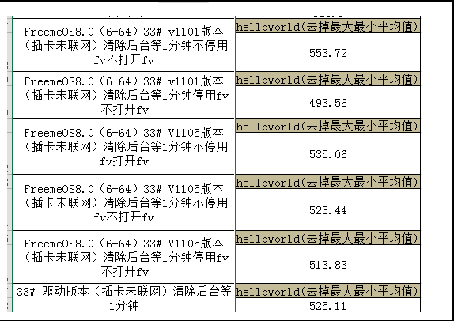

[TOC]

# 应用冷启动慢问题分析

## 1. 问题现象

`Helloword` 应用启动速度，平均500次相对于驱动版启动时间慢 20多ms

## 2. 复现环境

刷机后5分钟使用测试脚本（见最后）测试Helloword 应用，大概率出现

## 3. 分析
**阶段一：**
通过对比驱动版，驱动版启动时间整体小于目前公版，初步的回退版本结果如下：
|                                          | 15次  | 100次 |
| ---------------------------------------- | ---- | ---- |
| 客户-驱动版    （userdebug + dexpreopt）        | 507  |      |
| freeme-驱动版（userdebug + dexpreopt）        | 502  |      |
| 客户-驱动版（user）                             | 491  | 502  |
| freeme-移除 aapt2 版本（user）                 | 538  |      |
| freeme-移除 第三方应用（user）                    | 521  |      |
| freeme-移除 service改动（user）                |      | 517  |
| freeme-移除 theme（user）                    |      | 501  |
| freeme-移除 actionbar（包含freeme-theme）（user） |      | 503  |

从测试数据来看移除freeme- theme 改动后，100次测试结果偏好，趋于驱动版。但不能完整保证没有问题，因为从测试的数据来看，波动任然较大。

**阶段二：**

利用trace工具，但是由于误差只有20ms，分析难度较大

**阶段三：**

查看`adb logcat`，发现异常log，每次启动时会概率性刷新fooview 的布局。通过以下命令dump 视图状态


```
  $ adb shell dumpsys window windows
  Window #1 Window{df4710d u0 StatusBar}:
  Window #2 Window{e3a52a8 u0 com.fooview.android.fooview.freeme}:
  Window #3 Window{c9d719a u0 com.fooview.android.fooview.freeme}:
  Window #4 Window{5bd86bc u0 com.fooview.android.fooview.freeme}:
  Window #5 Window{76495c1 u0 AssistPreviewPanel}:
  Window #6 Window{735f154 u0 com.fooview.android.fooview.freeme}:
  Window #7 Window{dd10d66 u0 com.fooview.android.fooview.freeme}:
  Window #8 Window{e7b495b u0 DockedStackDivider}:
```

怀疑其影响，测试帮忙验证 `fooview` 关闭打开情况，结果如下（平均20次）。




停用`fv`后，整体数据偏好。

## 4. 结论

通过阶段三的测试，关闭`fooview`后，启动数据有所优化，目前已建议项目默认关闭。

## 5. 遗留问题

1. 目前测试这种冷启动问题暂无可靠性方案，只能通过传统的`am start -W` 命令获取结果
2. 缺少启动过程中的埋点数据


## 附录

测试脚本如下：

```shell
#!/bin/bash

total=0
for ((i=0; i<500; ++i))
do
  n=$(echo $(adb shell  am start -W -n "com.example.zzw_7.myapplication/.MainActivity"  | grep "WaitTime" | cut -d ":" -f2))
  let "avg += $n"
  echo $n
  sleep 5;
  #adb shell input keyevent BACK;
  adb shell am force-stop com.example.zzw_7.myapplication
  sleep 30;
done
#echo " Total" $avg
let "avg /= 500"
echo "Avg :" $avg
```


