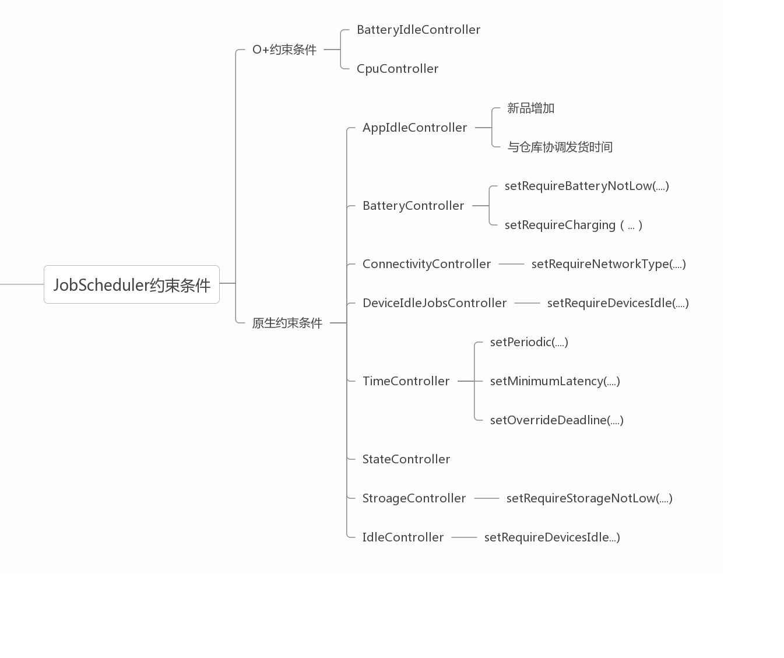
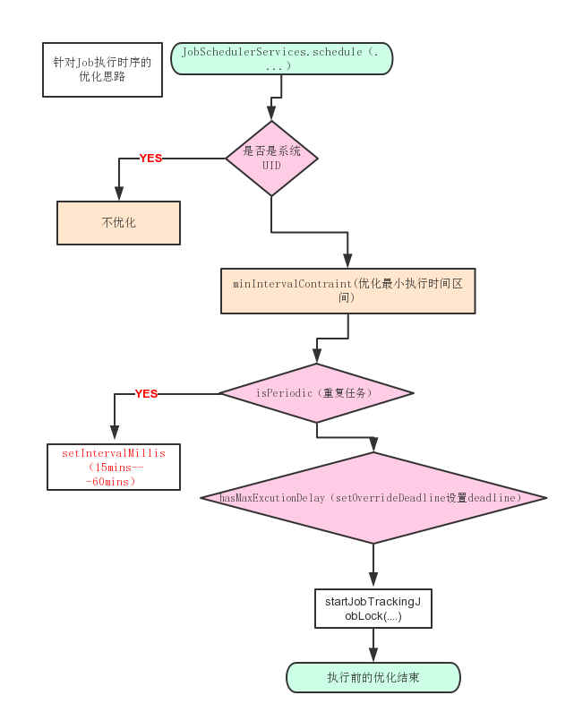
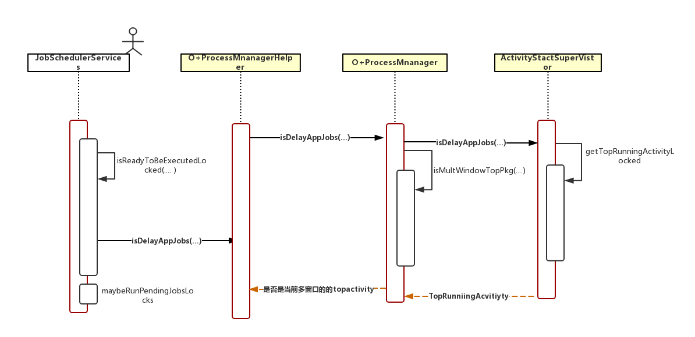

[TOC]

# 修改记录

| 版本 | 修改日期 | 作者 | 修改内容 |
| :---| ----------| ---- | ---- |
| v1.0 | 2018.06.12 |李明 | 初版 |

# 方案介绍

## 背景

 JobScheduler 是 Android L（API21）新增的特性，用于定义满足某些条件下执行的任务。它的宗旨是把一些不是特别紧急的任务放到更合适的时机批量处理，这样可以有效的节省电量。

上图列出的 android 原生约束条件中，都有针对性的约束意义

比如：

对于 ConnectivityControllor 这个约束条件，系统 OTA 设置了有网络连接的时候触发 OTA 检测，这个我们不作限制。

But but but:

其中有一个约束条件 TimeController 提供了三个接口

- setPeriodic（...） 设置重复 Job

- setMinmumLatency(...) 设置最早触发时间

- setOverrideDeadline（...） 设置最晚触发时间

有些第三方应用利用了其中一个约束条件（TimeController.java），设置循环触发条件，这样就会定时唤醒系统开始执行，造成功耗问题。

## 优化方向
- 对于 UID 小于 10000 的应用程序（一般是非系统应用）设置的 Job 任务，如果设置了最小的循环区间小于系统规定的 15mins，就改变其最小循环区间为 60mins

- 对于 Job 设置 deadline（最晚触发时间）的实现小于 15 分钟，就改变其触发的 deadline 为 60mins

- 在准备触发之前，检查该 Job 的 packageName 是否处于最上层 TopActivity，如果是，暂不执行。

通过上述三种方式，降低这种唤醒类 Job 任务的执行次数，达到减低功耗效果

## 优化实现

### Job 执行前优化
优化思路：

通过降低 Job 任务的执行频率，降低其对系统的唤醒频率，从而达到降功耗的效果

- 设置 Job 任务的最小循环执行间隔为 60mins

  现在系统默认 Job 任务最小循环执行间隔是 15mins

- 设置 Job 任务的 deadline 为 60mins

  系统没有对 deadline 做限制

### Job 执行时优化

优化思路：

通过判断当前 Job 所在的进程是前台进程的话约束其执行，优化后台 Job 任务执行导致的功耗问题

- 判断是否前台进程

  在 Job 任务约束条件满足的时候，判断如下条件

| 条件 |
| :---| 
|  该 Job 所在的 package 是 MultiWindow 的其中一个窗口 |
|  该 Job 是 TopActivity | 

   如果满足其中任意一个，选择不执行Job任务

# 小结

- 优化方案总体上通过两种方式 限制 Job 任务的执行频率，减少对系统的唤醒频率。优化了灭屏和亮屏情况下的功耗问题

# 后续持续优化点

- 建议把 Job 任务唤醒的时间点对齐到心跳的时间点。