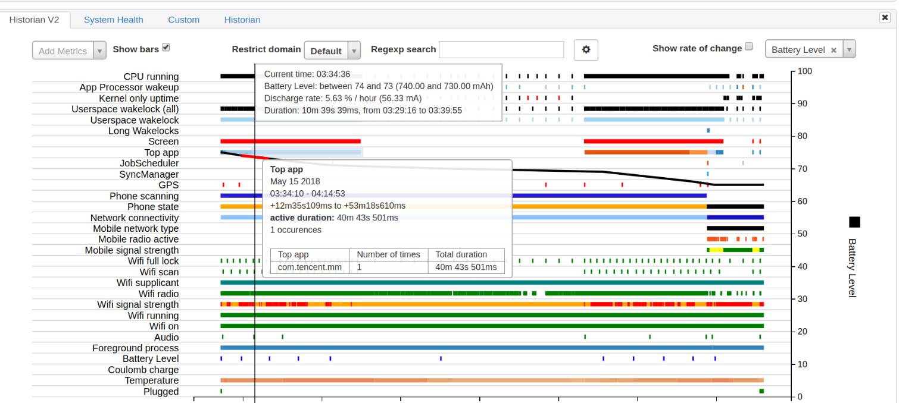
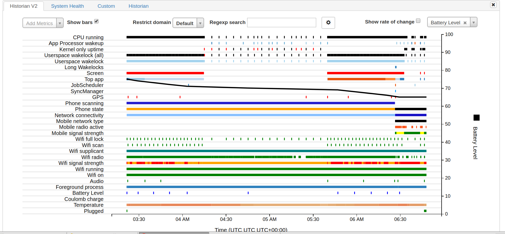
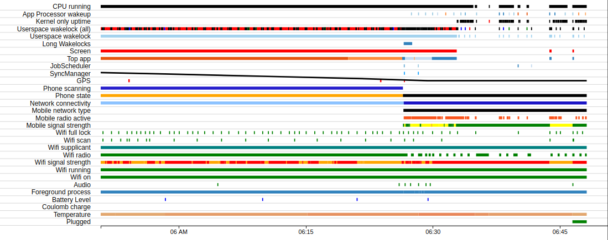

[TOC]

# battery-historian 总结
## battery-historian 工具的安装步骤
### 1. 安装docker
`$ sudo apt-get install docker.io`
### 2. 初始化battery-historian环境
`$ sudo docker -- run -p 8888:9999 gcr.io/android-battery-historian/stable:3.0 --port 9999`

*如果上条命令执行后出现下面的提示：*

```
FATA[0526] Error response from daemon: Cannot start container 2cbb9ad34e5eb6768af3a5bedd765ea0c48ba17462feb70e2928f8502cac5044: Error starting userland proxy: listen tcp 0.0.0.0:8888: bind: address already in use
```
*是因为“8888“这个端口在你的机器上已经被占用了，你只需要换一个其他的端口就可以了*

### 3. 打开battery-historian分析网页
在浏览器上直接打开：http://localhost:8888
### 4. 从设备端获取待分析的Battery日志信息
a. 重置电池数据收集数据，我们在开始的时候需要通过以下命令来打开电池数据的获取方式以及进行重置：

```
$ adb shell dumpsys batterystats --enable full-wake-history
$ adb shell dumpsys batterystats --reset
```

*在上面命令中，我们对电池日志数据进行了reset，也就是说数据是从我们reset的时间点进行记录的，此时要拔掉手机数据线的连接，以免手机处于充电状态没有耗电信息。然后至少要过几分钟再去获取bugreport日志信息，否则有可能获取不到有效信息*

b. 生成bugreport 日志文件：

`$ adb shell bugreport > bugreport.txt`

*此时需要耐心的等一会，待命令执行完会生成bugreport.txt文件,然后命令自动结束*

### 5. 在battery-historian分析网页网页上选择需要上传的日志文件bugreport.txt进行分析

## Battery-historian报告各个参数的意义说明



如上图所示：将鼠标放到每个参数对应的线上面可以看到每个参数对应的具体详细信息。
例如我们将鼠标放到Top app上，我们可以看到此时有那些app处于最上层，以及持续的时间等信息。
横坐标是UTC时间，本地时间=UTC时间+时区差(8)。



**CPU runing**

cpu运行的状态，是否被唤醒。如果把鼠标放到上面去，还能看到更多的信息，如CPU唤醒的原因。

**App Processor wakeup**

应用程序处理器唤醒

**Kernal only uptime**

只有内核运行时间,即:CPU运行,但是屏幕没有唤醒的情况.

**Usespace wakelock(all)**

该属性是记录wakelock模块的工作时间。是否有停止的时候等。系统为了节省电量，CPU在没有任务忙的时候就会自动进入休眠。有任务需要唤醒CPU高效执行的时候，就会给CPU加wakelock锁.该维度只记录第一个使用wakelock的app,如果需要记录所有的,使用adb shell dumpsys batterystates --enable full-wake-history

**Long Wakelocks**

如果这个维度出现了记录,说明持有wakelock已经超过1分钟了,这样是极其不正常的

**Screen**

屏幕是否点亮，可以用于考虑睡眠状态和点亮状态下电量的使用情况。

**Top app**

显示当前时刻哪个app处于最上层，就是当前手机运行的app,用来判断某个app对手机电量的影响，这样也能判断出该app的耗电量信息。该栏记录了应用在某一个时刻启动，以及运行的时间，这对我们比对不同应用对性能的影响有很大的帮助。

**GPS**

是否使用GPS

**Mobile network type**

网络类型

**Mobile radio active**

移动蜂窝信号 BP侧耗电，通常是指SIM卡，数据链接。该栏过多着色，间隔多。表示功耗也会高。

**Wifi Scan**

是否在扫描wifi信号

**Wifi supplicant**

是否有wifi请求

**Wifi radio**

是否正在通过wifi传输数据

**Wifi signal strength**

wifi信号强度

**Wifi running**

wifi组件是否在工作

**Wifi on**

wifi是否打开

**Audio**

音频是否开启

**Foreground process**

前台进程

**Battery level**

电池当前电量,通过图表可以看出电量的变化。

**Temperature**

电池温度

**Plugged**

充电状态，这一栏显示是否进行充电，以及充电的时间范围。

**Charging on**

在充电

## 使用Battery Historian分析电源使用情况


  如图所示：图中黑色斜线表示电池电量，可以看出随着时间的增加，电量逐渐下降，此时主要耗电行为有三个：CPU正在运行，应用程序已获取唤醒锁，屏幕亮起。通过这种方式，Battery Historian可帮助您了解电池消耗高时发生的事件。然后，您可以将这些行为定位到您的应用中，并调查是否可以进行相关的优化。

  **walelock锁机制**

   wakelock是一种锁的机制，只要有应用拿着这个锁，CPU就无法进入休眠状态，一直处于工作状态。比如，手机屏幕在屏幕关闭的时候，有些应用依然可以唤醒屏幕提示用户消息，这里就是用到了wakelock锁机制，虽然手机屏幕关闭了，但是这些应用依然在运行着。手机耗电的问题，大部分是开发人员没有正确使用这个锁，成为"待机杀手"。
  借助battery-historian工具，我们可以看到有哪些apk频繁占用walelock锁，使cpu不能进入休眠状态，消耗电量。并去进一步分析这种行为是否合理，如过不合理，需要对其进行优化。

## 电量优化建议
### 1. 判断充电状态

对于那么些不需要及时的和用户交互的操作或者比较耗电的操作可以放到手机插上电源的时候去做。

### 2. 屏幕保持常亮

为了防止屏幕唤醒一瞬间耗电过多，有一些应用，比如游戏、支付页面，需要保持屏幕常亮来节省电量。
