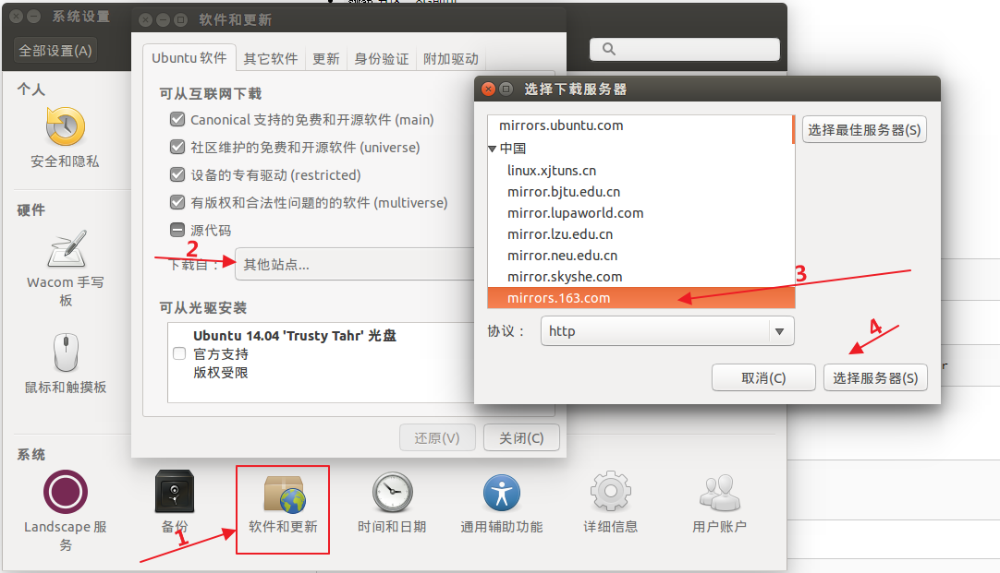
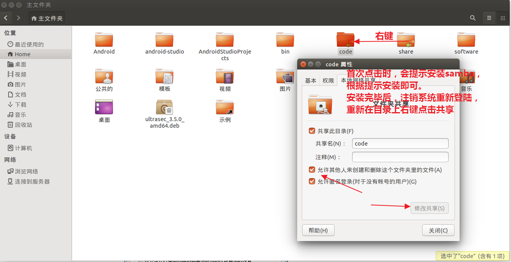
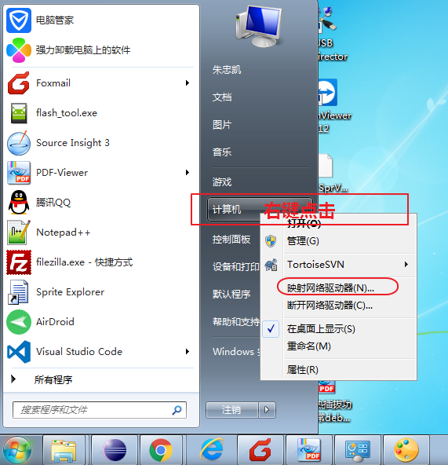
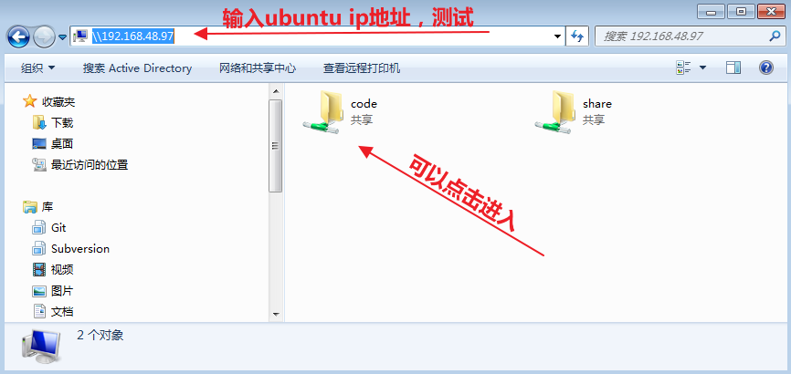
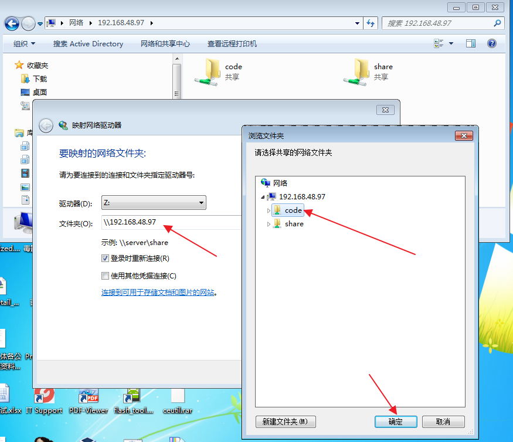
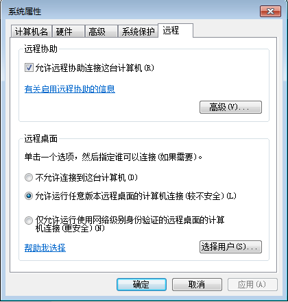
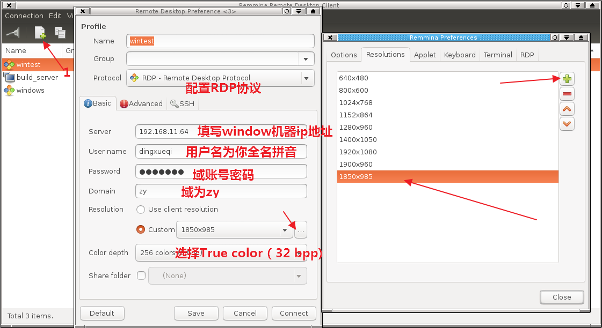
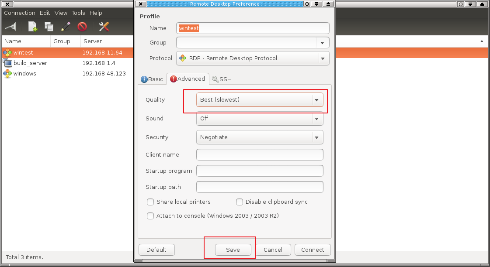

# 卓易framework组linux开发环境搭建指南

[TOC]

## ubuntu系统安装

### 制作安装U盘

安装环境为ubuntu14.04，下载地址为：

iso可从官网下载，也可从公司的ftp服务器上下载（位于software\镜像软件目录下\ubuntu-14.04-desktop-amd64.iso），可使用u盘制作启动盘安装，方法请参考网上资料。

linux系统上制作ubuntu启动盘的方法为（需要准备一块可用U盘，根据自己系统的实际情况修改下面命令中的/dev/sdc1）

```
sudo dd if=ubuntu-14.04-desktop-amd64.iso of=/dev/sdc1 bs=1M
```

制作完毕后开机配置bios，通过U盘启动后开始安装过程。

### ubuntu安装硬盘分区方案

因为代码占用空间较大，建议分区方案为：

- `/`分区，`EXT4`格式，`80G`左右
- `swap`分区，8G即可
- `/home`分区，`EXT4`格式，其余所有空间

如果有两块硬盘，如500G+2T硬盘，建议分区方案为：

- 500G硬盘，根分区80G + 8G swap分区 + /opt分区(EXT4格式，剩余全部）
- 2G硬盘，EXT4格式，挂载点为`/home`

### 系统配置

#### 配置163源

ubuntu系统默认源为官方中国服务器，实际测试，速度偏慢，建议使用`163`源，配置方法是：



配置完成后，ubuntu系统会自动执行源更新索引操作，请耐心等待，在更新完毕之前，无法执行`sudo apt-get xxx`命令。

源更新完毕之后，请执行如下命令确认源索引完毕。

```
$ sudo apt-get update
```

#### 安装必要软件包

```
$ sudo apt-get install gdebi vim vim-gnome subversion tree p7zip-full openssh-server
```
#### 安装搜狗输入法

默认输入法为ibus比较难用，可安装搜狗linux输入法，命令为

```
$ sudo apt-get install fcitx
$ im-config
```

下载搜狗输入法：http://pinyin.sogou.com/linux/ 下载得到deb包后，命令行执行

```
$ sudo gdebi sogoupinyin_2.0.0.0078_amd64.deb
```

配置完成后重启生效。

#### 安装chrome浏览器

ubuntu系统默认使用`FireFox`浏览器，有道云笔记仅在chrome浏览器上支持`markdown`格式，建议使用chrome，并配置为默认浏览器。方法如下：

下载：http://www.google.cn/intl/zh-CN/chrome/browser/desktop/index.html，下载完毕后，双击安装。

#### 配置samba共享

请参考下图配置samba服务器。







如果进入code目录提示`没有权限....`，需要安装`libtalloc2`，方法如下

```
sudo apt-get install libtalloc2
```

安装完成后，注销ubuntu后重新登陆，继续在Windows中测试是否可以正常访问，正常后，可在windows中映射磁盘。方法如下。



#### 配置远程桌面

本步配置后，可以在ubuntu中远程访问windows桌面系统。

1. windows使能远程桌面

    切换至windows系统，打开`开始菜单` -> `计算机`右键点击`属性`，打开`控制面板`的`系统`子页面 -> 点击左侧`远程设置`。



2. ubuntu配置

    切换回ubunut系统，启动`remmina`，参考下图配置





配置完成后，测试是否可以访问windows。

### 安装加密系统

公司内部代码服务器部署了加密系统，并且在本地执行加密。为了正常拉取代码需要在本地安装加密客户端，并登陆账号密码。账号为`拼音全名+数字1`、密码为`12345678`，如刘德华的加密账号密码为：

- 账号：liudehua1
- 密码：12345678

安装加密客户端命令如下，

```
$ wget http://192.168.0.193/packages/linux/ultrasec_3.5.0_amd64.deb && sudo dpkg -i ultrasec_3.5.0_amd64.deb
```

确保使用加密系统支持的内核，查看内核版本命令为

```
$ uname -a
```

ubuntu 14.04请使用`3.13.0-24-generic`内核，如果使用高版本内核，请降级内核，命令如下，

```
sudo apt-get remove linux-image-3.13.0-144-generic
```

安装完成后重启系统

确认加密客户端是否安装的方法是（仅以ubuntu系统为例），终端执行`usec`，是否出现：

```
1.Update policy
2.Change password
3.Set workspace
4.View status
5.Offline service
6.Logout
7.About
8.Quit
> Please choose:
```

首先输入设置加密服务器ip地址和端口:

- ip： `192.168.0.128`
- port：`80`

设置账号密码, 如前面描述的刘德华，其账号密码分别是

- 账号：liudehua1
- 密码：12345678

然后根据情况，设置workspace（即要被加密的目录，默认只加密 /home、/root两个目录, 如果代码位于/mnt分区下，请添加workspace）

最后输入4，若出现类似以下输出，则表示加密客户端正确运行

```
Online: 账号：liudehua1
```

如果usec提示未知道匹配的内核，说明加密客户端不支持你的ubuntu系统当前使用的内核。请配置使用指定内核。

如果打开本地代码发现都是乱码。有两种可能：

1. 加密客户端未正常工作。请执行`usec`查看，内核升级、未登陆账号密码都可能导致该问题。请确保内核版本为`3.13.0-24-generic`、账号正确登陆。
2. 加密客户端正常。但是源码所在路径没有被设置为加密目录。

## 搭建Android代码编译环境

### 安装编译工具链

```
$ sudo apt-get install openjdk-7-jdk
$ sudo apt-get install git-core gnupg flex bison gperf build-essential \
  zip curl zlib1g-dev gcc-multilib g++-multilib libc6-dev-i386 \
  lib32ncurses5-dev x11proto-core-dev libx11-dev lib32z-dev ccache \
  libgl1-mesa-dev libxml2-utils xsltproc unzip
```

PS. 参考自：https://source.android.com/source/initializing.html


### ubuntu14.04 安装openjdk8

Android7.0代码依赖`openjdk8`。以下内容参考自Android官网。

1. [openjdk-8-jre-headless_8u45-b14-1_amd64.deb](http://archive.ubuntu.com/ubuntu/pool/universe/o/openjdk-8/openjdk-8-jre-headless_8u45-b14-1_amd64.deb)

SHA256 0f5aba8db39088283b51e00054813063173a4d8809f70033976f83e214ab56c0

2. [openjdk-8-jre_8u45-b14-1_amd64.deb](http://archive.ubuntu.com/ubuntu/pool/universe/o/openjdk-8/openjdk-8-jre_8u45-b14-1_amd64.deb)

SHA256 9ef76c4562d39432b69baf6c18f199707c5c56a5b4566847df908b7d74e15849

3. [openjdk-8-jdk_8u45-b14-1_amd64.deb](http://archive.ubuntu.com/ubuntu/pool/universe/o/openjdk-8/openjdk-8-jdk_8u45-b14-1_amd64.deb)

SHA256 6e47215cf6205aa829e6a0a64985075bd29d1f428a4006a80c9db371c2fc3c4c

```
$ sha256sum {downloaded.deb file}
```

对比hash值确保下载的包完整，然后执行如下命令安装。

```
$ sudo dpkg -i openjdk-8-jre-headless_8u45-b14-1_amd64.deb openjdk-8-jre_8u45-b14-1_amd64.deb openjdk-8-jdk_8u45-b14-1_amd64.deb
```

上述命令在14.04上会安装失败，提示缺少部分依赖库，执行如下命令修复依赖并完成jdk8安装。

```
$ sudo apt-get -f install
```

### ubuntu 14.04安装编译依赖

```
$ sudo apt-get install git-core gnupg flex bison gperf build-essential \
  zip curl zlib1g-dev gcc-multilib g++-multilib libc6-dev-i386 \
  lib32ncurses5-dev x11proto-core-dev libx11-dev lib32z-dev ccache \
  libgl1-mesa-dev libxml2-utils xsltproc unzip
```

参考：https://source.android.com/source/initializing

### ubuntu 12.04安装jdk8

参考： http://ubuntuhandbook.org/index.php/2015/01/install-openjdk-8-ubuntu-14-04-12-04-lts/

```
sudo add-apt-repository ppa:openjdk-r/ppa
sudo apt-get update
sudo apt-get install openjdk-8-jdk
```

#### 切换jdk版本

```
$ sudo update-alternatives --config java
$ sudo update-alternatives --config javac
```

根据提示配置为java 8。

**AOSP 代码中添加自动识别jdk安装路径的代码，支持jdk7和jdk8同时存在。只要正确安装jdk, 可自动编译Android6.0（需要jdk7）与Android7.0（需要jdk8）**

```
sudo apt-get install openjdk-7-jdk
```
同时，请不要添加`JAVA_HOME`等环境变量, 即请确保`echo $JAVA_HOME`输出为空, `JAVA_HOME`配置的可能位置如下，将他们全部删掉

```
/etc/environment
/etc/profile
/etc/bash.bashrc
~/.profile
~/.bashrc
```

#### 编译

```
$ . build/envsetup.sh
$ lunch
选择合适版本

$ make -j10 开10个线程编译。
```

### 安装AndroidStudio开发环境

请参考有道云协作中Droi群组下的 `Develop/AndroidStudio/AndroidStudio-安装-配置-调试`。
