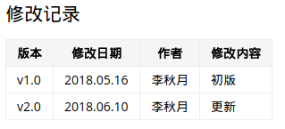

[TOC]

# 一、修改记录

| 版本 | 修改日期 | 作者 | 修改内容 |
| :---| ----------| ---- | ---- |
| v1.0 | 2018.05.31 | 李秋月 | 初版 |
| v2.0 | 2018.08.25 | 李秋月 | 文章结构 |

# 二、注意点

1、不同的样式之间加上新的空行，即回车一下，否则 gerrit 上识别不了，就不会显示出我们想要的效果。

2、上传的图片，用 ubuntu 的截图工具截取，方可识别，图片大小不可超过 256KB 。

3、加粗，"**" 符号需要和未包裹的字符留一个半角空格。否则 gerrit 也识别不了，诸如类似的问题都需要注意一下。

```
错误：今天是个**好**日子。
正确：今天是个 **好** 日子。
```

4、在文档开始处加上 **修改记录** ,如下图；亦可参照本文档。



# 三、文件名

文档的文件名不得含有空格。

文件名包含多个单词时，单词之间建议使用半角的连词线（-）分隔。

```
不佳：advanced_usage.md

正确：advanced-usage.md
```

# 四、段落

- 一个段落的长度不能超过七行，最佳段落长度小于等于四行。
- 段落的句子语气要使用陈述和肯定语气，避免使用感叹语气。
- 段落之间使用一个空行隔开。
- 段落开头不要留出空白字符。

# 五、文章结构

为了文章结构一目了然，便于读者阅读。
在一级、二级、三级标题前面加上如下序号，即使没有 # ## ### 表示标题的符号，文章内容大体结构上符合这样的逻辑也必须加上序号，可参照本文。

- 一级标题前面加上如下序号:

```
一、

二、

三、
```

- 二级标题加上如下序号:

```
1、

2、

3、
```

- 三级标题加上如下序号

```
a、

b、

c、
```

- 因网页不支持四级标题及以下，如若有更深层级的标题,则按二级和三级标题的序号处理，这里不再赘述。

**注：这里为什么不用点，而用顿号，是因为网页版有时不能正确的显示序号，为避免错误，统一用顿号。**

# 六、文本

## 1、字间距

**a、全角中文字符与半角英文字符之间，应有一个半角空格。**

```
错误：本文介绍如何快速启动Windows系统。

正确：本文介绍如何快速启动 Windows 系统。
```

**b、全角中文字符与半角阿拉伯数字之间，有没有半角空格都可，但必须保证风格统一，不能两种风格混杂。**

```
正确：2011年5月15日，我订购了5台笔记本电脑与10台平板电脑。

正确：2011 年 5 月 15 日，我订购了 5 台笔记本电脑与 10 台平板电脑。
```

**c、半角的百分号，视同阿拉伯数字。**


**英文单位若不翻译，单位前的阿拉伯数字与单位间不留空格。**

```
错误：一部容量为 16 GB 的智能手机

正确：一部容量为 16GB 的智能手机
```

**d、半角英文字符和半角阿拉伯数字，与全角标点符号之间不留空格。**

```
错误：他的电脑是 MacBook Air 。

正确：他的电脑是 MacBook Air。
```

## 2、句子

- 避免使用长句。句子内部不使用逗号时，总长度不应该超过 40 个字；使用逗号时，总长度不应该超过 100 字或者正文的 3 行。
-  尽量使用简单句和并列句，避免使用复合句。

## 3、写作风格

**a、尽量不使用被动语态，改为使用主动语态。**

```
错误：假如此软件尚未被安装，

正确：假如尚未安装这个软件，
```

**b、使用代词时（比如“其”、“该”、“此”、“这”等词），必须明确指代的内容，保证只有一个含义。**

```
错误：从管理系统可以监视中继系统和受其直接控制的分配系统。

正确：从管理系统可以监视两个系统：中继系统和受中继系统直接控制的分配系统。
```

**c、不包含任何标点符号的单个句子，或者以逗号分隔的句子构件，长度尽量保持在 20 个字以内；20～29 个字的句子，可以接受；30～39 个字的句子，语义必须明确，才能接受；多于 40 个字的句子，在任何情况下都不能接受。**

```
错误：本产品适用于从由一台服务器进行动作控制的单一节点结构到由多台服务器进行动作控制的并行处理程序结构等多种体系结构。

正确：本产品适用于多种体系结构。无论是由一台服务器（单一节点结构），还是由多台服务器（并行处理结构）进行动作控制，均可以使用本产品。
```

**d、同样一个意思，尽量使用肯定句表达，不使用否定句表达。**

```
错误：请确认没有接通装置的电源。

正确：请确认装置的电源已关闭。
```

**e、避免使用双重否定句。**

```
错误：没有删除权限的用户，不能删除此文件。

正确：用户必须拥有删除权限，才能删除此文件。

```

**f、不使用非正式的语言风格。**

```
错误：Lady Gaga 的演唱会真是酷毙了，从没看过这么给力的表演！！！

正确：无法参加本次活动，我深感遗憾。
```

# 七、标点符号

## 1、原则

- 中文语句的标点符号，均应该采取全角符号，这样可以保证视觉的一致。
- 如果整句为英文，则该句使用英文/半角标点。
- 句号、问号、叹号、逗号、顿号、分号和冒号不得出现在一行之首。

## 2、句号

**1.中文语句中的结尾处应该用全角句号（。）。**


**句子末尾用括号加注时，句号应在括号之外。**

```
错误：关于文件的输出，请参照第 1.3 节（见第 26 页。）

正确：关于文件的输出，请参照第 1.3 节（见第 26 页）。

```

## 3、逗号
逗号，表示句子内部的一般性停顿。

注意避免“一逗到底”，即整个段落除了结尾，全部停顿都使用逗号

## 4、顿号

句子内部的并列词，应该用全角顿号(、) 分隔，而不用逗号，即使并列词是英语也是如此。

```
错误：我最欣赏的科技公司有 Google, Facebook, 腾讯, 阿里和百度等。

正确：我最欣赏的科技公司有 Google、Facebook、腾讯、阿里和百度等。
```

英文句子中，并列词语之间使用半角逗号（,）分隔。

```
例句：Microsoft Office includes Word, Excel, PowerPoint, Outlook and other components.
```

## 5、圆括号

补充说明时，使用全角圆括号（），括号前后不加空格。

```
例句：请确认所有的连接（电缆和接插件）均安装牢固。
```

## 6、冒号

全角冒号（：）常用在需要解释的词语后边，引出解释和说明。

```
例句：请确认以下几项内容：时间、地点、活动名称，以及来宾数量。
```

## 7、省略号

省略号……表示语句未完、或者语气的不连续。它占两个汉字空间、包含六个省略点，不要使用。。。或...等非标准形式。

省略号不应与“等”这个词一起使用

```
错误：我们为会餐准备了香蕉、苹果、梨…等各色水果。

正确：我们为会餐准备了各色水果，有香蕉、苹果、梨……

正确：我们为会餐准备了香蕉、苹果、梨等各色水果。
```

## 8、感叹号

应该使用平静的语气叙述，尽量避免使用感叹号！。

不得多个感叹号连用，比如！！和!!!。

## 9、破折号

破折号————一般用于进一步解释。

破折号应占两个汉字的位置。如果破折号本身只占一个汉字的位置，那么前后应该留出一个半角空格。

```
例句：直觉————尽管它并不总是可靠的————告诉我，这事可能出了些问题。

例句：直觉 —— 尽管它并不总是可靠的 —— 告诉我，这事可能出了些问题。
```

注：

本文参照 [中文技术文档的写作规范](http://www.ruanyifeng.com/blog/2016/10/document_style_guide.html)

