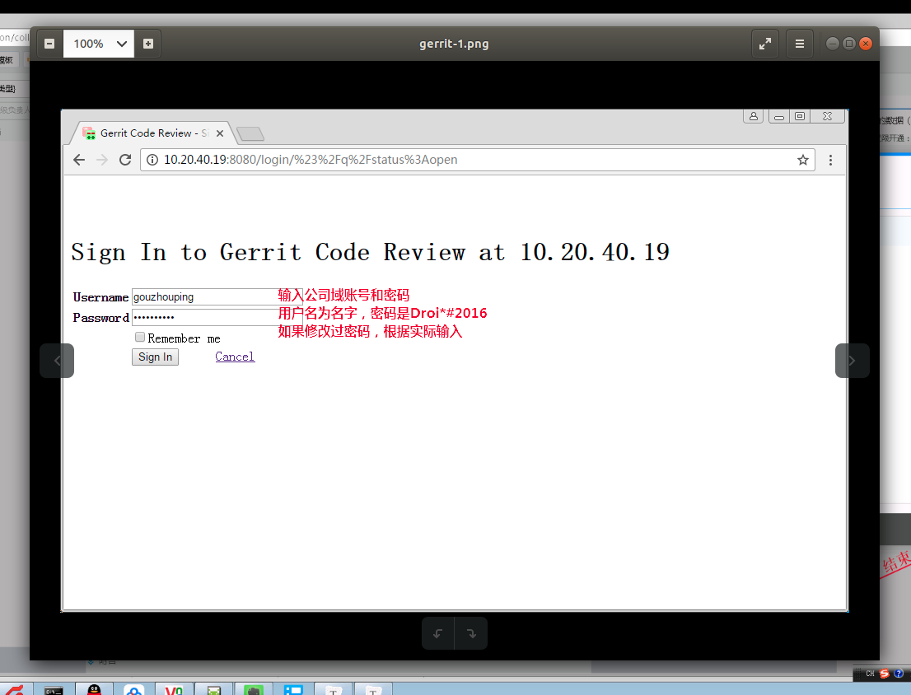

[TOC]

# 安装系统/配置开发环境

由主管帮忙提OA（电脑系统故障单），IT负责处理

# 账号申请

## 加入邮件组

首先登陆OA账号，后续操作如下

## 申请 gerrit 账号

**首先告知*部门主管*，开通账号权限。**

登陆gerrit，公司内网地址：[http://10.20.40.17:8080](http://10.20.40.17:8080/)，注意gerrit网页ip(10.20.40.17)地址与拉取代码使用的ip(10.20.40.19)不同，这是有意为之的。

**说明：目前测试发现使用IE浏览器以及360浏览器（兼容模式），无法打开本页面，请使用极速模式或更换chrome、firefox浏览器**

更多gerrit操作见

 http://10.20.40.17:8080/plugins/gitiles/freemeos/common/documents/+/refs/heads/master

## 申请mantis

日常bug反馈及处理网站，链接（[http://192.168.111.1/mantis/login_page.php](http://192.168.111.1/mantis/login_page.php)）

开通请咨询*部门主管*

# 文档管理

## gerrit托管

http://10.20.40.17:8080/plugins/gitiles/freemeos/common/documents/+/refs/heads/master

# 代码管理

代码托管在gerrit上，使用git管理。

## 配置环境以及拉取代码

参考：[git-repo简明教程1、2、3](http://10.20.40.17:8080/plugins/gitiles/freemeos/common/documents/+/master/freemeOS/other/code_management/gerrit/)。

## 代码开发

使用Android Studio。AS配置、调试 Android 框架请参考 [AndroidStudio-安装-配置-调试](http://10.20.40.17:8080/plugins/gitiles/freemeos/common/documents/+/master/introduction/configuration/AndroidStudio/)

## 代码编译

与AOSP原生代码不同，我们的项目代码对Android编译命令封装了编译脚本，名为`mk`。具体用法暂略。

# 附录

## 工作网站

功能 | 名称 | 网址 | 说明
---------|----------|---------|---------
代码托管和审核 | gerrit | http://10.20.40.17:8080 | 账号与域账号绑定
域账号修改 | 无 | http://10.20.40.61/RDWeb/Pages/en-US/password.aspx | 域账号定时过期，提示密码不正确时即需要更新域账号密码
bug管理 | mantis | http://192.168.111.1 | 由主管创建账号
任务管理 | Tower | https://tower.im/ | 请自行注册账号
