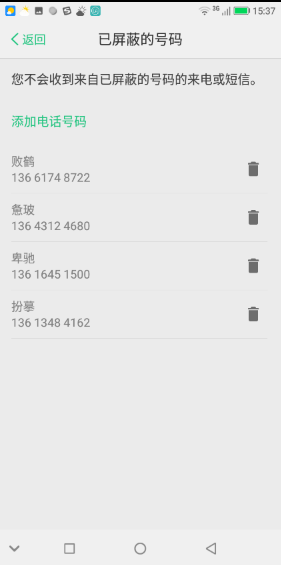

[TOC]

# 修改记录

| 版本 | 修改日期 | 作者 | 修改内容 |
| :---| ----------| ---- | ---- |
| v1.0 | 2018.06.14 | 李强 | 初版 |

# 黑名单

## 一、功能介绍

手机黑名单是一个防止自己被骚扰，拦截骚扰短信、电话的功能，当你不想让某人或者某些人联系到自己的时候，可以把他的号设置到手机黑名单中，这样当在黑名单中的号码给你打电话或者发短信的时候，电话和短信就会被拦截下来。</br>

## 二、添加删除黑名单流程

### 1.联系人详情界面添加删除黑名单

联系人详情界面初始化的时候，会先判断联系人号码是否已经被加入黑名单， 如果已经加入到黑名单，则显示从"黑名单中移除"，否则显示"添加到黑名单"。

联系人界面点击加入黑名单的图如下:


下面是从联系人界面把号码加入到黑名单的时序图:


详细的流程如下:

首先判断加入黑名单之前，需要满足以下几个条件：

- 联系人数据不为空
- 不是个人名片
- 号码数量大于 0
- 该进程是否是在主用户下运行的

QuickContactActivity.java

```
    private void initBlockList(LinkedHashMap<Integer, FreemeSettingEntryCardView.SettingsEntry> settingEntries) {
        // 判断是不是我的名片，该联系人是否是有号码，判断当前用户是否支持黑名单功能
        if (mContactData != null && !mContactData.isUserProfile()
                && mContactData.getPhoneNumberLists().size() > 0
                && FreemeBlockUtil.canCurrentUserBlockNumbers(this)) {
            // 在初始化的时候判断联系人号码是否已经有加入到黑名单了
            mIsAllBlocked = FreemeBlockUtil.isAllBlockedNumbers(this, mNumberList);
            final FreemeSettingEntryCardView.SettingsEntry blockEntry = new FreemeSettingEntryCardView.SettingsEntry(
                    CARD_ENTRY_ID_BLACK_LIST,
                    getString(mIsAllBlocked ? R.string.remove_from_blacklsit : R.string.add_to_blacklsit),
                    null, mBlockListener);
            settingEntries.put(CARD_ENTRY_ID_BLACK_LIST, blockEntry);
        }
    }
```

下面截取判断该进程是否在主用户下运行的代码:

BlockedNumberContract.java

```
    /**
     * Checks if blocking numbers is supported for the current user.
     * <p> Typically, blocking numbers is only supported for one user at a time.
     *
     * @return {@code true} if the current user can block numbers.
     */
    public static boolean canCurrentUserBlockNumbers(Context context) {
        final Bundle res = context.getContentResolver().call(
                AUTHORITY_URI, METHOD_CAN_CURRENT_USER_BLOCK_NUMBERS, null, null);
        return res != null && res.getBoolean(RES_CAN_BLOCK_NUMBERS, false);
    }
```

满足上面四个条件之后，把 mNumberList 传过去，然后通过 for 循环去一个个判断号码是否已经加入到黑名单，
判断号码是否已经加入黑名单代码如下:

BlockedNumberContract.java

```
    @WorkerThread
    public static boolean isBlocked(Context context, String phoneNumber) {
        final Bundle res = context.getContentResolver().call(
                AUTHORITY_URI, METHOD_IS_BLOCKED, phoneNumber, null);
        return res != null && res.getBoolean(RES_NUMBER_IS_BLOCKED, false);
    }
```

点击添加到黑名单 & 从黑名单中移除都是显示下面Dialog，如果是已经加入到黑名单的， 点击之后则从黑名单数据库中移除该号码，
否则则把该号码加入到黑名单数据库中。

QuickContactActivity.java

```
    private void showBlackListOperateTipsDialog() {
        ...
        build.setPositiveButton(android.R.string.ok, new DialogInterface.OnClickListener() {
            @Override
            public void onClick(DialogInterface arg0, int position) {
                // 先进行判断
                if (mIsAllBlocked) {
                    //已经加入黑名单，再次点击则从黑名单中移除
                    boolean ret = FreemeBlockUtil.unBlockNumbers(QuickContactActivity.this, mNumberList);
                    if (ret) {
                        mIsAllBlocked = false;
                    }
                } else {
                    String name = mContactName.getText().toString();
                    FreemeBlockUtil.blockNumbers(QuickContactActivity.this, mNumberList, name);
                    mIsAllBlocked = true;
                }
                mFreemeSettingsCard.updateEntryView(CARD_ENTRY_ID_BLACK_LIST,
                        getString(mIsAllBlocked ? R.string.remove_from_blacklsit : R.string.add_to_blacklsit),
                        null);
            }
        });
        ...
    }

```

添加到黑名单对应的插入数据库代码如下:

FreemeBlockUtil.java

```
    public static void blockNumber(Context context, String number, String name) {
        // 插入的时候， 号码不能为空并且判断此号码是否已经被加入黑名单
        if (!TextUtils.isEmpty(number) && !isBlockedNumber(context, number)) {
            ContentValues values = new ContentValues();
            //original_nummber
            values.put(BlockedNumberContract.BlockedNumbers.COLUMN_ORIGINAL_NUMBER, number);
            //original_name
            values.put(BlockedNumberContract.BlockedNumbers.COLUMN_ORIGINAL_NAME, name);
            // 插入到blocked表中
            context.getContentResolver().insert(BlockedNumberContract.BlockedNumbers.CONTENT_URI, values);
        }
    }
```

从黑名单中移除已经拉黑的号码对应代码如下，从下面这个方法我们可以看到调用了 call() 方法，具体的实现是在 BlockedNumberProvider.java
 里面的 call() 方法，我们可以在这里面看到是如何从数据库里面删除黑名单数据的。 所以我们在移除添加黑名单的时候可以直接调用 BlockedNumberContract 里面
 已经封装好的方法了:

BlockedNumberContract.java

```
    @WorkerThread
    public static int unblock(Context context, String phoneNumber) {
        final Bundle res = context.getContentResolver().call(
                AUTHORITY_URI, METHOD_UNBLOCK, phoneNumber, null);
        return res.getInt(RES_NUM_ROWS_DELETED, 0);
    }
```
下面这个是 SQLiteDatabase 删除 blokced 表格中需要移除的号码的代码 :

BlockedNumberProvider.java

```
    /**
     * Implements the "blocked/" delete.
     */
    private int deleteBlockedNumber(String selection, String[] selectionArgs) {
        final SQLiteDatabase db = mDbHelper.getWritableDatabase();

        // When selection is specified, compile it within (...) to detect SQL injection.
        if (!TextUtils.isEmpty(selection)) {
            db.validateSql("select 1 FROM " + Tables.BLOCKED_NUMBERS + " WHERE " +
                    Utils.wrapSelectionWithParens(selection),
                    /* cancellationSignal =*/ null);
        }

        return db.delete(
                BlockedNumberDatabaseHelper.Tables.BLOCKED_NUMBERS,
                selection, selectionArgs);
    }
```

### 2.设置界面添加删除黑名单

在设置界面我们可以管理黑名单列表( 设置-系统应用设置-电话-黑名单设置)， 第一次进入有一个提示界面。再次进去我们就可以管理
黑名单列表了。

对应的截图如下：




设置界面添加黑名单时序图如下:


设置界面添加黑名单有两种方式：

(1). 直接输入号码添加至黑名单，在点击添加电话号码之后弹出对话框，当我们手动输入一个号码，再点击屏调用如下代码:

FreemeBlockedNumbersActivity.java

```
    /**
     * Add blocked number if it does not exist.
     */
    private void addBlockedNumber(String number) {
        // 判断是否是紧急号码
        if (PhoneNumberUtils.isEmergencyNumber(number)) {
            Toast.makeText(
                    this,
                    getString(R.string.blocked_numbers_block_emergency_number_message),
                    Toast.LENGTH_SHORT).show();
        } else {
            // We disable the add button, to prevent the user from adding other numbers until the
            // current number is added.
            mAddButton.setEnabled(false);

            // 插入到黑名单数据库
            ContentResolver contentResolver = this.getContentResolver();
            ContentValues newValues = new ContentValues();
            newValues.put(BlockedNumberContract.BlockedNumbers.COLUMN_ORIGINAL_NUMBER,
                    number);
            contentResolver.insert(BlockedNumberContract.BlockedNumbers.CONTENT_URI,
                    newValues);
        }
    }
```

(2). 通过选择联系人列表选择之后添加到黑名单, 点击选择联系人按钮之后，进入选择的 Activity, 在选择好数据之后，返回的数据在
FreemeBlockedNumberActivity 的 OnActivityResult 里面处理。

下面是点击图片按钮的代码 :

FreemeBlockedNumbersActivity.java

```
        imageview.setOnClickListener(new View.OnClickListener() {
            public void onClick(View v) {
                dialog.dismiss();
                // 跳转到联系人选择界面的action
                Intent contactPickerIntent = new Intent(ACTION_CONTACT_SELECTION);
                contactPickerIntent.setType(ContactsContract.CommonDataKinds.Phone.CONTENT_TYPE);
                startActivityForResult(contactPickerIntent,
                        CHOOSE_CONTACTS_BLOCKED_CODE);
            }
        });
```

在选择好了联系人之后，返回到 FreemeBlockedNumberActivity 之后，在 OnActivityResult 里面做操作。

```
    protected void onActivityResult(int requestCode, int resultCode, Intent data) {
        super.onActivityResult(requestCode, resultCode, data);
        if (requestCode == CHOOSE_CONTACTS_BLOCKED_CODE) {
            if (data != null) {
                long[] contactIds = data.getLongArrayExtra("com.mediatek.contacts.list.pickdataresult");
                // 把返回的数据加入到ArrayList
                ArrayList<Object> params = new ArrayList<Object>();
                params.add(contactIds);
                params.add(this);
                addBlockedNumber(params);
            }
        }
    }

    private void addBlockedNumber(ArrayList<Object> ids) {
        mBlockNumberTaskFragment.blockIfNotAlreadyBlocked(ids, this);
    }
```

把返回的数据加入到 ArrayList之 后，在通过 addBlockedNumber 方法传入数据，在开启异步线程去添加到黑名单数据库。

FreemeBlockNumberTaskFragment.java

```
    /**
     * Runs an async task to write the number to the blocked numbers provider if it does not already
     * exist.
     * <p>
     * Triggers {@link Listener#onBlocked(String, boolean)} when task finishes to show proper UI.
     */
    public void blockIfNotAlreadyBlocked(ArrayList<Object> ids, Listener listener) {
        mListener = listener;
        mTask = new BlockNumberTask();
        // 开启异步线程
        mTask.execute(ids);
    }
```

可以看一下 BlockNumberTask 的具体代码如下:

```
    /**
     * Task to block a number.
     */
    private class BlockNumberTask extends AsyncTask<ArrayList, Void, Boolean> {
        private String blockedName;
        private String blockedNumber;

        @Override
        protected Boolean doInBackground(ArrayList... params) {
            if (params.length == 0) {
                return null;
            }
            ArrayList<Object> list = params[0];
            long[] ids = (long[]) list.get(0);
            StringBuilder idSetBuilder = new StringBuilder();
            boolean first = true;
            //for 循环把 ids append 到 idSetbBuilder 里
            for (long id : ids) {
                if (first) {
                    first = false;
                    idSetBuilder.append(id);
                } else {
                    idSetBuilder.append(',').append(id);
                }
            }
            Cursor cursor = null;
            ContentResolver contentResolver = getContext().getContentResolver();
            if (idSetBuilder.length() > 0) {
                // 查询联系人里面data表是否有对应的 _id
                final String whereClause = ContactsContract.CommonDataKinds.Phone._ID + " IN (" + idSetBuilder.toString() + ")";
                cursor = contentResolver.query(
                        PHONES_WITH_PRESENCE_URI, CALLER_ID_PROJECTION, whereClause, null, null);
            }
            // 如果没有查询到则 return false
            if (cursor == null) {
                return false;
            }
            try {
                // cursor.moveToNext ， 读取 cursor 里数据， 然后再进行判断是否是已经加入黑名单，若没有则加入黑名单数据库
                while (cursor.moveToNext()) {
                    blockedName = cursor.getString(CONTACT_NAME_COLUMN);
                    blockedNumber = cursor.getString(PHONE_NUMBER_COLUMN);
                    if (BlockedNumberContract.isBlocked(getContext(), blockedNumber)) {
                        continue;
                    } else {
                        ContentValues newValues = new ContentValues();

                       // put number
                       newValues.put(BlockedNumberContract.BlockedNumbers.COLUMN_ORIGINAL_NUMBER,
                                blockedNumber);

                       // put blockedName
                       newValues.put(BlockedNumberContract.BlockedNumbers.COLUMN_ORIGINAL_NAME,
                                blockedName);

                       // insert
                       contentResolver.insert(BlockedNumberContract.BlockedNumbers.CONTENT_URI,
                                newValues);
                    }
                }
            } finally {
                if (cursor != null) {
                    cursor.close();
                }
            }
            return true;
        }

        @Override
        protected void onPostExecute(Boolean result) {
            mTask = null;
            if (mListener != null) {
                // 监听是否成功加入黑名单
                mListener.onBlocked(blockedNumber, result /* alreadyBlocked */);
            }
            mListener = null;
        }
    }
```

## 三、来电如何拦截已经加入黑名单的号码

在来电的时候会走到 CallsManager.java 里面 onSuccessfulIncomingCall 这一步，我们在这个方法里面添加对 AsyncBlockCheckFilter
 的监听。

来电的流程可以参考链接文档:[Phone流程](http://10.20.40.17:8080/plugins/gitiles/freemeos/common/documents/+/refs/changes/11/61311/6/phone/Phone/Phone.md)

CallsManager.java

```
    @Override
    public void onSuccessfulIncomingCall(Call incomingCall) {
        Log.d(this, "onSuccessfulIncomingCall");
        if (incomingCall.hasProperty(Connection.PROPERTY_EMERGENCY_CALLBACK_MODE)) {
            Log.i(this, "Skipping call filtering due to ECBM");
            onCallFilteringComplete(incomingCall, new CallFilteringResult(true, false, true, true));
            return;
        }

        List<IncomingCallFilter.CallFilter> filters = new ArrayList<>();
        filters.add(new DirectToVoicemailCallFilter(mCallerInfoLookupHelper));

        //在来电这里添加 AsyncBlockCheckFilter 监听
        filters.add(new AsyncBlockCheckFilter(mContext, new BlockCheckerAdapter()));
        filters.add(new CallScreeningServiceFilter(mContext, this, mPhoneAccountRegistrar,
                mDefaultDialerCache, new ParcelableCallUtils.Converter(), mLock));
        new IncomingCallFilter(mContext, this, incomingCall, mLock,
                mTimeoutsAdapter, filters).performFiltering();
    }
```

在onSuccessfulIncomingCall 最后面新建了 IncomingCallFilter 的实例， 并且调用了这个类里面的 performFiltering() 方法，
在 IncomingCallFilter 的构造函数里面把 filters 赋值 给 mFilters 。

IncomingCallFilter.java

```
    public void performFiltering() {
        Log.addEvent(mCall, LogUtils.Events.FILTERING_INITIATED);
        for (CallFilter filter : mFilters) {
            filter.startFilterLookup(mCall, this);
        }
        // synchronized to prevent a race on mResult and to enter into Telecom.
        mHandler.postDelayed(new Runnable("ICF.pFTO", mTelecomLock) { // performFiltering time-out
            @Override
            public void loggedRun() {
                if (mIsPending) {
                    Log.i(IncomingCallFilter.this, "Call filtering has timed out.");
                    Log.addEvent(mCall, LogUtils.Events.FILTERING_TIMED_OUT);
                    mListener.onCallFilteringComplete(mCall, mResult);
                    mIsPending = false;
                }
            }
        }.prepare(), mTimeoutsAdapter.getCallScreeningTimeoutMillis(mContext.getContentResolver()));
    }
```

onSuccessfulIncomingCall 方法里添加了监听，并且在调用了 IncomingCallFilter 的 performFiltering() 方法。 在 IncomingCallFilter 构造方法里面把 filters 赋值给 mFilters 了。
然后再 performFiltering 里面 for 循环去 startFilterLookup 。 然后 AsyncBlockCheckFilter 实现了 IncomingCallFilter.CallFilter 。

AsyncBlockCheckFilter.java

```
    @Override
    public void startFilterLookup(Call call, CallFilterResultCallback callback) {
        mCallback = callback;
        mIncomingCall = call;
        String number = call.getHandle() == null ?
                null : call.getHandle().getSchemeSpecificPart();
        //开启线程， 传入号码
        this.execute(number);
    }

    //在 doInBackground 里面去判断此号码是否已经加入黑名单
    @Override
    protected Boolean doInBackground(String... params) {
        try {
            Log.continueSession(mBackgroundTaskSubsession, "ABCF.dIB");
            Log.addEvent(mIncomingCall, LogUtils.Events.BLOCK_CHECK_INITIATED);
            return mBlockCheckerAdapter.isBlocked(mContext, params[0]);
        } finally {
            Log.endSession();
        }
    }

    //在 onPostExecute 返回结果 ， 并且 new CallFilteResult 实例。
    @Override
    protected void onPostExecute(Boolean isBlocked) {
        Log.continueSession(mPostExecuteSubsession, "ABCF.oPE");
        try {
            CallFilteringResult result;
            if (isBlocked) {
                result = new CallFilteringResult(
                        false, // shouldAllowCall
                        true, //shouldReject
                        false, //shouldAddToCallLog
                        false // shouldShowNotification
                );
            } else {
                result = new CallFilteringResult(
                        true, // shouldAllowCall
                        false, // shouldReject
                        true, // shouldAddToCallLog
                        true // shouldShowNotification
                );
            }
            Log.addEvent(mIncomingCall, LogUtils.Events.BLOCK_CHECK_FINISHED, result);
            // 回调
            mCallback.onCallFilteringComplete(mIncomingCall, result);
        } finally {
            Log.endSession();
        }
    }
```

然后通过回调 CallsManager 里面在做相应的处理, 譬如是拒接还是接通等等....

CallsManager.java

```
    @Override
    public void onCallFilteringComplete(Call incomingCall, CallFilteringResult result) {

        ...

        if (result.shouldAllowCall) {
            ...
        } else {
            // 根据 result 来判断是否需要 reject
            if (result.shouldReject) {
                Log.i(this, "onCallFilteringCompleted: blocked call, rejecting.");
                incomingCall.reject(false, null);
            }
            if (result.shouldAddToCallLog) {
                Log.i(this, "onCallScreeningCompleted: blocked call, adding to call log.");
                if (result.shouldShowNotification) {
                    Log.w(this, "onCallScreeningCompleted: blocked call, showing notification.");
                }
                mCallLogManager.logCall(incomingCall, Calls.MISSED_TYPE,
                        result.shouldShowNotification);
            } else if (result.shouldShowNotification) {
                Log.i(this, "onCallScreeningCompleted: blocked call, showing notification.");
                mMissedCallNotifier.showMissedCallNotification(
                        new MissedCallNotifier.CallInfo(incomingCall));
            }
        }
    }
```

上面大概是来电判断号码是否是已经加入黑名单的流程 。如果我们需要判断一个号码是否是一家被加入黑名单，可以直接调用 BlockChecker.java 里面的 isBlocked()
 方法去判断是否已经加入黑名单。底层的判断都是写在了 BlockedNumberContract.java 里面。 
 
 BlockedNumberContract.java 
 
```
   /**
     * Returns whether a given number is in the blocked list.
     *
     * <p> This matches the {@code phoneNumber} against the
     * {@link BlockedNumbers#COLUMN_ORIGINAL_NUMBER} column, and the E164 representation of the
     * {@code phoneNumber} with the {@link BlockedNumbers#COLUMN_E164_NUMBER} column.
     *
     * <p> Note that if the {@link #canCurrentUserBlockNumbers} is {@code false} for the user
     * context {@code context}, this method will throw a {@link SecurityException}.
     *
     * @return {@code true} if the {@code phoneNumber} is blocked.
     */
    @WorkerThread
    public static boolean isBlocked(Context context, String phoneNumber) {
        // 通过 getContentResolver().call 方法
        final Bundle res = context.getContentResolver().call(
                AUTHORITY_URI, METHOD_IS_BLOCKED, phoneNumber, null);
        return res != null && res.getBoolean(RES_NUMBER_IS_BLOCKED, false);
    }
```

BlockedNummberProvider 继承 ContentProvider ，重写了 call 方法

```
    @Override
    public Bundle call(@NonNull String method, @Nullable String arg, @Nullable Bundle extras) {
        final Bundle res = new Bundle();
        switch (method) {
            // isBlocked(arg) 判断号码是否已经加入黑名单然后保存。也是通过查询语句去查询 blocked 表里面数据
            case BlockedNumberContract.METHOD_IS_BLOCKED:
                enforceReadPermissionAndPrimaryUser();

                res.putBoolean(BlockedNumberContract.RES_NUMBER_IS_BLOCKED, isBlocked(arg));
                break;
            // 判断当前用户是否有权限把号码加入到黑名单中，里面就是判断是否是主用户
            case BlockedNumberContract.METHOD_CAN_CURRENT_USER_BLOCK_NUMBERS:
                // No permission checks: any app should be able to access this API.
                res.putBoolean(
                        BlockedNumberContract.RES_CAN_BLOCK_NUMBERS, canCurrentUserBlockUsers());
                break;
            // 解除拉黑状态
            case BlockedNumberContract.METHOD_UNBLOCK:
                enforceWritePermissionAndPrimaryUser();

                res.putInt(BlockedNumberContract.RES_NUM_ROWS_DELETED, unblock(arg));
                break;
            // 紧急联系人
            case SystemContract.METHOD_NOTIFY_EMERGENCY_CONTACT:
                enforceSystemWritePermissionAndPrimaryUser();

                notifyEmergencyContact();
                break;
            ...
            ...
            default:
                enforceReadPermissionAndPrimaryUser();

                throw new IllegalArgumentException("Unsupported method " + method);
        }
        return res;
    }
```

可以看出来，具体添加、查询、删除黑名单都已经在底层封装好了，所以只需要调用 BlockedNumberContract 里面相关的方法即可。


## 四、如何在blocked表里面加一个字段

之前我们黑名单是只有号码，如果需要添加一个黑名单名称字段的话，可以按照如下方法去添加：

BlockedNumberDatabaseHelper.java

修改version

```
    /*/ freeme.liqiang, 20171110, phone name to block
    private static final int DATABASE_VERSION = 2;
    /*/
    private static final int DATABASE_VERSION = 3;
    //*/
```

在onUpgrade里面添加 upgradeToVersion(db)

```
        @Override
        public void onUpgrade(SQLiteDatabase db, int oldVersion, int newVersion) {
            if (oldVersion < 2) {
                db.execSQL("DROP TABLE IF EXISTS blocked");
                createTables(db);
            }

            //*/ freeme.liqiang, 20171110, phone name to block
            if (oldVersion < 3) {
                upgradeToVersion(db);
            }
            //*/
        }

        //*/ freeme.liqiang, 20171110, phone name to block
        private void upgradeToVersion(SQLiteDatabase db) {
            db.execSQL("ALTER TABLE " + Tables.BLOCKED_NUMBERS
                    + " ADD " + BlockedNumbers.COLUMN_ORIGINAL_NAME + " TEXT DEFAULT ''");
        }
        //*/

```

修改 onCreateTables 里面的 sql 语句

```
        private void createTables(SQLiteDatabase db) {
            /*/ freeme.liqiang, 20171110, phone name to block
            db.execSQL("CREATE TABLE " + Tables.BLOCKED_NUMBERS + " (" +
                    BlockedNumbers.COLUMN_ID + " INTEGER PRIMARY KEY AUTOINCREMENT," +
                    BlockedNumbers.COLUMN_ORIGINAL_NUMBER + " TEXT NOT NULL UNIQUE," +
                    BlockedNumbers.COLUMN_E164_NUMBER + " TEXT" +
                    ")");
            /*/
            db.execSQL("CREATE TABLE " + Tables.BLOCKED_NUMBERS + " (" +
                    BlockedNumbers.COLUMN_ID + " INTEGER PRIMARY KEY AUTOINCREMENT," +
                    BlockedNumbers.COLUMN_ORIGINAL_NUMBER + " TEXT NOT NULL UNIQUE," +
                    BlockedNumbers.COLUMN_ORIGINAL_NAME + " TEXT," +
                    BlockedNumbers.COLUMN_E164_NUMBER + " TEXT" +
                    ")");
            //*/

            db.execSQL("CREATE INDEX blocked_number_idx_original ON " + Tables.BLOCKED_NUMBERS +
                    " (" + BlockedNumbers.COLUMN_ORIGINAL_NUMBER + ");");
            db.execSQL("CREATE INDEX blocked_number_idx_e164 ON " + Tables.BLOCKED_NUMBERS + " (" +
                    BlockedNumbers.COLUMN_E164_NUMBER +
                    ");");
        }
```